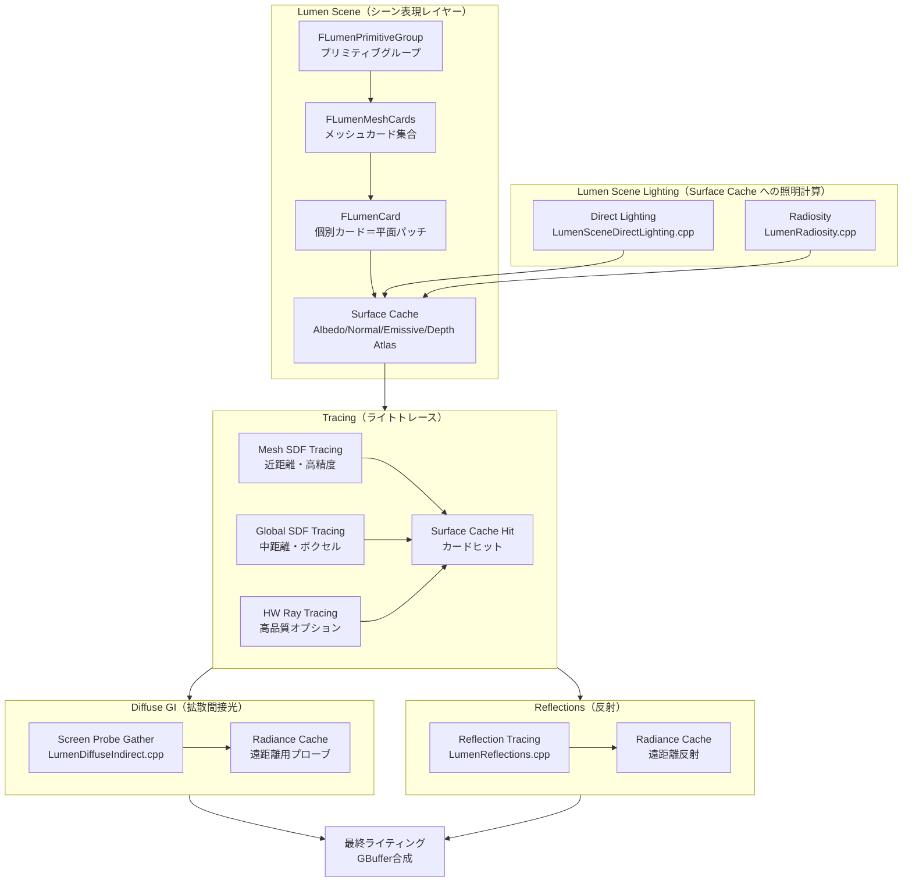

# Lumen 詳細解析

- 取得日: 2026-04-05
- 対象: `D:\UnrealEngine\Engine\Source\Runtime\Renderer\Private\Lumen\`

---

## 1. Lumen とは何か（設計思想）

Lumen は **「完全動的なグローバルイルミネーション（GI）と反射」** をリアルタイムで実現するシステム。  
従来の Lightmap（静的）や SSAO（Screen Space のみ）に代わるもの。

### 解決したかった問題
| 従来の問題 | Lumen の解法 |
|-----------|-------------|
| Lightmap は静的しか対応できない | 全てランタイム計算 |
| SSR は画面外の情報がない | Surface Cache で画面外もカバー |
| Ray Tracing は全ピクセル打つとコストが高い | 低解像度 Probe でキャッシュして補間 |
| 移動するライトに GI が追随しない | Surface Cache を差分更新（dirty だけ再キャプチャ）|

### 2つの大機能
```
Lumen
 ├── Diffuse GI（拡散間接照明）    → 間接光・色かぶり・AO
 └── Reflections（反射）           → 鏡面反射・光沢反射
```

---

## 2. 全体アーキテクチャ図（Mermaid）



---

## 3. Lumen Scene（シーン表現）

Lumen は通常の Scene（FScene）とは別に、**Lumen 専用のシーン表現**を持つ。  
その中心が **Card（カード）** という概念。

### Card とは何か

- メッシュの表面を **軸平行な平面パッチ（OBB）** で近似したもの
- 6方向（±X, ±Y, ±Z）のうち有効な面に対して生成される
- それぞれの Card が **Surface Cache のアトラス領域** を持ち、ライティング情報を焼く

```
メッシュ（例：壁）
 │
 └─ FLumenMeshCards（壁全体をまとめるコンテナ）
      ├─ FLumenCard[0]  方向:+X  → Surface Cache の矩形領域に割り当て
      ├─ FLumenCard[1]  方向:-X
      └─ FLumenCard[2]  方向:+Z
```

### クラス構造

```cpp
// 1プリミティブ（またはインスタンスグループ）に対応
class FLumenPrimitiveGroup {
    TArray<FPrimitiveSceneInfo*> Primitives;  // 対象プリミティブ
    int32 MeshCardsIndex;   // FLumenMeshCards へのインデックス
    bool bFarField;         // 遠距離フィールド扱いか
    bool bEmissiveLightSource; // 自発光光源か
};

// 1メッシュに紐づくCard群のコンテナ
class FLumenMeshCards {
    FMatrix LocalToWorld;
    FBox LocalBounds;
    uint32 FirstCardIndex;
    uint32 NumCards;
    // 6方向のCardへのルックアップテーブル
    uint32 CardLookup[Lumen::NumAxisAlignedDirections];  // NumAxisAlignedDirections = 6
};

// 1枚のCard（平面パッチ）
class FLumenCard {
    FLumenCardOBBf LocalOBB;    // ローカル空間OBB
    FLumenCardOBBd WorldOBB;    // ワールド空間OBB（double精度）
    bool bVisible;
    uint8 AxisAlignedDirectionIndex;    // 0〜5
    FLumenSurfaceMipMap SurfaceMipMaps[Lumen::NumResLevels]; // ミップマップ配列
    // ResLevel: 3(8px)〜11(2048px), 計9レベル
};
```

### Surface Cache アトラス（`FLumenCardScene`）

Surface Cache は複数のテクスチャアトラス（全Card分を詰め込んだ大きな1枚テクスチャ）で構成される：

```
AlbedoAtlas   … 各Cardのベースカラー
OpacityAtlas  … 不透明度
NormalAtlas   … 法線
EmissiveAtlas … 自発光
DepthAtlas    … 深度

DirectLightingAtlas   … 直接光（ライティング計算結果）
IndirectLightingAtlas … 間接光（Radiosity計算結果）
FinalLightingAtlas    … 合成済み最終ライティング
```

これらはシェーダーに `SHADER_PARAMETER_RDG_TEXTURE` でバインドされ、  
全てのLumen Tracingシェーダーから参照される（`FLumenCardTracingParameters`）。

### Surface Cache 更新（差分更新の仕組み）

```
毎フレーム:
  1. ダーティフラグが立ったCard を検出
  2. r.LumenScene.SurfaceCache.CardCapturesPerFrame = 300（デフォルト）
     → 1フレームに最大300個までキャプチャ
  3. r.LumenScene.SurfaceCache.CardCaptureFactor = 64
     → SurfaceCacheTexels / 64 のテクセル数を上限として更新
  4. FRasterizeToCardsVS でアトラスに書き込む

デバッグ用CVar:
  r.LumenScene.SurfaceCache.Freeze = 1          … 更新を止める
  r.LumenScene.SurfaceCache.Reset = 1           … 全リセット
  r.LumenScene.SurfaceCache.CardCaptureRefreshFraction = 0.125
     → 既存ページの再キャプチャに使えるバジェットの割合（デフォルト12.5%）
```

---

## 4. Lumen Scene Lighting（Surface Cache への照明）

Surface Cache に「ライト情報」を焼き込む段階。  
Surface Cache には以下の2つが書き込まれる：

### 4-1. Direct Lighting（直接光）
- `LumenSceneDirectLighting.cpp`
- 各Cardに当たる直接光を計算してアトラスに書き込む
- HW Ray Tracing バリアント: `LumenSceneDirectLightingHardwareRayTracing.cpp`
- 確率的バリアント（ノイズ低減）: `LumenSceneDirectLightingStochastic.inl`

### 4-2. Radiosity（間接の間接光）
- `LumenRadiosity.cpp`
- Card から Card へのバウンス光（間接光の2バウンス以降）
- Surface Cache の `IndirectLightingAtlas` に書き込む

---

## 5. Tracing（ライトトレース）

「ある点からある方向にレイを飛ばすと何が見えるか」を解決する層。  
Lumen は **3種類のTracing方法** を持ち、距離や設定に応じて切り替える。

### トレース方法の比較

| 方法 | 距離 | 精度 | コスト | ファイル |
|------|------|------|--------|---------|
| **Mesh SDF** | 近距離（〜180cm デフォルト） | 高（メッシュ形状に追従） | 中 | `LumenMeshSDFCulling.cpp` |
| **Global SDF（Voxel）** | 中〜遠距離 | 中（ボクセル近似） | 低 | `DistanceFieldAmbientOcclusion.cpp` |
| **HW Ray Tracing** | 全距離 | 最高 | 高 | `LumenHardwareRayTracingCommon.cpp` |

### ETracingPermutation（組み合わせ）

```cpp
enum class ETracingPermutation {
    Cards,              // Surface Cache のみ（最速・近距離用）
    VoxelsAfterCards,   // Cards → ミスしたら Voxel SDF にフォールバック
    Voxels,             // Voxel SDF のみ
};
```

### トレース先：Surface Cache ヒット

レイが何かにヒットした後、その位置のライティング情報を **Surface Cache から補間** して取得。  
これが Lumen の根幹：事前に焼いた Surface Cache から高速に間接光を拾う。

```
FLumenCardTracingParameters（シェーダーバインド構造体）
  ├─ LumenCardScene     … Card位置・ページテーブル
  ├─ AlbedoAtlas        … アルベド参照
  ├─ DirectLightingAtlas … 直接光参照
  ├─ IndirectLightingAtlas … 間接光参照
  ├─ FinalLightingAtlas … 合成済みライティング参照
  └─ RWSurfaceCacheFeedbackBuffer … フィードバック（どのCardが使われたか）
```

### Surface Cache Feedback（フィードバックループ）

```
トレースシェーダー
  → どのCardページが参照されたか を RWSurfaceCacheFeedbackBuffer に書き込む
  → CPU側でフィードバックを読み、よく参照されるCardは高解像度を割り当てる
  → 参照されないCardは低解像度に格下げ（メモリ節約）
```

---

## 6. Diffuse GI（拡散間接照明）

### Screen Probe Gather

- `LumenDiffuseIndirect.cpp` + `LumenScreenProbeGather` 関連
- **Screen Space に Probe（探索点）を低解像度でタイル配置**し、各 Probe から半球方向にレイを飛ばす
- 各 Probe のラジアンス（輝度）を集計して、隣接 Probe と補間して最終ピクセルに適用

```
画面解像度: 1920×1080
  → タイル分割（例: 8×8 ピクセルに1プローブ）
  → プローブ数: 240×135 = 32,400 プローブ
  → 各プローブから数本のレイをトレース
  → テンポラル蓄積で品質向上
```

### テンポラル蓄積（`FScreenProbeGatherTemporalState`）

```cpp
class FScreenProbeGatherTemporalState {
    // 拡散GIの前フレーム履歴（再投影して使い回す）
    TRefCountPtr<IPooledRenderTarget> DiffuseIndirectHistoryRT;
    TRefCountPtr<IPooledRenderTarget> BackfaceDiffuseIndirectHistoryRT;
    TRefCountPtr<IPooledRenderTarget> RoughSpecularIndirectHistoryRT;
    TRefCountPtr<IPooledRenderTarget> ShortRangeAOHistoryRT;   // 近距離AO
    TRefCountPtr<IPooledRenderTarget> ShortRangeGIHistoryRT;   // 近距離GI
    // Probe の過去フレーム輝度（Importace Sampling の重みとして活用）
    TRefCountPtr<IPooledRenderTarget> ProbeHistoryScreenProbeRadiance;
    FLumenGatherCvarState LumenGatherCvars; // 設定変更検知用スナップショット
};
```

### 主要 CVar（Diffuse GI）

```
r.Lumen.DiffuseIndirect.Allow = 1          … GI 全体の有効/無効
r.Lumen.DiffuseIndirect.TraceStepFactor    … レイのステップ刻み
r.Lumen.DiffuseIndirect.SurfaceBias = 5.0  … 自己交差防止バイアス
r.Lumen.DiffuseIndirect.MinSampleRadius = 10
r.LumenScene.FastCameraMode = 0            … 高速カメラモード（低品質・高速更新）
```

---

## 7. Reflections（反射）

### `LumenReflections.cpp` + `LumenReflectionTracing.cpp`

- 各ピクセルのマテリアルの粗さ（Roughness）に応じてレイを飛ばす
- Roughness が低い（鏡面に近い）ほど精度の高いトレースを使用
- 結果はテンポラルに蓄積してノイズを低減

### FLumenReflectionTracingParameters（主要パラメータ）

```cpp
struct FLumenReflectionTracingParameters {
    FIntPoint ReflectionDownsampleFactorXY;  // 解像度ダウンスケール係数
    float NearFieldMaxTraceDistance;          // 近距離レイの最大距離
    float FarFieldMaxTraceDistance;           // 遠距離レイの最大距離
    uint32 MaxReflectionBounces;             // 最大バウンス数
    uint32 MaxRefractionBounces;             // 最大屈折バウンス数
    float MaxRoughnessToTrace;               // この粗さ以上はトレースしない
    float MaxRoughnessToTraceForFoliage;     // 植生用の専用設定
};
```

### Roughness によるパス分岐

```
Roughness ≈ 0（完全鏡面）  → 高精度トレース
Roughness ≈ 0.3〜0.6       → ダウンスケール + テンポラル蓄積
Roughness > MaxRoughness    → Radiance Cache からサンプリング（低精度・高速）
```

### テンポラル状態（`FReflectionTemporalState`）

```cpp
class FReflectionTemporalState {
    TRefCountPtr<IPooledRenderTarget> SpecularAndSecondMomentHistory; // 反射輝度履歴
    TRefCountPtr<IPooledRenderTarget> NumFramesAccumulatedHistory;    // 蓄積フレーム数
    FIntRect HistoryViewRect;
    uint32 HistoryFrameIndex;
};
```

### ReSTIR（確率的リサンプリング）

`LumenReSTIRGather.cpp` / `FReSTIRGatherTemporalState`  
- Reservoir Resampling によるサンプル再利用
- 時間方向（テンポラル）の再サンプリングと蓄積
- より少ないレイで高品質なサンプルを得るための手法

---

## 8. Radiance Cache（放射輝度キャッシュ）

### 役割

Screen Probe から飛ばしたレイが **遠距離**に到達した場合、  
毎フレーム全てをトレースするのはコストが高い。  
→ **3Dグリッド（クリップマップ）** にワールド空間プローブを配置し、  
　低頻度で更新しつつ補間して使い回す。

### クリップマップ構造（`FRadianceCacheClipmap`）

```cpp
class FRadianceCacheClipmap {
    FVector Center;     // ワールド空間中心
    float Extent;       // クリップマップの大きさ
    float CellSize;     // プローブ間隔
    float ProbeTMin;    // レイトレースの最小距離（自己交差防止）
    FVector VolumeUVOffset; // フレーム間のUVオフセット（スクロール更新）
};
```

### FRadianceCacheState（GPUリソース）

```cpp
class FRadianceCacheState {
    // クリップマップ配列（最大MaxClipmaps段）
    TArray<FRadianceCacheClipmap> Clipmaps;

    // Probe のインデックスを引くための 3D テクスチャ
    TRefCountPtr<IPooledRenderTarget> RadianceProbeIndirectionTexture;

    // 各 Probe の放射輝度を格納するアトラス
    TRefCountPtr<IPooledRenderTarget> RadianceProbeAtlasTexture;
    TRefCountPtr<IPooledRenderTarget> FinalRadianceAtlas;    // フィルタ済み
    TRefCountPtr<IPooledRenderTarget> FinalIrradianceAtlas; // 積分済み放射照度
    TRefCountPtr<IPooledRenderTarget> ProbeOcclusionAtlas;  // オクルージョン

    // Probe の生存管理（空きリスト方式）
    TRefCountPtr<FRDGPooledBuffer> ProbeAllocator;
    TRefCountPtr<FRDGPooledBuffer> ProbeFreeList;
    TRefCountPtr<FRDGPooledBuffer> ProbeLastUsedFrame;   // 使用最終フレーム
    TRefCountPtr<FRDGPooledBuffer> ProbeLastTracedFrame; // トレース最終フレーム
};
```

### Radiance Cache の更新タイミング

```
1. Screen Probe が飛ばしたレイがキャッシュをマーク
   → FMarkUsedRadianceCacheProbes デリゲートで通知
2. マークされた Probe を低頻度でトレース
   （全プローブを毎フレームトレースしない）
3. トレース結果を FinalRadianceAtlas に格納
4. Screen Probe がキャッシュを参照して補間
```

---

## 9. 主要データフロー（フレーム全体）

```
フレーム開始
│
├─ [A] Lumen Scene 更新（CPU＋GPU）
│   ├─ FLumenPrimitiveGroup の追加/削除検出
│   ├─ Dirty になった FLumenCard のリストアップ
│   └─ Surface Cache キャプチャ（1フレームに最大N枚）
│       └─ Albedo/Normal/Emissive/Depth アトラスへ書き込み
│
├─ [B] Surface Cache Lighting（GPU Compute）
│   ├─ Direct Lighting → DirectLightingAtlas
│   ├─ Radiosity       → IndirectLightingAtlas
│   └─ 合成            → FinalLightingAtlas
│
├─ [C] Tracing（GPU Compute）
│   ├─ Screen Probe 配置（低解像度グリッド）
│   ├─ Mesh SDF / Global SDF / HW RT でトレース
│   └─ ヒットした Card の FinalLightingAtlas をサンプル
│
├─ [D] Diffuse GI 解決（GPU Compute）
│   ├─ Screen Probe のラジアンスを補間・フィルタ
│   ├─ Radiance Cache 更新（遠距離プローブ）
│   └─ テンポラル蓄積（前フレーム履歴と合成）
│
├─ [E] Reflections（GPU Compute）
│   ├─ Roughness に応じてレイをトレース
│   ├─ Radiance Cache からサンプリング（粗い面）
│   ├─ ReSTIR によるサンプル再利用
│   └─ テンポラル蓄積
│
└─ [F] GBuffer合成
    ├─ Diffuse GI + Direct Light + Emissive
    └─ Reflections 合成 → 最終ピクセル
```

---

## 10. 主要クラス一覧（まとめ）

| クラス/構造体 | ファイル | 役割 |
|-------------|---------|------|
| `FLumenSceneData` | `LumenSceneData.h` | Lumen全体のシーンデータ（CPUサイド）|
| `FLumenCardScene` | `LumenSceneData.h` | シェーダーバインド用のUBパラメータ |
| `FLumenPrimitiveGroup` | `LumenSceneData.h` | プリミティブのグループ管理 |
| `FLumenMeshCards` | `LumenMeshCards.h` | 1メッシュのCard群コンテナ |
| `FLumenCard` | `LumenSceneData.h` | 1枚の平面パッチ（Surface Cache単位）|
| `FLumenSurfaceMipMap` | `LumenSceneData.h` | CardのMipMapアロケーション情報 |
| `FLumenCardTracingParameters` | `LumenTracingUtils.h` | トレーシングシェーダー共通バインド |
| `FLumenMeshSDFGridParameters` | `LumenTracingUtils.h` | Mesh SDFトレースのグリッドバインド |
| `FScreenProbeGatherTemporalState` | `LumenViewState.h` | Diffuse GI のテンポラル履歴 |
| `FReflectionTemporalState` | `LumenViewState.h` | 反射のテンポラル履歴 |
| `FRadianceCacheState` | `LumenViewState.h` | Radiance Cache の GPU リソース |
| `FRadianceCacheClipmap` | `LumenViewState.h` | クリップマップ1段分の設定 |
| `FReSTIRGatherTemporalState` | `LumenViewState.h` | ReSTIR の Reservoir 履歴 |
| `FLumenCardUpdateContext` | `LumenSceneLighting.h` | Card 更新バッチの管理 |

---

## 11. 有効化条件と主要 CVar

### 有効化チェック（`Lumen.h`）

```cpp
// これらが false を返すとそのLumen機能は無効化される
bool ShouldRenderLumenDiffuseGI(const FScene*, const FSceneView&,
    bool bSkipTracingDataCheck = false, bool bSkipProjectCheck = false);
bool ShouldRenderLumenReflections(const FSceneView&, ...);
bool ShouldRenderLumenDirectLighting(const FScene*, const FSceneView&);
bool ShouldRenderAOWithLumenGI();    // LumenGI使用時はSSAO無効化
```

### 主要 CVar

```
# GI 全体
r.Lumen.DiffuseIndirect.Allow = 1

# Surface Cache 更新
r.LumenScene.SurfaceCache.CardCapturesPerFrame = 300
r.LumenScene.SurfaceCache.CardCaptureFactor = 64
r.LumenScene.SurfaceCache.CardCaptureRefreshFraction = 0.125
r.LumenScene.SurfaceCache.Freeze = 0       # デバッグ用フリーズ
r.LumenScene.SurfaceCache.Reset = 0        # デバッグ用リセット

# Mesh SDF トレース
r.Lumen.DiffuseIndirect.TraceMeshSDFs = 1
r.Lumen.DiffuseIndirect.MeshSDFTraceDistance = 180.0

# パフォーマンス調整
r.LumenScene.FastCameraMode = 0            # 高速カメラ移動時の低品質モード
r.LumenScene.ParallelUpdate = 1            # マルチスレッド更新
r.LumenScene.PrimitivesPerTask = 128       # タスクあたりのプリミティブ数
r.LumenScene.MeshCardsPerTask = 128        # タスクあたりのMeshCards数

# グローバル SDF
r.Lumen.GlobalSDF.Resolution              # 解像度設定
```

---

## 12. 次に読むべきファイル

| 目的 | ファイル |
|------|---------|
| Screen Probe の実装詳細 | `LumenScreenProbeGather` 関連 |
| Surface Cache キャプチャの実装 | `LumenSceneCardCapture.cpp` |
| Mesh SDF カリングの実装 | `LumenMeshSDFCulling.cpp` |
| Radiosity の実装 | `LumenRadiosity.cpp` |
| HW Ray Tracing バックエンド | `LumenHardwareRayTracingCommon.cpp` |
| Direct Lighting の実装 | `LumenSceneDirectLighting.cpp` |
