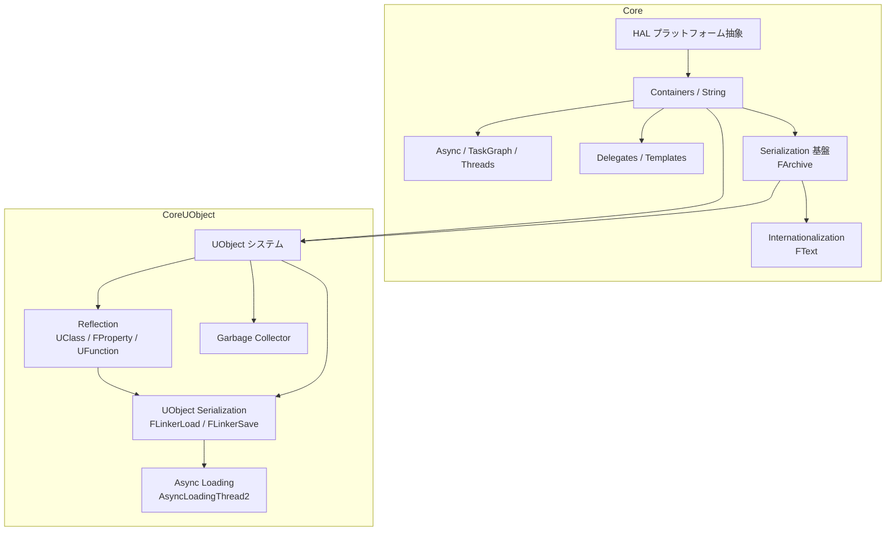
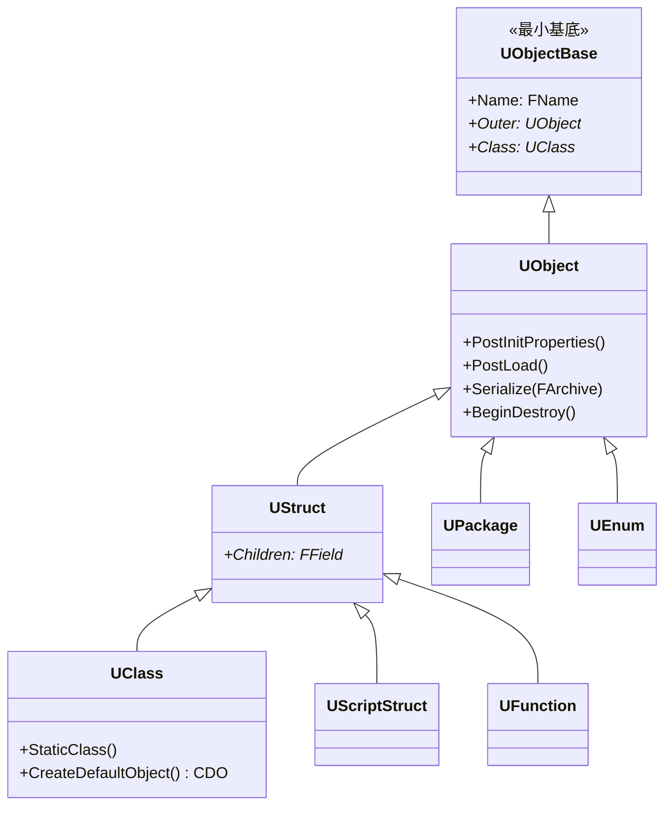

# Core システム全体概要

- 対象: `Engine/Source/Runtime/Core/`, `Engine/Source/Runtime/CoreUObject/`
- ソースマップ: [[_source_map]]
- 上位: [[_module_index]]

---

## Core とは

UE5 の **エンジン全体の基盤** となるモジュール群。プラットフォーム抽象化・コンテナ・文字列・非同期・リフレクション・シリアライゼーション・GC など、あらゆるサブシステムが依存する最低層を提供する。

大きく 2 モジュールに分かれる:

| モジュール | 役割 |
|-----------|------|
| **Core** | プラットフォーム抽象（HAL）・コンテナ・文字列・数学・非同期・デリゲート・ログなど、**UObject に依存しない** 基盤 |
| **CoreUObject** | `UObject` システム本体・リフレクション・GC・シリアライゼーション（`FArchive`）・パッケージ管理。Core の上に構築 |

依存方向は **Core → CoreUObject → Engine → その他** という一方向。Core は最も根源的なレイヤーであり、UE のほぼすべてのコードがここを参照する。

---

## アーキテクチャ全体像

---

## サブフォルダ（6 領域）

| サブフォルダ | 内容 | 主要型 |
|------------|------|--------|
| [[UObject/01_overview]] | UObject 基底・ライフサイクル・GC・スマートポインタ | `UObject` / `FGCObject` / `TObjectPtr` / `TWeakObjectPtr` |
| [[Reflection/01_overview]] | UCLASS/UPROPERTY マクロ展開・型情報・Blueprint 公開 | `UClass` / `FProperty` / `UFunction` / `UInterface` |
| [[Serialization/01_overview]] | FArchive 基盤・パッケージ保存/ロード・BulkData・非同期ロード | `FArchive` / `FStructuredArchive` / `FLinkerLoad` / `FBulkData` |
| [[AsyncTasks/01_overview]] | TaskGraph・Task System v2・スレッド・ParallelFor・Mutex | `FTaskGraphInterface` / `UE::Tasks` / `FRunnable` / `ParallelFor` |
| [[Delegates/01_overview]] | デリゲート・動的デリゲート・タイマー・TFunction | `TDelegate` / `TMulticastDelegate` / `FTimerManager` |
| [[Containers/01_overview]] | TArray/TMap/TSet・FString/FName/FText・SharedPointer | `TArray` / `TMap` / `FString` / `FName` / `TSharedPtr` |

---

## 主要クラス階層

---

## UObject の原則

- **すべての UObject 派生型は `UCLASS()` マクロが必要** — UHT（UnrealHeaderTool）が解析し、型情報（`UClass`）を自動生成
- **GC 管理** — すべての UObject は `GUObjectArray` に登録され、マーク&スイープ GC で管理される
- **Outer チェーン** — 各 UObject は「所有者」を示す `Outer` ポインタを持ち、`UPackage` をルートとするツリーを構成
- **名前はパッケージ内で一意** — `GetPathName()` で `/Game/Path.PackageName.ObjectName` 形式のフルパスが取得可能
- **CDO（Class Default Object）** — 各 UClass は 1 つの「デフォルト値テンプレート」インスタンスを持つ。`NewObject<T>()` はこの CDO をコピーして初期化

---

## 主要 CVar（抜粋）

| CVar | デフォルト | 説明 |
|------|----------|------|
| `gc.TimeBetweenPurgingPendingKillObjects` | `60.0` | GC 強制実行間隔（秒）|
| `gc.AllowParallelGC` | `1` | 並列 GC 有効化 |
| `gc.IncrementalReachabilityTimeLimit` | `0.002` | インクリメンタル GC の 1 フレーム予算 |
| `s.AsyncLoadingThreadEnabled` | `1` | 非同期ロードスレッド有効化 |
| `TaskGraph.EnableAsyncTasks` | `1` | TaskGraph 非同期実行 |

詳細 CVar は各サブフォルダの `01_overview.md` を参照。

---

## Blueprint との関係

- `UCLASS(BlueprintType)` → Blueprint から変数として使用可
- `UCLASS(Blueprintable)` → Blueprint クラスを派生可能
- `UPROPERTY(BlueprintReadWrite)` → Blueprint から読み書き可能
- `UFUNCTION(BlueprintCallable)` → Blueprint から関数呼び出し可能
- `DECLARE_DYNAMIC_MULTICAST_DELEGATE` → Blueprint 対応デリゲート（イベントピン）

これらはすべて **リフレクション情報が生成されている** ことが前提。そのため UCLASS/UPROPERTY/UFUNCTION マクロなしでは Blueprint 連携は不可能。

---

## 備考

- UE5 ではプロパティ実装が `UProperty`（UE4）から `FProperty`（UE5）へ変更された。GC 対象外となり、メモリ・GC 負荷が削減
- 非同期ロードは EDL（Event Driven Loader）から Zen Loader（`AsyncLoadingThread2`）へ移行中
- タスクシステムは `FTaskGraph`（レガシー）と `UE::Tasks::Launch`（Task System v2）が並行稼働
