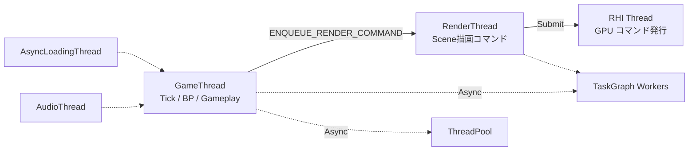

# AsyncTasks 概要

- 上位: [[01_core_overview]]
- 関連: [[Delegates/01_overview]] | [[Containers/01_overview]]
- ソース: `Engine/Source/Runtime/Core/Public/Async/`, `Engine/Source/Runtime/Core/Public/HAL/`

---

## AsyncTasks とは

UE5 における **並列処理・スレッド管理・同期プリミティブ** の統一基盤。用途別に複数の API が並行稼働している:

1. **FTaskGraph（レガシー）** — UE4 から続く高機能タスクスケジューラ
2. **UE::Tasks（Task System v2）** — UE5 の新世代タスクシステム（`Core/Public/Async/Fundamental/`）
3. **Async() / ParallelFor()** — ワンショット並列実行のヘルパ
4. **FRunnable / FRunnableThread** — 独立した長寿命スレッド
5. **FAsyncTask / FQueuedThreadPool** — キュー方式の非同期タスク
6. **TFuture / TPromise** — 非同期結果のハンドル
7. **Mutex / SharedMutex / CriticalSection** — 排他制御

---

## スレッドモデル

UE5 の主要スレッド:



| スレッド | 主な役割 |
|---------|---------|
| **GameThread** | 全ゲームロジック。`UObject` 触るのはほぼここ |
| **RenderThread** | 描画コマンド構築（1 フレーム遅延で GameThread を追う） |
| **RHI Thread** | GPU API（D3D12/Vulkan/Metal）への実際のコマンド発行 |
| **AsyncLoading Thread** | パッケージロード専用 |
| **Audio Thread** | オーディオ処理 |
| **TaskGraph Workers** | 汎用ワーカープール（CPU コア数に応じて生成） |

---

## TaskGraph（レガシー）

### 基本構造

```cpp
FGraphEventRef TaskRef = FFunctionGraphTask::CreateAndDispatchWhenReady(
    []() {
        // 任意スレッドで実行される処理
    },
    TStatId(),
    nullptr,           // 前提条件タスク
    ENamedThreads::AnyBackgroundThreadNormalTask
);

// 待機
FTaskGraphInterface::Get().WaitUntilTaskCompletes(TaskRef);
```

### ENamedThreads

| 値 | 説明 |
|----|------|
| `GameThread` | GameThread で実行 |
| `RenderThread` | RenderThread で実行 |
| `AnyThread` | 任意のワーカー |
| `AnyBackgroundThreadNormalTask` | バックグラウンドワーカー（優先度低） |
| `AnyHiPriThreadHiPriTask` | 高優先度ワーカー |

### 前提条件（Prerequisites）

```cpp
FGraphEventArray Prereqs;
Prereqs.Add(TaskA);
Prereqs.Add(TaskB);
FFunctionGraphTask::CreateAndDispatchWhenReady([]() { ... }, TStatId(), &Prereqs);
```

TaskA と TaskB の両方が完了してから実行される。

---

## UE::Tasks（Task System v2）

UE5 で新設された軽量タスクシステム。`FTaskGraph` より低オーバーヘッド:

```cpp
#include "Tasks/Task.h"

UE::Tasks::FTask Task = UE::Tasks::Launch(
    TEXT("MyTask"),
    []() {
        // 任意スレッドで実行
    },
    UE::Tasks::ETaskPriority::Normal
);

Task.Wait();
// または Task.BusyWait() でスピン待機
```

**特徴**:
- スタックサイズ最適化
- 待機中のスレッドが他のタスクを盗む（ワークスティーリング）
- ParkingLot ベースの効率的なブロッキング

---

## Async() — 汎用ヘルパ

```cpp
#include "Async/Async.h"

TFuture<int32> Future = Async(EAsyncExecution::Thread, []() -> int32 {
    return ComputeHeavyThing();
});

int32 Result = Future.Get();  // 完了まで待機
```

### EAsyncExecution

| 値 | 説明 |
|----|------|
| `TaskGraph` | TaskGraph ワーカーで実行 |
| `TaskGraphMainThread` | GameThread（TaskGraph 経由） |
| `Thread` | 新規スレッドを起動（単発） |
| `ThreadPool` | `FQueuedThreadPool` から借用 |
| `ThreadIfForkSafe` | Fork 後も安全な方式で選択 |

---

## ParallelFor — 並列 for ループ

```cpp
#include "Async/ParallelFor.h"

ParallelFor(Count, [](int32 Index) {
    ProcessElement(Index);
});

// フラグ指定
ParallelFor(Count, [](int32 Index) { ... },
    EParallelForFlags::Unbalanced | EParallelForFlags::BackgroundPriority);
```

**特徴**:
- バッチサイズは自動調整（要素数とスレッド数から）
- `Unbalanced` フラグで不均等な処理時間にも対応
- 関数呼び出しオーバーヘッドを避けるためインライン展開される

---

## FRunnable — 独立スレッド

長寿命（ゲーム中ずっと動く）スレッドに使う:

```cpp
class FMyWorker : public FRunnable
{
public:
    virtual bool Init() override { return true; }
    virtual uint32 Run() override
    {
        while (!bStopping)
        {
            DoWork();
            FPlatformProcess::Sleep(0.01f);
        }
        return 0;
    }
    virtual void Stop() override { bStopping = true; }

    FThreadSafeBool bStopping;
};

// 生成
FMyWorker* Worker = new FMyWorker();
FRunnableThread* Thread = FRunnableThread::Create(Worker, TEXT("MyThread"));
```

---

## 同期プリミティブ

| プリミティブ | ヘッダ | 特徴 |
|------------|-------|------|
| `FCriticalSection` | `HAL/CriticalSection.h` | レガシー。OS ネイティブなミューテックス |
| `UE::FMutex` | `Async/Mutex.h` | UE5 新型。ParkingLot 方式で軽量 |
| `UE::FSharedMutex` | `Async/SharedMutex.h` | R/W ロック |
| `UE::FRecursiveMutex` | `Async/RecursiveMutex.h` | 再帰的ロック |
| `FScopeLock` / `UE::TUniqueLock` | — | RAII ラッパ |
| `FEvent` | `HAL/Event.h` | OS レベルのイベント同期 |
| `std::atomic` 等 | `<atomic>` | 低レベル原子操作 |

---

## ENQUEUE_RENDER_COMMAND

GameThread → RenderThread への命令投入:

```cpp
ENQUEUE_RENDER_COMMAND(SetColorCommand)(
    [Color](FRHICommandListImmediate& RHICmdList) {
        // RenderThread 上で実行
    });
```

マクロ展開後は TaskGraph のタスクとして RenderThread にキューされる。

---

## Details（個別記事）

| ドキュメント | 内容 |
|------------|------|
| [[Details/a_task_graph]] | `FTaskGraphInterface`・`FBaseGraphTask`・前提条件・`ENamedThreads` |
| [[Details/b_async_patterns]] | `Async()`・`UE::Tasks::Launch`・`FAsyncTask`・`FQueuedThreadPool`・`FRunnable` |
| [[Details/c_game_thread]] | GameThread/RenderThread/RHIThread 連携・`ENQUEUE_RENDER_COMMAND`・`FlushRenderingCommands` |
| [[Details/d_parallel_for]] | `ParallelFor`・`EParallelForFlags`・バッチサイズ・同期プリミティブ |

---

## Reference

- [[Reference/ref_async_api]] … `Async` / `FAsyncTask` / `FRunnable` / `FTaskGraphInterface` API

---

## 主要 CVar

| CVar | デフォルト | 説明 |
|------|----------|------|
| `TaskGraph.EnableAsyncTasks` | `1` | TaskGraph 非同期実行有効化 |
| `TaskGraph.ForkedProcessMaxWorkerThreads` | `2` | Fork 後の最大ワーカー数 |
| `Tasks.Default.Priority` | `0` | UE::Tasks のデフォルト優先度 |
| `s.AsyncLoadingThreadEnabled` | `1` | 非同期ロードスレッド有効化 |

---

## 備考

- **GameThread 絶対則**: `UObject` 操作・Tick・BP は GameThread で。`UWorld` アクセスも原則 GameThread
- **TWeakObjectPtr は任意スレッド OK**: 弱参照の `.IsValid()` は GC と競合しないよう設計されている
- **Task System v2 への移行中**: 新規コードは `UE::Tasks::Launch` 推奨。既存の `FTaskGraph` コードも並行保守
- **ParallelFor は入れ子不可**: 外側の ParallelFor 内部で別の ParallelFor を呼ぶとデッドロックの危険
