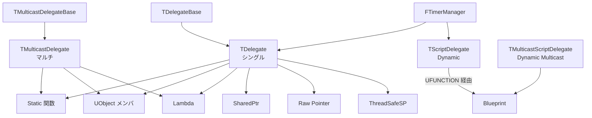

# Delegates 概要

- 上位: [[01_core_overview]]
- 関連: [[AsyncTasks/01_overview]] | [[UObject/01_overview]]
- ソース: `Engine/Source/Runtime/Core/Public/Delegates/`, `Engine/Source/Runtime/Core/Public/UObject/ScriptDelegates.h`, `Engine/Source/Runtime/Engine/Public/TimerManager.h`

---

## Delegates とは

UE5 における **型安全なコールバック機構**。`std::function` 相当だが、UObject ライフサイクル・Blueprint 連携・マルチキャストなどに特化した機能が多い。

大きく 3 系統:

1. **TDelegate / TMulticastDelegate**（ネイティブ） — C++ のみ・最高性能
2. **Dynamic Delegate / Dynamic Multicast Delegate** — Blueprint 公開可能（UFUNCTION 必須）
3. **TFunction / TUniqueFunction** — `std::function` 相当（テンプレート）

タイマー（`FTimerManager`）もデリゲート機構の上に構築されている。

---

## アーキテクチャ



---

## 6 種類のデリゲート（宣言マクロ対応表）

| マクロ | シングル/マルチ | Blueprint 公開 | 特徴 |
|--------|--------------|-------------|------|
| `DECLARE_DELEGATE` | シングル | No | 戻り値なし、1 つのバインドのみ |
| `DECLARE_DELEGATE_RetVal` | シングル | No | 戻り値あり |
| `DECLARE_MULTICAST_DELEGATE` | マルチ | No | 戻り値なし、複数バインド可 |
| `DECLARE_DYNAMIC_DELEGATE` | シングル | **Yes** | BP 公開可だが低速 |
| `DECLARE_DYNAMIC_MULTICAST_DELEGATE` | マルチ | **Yes** | BP のイベントピンで使用 |
| `DECLARE_EVENT` | マルチ（クラス内） | No | 宣言したクラスのみ Broadcast 可 |

### 引数付きバリアント

引数があれば `_OneParam`・`_TwoParams`・`_ThreeParams` … を付ける:

```cpp
DECLARE_DELEGATE_TwoParams(FOnHealthChanged, float /*Current*/, float /*Max*/);
DECLARE_DYNAMIC_MULTICAST_DELEGATE_OneParam(FOnDamageTaken, float, DamageAmount);
```

---

## バインド方式

`TDelegate::Bind*()` の種類:

| メソッド | 用途 |
|---------|------|
| `BindStatic(&StaticFn)` | 静的関数 |
| `BindRaw(Object, &Class::Method)` | 生ポインタのメンバ関数（ライフタイム管理は自己責任）|
| `BindLambda([](){...})` | ラムダ式 |
| `BindSP(SharedPtr, &Class::Method)` | `TSharedPtr`/`TSharedRef` |
| `BindThreadSafeSP(...)` | スレッドセーフ版 SharedPtr |
| `BindUObject(UObjectPtr, &Class::Method)` | UObject のメンバ（自動弱参照化） |
| `BindWeakLambda(UObjectPtr, [](){...})` | UObject 弱参照 + Lambda |
| `BindUFunction(Object, "MethodName")` | リフレクション経由（UFUNCTION 必須）|

`BindUObject` は **UObject が破棄されたら自動で呼び出し無効化** される（弱参照）。これが Raw との最大の違い。

---

## サンプル（ネイティブ Multicast）

```cpp
// 宣言
DECLARE_MULTICAST_DELEGATE_OneParam(FOnDamageTaken, float);

class AMyCharacter : public ACharacter
{
public:
    FOnDamageTaken OnDamageTakenEvent;

    float TakeDamage(...) override
    {
        OnDamageTakenEvent.Broadcast(ActualDamage);
        return ActualDamage;
    }
};

// 登録
Character->OnDamageTakenEvent.AddUObject(this, &AOtherActor::HandleDamage);
Character->OnDamageTakenEvent.AddLambda([](float Dmg){ UE_LOG(...); });
```

---

## サンプル（Dynamic Multicast — Blueprint 公開）

```cpp
// 宣言
DECLARE_DYNAMIC_MULTICAST_DELEGATE_OneParam(FOnDamageTakenBP, float, DamageAmount);

UCLASS()
class AMyCharacter : public ACharacter
{
    GENERATED_BODY()
public:
    UPROPERTY(BlueprintAssignable, Category="Events")
    FOnDamageTakenBP OnDamageTakenEvent;
};

// Blueprint 側: OnDamageTakenEvent ピンにノードを接続
// C++ 側の登録（UFUNCTION 必須）
Character->OnDamageTakenEvent.AddDynamic(this, &AOtherActor::HandleDamageBP);

UFUNCTION()
void HandleDamageBP(float DamageAmount);  // これが呼ばれる
```

**`Dynamic` は `UFUNCTION()` 指定の関数しかバインドできない**（リフレクションで呼び出すため）。性能はネイティブデリゲートの数倍遅いが Blueprint 連携が可能。

---

## FTimerManager

`UWorld` が所有する。`SetTimer` で一定時間後/周期的にデリゲートを呼び出す:

```cpp
FTimerHandle Handle;
GetWorldTimerManager().SetTimer(
    Handle,
    this,
    &AMyActor::TickFn,
    1.0f,      // 1 秒後
    true,      // Loop = 繰り返す
    0.5f       // 初回遅延
);

// キャンセル
GetWorldTimerManager().ClearTimer(Handle);

// 次フレームで実行
GetWorldTimerManager().SetTimerForNextTick(Delegate);
```

内部では `FTimerHeap`（優先度キュー）で管理され、毎 Tick で期限の来たものが発火される。

---

## TFunction — `std::function` 相当

```cpp
TFunction<int32(float)> Fn = [](float X) -> int32 { return FMath::RoundToInt(X); };
int32 Result = Fn(3.7f);
```

- `TFunction` — コピー可（`std::function` 相当）
- `TUniqueFunction` — ムーブのみ（`std::move_only_function` 相当）

デリゲートより軽量だがライフタイム管理機能はない。コールバックを関数引数で渡す場合によく使う。

---

## 主要クラス

| クラス | 役割 |
|-------|------|
| `TDelegate<RetType(Args...)>` | シングル型安全デリゲート |
| `TMulticastDelegate<void(Args...)>` | マルチキャスト（戻り値なし） |
| `TDelegateBase` | デリゲート基底（ストレージ管理） |
| `TMulticastDelegateBase` | マルチキャスト基底 |
| `IDelegateInstance` | デリゲートインスタンス基底 |
| `TScriptDelegate` | Dynamic デリゲート（BP 対応、戻り値付き） |
| `TMulticastScriptDelegate` | Dynamic Multicast（BP イベント） |
| `TFunction` / `TUniqueFunction` | `std::function` 相当 |
| `FTimerManager` | タイマー管理（`UWorld` 所有） |
| `FTimerHandle` | タイマーの識別子 |

---

## Details（個別記事）

| ドキュメント | 内容 |
|------------|------|
| [[Details/a_delegate_types]] | `TDelegate`/`TMulticastDelegate`・`DECLARE_DELEGATE*` マクロ群・バインド方式 |
| [[Details/b_dynamic_delegates]] | `DECLARE_DYNAMIC_*`・Blueprint 対応・`AddDynamic`・`UFUNCTION` 必須性 |
| [[Details/c_timer]] | `FTimerManager`・`SetTimer`/`SetTimerForNextTick`/`ClearTimer`・タイマーヒープ |

---

## Reference

- [[Reference/ref_delegate_api]] … `TDelegate` / `TMulticastDelegate` / `FTimerManager` の API

---

## コード実行フロー

### エントリポイント（バインド 〜 Broadcast 〜 タイマー発火）

```
(ネイティブ Multicast)
Delegate.AddUObject(Object, &Class::Method)                       [Delegate.h]
  └─ TMulticastDelegateBase::AddDelegateInstance()                 [DelegateBase.h]
       └─ TBaseUObjectMethodDelegateInstance を生成                 ← UObject 弱参照ラップ
            └─ InvocationList に格納                                ← TArray<IDelegateInstance*>

Delegate.Broadcast(Args...)                                        [MulticastDelegateBase.h]
  └─ for each instance in InvocationList
       ├─ instance->IsCompactable() ? skip : Execute()              ← 破棄済み UObject はスキップ
       └─ TBaseUObjectMethodDelegateInstance::ExecuteIfSafe()
            └─ (Object.Get() ? Object->Method(Args) : nop)           ← 弱参照解決

(Dynamic Multicast - Blueprint 公開)
Delegate.AddDynamic(this, &Class::Method)                          [ScriptDelegates.h]
  └─ TScriptDelegate::BindUFunction(Object, FunctionName)
       └─ FScriptDelegate に Object + UFunction* を格納

Delegate.Broadcast(Args...)
  └─ TMulticastScriptDelegate::ProcessMulticastDelegate(Params)
       └─ for each FScriptDelegate
            └─ Object->ProcessEvent(UFunction, Params)              ← リフレクション経由

(タイマー)
GetWorldTimerManager().SetTimer(Handle, Obj, &Fn, Rate, Loop)      [TimerManager.h]
  └─ FTimerManager::InternalSetTimer()                              [TimerManager.cpp]
       └─ ActiveTimerHeap に FTimerData を追加                       ← 優先度キュー（min-heap）

UWorld::Tick()
  └─ FTimerManager::Tick(DeltaTime)                                 [TimerManager.cpp]
       ├─ InternalTime += DeltaTime
       └─ while (Heap.Top().ExpireTime <= InternalTime)
            ├─ Timer.TimerDelegate.Execute()                        ← デリゲート発火
            └─ Loop なら ExpireTime += Rate して再投入
```

### フロー詳細

1. **バインド** — `AddUObject` は `TBaseUObjectMethodDelegateInstance` を生成し、UObject を弱参照（`FWeakObjectPtr`）でラップして `InvocationList` に格納する（[[Details/a_delegate_types]]）。
2. **Broadcast** — `TMulticastDelegate::Broadcast` が `InvocationList` を走査し、各インスタンスを `ExecuteIfSafe` で呼ぶ。UObject が破棄されていれば自動でスキップされる。
3. **Dynamic 経路** — `AddDynamic` は `FScriptDelegate` に `UFunction*` と Object ポインタを格納。`Broadcast` 時は `UObject::ProcessEvent` 経由でリフレクション呼出（[[Details/b_dynamic_delegates]]）。
4. **タイマー登録** — `SetTimer` が `FTimerData` を生成し、`ActiveTimerHeap`（min-heap）に挿入。`FTimerHandle` は内部 ID。
5. **タイマー発火** — `UWorld::Tick` 中に `FTimerManager::Tick` が呼ばれ、期限到達した `FTimerData` を順次取り出してデリゲートを発火。Loop 指定なら再投入される（[[Details/c_timer]]）。
6. **TFunction** — SBO（Small Buffer Optimization）で小ラムダはアロケーション不要。`std::function` 相当の型消去。

### 関与クラス・関数一覧

| クラス / 関数 | ファイル | 役割 |
|-------------|---------|------|
| `TMulticastDelegateBase::AddDelegateInstance` | `DelegateBase.h` | バインド本体 |
| `TBaseUObjectMethodDelegateInstance::ExecuteIfSafe` | `DelegateInstancesImpl.h` | UObject 弱参照デリゲート実行 |
| `TMulticastDelegate::Broadcast` | `MulticastDelegateBase.h` | 全リスナー一斉呼出 |
| `TMulticastScriptDelegate::ProcessMulticastDelegate` | `ScriptDelegates.h` | Dynamic Multicast 実行 |
| `FTimerManager::SetTimer` / `Tick` | `TimerManager.cpp` | タイマー登録・発火ドライバ |
| `UObject::ProcessEvent` | `Class.cpp` | UFunction 経由の関数呼出 |

---

## 備考

- **ネイティブ vs Dynamic の選択基準**:
    - Blueprint からバインドする → Dynamic 一択
    - C++ のみ・ホットパス → ネイティブ（性能 5〜10 倍）
- **UObject 参照は必ず `BindUObject`**: `BindRaw` だと破棄済みオブジェクトで UB
- **マルチキャストは Broadcast 中に Add/Remove 不可**: コピーを取ってから操作する必要あり
- **Delegate はコピー可だが重い**: 関数引数で渡すなら `const FMyDelegate&` 推奨
- **TFunction は SBO（Small Buffer Optimization）あり**: 小さいラムダはアロケーションなし
