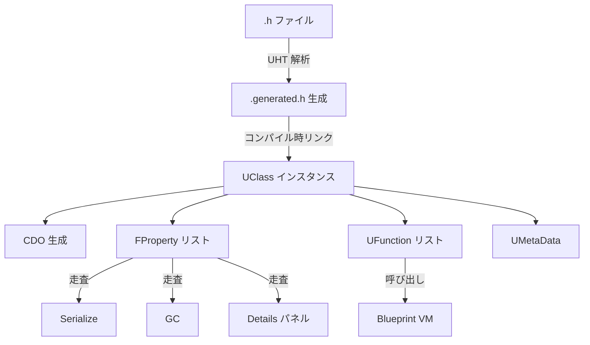
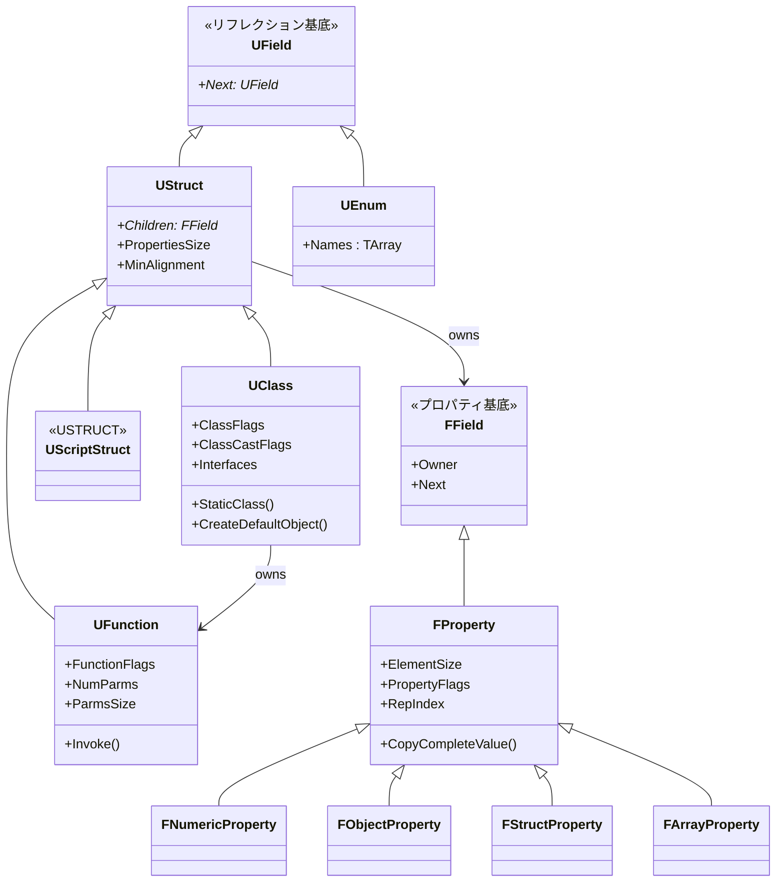

# Reflection 概要

- 上位: [[01_core_overview]]
- 関連: [[UObject/01_overview]] | [[Serialization/01_overview]]
- ソース: `Engine/Source/Runtime/CoreUObject/Public/UObject/`

---

## Reflection とは

UE5 のリフレクションは、**C++ のネイティブな型情報に加え、ランタイムで型を列挙・操作できる仕組み** を提供する。UE では専用のプリプロセッサ **UnrealHeaderTool（UHT）** が `.h` を解析し、`UCLASS`/`UPROPERTY`/`UFUNCTION` マクロから自動で型情報コード（`.generated.h`）を生成する。

この情報は以下に使われる:

- **Blueprint 連携** — Blueprint エディタが C++ クラスのプロパティ・関数を自動認識
- **シリアライゼーション** — `UPROPERTY()` がついたメンバはアセット保存・ネット複製の対象
- **エディタ UI** — `Details` パネルへの自動表示・編集
- **GC** — `UPROPERTY()` ポインタは GC の参照グラフ探索に使われる
- **ネットワーク複製** — `UPROPERTY(Replicated)` のメンバが自動同期

---

## アーキテクチャ



---

## 主要型

### リフレクション情報の階層



---

## UCLASS マクロの展開

```cpp
UCLASS(BlueprintType, Blueprintable)
class MYGAME_API UMyComponent : public UActorComponent
{
    GENERATED_BODY()

    UPROPERTY(EditAnywhere, BlueprintReadWrite, Category="Stats")
    float Health = 100.f;

    UFUNCTION(BlueprintCallable)
    void TakeDamage(float Amount);
};
```

UHT が生成するもの:

1. **`UMyComponent::StaticClass()`** — 型 → `UClass*` の関数
2. **`UMyComponent::StaticRegisterNativesUMyComponent()`** — ネイティブ関数登録
3. **`Z_Construct_UClass_UMyComponent()`** — クラス構築関数（グローバル初期化時に 1 回呼ばれる）
4. **プロパティメタデータテーブル** — `Health` の型情報・フラグ・カテゴリ
5. **関数シム（`execTakeDamage`）** — Blueprint VM から呼び出し可能にするラッパー

---

## UPROPERTY 指定子（抜粋）

| 指定子 | 効果 |
|--------|------|
| `EditAnywhere` | どのインスタンスでも編集可（Archetype含む） |
| `EditDefaultsOnly` | CDO（Archetype）のみ編集可、インスタンス不可 |
| `VisibleAnywhere` | 読み取り専用表示 |
| `BlueprintReadWrite` | Blueprint からの Get/Set 両方を生成 |
| `BlueprintReadOnly` | Blueprint の Get のみ |
| `Category="..."` | Details パネルのカテゴリ |
| `Replicated` | ネットワーク複製対象 |
| `ReplicatedUsing=FnName` | 複製時にコールバック |
| `Transient` | シリアライズ対象外（保存されない） |
| `SaveGame` | SaveGame シリアライズ対象 |
| `Meta=(ClampMin=0)` | UI のクランプ値等、メタデータ |

---

## UFUNCTION 指定子（抜粋）

| 指定子 | 効果 |
|--------|------|
| `BlueprintCallable` | Blueprint から呼び出し可能 |
| `BlueprintPure` | 純粋関数（副作用なし、実行ピン不要） |
| `BlueprintImplementableEvent` | C++ 宣言のみ、Blueprint で実装 |
| `BlueprintNativeEvent` | C++ デフォルト実装 + Blueprint オーバーライド可 |
| `Server`/`Client`/`NetMulticast` | RPC |
| `Reliable`/`Unreliable` | RPC 信頼性 |
| `Exec` | コンソールコマンド化 |

---

## 主要クラス

| クラス | 役割 |
|-------|------|
| `UClass` | 型情報の中核。継承・プロパティ・関数・インターフェース・メタデータを保持 |
| `UStruct` | `UClass` の基底。プロパティリストを持つ共通基底 |
| `UScriptStruct` | `USTRUCT()` の情報（値型なので CDO なし） |
| `UFunction` | 関数シグネチャ（引数・戻り値のプロパティリスト） |
| `UEnum` | 列挙型の情報 |
| `UInterface` / `IInterface` | インターフェースシステム（C++ と Blueprint の両方で実装可） |
| `FField` | UE5 のプロパティ基底（UE4 の `UField` 派生から移行） |
| `FProperty` | プロパティ情報基底 |
| `FNumericProperty` / `FObjectProperty` / `FStructProperty` / `FArrayProperty` / `FMapProperty` / `FSetProperty` | 型別プロパティハンドラ |
| `UMetaData` | Tooltip・EditCondition 等のメタデータ格納 |

---

## Details（個別記事）

| ドキュメント | 内容 |
|------------|------|
| [[Details/a_uclass]] | `UClass` の内部構造・`ClassFlags`・インターフェース・`StaticClass()` |
| [[Details/b_fproperty]] | `FProperty` 階層・型別プロパティ・`CopyCompleteValue`/`CopySingleValue` |
| [[Details/c_ufunction]] | `UFunction` の内部構造・`FunctionFlags`・ネイティブ vs Blueprint・`ProcessEvent` |
| [[Details/d_metadata]] | `UMETA` マクロ・メタデータスペシファイア・`EditCondition`・`ToolTip` |

---

## Reference

- [[Reference/ref_reflection_api]] … `UClass` / `FProperty` / `UFunction` の API
- [[Reference/ref_macros]] … `UCLASS` / `UPROPERTY` / `UFUNCTION` / `USTRUCT` の全指定子

---

## コード実行フロー

### エントリポイント（UHT 生成 〜 ランタイム呼び出し）

```
ビルド時:
UnrealHeaderTool が .h を解析
  └─ .generated.h を生成
       ├─ Z_Construct_UClass_UMyComponent()         ← UClass 構築関数
       ├─ Z_Construct_UFunction_UMyComponent_Foo()  ← UFunction 構築関数
       ├─ UMyComponent::StaticClass()               ← 静的アクセサ
       └─ DECLARE_FUNCTION(execFoo)                 ← Blueprint VM シム

エンジン起動時:
ProcessNewlyLoadedUObjects()                                   [UObjectGlobals.cpp]
  ├─ UClassRegisterAllCompiledInClasses()
  │    └─ Z_Construct_UClass_UMyComponent()                    ← FProperty / UFunction 登録
  └─ UObjectLoadAllCompiledInDefaultProperties()
       └─ Class->CreateDefaultObject()                          ← CDO 生成

ランタイム呼び出し（Blueprint → C++）:
BP ノード実行
  └─ UObject::ProcessEvent(UFunction* Func, void* Parms)        [Class.cpp]
       ├─ [FUNC_Native] Func->Func(this, Stack, Result)          ← execFoo を呼ぶ
       │    └─ P_THIS->Foo(P_Param1, P_Param2)                   ← C++ 実装
       └─ [BP only] FFrame::Step → ProcessInternal               ← VM バイトコード
```

### フロー詳細

1. **UHT 解析** — `UnrealHeaderTool` がヘッダ内の `UCLASS`/`UPROPERTY`/`UFUNCTION` マクロを検出し、`.generated.h` に `Z_Construct_*` 関数を出力する。
2. **静的初期化** — モジュールロード時に `Z_Construct_UClass_*` がグローバル初期化として実行され、`UClass` インスタンスを構築。`FProperty` リスト・`UFunction` リスト・メタデータが登録される（[[Details/a_uclass]]）。
3. **CDO 生成** — `UObjectLoadAllCompiledInDefaultProperties()` が各 `UClass` に対して `CreateDefaultObject()` を呼び出す。
4. **ProcessEvent 経路** — Blueprint VM が C++ 関数を呼ぶときは `UObject::ProcessEvent(UFunction*, void* Parms)` を経由。`FUNC_Native` フラグがあれば UHT 生成の `execFoo` シム関数を呼ぶ（[[Details/c_ufunction]]）。
5. **プロパティアクセス** — `FindPropertyByName` で `FProperty*` を取得し、`GetPropertyValue_InContainer` / `SetPropertyValue_InContainer` で値を読み書きする（[[Details/b_fproperty]]）。
6. **メタデータ参照** — `Prop->GetMetaData(TEXT("ClampMin"))` で `UMetaData` から取得（エディタビルドのみ、[[Details/d_metadata]]）。

### 関与クラス・関数一覧

| クラス / 関数 | ファイル | 役割 |
|-------------|---------|------|
| `Z_Construct_UClass_*` | `*.generated.cpp` | UHT 生成の UClass 構築関数 |
| `UClassRegisterAllCompiledInClasses` | `UObjectGlobals.cpp` | 全 UClass 登録ドライバ |
| `UObject::ProcessEvent` | `Class.cpp` | BP → C++ 関数呼び出しのエントリ |
| `execFoo` (DECLARE_FUNCTION) | UHT 生成 | Blueprint VM シム |
| `UClass::FindPropertyByName` | `Class.cpp` | プロパティ検索 |
| `FProperty::GetPropertyValue_InContainer` | `UnrealType.h` | プロパティ値取得 |

---

## 備考

- **UHT（UnrealHeaderTool）が前提** — UHT なしでは `UCLASS` マクロは無効。ビルド時に `.generated.h` が生成される
- **UE5 の大きな変更** — プロパティ実装が `UProperty`（UE4、`UObject` 派生）から `FField`/`FProperty`（UE5、非 UObject）へ移行。GC 負荷軽減
- **Blueprint 連携は完全にリフレクション依存** — Blueprint VM は `UClass`/`UFunction`/`FProperty` を経由して C++ を呼び出す
- **メタデータはエディタ専用** — `Meta=(...)` の値はクック時に捨てられる（ランタイムには残らない）
