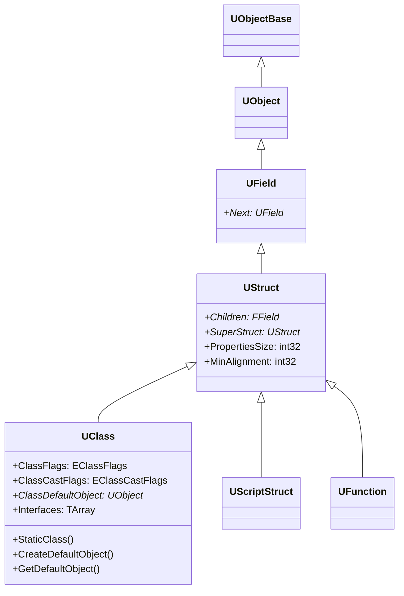

# UClass — クラスリフレクション

- 上位: [[Reflection/01_overview]]
- 関連: [[b_fproperty]] | [[c_ufunction]] | [[UObject/Details/d_class_default_object]]
- ソース: `CoreUObject/Public/UObject/Class.h`（`UClass : public UStruct`、Class.h:3792）

---

## 概要

`UClass` は `UObject` 派生クラスの **型情報オブジェクト**。継承ツリー・プロパティリスト・関数リスト・インターフェース・メタデータを保持し、ランタイムのリフレクション操作・Blueprint 連携・シリアライゼーションの基盤となる。

各 C++ クラスに対して 1 つの `UClass` インスタンスがエンジン起動時に生成され、アプリ終了まで存在する。

---

## クラス階層



---

## StaticClass() と GetClass()

```cpp
// コンパイル時に型 → UClass* を取得（テンプレート）
UClass* ActorClass = AActor::StaticClass();

// ランタイムにインスタンス → UClass* を取得
UClass* ObjClass = MyActor->GetClass();

// 型チェック
bool bIsActor = MyActor->IsA<AActor>();
bool bIsA     = MyActor->IsA(AActor::StaticClass());

// キャスト（失敗時は nullptr）
ACharacter* Char = Cast<ACharacter>(MyActor);

// キャスト（失敗時 assert）
ACharacter* Char = CastChecked<ACharacter>(MyActor);
```

`StaticClass()` は UHT が生成する `Z_Construct_UClass_*()` 関数がグローバル初期化時に呼ばれることで確立する。

---

## EClassFlags（主要フラグ）

| フラグ | 値 | UCLASS 指定子 | 意味 |
|--------|-----|-------------|------|
| `CLASS_Abstract` | `0x00000001` | `Abstract` | 直接インスタンス化不可 |
| `CLASS_Config` | `0x00000002` | `Config=xxx` | .ini からプロパティ読み込み |
| `CLASS_Transient` | `0x00000008` | `Transient` | シリアライズしない |
| `CLASS_DefaultConfig` | `0x00000200` | `DefaultConfig` | DefaultXxx.ini に保存 |
| `CLASS_Native` | `0x00000800` | — | C++ クラス（UHT 生成） |
| `CLASS_NotPlaceable` | `0x00004000` | `NotPlaceable` | レベルに直接配置不可 |
| `CLASS_CollapseCategories` | `0x00008000` | `CollapseCategories` | Details でカテゴリを折りたたむ |
| `CLASS_Interface` | `0x00080000` | — | インターフェース定義 |
| `CLASS_Deprecated` | `0x02000000` | `Deprecated` | 非推奨（警告付き） |
| `CLASS_NewerVersionExists` | `0x04000000` | — | 再コンパイル済みで古い版 |

組み合わせ確認:
```cpp
bool bAbstract = ActorClass->HasAnyClassFlags(CLASS_Abstract);
EClassFlags Flags = ActorClass->GetClassFlags();
```

---

## EClassCastFlags — 高速型チェック

頻繁にチェックされる型（`AActor`・`UActorComponent`・`UField` 等）には、`IsA()` の O(N) 継承チェーンを避けるための `ClassCastFlags` ビットが割り当てられている:

```cpp
// IsA<AActor>() の内部は以下と同等
bool bIsActor = !!(Obj->GetClass()->ClassCastFlags & CASTCLASS_AActor);
```

独自クラスに追加することはできない（エンジン側で固定割り当て）。

---

## インターフェース

```cpp
UCLASS()
class AMyActor : public AActor, public IMyInterface
{
    GENERATED_BODY()
    // IMyInterface の関数を実装
};

// 実行時のインターフェースチェック
bool bImpl = MyActor->GetClass()->ImplementsInterface(UMyInterface::StaticClass());

// キャスト（C++ 実装側）
IMyInterface* Iface = Cast<IMyInterface>(MyActor);
// または UObject 経由
IMyInterface* Iface = TScriptInterface<IMyInterface>(MyActor).GetInterface();
```

`UClass::Interfaces` は `TArray<FImplementedInterface>` で、実装されているインターフェースと各ポインタオフセットを保持する。

---

## クラスの探索

```cpp
// 名前からクラスを探す
UClass* FoundClass = FindObject<UClass>(nullptr, TEXT("/Script/Engine.Actor"));
// または
UClass* FoundClass = FindFirstObject<UClass>(TEXT("Actor"), EFindFirstObjectOptions::None);

// すべての UClass を走査
for (TObjectIterator<UClass> It; It; ++It)
{
    UClass* Class = *It;
    if (Class->IsChildOf(AActor::StaticClass()))
    {
        UE_LOG(LogTemp, Log, TEXT("Actor subclass: %s"), *Class->GetName());
    }
}
```

---

## SubclassOf — 型安全なクラス参照

```cpp
UPROPERTY(EditAnywhere, Category="Config")
TSubclassOf<AActor> SpawnClass;

// 使用時
if (SpawnClass)
{
    AActor* Spawned = World->SpawnActor<AActor>(SpawnClass, ...);
}
```

`TSubclassOf<T>` は `UClass*` のラッパで、`T` の派生クラスのみを保持できる型安全なコンテナ。

---

## UCLASS 主要指定子まとめ

| 指定子 | 効果 |
|--------|------|
| `BlueprintType` | Blueprint から変数として使用可 |
| `Blueprintable` | Blueprint で派生クラスを作成可 |
| `Abstract` | 直接インスタンス化不可 |
| `NotBlueprintable` | Blueprint 派生を禁止 |
| `Transient` | シリアライズしない |
| `Config=xxx` | .ini 読み込み有効化 |
| `DefaultConfig` | DefaultXxx.ini に保存 |
| `MinimalAPI` | 最小限の API エクスポート（DLL）|
| `Within=OuterClass` | Outer が必ず指定クラス型であることを強制 |
| `HideDropdown` | BP のドロップダウンに表示しない |
| `Deprecated` | 非推奨警告 |

---

## コード実行フロー

### エントリポイント（UClass 構築 〜 型チェック 〜 探索）

```
(ビルド時)
UnrealHeaderTool が UCLASS マクロを解析
  └─ {Module}.generated.cpp 出力
       ├─ Z_Construct_UClass_UMyComponent_NoRegister()              ← 軽量初期化
       ├─ Z_Construct_UClass_UMyComponent()                         ← フル初期化
       └─ UMyComponent::StaticClass() 定義                          ← TClassCompiledInDefer

(エンジン起動時 - UClass 登録)
ProcessNewlyLoadedUObjects()                                       [UObjectGlobals.cpp]
  ├─ UClassRegisterAllCompiledInClasses()
  │    └─ for each TClassCompiledInDefer:
  │         └─ Z_Construct_UClass_UMyComponent()
  │              ├─ UECodeGen_Private::ConstructUClass()
  │              ├─ AddCppProperty で FProperty を Children に追加  ← [[b_fproperty]]
  │              ├─ AddFunctionToFunctionMap で UFunction 登録      ← [[c_ufunction]]
  │              └─ ImplementsInterface 設定
  └─ UObjectLoadAllCompiledInDefaultProperties()
       └─ Class->CreateDefaultObject()                              ← CDO 生成

(StaticClass)
UMyComponent::StaticClass()                                        [UHT 生成]
  └─ static UClass* キャッシュ返却（初回は GetPrivateStaticClass で構築）

(型チェック)
Obj->IsA<AActor>()                                                 [Object.h]
  └─ UClass::IsChildOf(AActor::StaticClass())
       ├─ ClassCastFlags & CASTCLASS_AActor (高速パス)              ← O(1) ビット判定
       └─ for (Class = this; Class; Class = Class->SuperStruct)     ← O(N) フォールバック

(クラス探索)
FindObject<UClass>(nullptr, TEXT("/Script/Engine.Actor"))          [UObjectGlobals.cpp]
  └─ StaticFindObject() → FUObjectHashTables 経由

TObjectIterator<UClass>                                            [UObjectIterator.h]
  └─ GUObjectArray を全走査
```

### フロー詳細

1. **UHT 生成** — UnrealHeaderTool が `.h` を解析して `.generated.cpp` に `Z_Construct_UClass_*` 関数を出力。`StaticClass()` テンプレートも生成される。
2. **UClass 登録** — `ProcessNewlyLoadedUObjects` から `UClassRegisterAllCompiledInClasses` が呼ばれ、各 `Z_Construct_UClass_*` が UClass インスタンスを構築。`AddCppProperty` で `FProperty` リストを構築し、`AddFunctionToFunctionMap` で `UFunction` を登録。
3. **CDO 生成** — `UObjectLoadAllCompiledInDefaultProperties` が `CreateDefaultObject` を呼び、各クラスの CDO を生成（[[UObject/Details/d_class_default_object]]）。
4. **StaticClass 解決** — `T::StaticClass()` は UHT 生成のキャッシュ済み `UClass*` を返す O(1) アクセス。
5. **IsA 高速パス** — 頻出型（AActor、UActorComponent 等）は `ClassCastFlags` ビットで判定。それ以外は `SuperStruct` チェーンを上って `IsChildOf` 検査。
6. **インターフェース実装** — `Interfaces` 配列に `FImplementedInterface` が登録され、`Cast<IMyInterface>(Obj)` 時にポインタオフセット調整に使われる。
7. **クラス探索** — `FindObject<UClass>` は `FUObjectHashTables` を、`TObjectIterator<UClass>` は `GUObjectArray` を直接走査する（[[UObject/Details/c_outer_chain]]）。

### 関与クラス・関数一覧

| クラス / 関数 | ファイル | 役割 |
|-------------|---------|------|
| `Z_Construct_UClass_*` | `*.generated.cpp` | UHT 生成の UClass 構築関数 |
| `UClassRegisterAllCompiledInClasses` | `UObjectGlobals.cpp` | UClass 登録ドライバ |
| `UECodeGen_Private::ConstructUClass` | `UObjectGlobals.cpp` | UClass 構築の共通実装 |
| `UClass::CreateDefaultObject` | `Class.cpp` | CDO 生成 |
| `UClass::IsChildOf` | `Class.h` | 継承チェーン判定 |
| `UClass::ImplementsInterface` | `Class.cpp` | インターフェース実装チェック |
| `TObjectIterator<UClass>` | `UObjectIterator.h` | UClass 全走査 |

---

## 関連ドキュメント

- [[b_fproperty]] — `UClass` が保持するプロパティリスト
- [[c_ufunction]] — `UClass` が保持する関数リスト
- [[UObject/Details/d_class_default_object]] — CDO との関係
- [[Reference/ref_reflection_api]] — `UClass` / `TObjectIterator` の API
