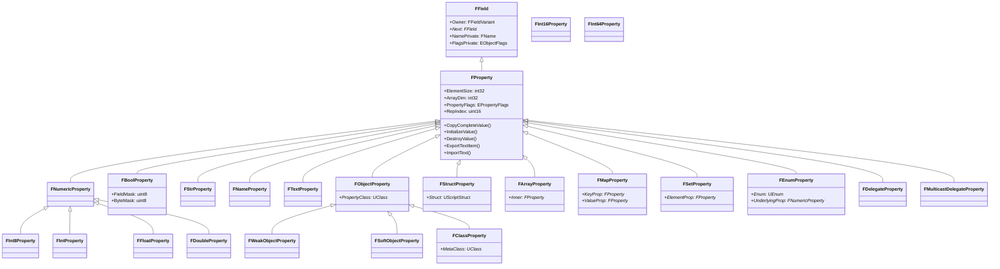

# FProperty — プロパティリフレクション

- 上位: [[Reflection/01_overview]]
- 関連: [[a_uclass]] | [[c_ufunction]]
- ソース: `CoreUObject/Public/UObject/UnrealType.h`（`FProperty : public FField`、UnrealType.h:173）

---

## 概要

`FProperty` は **UObject のメンバ変数のリフレクション情報**。UE5 で `UProperty`（UObject 派生）から `FField`/`FProperty`（非 UObject）へ変更され、GC 負荷を削減した。型別のサブクラス（`FNumericProperty`・`FObjectProperty`・`FArrayProperty` 等）がプロパティの読み書き・コピー・ネット複製を担う。

---

## FProperty 階層



---

## EPropertyFlags（CPF_*）主要フラグ

| フラグ | 値 | UPROPERTY 指定子 | 意味 |
|--------|-----|----------------|------|
| `CPF_Edit` | `0x0001` | `EditAnywhere`/`EditDefaultsOnly` | エディタ編集可 |
| `CPF_BlueprintVisible` | `0x0004` | `BlueprintReadWrite`/`BlueprintReadOnly` | Blueprint 公開 |
| `CPF_BlueprintReadOnly` | `0x0010` | `BlueprintReadOnly` | Blueprint 読み取り専用 |
| `CPF_Net` | `0x0020` | `Replicated` | ネット複製対象 |
| `CPF_Transient` | `0x2000` | `Transient` | シリアライズしない |
| `CPF_Config` | `0x4000` | `Config` | .ini から読み込む |
| `CPF_EditConst` | `0x20000` | `VisibleAnywhere` | 表示のみ（編集不可） |
| `CPF_SaveGame` | — | `SaveGame` | SaveGame シリアライズ対象 |
| `CPF_EditorOnly` | `0x800000000` | `meta=(...)` | エディタのみ |
| `CPF_DisableEditOnInstance` | `0x10000` | `EditDefaultsOnly` | インスタンス編集不可 |

---

## プロパティの操作

### TFieldIterator — クラスのプロパティ走査

```cpp
// UMyClass のすべての UPROPERTY を走査
for (TFieldIterator<FProperty> It(UMyClass::StaticClass()); It; ++It)
{
    FProperty* Prop = *It;
    UE_LOG(LogTemp, Log, TEXT("Property: %s, Type: %s"),
        *Prop->GetName(), *Prop->GetCPPType());
}

// 継承プロパティを含めるかどうか
TFieldIterator<FProperty> It(Class, EFieldIteratorFlags::IncludeSuper);
```

### 値の汎用取得・設定

```cpp
// インスタンスからプロパティ値を取得
FProperty* Prop = UMyClass::StaticClass()->FindPropertyByName(TEXT("Health"));
FFloatProperty* FloatProp = CastField<FFloatProperty>(Prop);
if (FloatProp)
{
    float Value = FloatProp->GetPropertyValue_InContainer(MyObj);
    FloatProp->SetPropertyValue_InContainer(MyObj, 200.f);
}
```

### CopyCompleteValue — 汎用コピー

```cpp
// src から dest へプロパティ値を型に関係なくコピー
Prop->CopyCompleteValue(DestContainer, SrcContainer);

// 初期値で埋める（コンストラクタ相当）
Prop->InitializeValue_InContainer(Container);

// デストラクタ相当
Prop->DestroyValue_InContainer(Container);
```

### テキスト入出力

```cpp
// FProperty の値をテキストにエクスポート
FString TextVal;
Prop->ExportTextItem_Direct(TextVal, PropPtr, nullptr, nullptr, PPF_None);

// テキストから値をインポート
const TCHAR* Text = TEXT("150.0");
Prop->ImportText_Direct(Text, PropPtr, nullptr, PPF_None);
```

---

## UE4 → UE5 の移行（UProperty → FProperty）

| 変更点 | UE4 | UE5 |
|--------|-----|-----|
| 基底 | `UProperty : public UField : public UObject` | `FProperty : public FField`（非 UObject） |
| GC | GC が追跡（コスト大） | GC 対象外（コスト削減） |
| キャスト | `Cast<UIntProperty>(Prop)` | `CastField<FIntProperty>(Prop)` |
| 型名 | `UIntProperty`/`UFloatProperty` | `FIntProperty`/`FFloatProperty` |
| 走査 | `TFieldIterator<UProperty>` | `TFieldIterator<FProperty>` |

---

## 主要サブクラスの特徴

### FBoolProperty

`bool` 型はビットフィールドのパッキングに対応:

```cpp
FBoolProperty* BoolProp = CastField<FBoolProperty>(Prop);
bool Val = BoolProp->GetPropertyValue_InContainer(Obj);
// 内部的には FieldMask と ByteMask でバイト内のビット位置を管理
```

### FObjectProperty

```cpp
FObjectProperty* ObjProp = CastField<FObjectProperty>(Prop);
UClass* PropClass = ObjProp->PropertyClass;  // どのクラスの UObject か
UObject* RefObj = ObjProp->GetObjectPropertyValue_InContainer(Obj);
```

`FWeakObjectProperty`・`FSoftObjectProperty`・`FLazyObjectProperty` は同様に特殊参照型の処理を持つ。

### FStructProperty

```cpp
FStructProperty* StructProp = CastField<FStructProperty>(Prop);
UScriptStruct* InnerStruct = StructProp->Struct;  // USTRUCT 型情報
void* StructData = StructProp->ContainerPtrToValuePtr<void>(Container);
```

---

## プロパティのネットワーク複製

`CPF_Net` フラグが立っている `FProperty` はレプリケーション対象。各プロパティは `RepIndex` を持ち、ネット複製テーブルで管理される。

```cpp
// RepIndex で RepLayout のプロパティを特定
uint16 RepIdx = Prop->RepIndex;
```

---

## 関連ドキュメント

- [[a_uclass]] — プロパティを所有する `UClass`/`UStruct`
- [[c_ufunction]] — 引数・戻り値も `FProperty` で表現
- [[Reference/ref_reflection_api]] — `FProperty` / `TFieldIterator` の API
