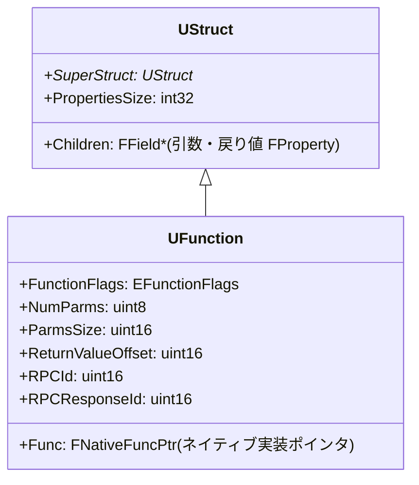

# UFunction — 関数リフレクション

- 上位: [[Reflection/01_overview]]
- 関連: [[a_uclass]] | [[b_fproperty]]
- ソース: `CoreUObject/Public/UObject/Class.h`（`UFunction : public UStruct`、Class.h:2475）, `CoreUObject/Public/UObject/Script.h`

---

## 概要

`UFunction` は `UFUNCTION()` マクロが付いた関数の **リフレクション情報オブジェクト**。引数・戻り値は `FProperty` のリストとして `UStruct::Children` に格納され、Blueprint VM からの呼び出し・RPC・イベント・コンソールコマンドなど幅広い用途に使われる。

---

## UFunction の構造



`UFunction::Func` はネイティブ実装の関数ポインタ。Blueprint のみの関数では `nullptr`（VM が `Children` のプロパティを元にバイトコードを実行する）。

---

## EFunctionFlags（主要フラグ）

| フラグ | 値 | UFUNCTION 指定子 | 意味 |
|--------|-----|----------------|------|
| `FUNC_Native` | `0x0400` | — | C++ ネイティブ実装あり |
| `FUNC_Net` | `0x0040` | `Server`/`Client`/`NetMulticast` | ネットワーク RPC |
| `FUNC_NetReliable` | `0x0080` | `Reliable` | 信頼性あり RPC |
| `FUNC_NetServer` | `0x0200000` | `Server` | サーバー側 RPC |
| `FUNC_NetClient` | `0x0010000000` | `Client` | クライアント側 RPC |
| `FUNC_NetMulticast` | `0x0020000000` | `NetMulticast` | マルチキャスト RPC |
| `FUNC_Exec` | `0x0200` | `Exec` | コンソールコマンド化 |
| `FUNC_Event` | `0x0800` | `BlueprintImplementableEvent` | イベント（BP で実装）|
| `FUNC_Static` | `0x0002000` | `static` | 静的関数 |
| `FUNC_BlueprintCallable` | `0x04000000` | `BlueprintCallable` | BP から呼び出し可 |
| `FUNC_BlueprintPure` | `0x10000000` | `BlueprintPure` | 副作用なし純粋関数 |
| `FUNC_BlueprintAuthorityOnly` | `0x0400000` | `BlueprintAuthorityOnly` | 権威側のみ呼び出し可 |
| `FUNC_Const` | `0x40000` | `const` | const メンバ関数 |

---

## ProcessEvent — Blueprint から C++ 関数呼び出し

Blueprint が C++ 関数を呼び出す際の経路:

```
Blueprint ノード実行
  └─ UObject::ProcessEvent(UFunction*, void* Parms)
       ├─ [FUNC_Native] → UFunction::Func(this, Stack, Result)
       │    = 実際の C++ execXxx 関数ポインタを呼ぶ
       └─ [FUNC_Event] → GNatives[EX_CallMath] 等 VM バイトコード実行
```

### exec ラッパ関数（UHT 生成）

```cpp
// UHT が自動生成するネイティブ関数シム
DECLARE_FUNCTION(execMyBlueprintCallable)
{
    // スタックから引数を P_GET_PROPERTY で取り出す
    P_GET_PROPERTY(FFloatProperty, Z_Param_Damage);
    P_FINISH;
    P_NATIVE_BEGIN;
    // 実際の C++ 実装を呼び出す
    P_THIS->MyBlueprintCallable(Z_Param_Damage);
    P_NATIVE_END;
}
```

これが `UFunction::Func` ポインタに設定される。

---

## 関数の検索と動的呼び出し

```cpp
// 名前で UFunction を取得
UFunction* Fn = MyObj->FindFunction(TEXT("MyBlueprintCallable"));

// 引数バッファを用意して動的呼び出し
struct FMyParams
{
    float Damage;
};
FMyParams Params{ 50.f };
MyObj->ProcessEvent(Fn, &Params);
```

UHT が生成するパラメータ構造体のレイアウトは `UFunction::Children` の `FProperty` の順序とオフセットに従う。

---

## BlueprintImplementableEvent / BlueprintNativeEvent

### BlueprintImplementableEvent

C++ 宣言のみ、実装は Blueprint:

```cpp
// C++ 側
UFUNCTION(BlueprintImplementableEvent, Category="Events")
void OnHealthChanged(float NewHealth);  // 実装は書かない

// Blueprint 側でオーバーライドして実装
```

内部では「`UFunction` の `FUNC_Event` 版」が生成され、BP がバイトコードとして実装を持つ。

### BlueprintNativeEvent

C++ でデフォルト実装を持ち、Blueprint でオーバーライド可能:

```cpp
// C++ 宣言
UFUNCTION(BlueprintNativeEvent, Category="Events")
void OnHealthChanged(float NewHealth);

// C++ 実装（_Implementation サフィックス）
void UMyClass::OnHealthChanged_Implementation(float NewHealth)
{
    // デフォルト実装
}

// Blueprint でオーバーライドした場合は BP 実装が優先される
```

`OnHealthChanged` を呼ぶと内部で BP 実装があるかチェックし、なければ `_Implementation` にフォールバック。

---

## RPC（Remote Procedure Call）

```cpp
// Server RPC（クライアント → サーバー）
UFUNCTION(Server, Reliable)
void ServerFireWeapon(FVector Direction);

// Client RPC（サーバー → 所有クライアント）
UFUNCTION(Client, Unreliable)
void ClientUpdateScore(int32 NewScore);

// Multicast（サーバー → 全クライアント）
UFUNCTION(NetMulticast, Reliable)
void MulticastPlayEffect(FVector Location);
```

**実装**: `ServerFireWeapon_Implementation()` のサフィックスを付けた関数に書く（BlueprintNativeEvent と同様のパターン）。

---

## Exec — コンソールコマンド

```cpp
UFUNCTION(Exec)
void CheatGodMode();
// → デバッグコンソールで "CheatGodMode" と入力すると呼ばれる
```

PlayerController・GameMode 等 `APlayerController` の入力伝搬チェーンに乗っているオブジェクトのみ有効。

---

## 引数の走査

```cpp
// UFunction の引数プロパティを走査
for (TFieldIterator<FProperty> It(MyFunction); It; ++It)
{
    FProperty* Param = *It;
    if (Param->HasAnyPropertyFlags(CPF_Parm))
    {
        bool bRetVal = Param->HasAnyPropertyFlags(CPF_ReturnParm);
        bool bOutParam = Param->HasAnyPropertyFlags(CPF_OutParm);
        UE_LOG(LogTemp, Log, TEXT("Param: %s (Return=%d, Out=%d)"),
            *Param->GetName(), bRetVal, bOutParam);
    }
}
```

---

## 関連ドキュメント

- [[a_uclass]] — `UFunction` を所有する `UClass`
- [[b_fproperty]] — 引数・戻り値の `FProperty`
- [[Reference/ref_reflection_api]] — `UFunction` / `ProcessEvent` の API
