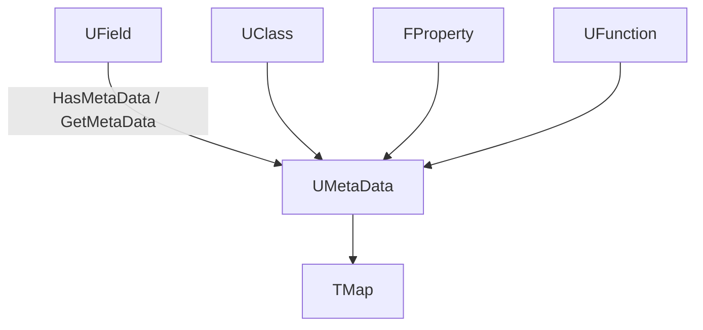

# メタデータ（UMETA・メタデータスペシファイア）

- 上位: [[Reflection/01_overview]]
- 関連: [[a_uclass]] | [[b_fproperty]] | [[c_ufunction]]
- ソース: `CoreUObject/Public/UObject/MetaData.h`, `CoreUObject/Public/UObject/Class.h`

---

## 概要

UE5 のメタデータは、`UCLASS`/`UPROPERTY`/`UFUNCTION`/`USTRUCT` マクロの `Meta=(...)` に記述する **エディタ向けの付加情報**。ToolTip・編集条件・検証ルール・カテゴリ名など、エディタ UI の挙動をコード側から制御する。

**ランタイムには存在しない** — クック時にメタデータは除去される（`WITH_EDITORONLY_DATA` で囲まれている）。

---

## メタデータの構造



`UMetaData` は `UPackage` が所有するオブジェクトで、`UField` / `FField` に `FName → FString` のキー・バリューマップを提供する。

---

## メタデータの記述方法

```cpp
UCLASS(meta=(ToolTip="プレイヤーの基本キャラクター",
             ShortTooltip="プレイヤーキャラ",
             DisplayName="Player Character"))
class AMyCharacter : public ACharacter { ... };

UPROPERTY(EditAnywhere, Category="Stats",
    meta=(
        ClampMin="0.0",
        ClampMax="1000.0",
        UIMin="0.0",
        UIMax="500.0",
        EditCondition="bIsAlive",
        EditConditionHides,
        ToolTip="現在の HP"
    ))
float Health;

UFUNCTION(BlueprintCallable,
    meta=(
        DisplayName="ダメージを与える",
        ToolTip="指定量のダメージをこのキャラクターに与える",
        DefaultToSelf="Target",
        WorldContext="WorldContextObject"
    ))
void TakeDamage(float Amount);
```

---

## よく使うメタデータスペシファイア

### UPROPERTY 向け

| キー | 型 | 説明 |
|------|----|------|
| `ClampMin` / `ClampMax` | float/int | 値のクランプ（内部値も制限） |
| `UIMin` / `UIMax` | float/int | スライダーの表示範囲（内部値は制限しない） |
| `EditCondition` | C++ 式 | 指定式が `true` のときのみ編集可 |
| `EditConditionHides` | — | `EditCondition` が false のとき UI から非表示 |
| `InlineEditConditionToggle` | — | チェックボックスを隣に表示 |
| `ToolTip` | string | ホバー時のツールチップ |
| `DisplayName` | string | UI 上の表示名 |
| `Category` | string | `Category="..."` と同じ（メタでも指定可） |
| `AllowedClasses` | クラス名 | オブジェクト参照プロパティで選択可能なクラスを制限 |
| `RequiredAssetDataTags` | タグ式 | アセット選択フィルタ |
| `NoResetToDefault` | — | 右クリック「Reset to Default」を無効化 |
| `ShowOnlyInnerProperties` | — | 構造体の展開表示 |
| `TitleProperty` | プロパティ名 | 配列要素のタイトルに使うプロパティ |
| `Units` | 単位文字列 | `"cm"` / `"kg"` など（数値の隣に表示） |
| `ForceUnits` | 単位文字列 | 強制的に単位変換 |
| `MakeStructureDefaultValue` | — | デフォルト値を構造体のコンストラクタから取得 |

### UFUNCTION 向け

| キー | 説明 |
|------|------|
| `DisplayName` | BP ノードの表示名 |
| `ToolTip` | BP ノードのツールチップ |
| `DefaultToSelf` | 指定引数のデフォルトを self に |
| `WorldContext` | ワールドコンテキスト引数名 |
| `ExpandEnumAsExecs` | 列挙型引数を実行ピンに展開 |
| `LatentInfo` | 非同期ノードの情報引数名 |
| `Latent` | Latent（遅延）ノードとしてマーク |
| `HidePin` | 指定引数ピンを隠す |
| `AutoCreateRefTerm` | 参照引数に自動デフォルトを生成 |

### UCLASS 向け

| キー | 説明 |
|------|------|
| `ToolTip` / `ShortTooltip` | クラスのツールチップ |
| `DisplayName` | エディタ上の表示名 |
| `ClassGroup` | アクタ追加ダイアログのグループ |
| `HideCategories` | 指定カテゴリを Details から非表示 |
| `ShowCategories` | 親クラスで非表示になったカテゴリを再表示 |
| `ComponentWrapperClass` | コンポーネントラッパーとしてマーク |

---

## EditCondition — 条件付き編集

```cpp
UPROPERTY(EditAnywhere)
bool bUseCustomSpeed;

UPROPERTY(EditAnywhere, meta=(EditCondition="bUseCustomSpeed", EditConditionHides))
float CustomSpeed;
// bUseCustomSpeed が false のとき CustomSpeed は非表示
```

`EditCondition` には `!bSomething` や `EnumValue == EMyEnum::Active` のような C++ 式が使える（評価はエディタが行う）。

---

## ランタイムでのメタデータアクセス

エディタビルドのみ。`WITH_EDITOR` or `WITH_EDITORONLY_DATA` で囲む必要がある:

```cpp
#if WITH_EDITOR
FProperty* Prop = UMyClass::StaticClass()->FindPropertyByName(TEXT("Health"));

// キーが存在するか
bool bHas = Prop->HasMetaData(TEXT("ClampMin"));

// 値を取得
FString ClampMin = Prop->GetMetaData(TEXT("ClampMin"));
float MinVal = FCString::Atof(*ClampMin);

// 設定（通常は UHT が行う。手動設定は稀）
Prop->SetMetaData(TEXT("ToolTip"), TEXT("カスタムツールチップ"));
#endif
```

---

## UMETA — Enum 向けメタデータ

```cpp
UENUM(BlueprintType)
enum class EMyState : uint8
{
    Idle    UMETA(DisplayName="待機中"),
    Moving  UMETA(DisplayName="移動中", ToolTip="移動状態"),
    Dead    UMETA(DisplayName="死亡", Hidden),  // BP のドロップダウンから非表示
};
```

---

## カスタムメタデータの追加

UHT の解析を通じてカスタムキーを追加できる（エディタ UI 上での解釈は自分で実装する必要あり）:

```cpp
UPROPERTY(meta=(MyCustomKey="CustomValue"))
int32 MyProp;

// 独自エディタ Customization で読む
FString Val = Prop->GetMetaData(TEXT("MyCustomKey"));
```

---

## コード実行フロー

### エントリポイント（メタデータ登録 〜 取得 〜 EditCondition 評価）

```
(UHT 生成 - メタデータ登録)
Z_Construct_UClass_UMyComponent()                                  [*.generated.cpp]
  └─ UECodeGen_Private::ConstructUClass()
       └─ UStruct::SetMetaData(Key, Value)                         [Class.cpp]
            └─ UMetaData::SetValue(Object, Key, Value)
                 └─ ObjectMetaDataMap.FindOrAdd(Object).Add(Key, Value)

(取得経路)
FProperty::GetMetaData(TEXT("ClampMin"))                          [Field.h]
  └─ UMetaData* MD = GetOutermost()->GetMetaData()
       └─ MD->GetValue(this, Key)
            └─ ObjectMetaDataMap.Find(Object) → Map.Find(Key)
                 └─ FString 値を返す（未登録なら空）

(EditCondition 評価 - エディタ)
FPropertyHandleBase::IsEditable()                                  [PropertyHandleImpl.cpp]
  └─ FEditConditionParser::Evaluate(Expression, Context)            [EditConditionParser.cpp]
       ├─ 字句解析: "bIsAlive" / "==" / "Active"
       ├─ プロパティ解決: Container->FindPropertyByName("bIsAlive")
       └─ 値評価: bIsAlive == true ? 編集可 : 編集不可
            └─ EditConditionHides あれば UI 自体を隠す

(ClampMin 適用 - エディタの Slider)
SNumericEntryBox<float>::OnValueChanged()                         [SlateWidgets]
  └─ Prop->GetMetaData(TEXT("ClampMin")) → "0.0"
       └─ FCString::Atof で数値化
            └─ FMath::Clamp(Value, MinVal, MaxVal) で値を制限

(クック時 - 除去)
UPackage::SavePackage()                                           [SavePackage.cpp]
  └─ if (CookingTarget) UMetaData をシリアライズ対象から除外          ← クック後消失
```

### フロー詳細

1. **UHT 登録** — UHT が `meta=(...)` 内の各キーバリューを抽出し、`Z_Construct_UClass_*` 内で `SetMetaData` を呼んで `UMetaData` に登録する。
2. **UMetaData の所有** — メタデータは `UPackage` が所有する `UMetaData` インスタンスに集約される（`UPackage::GetMetaData()` で取得）。各 `UField`/`FField` を起点とした `TMap<FName, FString>` を持つ。
3. **取得 API** — `FProperty::GetMetaData(Key)` は `GetOutermost()->GetMetaData()` 経由で `UMetaData::GetValue` を呼ぶ。継承先プロパティは親クラスのメタも参照する。
4. **EditCondition** — エディタの `FEditConditionParser` がメタ値を C++ 風の式として字句解析・評価する。プロパティ参照・比較演算子・論理演算子をサポート。
5. **UI 制御** — `SNumericEntryBox` 等の Slate Widget が `ClampMin`/`UIMin`/`Units` などを読み取り、入力範囲・表示書式を決定。
6. **クック除去** — `UPackage::SavePackage` がクックターゲット向けには `UMetaData` を保存対象から外す。ランタイムには `WITH_EDITORONLY_DATA` のため存在しない。
7. **カスタム指定子** — UHT がパース・登録までを担うので、独自キーは `Prop->GetMetaData(TEXT("MyCustomKey"))` で取得し、エディタ Customization で解釈する。

### 関与クラス・関数一覧

| クラス / 関数 | ファイル | 役割 |
|-------------|---------|------|
| `UMetaData::SetValue` / `GetValue` | `MetaData.cpp` | メタデータ KVS の本体 |
| `UStruct::SetMetaData` | `Class.cpp` | UClass/UStruct への登録ヘルパ |
| `FField::GetMetaData` / `HasMetaData` | `Field.h` | FProperty/UFunction からの取得 |
| `FEditConditionParser::Evaluate` | `EditConditionParser.cpp` | EditCondition 式評価 |
| `FPropertyHandleBase::IsEditable` | `PropertyHandleImpl.cpp` | Details パネル編集可否 |
| `UPackage::SavePackage` | `SavePackage.cpp` | クック時のメタ除去 |

---

## 備考

- **ランタイム非存在**: クック後のビルドにはメタデータが含まれないため、ゲームコードで `GetMetaData` を呼ぶと `WITH_EDITOR` でのみコンパイル可
- **UHT がバリデーション**: 不正なメタデータキーや値はビルドエラーになることがある
- **Blueprint のピン名**: `DisplayName` メタはネイティブ関数の BP ノード表示名に使われ、日本語も使用可能

---

## 関連ドキュメント

- [[a_uclass]] — `UCLASS(meta=...)` の適用先
- [[b_fproperty]] — `UPROPERTY(meta=...)` の適用先
- [[c_ufunction]] — `UFUNCTION(meta=...)` の適用先
- [[Reference/ref_macros]] — UCLASS/UPROPERTY/UFUNCTION の全指定子
