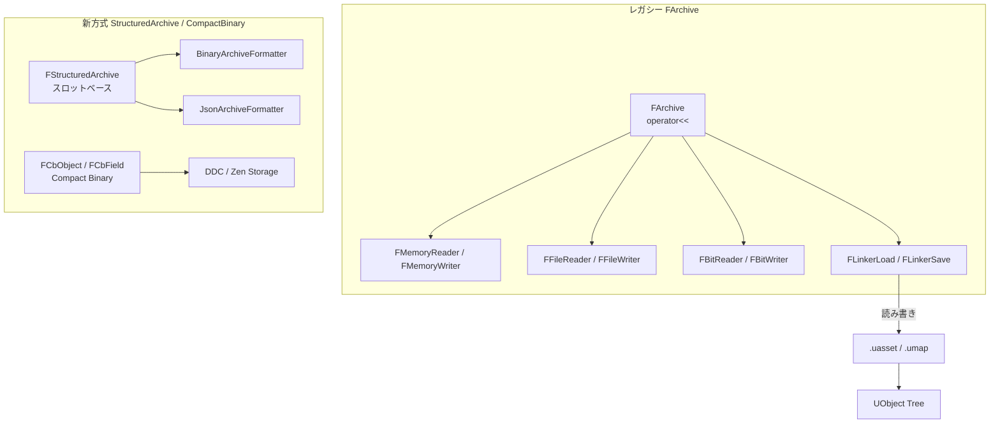

# Serialization 概要

- 上位: [[01_core_overview]]
- 関連: [[UObject/01_overview]] | [[Reflection/01_overview]]
- ソース: `Engine/Source/Runtime/Core/Public/Serialization/`, `Engine/Source/Runtime/CoreUObject/Public/Serialization/`, `CoreUObject/Public/UObject/Linker*.h`

---

## Serialization とは

UE5 における **バイナリ/テキスト I/O の統一抽象**。同じコードで以下のすべてに対応する:

- **アセット保存・ロード** — `.uasset`/`.umap` への変換
- **ネットワーク複製** — ビット単位のパケット生成
- **SaveGame** — プレイヤーのセーブデータ
- **エディタの Copy/Paste** — アクタ・プロパティのテキスト化
- **DDC（Derived Data Cache）** — コンパイル済みシェーダ等のキャッシュ

中核は `FArchive` 抽象クラス。`operator<<` を `IsLoading()` / `IsSaving()` で分岐させる **単方向インターフェース** が特徴。

---

## アーキテクチャ



---

## FArchive の基本形

```cpp
void UMyObject::Serialize(FArchive& Ar)
{
    Super::Serialize(Ar);

    Ar << MyInt;           // int32 / float / FVector 等は組込
    Ar << MyString;        // FString / FName / FText
    Ar << MyArray;         // TArray / TMap / TSet
    Ar << ObjectRef;       // UObject* も自動で参照として処理

    if (Ar.IsLoading())
    {
        // ロード時のみの処理（例: バージョン互換）
    }
    if (Ar.IsSaving())
    {
        // セーブ時のみの処理（例: 派生データ計算）
    }
}
```

**UPROPERTY() がついたメンバは `UObject::Serialize()` が自動でリフレクション経由でシリアライズするため、通常は Super 呼び出しで十分**。カスタム処理が必要な場合のみオーバーライドする。

---

## 主要クラス

| クラス | 役割 |
|-------|------|
| `FArchive` | シリアライズ基底。`operator<<(T&)`・`IsLoading()`/`IsSaving()`・`ArVersion` |
| `FArchiveState` | `FArchive` の内部状態（バージョン・フラグ等）を別オブジェクトに分離 |
| `FArchiveProxy` | 別の `FArchive` にフォワードするプロキシ（ラッピング用）|
| `FMemoryArchive` / `FMemoryReader` / `FMemoryWriter` | メモリバッファへの I/O |
| `FBufferArchive` | 可変長バッファに書き込み |
| `FBitReader` / `FBitWriter` | ビット単位 I/O（ネットワーク複製で使用） |
| `FStructuredArchive` | スロットベースの構造化 I/O（Binary / JSON を切替可能） |
| `FCustomVersion` / `FCustomVersionContainer` | モジュール別のバージョニング（互換性維持） |
| `FCompactBinaryObject` (`FCbObject`) | UE5 新フォーマット（DDC / Zen で使用） |
| `FLinkerLoad` | `.uasset` ロードの中核（パッケージ → UObject ツリー復元） |
| `FLinkerSave` | `.uasset` セーブの中核 |
| `FPackageFileSummary` | `.uasset` のヘッダ情報 |
| `FBulkData` | 大容量バイナリデータ（メッシュ・テクスチャ）の遅延ロード |
| `IAsyncPackageLoader` / `FAsyncLoadingThread2` | 非同期パッケージロード（Zen Loader） |

---

## パッケージフォーマット

`.uasset` の構造:

```
+-----------------------------+
| FPackageFileSummary         | ← マジックナンバー、バージョン、オフセット
+-----------------------------+
| Name Table                  | ← 使用されている FName の配列
+-----------------------------+
| Import Table                | ← 他パッケージのオブジェクト参照
+-----------------------------+
| Export Table                | ← このパッケージが含む UObject の一覧
+-----------------------------+
| Export Data                 | ← 各 UObject::Serialize() が書いたデータ
+-----------------------------+
| BulkData / EditorOnly       | ← 大容量データ・エディタ専用データ
+-----------------------------+
```

**ロード手順** (`FLinkerLoad::Preload()`):
1. Summary 読み込み
2. Name/Import/Export テーブル展開
3. Export ごとに UObject を生成（クラスは Import から解決）
4. 各 UObject の `Serialize()` を呼び出してプロパティを復元

---

## 非同期ロード（Zen Loader / AsyncLoadingThread2）

UE5 では **EDL（Event Driven Loader）** が **Zen Loader / AsyncLoadingThread2** に置き換わりつつある。

- **AsyncLoadingThread** が別スレッドで動作し、ファイル I/O・UObject 生成・依存解決を並列化
- **GameThread との同期点** は `PostLoad()` と一部のコールバックのみ
- **バッチ化**: 複数パッケージの依存グラフを解析して I/O を最適化

CVar `s.AsyncLoadingThreadEnabled` で有効/無効切替。

---

## カスタムバージョン

互換性を維持するためのモジュール単位バージョニング:

```cpp
struct FMyCustomVersion
{
    enum Type { InitialVersion = 0, AddedFeatureX, LatestVersion = AddedFeatureX };
    static const FGuid GUID;
};

// 登録
FCustomVersionRegistration GMyCustomVersion(FMyCustomVersion::GUID,
    FMyCustomVersion::LatestVersion, TEXT("MyCustomVersion"));

// 使用
void UMyObject::Serialize(FArchive& Ar)
{
    Ar.UsingCustomVersion(FMyCustomVersion::GUID);
    if (Ar.CustomVer(FMyCustomVersion::GUID) >= FMyCustomVersion::AddedFeatureX)
    {
        Ar << NewMember;
    }
}
```

エンジン本体の例: `FFortniteMainBranchObjectVersion` / `FUE5MainStreamObjectVersion` 等多数。

---

## Details（個別記事）

| ドキュメント | 内容 |
|------------|------|
| [[Details/a_farchive]] | `FArchive` の基本・`operator<<`・IsLoading/IsSaving・カスタムバージョン |
| [[Details/b_asset_serialization]] | `.uasset` のロード/セーブ・`FLinkerLoad`/`FLinkerSave`・パッケージ構造 |
| [[Details/c_save_game]] | `USaveGame`・`UGameplayStatics::SaveGameToSlot`・バイナリ/JSON |

---

## Reference

- [[Reference/ref_serialization_api]] … `FArchive` / `FStructuredArchive` / `FLinkerLoad` の API

---

## 主要 CVar

| CVar | デフォルト | 説明 |
|------|----------|------|
| `s.AsyncLoadingThreadEnabled` | `1` | 非同期ロードスレッド有効化 |
| `s.LevelStreamingActorsUpdateTimeLimit` | `5.0` | 非同期ロード時間制限（ms/フレーム） |
| `s.UseBackgroundLevelStreaming` | `1` | バックグラウンドロード有効化 |
| `s.EnableBulkDataLoading` | `1` | BulkData 遅延ロード有効化 |

---

## コード実行フロー

### エントリポイント（パッケージロード経路）

```
LoadPackageAsync("/Game/Foo/Bar", CompletionDelegate)            [PackageName.cpp]
  └─ FAsyncLoadingThread2::QueuePackage()                        [AsyncLoading2.cpp]
       ├─ AsyncLoadingThread でファイル I/O
       ├─ FLinkerLoad::CreateLinker()                            [LinkerLoad.cpp]
       │    ├─ FPackageFileSummary デシリアライズ                ← ヘッダ読み込み
       │    ├─ Name テーブル展開                                  ← FName プールに登録
       │    ├─ Import / Export テーブル展開
       │    └─ Preload(Export)
       │         ├─ StaticConstructObject_Internal()             ← 各 Export を生成
       │         └─ UObject::Serialize(LinkerArchive)
       │              └─ FArchive::operator<<(MyMember)          ← UPROPERTY 復元
       │                   = FArchive::ByteOrderSerialize() 等を再帰呼び出し
       └─ GameThread 同期: UObject::PostLoad()                    ← ロード完了フック

(セーブ経路 - エディタ専用)
UPackage::Save() / UPackage::SavePackage()                       [SavePackage.cpp]
  └─ FLinkerSave::Save()                                          [LinkerSave.cpp]
       ├─ Export 収集 + Import 解決 + Name テーブル構築
       ├─ FPackageFileSummary 書き込み
       └─ Object->Serialize(SaveArchive)                          ← UPROPERTY を書き込む
```

### フロー詳細

1. **非同期ロード起動** — `LoadPackageAsync()` が `FAsyncLoadingThread2`（Zen Loader）にパッケージ名をキュー登録。GameThread はブロックされない（[[Details/b_asset_serialization]]）。
2. **Linker 生成** — `FLinkerLoad::CreateLinker()` が `FPackageFileSummary` を読み、Name/Import/Export テーブルを展開する（`LinkerLoad.cpp`）。
3. **Export 構築** — 各 `FObjectExport` に対して `StaticConstructObject_Internal()` で UObject を生成し、その `Serialize(FArchive&)` を呼んで UPROPERTY を復元する。
4. **`operator<<` 再帰** — `Ar << MyMember` は `FArchive::ByteOrderSerialize()` 等のプリミティブ I/O を経由してバイト列を読む。コンテナ・UObject 参照は型ごとの専用 operator が処理する（[[Details/a_farchive]]）。
5. **GameThread 同期** — Serialize 完了後、`PostLoad()` が GameThread で呼ばれる（async loading の唯一の同期点）。
6. **SaveGame 経路** — `UGameplayStatics::SaveGameToSlot()` は `FMemoryWriter` ベースで `CPF_SaveGame` フラグのプロパティだけを書く（[[Details/c_save_game]]）。

### 関与クラス・関数一覧

| クラス / 関数 | ファイル | 役割 |
|-------------|---------|------|
| `LoadPackageAsync` | `PackageName.cpp` | 非同期ロード API |
| `FAsyncLoadingThread2::QueuePackage` | `AsyncLoading2.cpp` | Zen Loader キュー |
| `FLinkerLoad::CreateLinker` / `Preload` | `LinkerLoad.cpp` | パッケージ → UObject 復元 |
| `FArchive::operator<<` | `Archive.h` | プリミティブ・コンテナの I/O |
| `UObject::Serialize` | `Object.cpp` | UPROPERTY シリアライゼーション |
| `UPackage::SavePackage` | `SavePackage.cpp` | セーブドライバ（エディタ） |

---

## 備考

- **FArchive は単方向** — Load/Save を同じコードで書くため、`operator<<` しか使えない（`>>` なし）
- **FStructuredArchive は UE 4.22 以降** — 従来の `FArchive` と互換性あり（`FStructuredArchiveFromArchive` でラップ可）
- **CompactBinary は DDC 専用** — UE5.1+ で DDC が Compact Binary ベースに移行
- **Zen Loader は Windows/Console のみ** — モバイルは引き続き EDL
