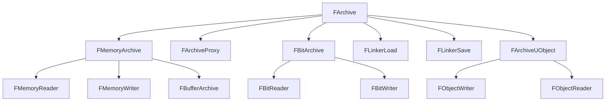

# FArchive — シリアライゼーション基盤

- 上位: [[Serialization/01_overview]]
- 関連: [[b_asset_serialization]] | [[c_save_game]]
- ソース: `Core/Public/Serialization/Archive.h`（`FArchive : private FArchiveState`、Archive.h:1207）

---

## 概要

`FArchive` は UE5 シリアライゼーションの **根幹インターフェース**。`IsLoading()` / `IsSaving()` を分岐させることで、同一の `operator<<` コードでロードとセーブの両方に対応する「単方向シリアライズ」を実現する。すべての UObject ・バイナリ I/O ・ネット複製・テキスト Export がこの抽象を通じて動作する。

---

## 基本パターン

```cpp
void UMyObject::Serialize(FArchive& Ar)
{
    Super::Serialize(Ar);

    Ar << MyInt;        // int32, float, bool 等はビルトイン
    Ar << MyFName;      // FName
    Ar << MyFString;    // FString
    Ar << MyVector;     // FVector / FRotator / FTransform 等
    Ar << MyArray;      // TArray<T> （T も operator<< が必要）
    Ar << MyObjRef;     // UObject* は参照として処理

    if (Ar.IsLoading())
    {
        // ロード時のみ: バージョン互換処理など
    }
    if (Ar.IsSaving())
    {
        // セーブ時のみ: キャッシュ無効化など
    }
}
```

**`UPROPERTY()` のついたメンバは `Super::Serialize()` の中でリフレクション経由で自動シリアライズされる**。手動 `<<` が必要なのは `UPROPERTY()` を付けない場合（意図的に GC 外・シリアライズ外にしたいケース）のみ。

---

## FArchive の状態フラグ

| メソッド | 説明 |
|---------|------|
| `IsLoading()` | データを読み込んでいる |
| `IsSaving()` | データを書き込んでいる |
| `IsTransacting()` | Undo トランザクション中（エディタ） |
| `IsCountingMemory()` | メモリ計測中（`FArchiveCountMem`） |
| `IsCooking()` | クック中（プラットフォーム向け変換） |
| `IsFilterEditorOnly()` | エディタ専用データをスキップ |
| `IsLoadingFromCookedPackage()` | クック済みパッケージを読み込み中 |
| `IsObjectReferenceCollector()` | オブジェクト参照収集中（GC 等） |
| `IsTextFormat()` | テキスト形式（JSON 等） |

---

## FArchive 派生クラス一覧



### 主要クラスの用途

| クラス | 用途 |
|-------|------|
| `FMemoryReader` | バイト配列から読み込む（`TArray<uint8>` の内容を Deserialize） |
| `FMemoryWriter` | バイト配列に書き込む（メモリへ Serialize） |
| `FBufferArchive` | 可変長バッファへの書き込み |
| `FBitReader`/`FBitWriter` | ビット単位 I/O（ネット複製パケット生成に使用） |
| `FArchiveProxy` | 別の `FArchive` にフォワード（フィルタ・ラッピング用） |
| `FLinkerLoad` | `.uasset` ロード（Export/Import テーブル → UObject 復元） |
| `FLinkerSave` | `.uasset` セーブ（UObject ツリー → バイナリ） |
| `FObjectWriter`/`FObjectReader` | UObject の完全コピー（`DuplicateObject` 内部で使用） |

---

## カスタムバージョン（バージョン互換）

モジュール単位で独立したバージョン番号を持てる:

```cpp
// バージョン定義
struct FMyModuleVersion
{
    enum Type
    {
        InitialVersion = 0,
        AddedManaPoint,          // MP フィールドを追加
        LatestVersion = AddedManaPoint
    };
    static const FGuid GUID;
};

// 静的登録（.cpp）
const FGuid FMyModuleVersion::GUID = FGuid(0x12345678, ...);
FCustomVersionRegistration GMyModVer(
    FMyModuleVersion::GUID, FMyModuleVersion::LatestVersion, TEXT("MyModule"));

// Serialize 内での使用
void UMyObject::Serialize(FArchive& Ar)
{
    Super::Serialize(Ar);
    Ar.UsingCustomVersion(FMyModuleVersion::GUID);

    if (Ar.CustomVer(FMyModuleVersion::GUID) >= FMyModuleVersion::AddedManaPoint)
    {
        Ar << MaxMana;
    }
}
```

エンジン標準バージョン: `FUE5MainStreamObjectVersion`・`FFortniteMainBranchObjectVersion` 等。

---

## FStructuredArchive — スロットベース新方式

UE 4.22 以降。Binary / JSON / 他フォーマットを抽象化:

```cpp
// FArchive のラッパとして使う
FStructuredArchiveFromArchive Adapter(Ar);
FStructuredArchive::FRecord RootRecord = Adapter.GetRoot().EnterRecord();

// レコード形式（キー付き）
RootRecord.GetField(SA_FIELD_NAME(TEXT("Health"))) << Health;
RootRecord.GetField(SA_FIELD_NAME(TEXT("Name"))) << Name;

// 配列形式
FStructuredArchive::FArray Array = RootRecord.EnterArray(SA_FIELD_NAME(TEXT("Items")));
for (auto& Item : Items)
{
    Array.EnterElement() << Item;
}
```

JSON フォーマッターに切り替えるだけで同一コードが JSON I/O に対応する（DDC / アセット JSON export 等）。

---

## メモリへのシリアライズ例

```cpp
// UObject → TArray<uint8>
TArray<uint8> Bytes;
FMemoryWriter Writer(Bytes);
MyObj->Serialize(Writer);

// TArray<uint8> → 復元
FMemoryReader Reader(Bytes);
MyObj->Serialize(Reader);
```

より高レベルな `FObjectWriter`/`FObjectReader` を使うとプロパティコピーが楽:

```cpp
TArray<uint8> Bytes;
FObjectWriter Writer(*MyObj, Bytes);  // MyObj の全 UPROPERTY を Bytes に書く

FObjectReader Reader(*NewObj, Bytes); // Bytes を NewObj に復元
```

---

## ArVersion — エンジンバージョン

```cpp
int32 EngineVer = Ar.UE4Ver();          // UE4 互換バージョン（FPackageFileVersion）
FPackageFileVersion PkgVer = Ar.UEVer();// UE5 バージョン
int32 LicenseeVer = Ar.LicenseeUE4Ver();// ライセンシーバージョン
```

古いアセットを読み込む際に `ArVersion` が低い場合の互換処理:

```cpp
if (Ar.IsLoading() && Ar.UE4Ver() < VER_UE4_SOME_FEATURE)
{
    // 旧フォーマット読み込み
}
```

---

## 関連ドキュメント

- [[b_asset_serialization]] — `FLinkerLoad`/`FLinkerSave` を使った `.uasset` I/O
- [[c_save_game]] — `USaveGame` のバイナリ/JSON シリアライズ
- [[Reference/ref_serialization_api]] — `FArchive` の API 一覧
