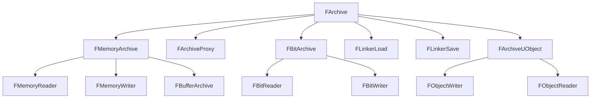

# FArchive — シリアライゼーション基盤

- 上位: [[Serialization/01_overview]]
- 関連: [[b_asset_serialization]] | [[c_save_game]]
- ソース: `Core/Public/Serialization/Archive.h`（`FArchive : private FArchiveState`、Archive.h:1207）

---

## 概要

`FArchive` は UE5 シリアライゼーションの **根幹インターフェース**。`IsLoading()` / `IsSaving()` を分岐させることで、同一の `operator<<` コードでロードとセーブの両方に対応する「単方向シリアライズ」を実現する。すべての UObject ・バイナリ I/O ・ネット複製・テキスト Export がこの抽象を通じて動作する。

---

## 基本パターン

```cpp
void UMyObject::Serialize(FArchive& Ar)
{
    Super::Serialize(Ar);

    Ar << MyInt;        // int32, float, bool 等はビルトイン
    Ar << MyFName;      // FName
    Ar << MyFString;    // FString
    Ar << MyVector;     // FVector / FRotator / FTransform 等
    Ar << MyArray;      // TArray<T> （T も operator<< が必要）
    Ar << MyObjRef;     // UObject* は参照として処理

    if (Ar.IsLoading())
    {
        // ロード時のみ: バージョン互換処理など
    }
    if (Ar.IsSaving())
    {
        // セーブ時のみ: キャッシュ無効化など
    }
}
```

**`UPROPERTY()` のついたメンバは `Super::Serialize()` の中でリフレクション経由で自動シリアライズされる**。手動 `<<` が必要なのは `UPROPERTY()` を付けない場合（意図的に GC 外・シリアライズ外にしたいケース）のみ。

---

## FArchive の状態フラグ

| メソッド | 説明 |
|---------|------|
| `IsLoading()` | データを読み込んでいる |
| `IsSaving()` | データを書き込んでいる |
| `IsTransacting()` | Undo トランザクション中（エディタ） |
| `IsCountingMemory()` | メモリ計測中（`FArchiveCountMem`） |
| `IsCooking()` | クック中（プラットフォーム向け変換） |
| `IsFilterEditorOnly()` | エディタ専用データをスキップ |
| `IsLoadingFromCookedPackage()` | クック済みパッケージを読み込み中 |
| `IsObjectReferenceCollector()` | オブジェクト参照収集中（GC 等） |
| `IsTextFormat()` | テキスト形式（JSON 等） |

---

## FArchive 派生クラス一覧



### 主要クラスの用途

| クラス | 用途 |
|-------|------|
| `FMemoryReader` | バイト配列から読み込む（`TArray<uint8>` の内容を Deserialize） |
| `FMemoryWriter` | バイト配列に書き込む（メモリへ Serialize） |
| `FBufferArchive` | 可変長バッファへの書き込み |
| `FBitReader`/`FBitWriter` | ビット単位 I/O（ネット複製パケット生成に使用） |
| `FArchiveProxy` | 別の `FArchive` にフォワード（フィルタ・ラッピング用） |
| `FLinkerLoad` | `.uasset` ロード（Export/Import テーブル → UObject 復元） |
| `FLinkerSave` | `.uasset` セーブ（UObject ツリー → バイナリ） |
| `FObjectWriter`/`FObjectReader` | UObject の完全コピー（`DuplicateObject` 内部で使用） |

---

## カスタムバージョン（バージョン互換）

モジュール単位で独立したバージョン番号を持てる:

```cpp
// バージョン定義
struct FMyModuleVersion
{
    enum Type
    {
        InitialVersion = 0,
        AddedManaPoint,          // MP フィールドを追加
        LatestVersion = AddedManaPoint
    };
    static const FGuid GUID;
};

// 静的登録（.cpp）
const FGuid FMyModuleVersion::GUID = FGuid(0x12345678, ...);
FCustomVersionRegistration GMyModVer(
    FMyModuleVersion::GUID, FMyModuleVersion::LatestVersion, TEXT("MyModule"));

// Serialize 内での使用
void UMyObject::Serialize(FArchive& Ar)
{
    Super::Serialize(Ar);
    Ar.UsingCustomVersion(FMyModuleVersion::GUID);

    if (Ar.CustomVer(FMyModuleVersion::GUID) >= FMyModuleVersion::AddedManaPoint)
    {
        Ar << MaxMana;
    }
}
```

エンジン標準バージョン: `FUE5MainStreamObjectVersion`・`FFortniteMainBranchObjectVersion` 等。

---

## FStructuredArchive — スロットベース新方式

UE 4.22 以降。Binary / JSON / 他フォーマットを抽象化:

```cpp
// FArchive のラッパとして使う
FStructuredArchiveFromArchive Adapter(Ar);
FStructuredArchive::FRecord RootRecord = Adapter.GetRoot().EnterRecord();

// レコード形式（キー付き）
RootRecord.GetField(SA_FIELD_NAME(TEXT("Health"))) << Health;
RootRecord.GetField(SA_FIELD_NAME(TEXT("Name"))) << Name;

// 配列形式
FStructuredArchive::FArray Array = RootRecord.EnterArray(SA_FIELD_NAME(TEXT("Items")));
for (auto& Item : Items)
{
    Array.EnterElement() << Item;
}
```

JSON フォーマッターに切り替えるだけで同一コードが JSON I/O に対応する（DDC / アセット JSON export 等）。

---

## メモリへのシリアライズ例

```cpp
// UObject → TArray<uint8>
TArray<uint8> Bytes;
FMemoryWriter Writer(Bytes);
MyObj->Serialize(Writer);

// TArray<uint8> → 復元
FMemoryReader Reader(Bytes);
MyObj->Serialize(Reader);
```

より高レベルな `FObjectWriter`/`FObjectReader` を使うとプロパティコピーが楽:

```cpp
TArray<uint8> Bytes;
FObjectWriter Writer(*MyObj, Bytes);  // MyObj の全 UPROPERTY を Bytes に書く

FObjectReader Reader(*NewObj, Bytes); // Bytes を NewObj に復元
```

---

## ArVersion — エンジンバージョン

```cpp
int32 EngineVer = Ar.UE4Ver();          // UE4 互換バージョン（FPackageFileVersion）
FPackageFileVersion PkgVer = Ar.UEVer();// UE5 バージョン
int32 LicenseeVer = Ar.LicenseeUE4Ver();// ライセンシーバージョン
```

古いアセットを読み込む際に `ArVersion` が低い場合の互換処理:

```cpp
if (Ar.IsLoading() && Ar.UE4Ver() < VER_UE4_SOME_FEATURE)
{
    // 旧フォーマット読み込み
}
```

---

## コード実行フロー

### エントリポイント（Serialize 〜 operator<< 〜 カスタムバージョン）

```
(基本パターン)
UObject::Serialize(FArchive& Ar)                                   [Object.cpp]
  ├─ Super::Serialize(Ar)                                           ← UObject 基底（リフレクション経由）
  │    └─ Class->SerializeBin(Ar, this)                              [Class.cpp]
  │         └─ for each FProperty: Prop->SerializeBinProperty(Slot, Container)
  │              └─ Prop->SerializeItem(Slot, ValuePtr)              ← 型別バイナリ I/O
  └─ Ar << CustomMember                                              ← カスタム手動シリアライズ
       └─ FArchive::operator<<(int32&) 等
            └─ FArchive::ByteOrderSerialize(Data, Size)              ← 仮想関数
                 └─ Serialize(Data, Size)                            ← 派生クラスの実装

(派生クラスの実装)
FMemoryWriter::Serialize(void* Data, int64 Num)                     [MemoryWriter.cpp]
  └─ Bytes.Append((uint8*)Data, Num)                                 ← TArray<uint8> 末尾追加

FMemoryReader::Serialize(void* Data, int64 Num)                     [MemoryReader.cpp]
  └─ FMemory::Memcpy(Data, &Bytes[Offset], Num); Offset += Num

FLinkerLoad::Serialize(void* Data, int64 Num)                       [LinkerLoad.cpp]
  └─ Loader->Serialize(Data, Num)                                    ← FFileHandle 経由

(カスタムバージョン)
Ar.UsingCustomVersion(GUID)                                         [Archive.cpp]
  └─ FArchiveState::CustomVersionContainer.SetVersionUsingRegistry(GUID)
       └─ Save 時はサマリーに自動追加                                ← FPackageFileSummary

if (Ar.CustomVer(GUID) >= MyVersion::Feature)                       [Archive.h]
  └─ CustomVersionContainer.GetVersion(GUID).Version

(FStructuredArchive)
FStructuredArchiveFromArchive Adapter(Ar)                          [StructuredArchiveFromArchive.h]
  └─ FStructuredArchive内部の BinaryArchiveFormatter / JsonArchiveFormatter で I/O
       └─ Slot.EnterRecord/EnterArray でフォーマット切替可能
```

### フロー詳細

1. **基本パターン** — `Serialize(FArchive&)` をオーバーライドし、`Super::Serialize(Ar)` で UPROPERTY を自動シリアライズ。手動メンバは `Ar << Member` で書く。
2. **operator<< 実装** — `FArchive::operator<<(int32&)` 等は `ByteOrderSerialize` を呼ぶ。これは仮想関数で、派生クラスの `Serialize(void*, int64)` に最終的に到達する。
3. **派生別 I/O** — `FMemoryWriter` は `TArray<uint8>` 末尾追加、`FMemoryReader` は `FMemory::Memcpy` で復元、`FLinkerLoad` は `FFileHandle` 経由でディスク I/O。
4. **UPROPERTY 自動経路** — `UObject::Serialize` 基底実装が `Class->SerializeBin` を呼び、各 `FProperty::SerializeBinProperty` が型別実装でバイナリ化（[[Reflection/Details/b_fproperty]]）。
5. **カスタムバージョン** — `Ar.UsingCustomVersion(GUID)` で使用宣言。Save 時は `FPackageFileSummary::CustomVersionContainer` に自動追加され、Load 時は `Ar.CustomVer(GUID)` で値を確認できる。
6. **IsLoading/IsSaving 分岐** — 単方向シリアライズなので、ロード時のみ・セーブ時のみの処理は `if (Ar.IsLoading())` / `if (Ar.IsSaving())` で分ける。
7. **FStructuredArchive 経路** — `FStructuredArchiveFromArchive` で `FArchive` をスロット形式にラップ。`BinaryArchiveFormatter` / `JsonArchiveFormatter` を切り替えるだけで Binary/JSON 両対応。

### 関与クラス・関数一覧

| クラス / 関数 | ファイル | 役割 |
|-------------|---------|------|
| `FArchive::operator<<` | `Archive.h` | プリミティブ I/O |
| `FArchive::ByteOrderSerialize` | `Archive.h` | エンディアン対応バイト列 I/O |
| `FArchive::Serialize` (virtual) | `Archive.h` | 派生クラスの最終実装ポイント |
| `FMemoryWriter::Serialize` | `MemoryWriter.cpp` | TArray バッファ書込 |
| `FMemoryReader::Serialize` | `MemoryReader.cpp` | TArray バッファ読込 |
| `UObject::Serialize` | `Object.cpp` | UPROPERTY 自動シリアライズ |
| `UStruct::SerializeBin` | `Class.cpp` | リフレクション経由 I/O |
| `FArchive::UsingCustomVersion` / `CustomVer` | `Archive.cpp` | カスタムバージョン管理 |

---

## 関連ドキュメント

- [[b_asset_serialization]] — `FLinkerLoad`/`FLinkerSave` を使った `.uasset` I/O
- [[c_save_game]] — `USaveGame` のバイナリ/JSON シリアライズ
- [[Reference/ref_serialization_api]] — `FArchive` の API 一覧
