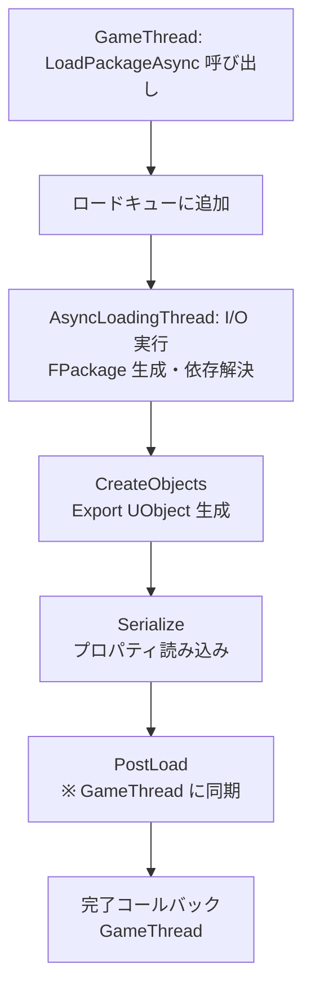

# アセットシリアライゼーション（パッケージロード/セーブ）

- 上位: [[Serialization/01_overview]]
- 関連: [[a_farchive]] | [[c_save_game]]
- ソース: `CoreUObject/Public/UObject/LinkerLoad.h`, `CoreUObject/Public/UObject/LinkerSave.h`, `CoreUObject/Public/UObject/PackageFileSummary.h`, `CoreUObject/Public/Serialization/AsyncLoading2.h`

---

## 概要

UE5 のアセット（`.uasset`/`.umap`）は **`UPackage`** 単位でディスクに保存される。ロード時は `FLinkerLoad` が、セーブ時は `FLinkerSave` が `FArchive` 派生として動作し、パッケージヘッダ（`FPackageFileSummary`）・名前テーブル・インポート/エクスポートテーブルを処理する。UE5 では非同期ロードを担う **Zen Loader**（`FAsyncLoadingThread2`）への移行が進んでいる。

---

## .uasset のバイナリ構造

```
┌─────────────────────────────────┐
│ FPackageFileSummary             │ ← マジック(0x9E2A83C1)・バージョン・各テーブルのオフセット
├─────────────────────────────────┤
│ Name Table                      │ ← パッケージ内で使われる FName の文字列プール
├─────────────────────────────────┤
│ Import Table (FObjectImport[])  │ ← 他パッケージのオブジェクト参照（クラス等）
├─────────────────────────────────┤
│ Export Table (FObjectExport[])  │ ← このパッケージに含まれる UObject の一覧
├─────────────────────────────────┤
│ Export Data                     │ ← 各 UObject::Serialize() が書いたバイナリ
├─────────────────────────────────┤
│ BulkData                        │ ← テクスチャ・メッシュ等の大容量データ（遅延ロード可）
└─────────────────────────────────┘
```

### FPackageFileSummary の主要フィールド

| フィールド | 説明 |
|-----------|------|
| `Tag` | マジックナンバー `PACKAGE_FILE_TAG` (`0x9E2A83C1`) |
| `FileVersionUE` | UE ファイルバージョン |
| `CustomVersionContainer` | カスタムバージョン群 |
| `TotalHeaderSize` | サマリー + テーブル群のバイト数 |
| `NameCount` / `NameOffset` | 名前テーブルのエントリ数とオフセット |
| `ImportCount` / `ImportOffset` | インポートテーブル |
| `ExportCount` / `ExportOffset` | エクスポートテーブル |
| `PackageFlags` | `PKG_ContainsMap` 等のフラグ |

---

## パッケージロードフロー（FLinkerLoad）

```
LoadPackageAsync("/Game/Foo/Bar") または StaticLoadObject()
  │
  └─ FLinkerLoad::CreateLinker()
       ├─ FPackageFileSummary のデシリアライズ（ヘッダ読み込み）
       ├─ Name テーブル展開 → FName プールへ登録
       ├─ Import テーブル展開 → FObjectImport[] 構築
       ├─ Export テーブル展開 → FObjectExport[] 構築
       │
       └─ Preload 開始
            ├─ 各 Export の UObject を StaticConstructObject_Internal で生成
            │    （クラスは Import テーブルから解決）
            ├─ 各 UObject の UObject::Serialize(FLinkerLoad&) 呼び出し
            │    → UPROPERTY の値を FLinkerLoad から読み込む
            └─ PostLoad() 呼び出し（全 Export のロード完了後）
```

### FObjectImport と FObjectExport

```cpp
struct FObjectImport
{
    FName  ClassPackage;     // クラスが属するパッケージ名
    FName  ClassName;        // クラス名
    int32  OuterIndex;       // Outer の Import/Export テーブルインデックス
    FName  ObjectName;       // オブジェクト名
};

struct FObjectExport
{
    int32  ClassIndex;       // クラスの Import/Export インデックス
    int32  OuterIndex;       // Outer の Import/Export インデックス
    FName  ObjectName;       // オブジェクト名
    int64  SerialOffset;     // Export Data のファイルオフセット
    int64  SerialSize;       // データのバイト数
    EObjectFlags ObjectFlags;
};
```

---

## パッケージセーブフロー（FLinkerSave / SavePackage）

```
UPackage::SavePackage() (Editor 専用)
  └─ UPackageSaveContext 構築
       ├─ Export 収集（パッケージ内のすべての UObject を列挙）
       ├─ Import 収集（Export が参照する外部オブジェクトを列挙）
       ├─ Name テーブル構築
       ├─ FPackageFileSummary 構築
       │
       └─ FLinkerSave に書き込み
            ├─ FPackageFileSummary 書き込み
            ├─ Name テーブル書き込み
            ├─ Import テーブル書き込み
            ├─ Export テーブル書き込み
            └─ 各 UObject の Serialize() 呼び出し → Export Data に書き込み
```

---

## 非同期ロード（Zen Loader / FAsyncLoadingThread2）

UE5 の非同期ローダ。EDL（Event Driven Loader）から置き換わりつつある:



**GameThread との同期点** は `PostLoad()` のみ。それ以外はバックグラウンドで実行される。

### 非同期ロードの API

```cpp
// コールバック方式
FStreamableManager& SM = UAssetManager::GetStreamableManager();
SM.RequestAsyncLoad(SoftRef.ToSoftObjectPath(), FStreamableDelegate::CreateUObject(
    this, &AMyActor::OnAssetLoaded));

// 低レベル API
LoadPackageAsync(TEXT("/Game/Foo/Bar"),
    FLoadPackageAsyncDelegate::CreateLambda([](const FName& PackageName,
        UPackage* LoadedPackage, EAsyncLoadingResult::Type Result) {
        // 完了時コールバック
    }));

// 同期ロード（非推奨：ゲームスレッドをブロック）
UPackage* Pkg = LoadPackage(nullptr, TEXT("/Game/Foo/Bar"), LOAD_None);
```

---

## BulkData（大容量データの遅延ロード）

テクスチャ・スタティックメッシュのレンダリングデータ等は `FBulkData` で管理:

```cpp
class FBulkData
{
    // 必要なときだけロードする
    void* GetData();           // 同期ロード（ブロッキング）
    bool IsAvailableForUse();  // ロード済みか
    void RemoveBulkData();     // メモリ解放（再ロード可能）

    int64 GetBulkDataOffsetInFile();  // ファイル内オフセット
    int64 GetBulkDataSize();          // バイト数
};
```

`FByteBulkData` が最も一般的。`BULKDATA_PayloadAtEndOfFile` フラグで Export Data ではなく末尾（ストリーミング用）に配置される。

---

## SoftObjectPath / FSoftObjectPtr

ロードせずにアセットへの参照を保持するポインタ:

```cpp
UPROPERTY(EditAnywhere)
TSoftObjectPtr<UStaticMesh> MeshRef;

// 非同期ロード
if (!MeshRef.IsValid())
{
    UAssetManager::GetStreamableManager().RequestAsyncLoad(
        MeshRef.ToSoftObjectPath(), ...);
}
UStaticMesh* Mesh = MeshRef.Get();
```

---

## 主要 CVar

| CVar | デフォルト | 説明 |
|------|----------|------|
| `s.AsyncLoadingThreadEnabled` | `1` | 非同期ロードスレッド有効化 |
| `s.UseBackgroundLevelStreaming` | `1` | レベルをバックグラウンドでロード |
| `s.MaxPackagesNotConsideredForShrinking` | `0` | Linker Pool サイズ管理 |

---

## 関連ドキュメント

- [[a_farchive]] — `FLinkerLoad`/`FLinkerSave` の基底 `FArchive`
- [[c_save_game]] — より高レベルな SaveGame フロー
- [[Reference/ref_serialization_api]] — `FLinkerLoad` / `LoadPackageAsync` の API
