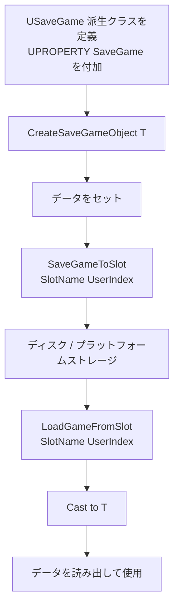

# SaveGame システム

- 上位: [[Serialization/01_overview]]
- 関連: [[a_farchive]] | [[b_asset_serialization]]
- ソース: `Engine/Classes/GameFramework/SaveGame.h`, `Engine/Classes/Kismet/GameplayStatics.h`

---

## 概要

UE5 の **SaveGame** システムはプレイヤーのセーブデータ（進捗・設定・スコア等）を管理する高レベル API。`USaveGame` 派生クラスに `UPROPERTY(SaveGame)` を付けたメンバを定義し、`UGameplayStatics` の関数でスロット名を指定して保存・ロードする。内部は `FMemoryWriter`/`FMemoryReader` を通じた `FArchive` ベースのバイナリ形式。

---

## 基本フロー



---

## 実装手順

### 1. SaveGame クラス定義

```cpp
UCLASS()
class UMySaveGame : public USaveGame
{
    GENERATED_BODY()

public:
    UPROPERTY(SaveGame)
    int32 PlayerLevel = 1;

    UPROPERTY(SaveGame)
    float PlayTimeHours = 0.f;

    UPROPERTY(SaveGame)
    FString PlayerName = TEXT("Unknown");

    UPROPERTY(SaveGame)
    TArray<FString> UnlockedItems;

    // SaveGame が付いていないメンバはシリアライズされない
    int32 RuntimeOnlyData = 0;  // 保存されない
};
```

`UPROPERTY(SaveGame)` はフラグ `CPF_SaveGame` を立てる。`FArchive::IsSavingObjectFlags()` がこのフラグを持つプロパティだけを書く。

### 2. セーブ

```cpp
// C++
UMySaveGame* SaveObj = Cast<UMySaveGame>(
    UGameplayStatics::CreateSaveGameObject(UMySaveGame::StaticClass()));
SaveObj->PlayerLevel = 5;
SaveObj->PlayerName = TEXT("Player1");

bool bSuccess = UGameplayStatics::SaveGameToSlot(SaveObj, TEXT("Slot1"), 0);
```

```cpp
// Blueprint: SaveGameToSlot ノード（スロット名・ユーザーIndex を入力）
```

### 3. ロード

```cpp
// C++
USaveGame* RawSave = UGameplayStatics::LoadGameFromSlot(TEXT("Slot1"), 0);
UMySaveGame* SaveObj = Cast<UMySaveGame>(RawSave);
if (SaveObj)
{
    int32 Level = SaveObj->PlayerLevel;  // 復元された値
}
```

### 4. スロット存在確認と削除

```cpp
bool bExists = UGameplayStatics::DoesSaveGameExist(TEXT("Slot1"), 0);
UGameplayStatics::DeleteGameInSlot(TEXT("Slot1"), 0);
```

---

## 非同期保存・ロード

ゲームスレッドをブロックしない推奨方式（UE 5.1 以降）:

```cpp
// 非同期セーブ
UGameplayStatics::AsyncSaveGameToSlot(
    SaveObj,
    TEXT("Slot1"),
    0,
    FAsyncSaveGameToSlotDelegate::CreateLambda(
        [](const FString& SlotName, const int32 UserIndex, bool bSuccess) {
            if (bSuccess) { /* 成功処理 */ }
        }));

// 非同期ロード
UGameplayStatics::AsyncLoadGameFromSlot(
    TEXT("Slot1"),
    0,
    FAsyncLoadGameFromSlotDelegate::CreateLambda(
        [](const FString& SlotName, const int32 UserIndex, USaveGame* SaveGame) {
            UMySaveGame* Save = Cast<UMySaveGame>(SaveGame);
            if (Save) { /* 使用 */ }
        }));
```

---

## 内部シリアライズフロー

`SaveGameToSlot` 内部の動作:

```
SaveGameToSlot(SaveGame, SlotName, UserIndex)
  ├─ UGameplayStatics::SaveGameToMemory(SaveGame)
  │    ├─ TArray<uint8> Bytes を確保
  │    ├─ FMemoryWriter MemWriter(Bytes)
  │    ├─ SaveGame ヘッダ書き込み（クラス名・バージョン）
  │    └─ FObjectAndNameAsStringProxyArchive ProxyAr(MemWriter)
  │         └─ SaveGame->Serialize(ProxyAr)
  │              → CPF_SaveGame フラグのプロパティのみ書く
  │
  └─ ISaveGameSystem::SaveGame(SlotName, UserIndex, Bytes)
       → プラットフォーム固有の書き込み（Windows: ファイル、Console: 専用ストレージ）
```

`FObjectAndNameAsStringProxyArchive` を使うことで、`UObject*` 参照をオブジェクト名文字列として保存（外部参照が壊れないようにするため）。

---

## バージョン管理

SaveGame は `FCustomVersion` でのバージョン管理を推奨:

```cpp
UCLASS()
class UMySaveGame : public USaveGame
{
    GENERATED_BODY()

    UPROPERTY(SaveGame)
    int32 SaveVersion = 0;  // 独自バージョンフィールド

    virtual void Serialize(FArchive& Ar) override
    {
        Super::Serialize(Ar);
        if (Ar.IsLoading() && SaveVersion < 2)
        {
            // バージョン 2 以前は PlayerName が存在しなかった
            PlayerName = TEXT("Legacy Player");
        }
    }
};
```

---

## JSON形式での保存（手動実装）

エンジン標準はバイナリ。JSON での保存はカスタム実装が必要:

```cpp
// UObject → JSON
TSharedPtr<FJsonObject> JsonObj = MakeShared<FJsonObject>();
for (TFieldIterator<FProperty> It(MySave->GetClass()); It; ++It)
{
    FProperty* Prop = *It;
    if (Prop->HasAnyPropertyFlags(CPF_SaveGame))
    {
        TSharedPtr<FJsonValue> JsonVal;
        FJsonObjectConverter::UPropertyToJsonValue(Prop, PropPtr, JsonVal, 0, CPF_SaveGame);
        JsonObj->SetField(Prop->GetName(), JsonVal);
    }
}
FString JsonStr;
TSharedRef<TJsonWriter<>> Writer = TJsonWriterFactory<>::Create(&JsonStr);
FJsonSerializer::Serialize(JsonObj.ToSharedRef(), Writer);
```

または `FStructuredArchive` + `JsonArchiveOutputFormatter` を利用。

---

## プラットフォーム別ストレージパス

| プラットフォーム | パス |
|----------------|------|
| Windows | `%LOCALAPPDATA%/[Project]/Saved/SaveGames/[SlotName].sav` |
| Mac | `~/Library/Application Support/[Project]/Saved/SaveGames/` |
| PlayStation | ユーザー固有の Protected Storage |
| Xbox | Title Storage / Connected Storage |

`ISaveGameSystem` がプラットフォーム差を抽象化。`FGenericSaveGameSystem`（ファイルベース）が非コンソールのデフォルト実装。

---

## 主要 CVar

| CVar | デフォルト | 説明 |
|------|----------|------|
| `SaveGame.AsyncSave` | `1` | 非同期セーブを有効化 |

---

## 関連ドキュメント

- [[a_farchive]] — `FMemoryWriter`/`FMemoryReader` の基底 `FArchive`
- [[b_asset_serialization]] — アセット（`.uasset`）のシリアライズ
- [[Reference/ref_serialization_api]] — `USaveGame` / `UGameplayStatics` のAPI
