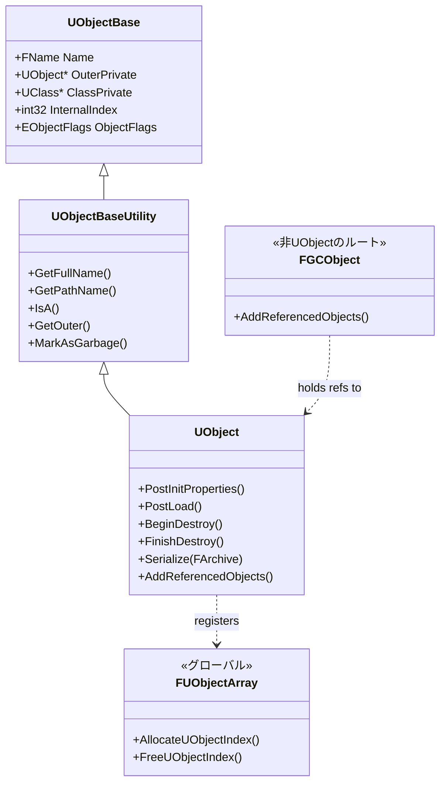
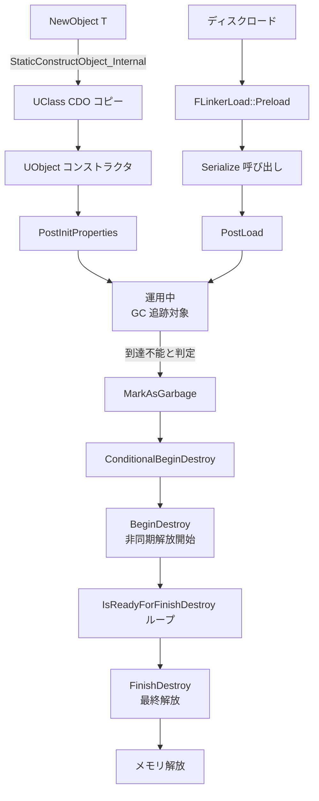

# UObject 概要

- 上位: [[01_core_overview]]
- 関連: [[Reflection/01_overview]] | [[Serialization/01_overview]]
- ソース: `Engine/Source/Runtime/CoreUObject/Public/UObject/`

---

## UObject とは

UE5 における **すべての管理対象オブジェクトの基底クラス**。ゲームプレイクラス（`AActor` / `UActorComponent` / `UUserWidget` など）はすべて `UObject` 派生。

UObject が提供する仕組み:

1. **リフレクション** — 型情報（クラス・プロパティ・関数）にランタイムアクセス
2. **GC（ガベージコレクション）** — マーク&スイープでの自動メモリ管理
3. **シリアライゼーション** — アセット保存・ロード・ネット複製の統一インターフェース
4. **Blueprint 連携** — C++ 型を Blueprint から透過的に利用
5. **名前空間（Outer チェーン）** — `/Game/Path.Package.Object` 形式のパスで全オブジェクトを識別

---

## クラス階層



---

## UObject ライフサイクル



---

## 主要クラス

| クラス | 役割 |
|-------|------|
| `UObjectBase` | 最小基底。名前・Outer・Class・Index・Flags のみ保持 |
| `UObjectBaseUtility` | 基底ユーティリティ。`GetFullName`/`IsA`/`GetOuter`/`GetOutermost` 等 |
| `UObject` | ゲームコード側のエントリポイント。`PostInitProperties`/`Serialize`/`BeginDestroy` など仮想関数 |
| `UObjectGlobals`（関数群） | `NewObject<T>()`/`StaticFindObject`/`LoadObject`/`DuplicateObject` など |
| `FObjectInitializer` | `UObject` コンストラクタに渡される初期化コンテキスト。`CreateDefaultSubobject<T>()` を提供 |
| `FUObjectArray` / `GUObjectArray` | 全 UObject のグローバルテーブル（`int32 InternalIndex` で索引可） |
| `FGCObject` | 非 UObject クラスから UObject 参照を GC に通知する基底 |
| `FGarbageCollectionTracer` | GC 実行本体（マーク&スイープ） |
| `TObjectPtr<T>` | UHT 生成コードで使う強参照。UE4 の `T*` を置換 |
| `TWeakObjectPtr<T>` | GC 対応の弱参照。破棄されたオブジェクトを安全に検出 |
| `TStrongObjectPtr<T>` | RAII 強参照（スコープ内で `AddToRoot` 相当） |

---

## Details（個別記事）

| ドキュメント | 内容 |
|------------|------|
| [[Details/a_lifecycle]] | `NewObject` / `CDO` / `PostInitProperties` / `ConditionalBeginDestroy` のライフサイクル |
| [[Details/b_garbage_collection]] | GC の内部構造・マーク&スイープ・`FGCObject`・クラスタリング |
| [[Details/c_outer_chain]] | Outer チェーン・`GetTransientPackage`・`Rename`・パス解決 |
| [[Details/d_class_default_object]] | CDO の生成・`GetDefaultObject`・Archetype チェーン |

---

## Reference

- [[Reference/ref_uobject_api]] … `UObject` / `UObjectBaseUtility` / `NewObject` の API
- [[Reference/ref_gc_api]] … GC 関連関数・UPROPERTY の GC 指定子（`TObjectPtr` / `UPROPERTY(Transient)` 等）

---

## 主要 CVar

| CVar | デフォルト | 説明 |
|------|----------|------|
| `gc.MaxObjectsInGame` | `131072` | GC 管理できる UObject 最大数 |
| `gc.TimeBetweenPurgingPendingKillObjects` | `60.0` | GC 強制実行間隔（秒）|
| `gc.AllowParallelGC` | `1` | 並列 GC 有効化 |
| `gc.IncrementalReachabilityTimeLimit` | `0.002` | インクリメンタル GC 1 フレーム予算（秒）|
| `gc.CreateGCClusters` | `1` | GC クラスタ生成有効化 |

---

## コード実行フロー

### エントリポイント（生成 〜 破棄）

```
NewObject<T>(Outer, Class, Name, Flags)                         [UObjectGlobals.h:1304]
  └─ StaticConstructObject_Internal(Params)                     [UObjectGlobals.cpp]
       ├─ StaticAllocateObject()                                ← メモリ確保 + GUObjectArray 登録
       │    └─ FUObjectArray::AllocateUObjectIndex()           [UObjectArray.cpp]
       ├─ Class->CreateDefaultObject() (CDO 未生成なら)         [Class.cpp]
       ├─ FObjectInitializer::FObjectInitializer()              ← CDO からプロパティコピー
       ├─ T::T() コンストラクタ                                  ← CreateDefaultSubobject 呼び出し可
       └─ FObjectInitializer::~FObjectInitializer()
            └─ PostConstructInit()
                 └─ Object->PostInitProperties()                ← 初期化フック

(ディスクロード時)
FLinkerLoad::Preload(Object)                                    [LinkerLoad.cpp]
  ├─ Object->Serialize(LinkerArchive)                           ← UPROPERTY 復元
  └─ Object->PostLoad()                                         ← ロード後フック

(GC 破棄時)
CollectGarbage()                                                [GarbageCollection.cpp]
  └─ IncrementalPurgeGarbage()
       ├─ Object->ConditionalBeginDestroy()
       │    └─ Object->BeginDestroy()                           ← 非同期解放開始
       ├─ Object->IsReadyForFinishDestroy()                     ← ポーリング
       └─ Object->ConditionalFinishDestroy()
            └─ Object->FinishDestroy()                          ← 同期解放
```

### フロー詳細

1. **メモリ確保** — `StaticAllocateObject()` が `FUObjectArray` から `InternalIndex` を取得し、メモリブロックを確保（`UObjectAllocator.cpp`）。
2. **CDO コピー** — `FObjectInitializer` が CDO のプロパティを新インスタンスにコピーする（[[Details/d_class_default_object]]）。
3. **コンストラクタ実行** — `T::T()` が呼ばれる。コンストラクタ内では `CreateDefaultSubobject<U>()` が使える（[[Details/a_lifecycle]]）。
4. **`PostInitProperties()` フック** — `FObjectInitializer` のデストラクタが呼び出す。派生クラスはここで初期化を完了させる。
5. **ロードパス** — `FLinkerLoad::Preload` が `Serialize()` で UPROPERTY を復元し、その後 `PostLoad()` を呼ぶ（[[Serialization/Details/b_asset_serialization]]）。
6. **GC 破棄** — `CollectGarbage` が到達不能オブジェクトを検出し、`BeginDestroy` → `IsReadyForFinishDestroy` ポーリング → `FinishDestroy` の順で破棄する（[[Details/b_garbage_collection]]）。

### 関与クラス・関数一覧

| クラス / 関数 | ファイル | 役割 |
|-------------|---------|------|
| `NewObject<T>` | `UObjectGlobals.h:1304` | 型安全な生成エントリ |
| `StaticConstructObject_Internal` | `UObjectGlobals.cpp` | 内部生成ドライバ |
| `FUObjectArray::AllocateUObjectIndex` | `UObjectArray.cpp` | InternalIndex 払い出し |
| `FObjectInitializer` | `UObjectGlobals.h` | コンストラクタコンテキスト・CDO コピー |
| `UObject::PostInitProperties` / `PostLoad` | `Object.cpp` | 初期化フック |
| `UObject::BeginDestroy` / `FinishDestroy` | `Object.cpp` | 破棄フック |

---

## 備考

- **UObject は `new` で作れない** — 必ず `NewObject<T>()` 経由（`UClass` 登録・GC・Outer 設定が必要なため）
- **ネイティブスレッドからの作成禁止** — UObject 生成は基本的に GameThread で。例外は async loading 系
- **GameThread でのみ安全** — 多くの `UObject` メソッドは GameThread 前提。別スレッドから触る場合は `FGCObject` でラップするか、`TWeakObjectPtr` で安全性を担保
