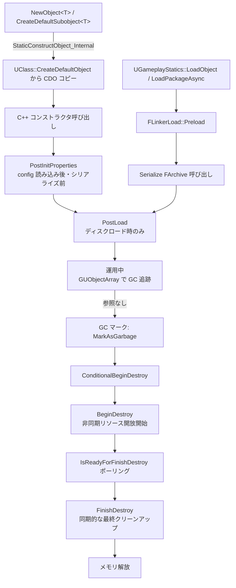

# UObject ライフサイクル

- 上位: [[UObject/01_overview]]
- 関連: [[b_garbage_collection]] | [[d_class_default_object]]
- ソース: `CoreUObject/Public/UObject/UObjectGlobals.h`, `CoreUObject/Public/UObject/Object.h`

---

## 概要

UObject の生成から破棄までの一連の流れ。生成は必ず `NewObject<T>()` 経由で行い、破棄は GC が自動管理する。各フェーズでエンジンが仮想関数を呼び出すため、派生クラスはオーバーライドで初期化・クリーンアップを実装できる。

---

## 全体フロー



---

## 生成フェーズ

### NewObject\<T\>()

```cpp
// 最も一般的な生成方法
UMyObject* Obj = NewObject<UMyObject>(
    Outer,          // 所有者 UObject（省略時 GetTransientPackage()）
    UMyObject::StaticClass(),
    TEXT("MyName"), // FName（省略時は自動命名）
    RF_NoFlags      // EObjectFlags
);
```

内部呼び出しチェーン:
```
NewObject<T>()
  └─ StaticConstructObject_Internal(FStaticConstructObjectParameters)
       ├─ StaticAllocateObject()       — メモリ確保 + GUObjectArray 登録
       ├─ FObjectInitializer 生成
       ├─ CDO → インスタンスへプロパティコピー
       ├─ T::T() コンストラクタ呼び出し
       └─ FObjectInitializer::PostConstructInit()
            ├─ CreateDefaultSubobjects を初期化
            └─ PostInitProperties() 呼び出し
```

### CreateDefaultSubobject\<T\>()

コンストラクタ内でのみ使用可能:

```cpp
UMyActor::UMyActor()
{
    // コンストラクタ内でのみ有効
    MyComp = CreateDefaultSubobject<UMyComponent>(TEXT("MyComp"));
    MyComp->SetupAttachment(RootComponent);
}
```

**コンストラクタ外では使えない** — 代わりに `NewObject<T>()` を使う。

### EObjectFlags（主要フラグ）

| フラグ | 値 | 意味 |
|--------|-----|------|
| `RF_Transient` | `0x00000008` | シリアライズしない（保存されない） |
| `RF_NeedLoad` | `0x00000200` | ディスクから未ロード（ロード待ち） |
| `RF_ClassDefaultObject` | `0x00000010` | これは CDO である |
| `RF_ArchetypeObject` | `0x00000020` | Archetype オブジェクト |
| `RF_Public` | `0x00000001` | 他パッケージから参照可能 |
| `RF_Standalone` | `0x00000002` | 参照がなくても存在できる |
| `RF_MarkAsRootSet` | — | GC ルートセットに追加 |

---

## 初期化コールバック

### PostInitProperties()

```cpp
void UMyObject::PostInitProperties()
{
    Super::PostInitProperties();
    // config から読み込まれた後・シリアライズの前に呼ばれる
    // ここで派生した初期値を設定する
    ComputedValue = BaseValue * 2;
}
```

**呼ばれるタイミング**:
- `NewObject<T>()` 後
- ディスクロード後（`PostLoad` の前）
- CDO 生成時（毎クラス 1 回）

### PostLoad()

```cpp
void UMyObject::PostLoad()
{
    Super::PostLoad();
    // ロード完了後の後処理
    // バージョン互換のためのデータ修正もここで
    if (GetLinkerCustomVersion(FMyVersion::GUID) < FMyVersion::AddedNewField)
    {
        NewField = OldField * Scale;
    }
}
```

**呼ばれるタイミング**: ディスクから `Serialize()` が完了した後のみ。`NewObject<T>()` では呼ばれない。

### PostEditChangeProperty()（エディタのみ）

```cpp
#if WITH_EDITOR
void UMyObject::PostEditChangeProperty(FPropertyChangedEvent& Event)
{
    Super::PostEditChangeProperty(Event);
    // Details パネルでプロパティが変更されたとき
}
#endif
```

---

## 破棄フェーズ

GC がオブジェクトへの参照がなくなったと判断したとき:

### BeginDestroy()

```cpp
void UMyObject::BeginDestroy()
{
    // 非同期リソースの解放開始（レンダリングリソース等）
    // GPU リソースは ENQUEUE_RENDER_COMMAND で後処理
    Super::BeginDestroy();  // 先に呼ぶ
}
```

### IsReadyForFinishDestroy()

```cpp
bool UMyObject::IsReadyForFinishDestroy()
{
    // GPU 解放完了など、非同期処理が終わるまで false を返す
    return bAsyncReleaseComplete;
}
```

デフォルトは `true`（即座に FinishDestroy へ）。

### FinishDestroy()

```cpp
void UMyObject::FinishDestroy()
{
    // 同期的なリソース解放
    // Super は最後に呼ぶ（プロパティがここで破棄されるため）
    CleanupSyncResources();
    Super::FinishDestroy();  // 最後に呼ぶ
}
```

> **注意**: `Super::FinishDestroy()` は **最後** に呼ぶこと。内部でプロパティが破棄されるため、先に呼ぶと UB になる。

---

## MarkAsGarbage / AddToRoot

```cpp
// 手動で GC 対象に指定（次回 GC で破棄）
Obj->MarkAsGarbage();

// GC からの保護（ルートセット追加）
Obj->AddToRoot();

// 保護解除
Obj->RemoveFromRoot();

// 状態チェック
bool bGarbage = Obj->IsGarbage();
bool bRoot = Obj->IsRooted();
```

`AddToRoot()` は **参照がなくても存在し続ける** ための緊急手段。使いすぎると GC が効かなくなる。

---

## ライフタイム管理まとめ

| シナリオ | 推奨手段 |
|---------|---------|
| 通常のオブジェクト | `UPROPERTY` ポインタで参照保持 → GC が自動管理 |
| ルートレベルのシングルトン | `AddToRoot()` または `UCLASS(Within=GameInstance)` |
| 一時オブジェクト（フレーム内） | `RF_Transient`・`GetTransientPackage()` 指定 |
| 非 UObject からの参照 | `FGCObject::AddReferencedObjects()` （[[b_garbage_collection]] 参照） |
| 安全な参照（破棄検出） | `TWeakObjectPtr<T>` |

---

## 関連ドキュメント

- [[b_garbage_collection]] — GC の内部動作とマーク&スイープ
- [[d_class_default_object]] — CDO の役割とプロパティコピーの仕組み
- [[Reference/ref_uobject_api]] — `NewObject` / `FObjectInitializer` / `EObjectFlags` のAPI一覧
