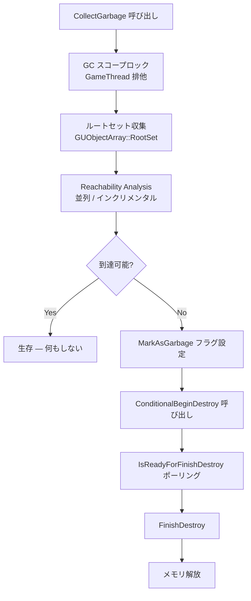

# UObject Garbage Collection

- 上位: [[UObject/01_overview]]
- 関連: [[a_lifecycle]] | [[d_class_default_object]]
- ソース: `CoreUObject/Public/UObject/GarbageCollection.h`, `CoreUObject/Public/UObject/GCObject.h`, `CoreUObject/Public/UObject/UObjectClusters.h`

---

## 概要

UE5 の GC は **マーク&スイープ方式**。すべての `UObject` は `GUObjectArray` で管理され、参照グラフの到達性解析（Reachability Analysis）により、生きているオブジェクトを特定し、残りを破棄する。UE5 では並列 GC・インクリメンタル GC・クラスタリングの三段構えでパフォーマンスを確保している。

---

## GC の実行タイミング

| トリガー | 条件 |
|---------|------|
| 自動（定期） | `gc.TimeBetweenPurgingPendingKillObjects`（デフォルト 60 秒）ごと |
| フレーム末 | インクリメンタル GC が `gc.IncrementalReachabilityTimeLimit` ms を消費 |
| 手動 | `GEngine->ForceGarbageCollection()` / `CollectGarbage()` |
| レベル遷移 | アンロード前に必ず実行 |

---

## マーク&スイープの流れ



---

## ルートセット

以下がルートセット（GC の探索起点）:

1. **`RF_MarkAsRootSet` フラグ付き UObject** — `AddToRoot()` 呼び出し済み
2. **`UPROPERTY()` による参照** — リフレクション経由で GC が認識
3. **`FGCObject::AddReferencedObjects()`** — 非 UObject からの登録
4. **グローバル UObject 変数** — `UPROPERTY()` がある場合

`UPROPERTY()` のない生ポインタ（`UObject* RawPtr`）は **GC に認識されない** — ダングリングポインタになる危険がある。

---

## UPROPERTY による参照保持

```cpp
UCLASS()
class UMyClass : public UObject
{
    GENERATED_BODY()

    UPROPERTY()
    UMyOtherObject* StrongRef;       // GC がこの参照を追跡

    TObjectPtr<UMyOtherObject> TypedRef; // UE5 推奨（UPROPERTY と同等）

    UMyOtherObject* RawPtr;          // UPROPERTY なし → GC に見えない (危険)
};
```

---

## FGCObject — 非 UObject からの参照登録

`UObject` 派生でないクラス（例: `FMySubsystem`、`FScene`）が UObject を保持する場合:

```cpp
class FMyManager : public FGCObject
{
public:
    // UObject への参照を GC に登録
    virtual void AddReferencedObjects(FReferenceCollector& Collector) override
    {
        Collector.AddReferencedObject(ManagedObject);
        Collector.AddReferencedObjects(ManagedArray);
    }

    virtual FString GetReferencerName() const override
    {
        return TEXT("FMyManager");
    }

private:
    UObject* ManagedObject = nullptr;
    TArray<UObject*> ManagedArray;
};
```

`FGCObject` を継承するだけで有効（`AddToRoot()` は不要）。デストラクタで自動登録解除。

---

## 並列 GC（UE5）

`gc.AllowParallelGC` が有効な場合、Reachability Analysis をワーカースレッドで並列実行:

```
Reachability Analysis
  ├─ GameThread: ルートセットから BFS 開始
  ├─ Worker 1: サブグラフをスキャン
  ├─ Worker 2: サブグラフをスキャン
  └─ Worker N: サブグラフをスキャン
  → マージ → 到達不能オブジェクトをリストアップ
```

---

## インクリメンタル GC

フレームをまたいで少しずつ実行することでヒッチを防ぐ。`gc.IncrementalReachabilityTimeLimit`（デフォルト 2ms）を超えたら次フレームに持ち越す。

完全な GC（Stop-the-World）は主に:
- レベル遷移時
- `ForceGarbageCollection(true)` 呼び出し時

---

## GC クラスタリング

静的アセット（スタティックメッシュ・テクスチャ等）はロード後に変化しないため、**クラスタ**（複数 UObject をまとめたグループ）として管理される。

- クラスタ内は **1 つのノード** として GC が処理 → 参照グラフのノード数を大幅削減
- `CanBeInCluster()` が `true` を返すクラスはクラスタ対象（デフォルトで `UStaticMesh` 等は `true`）
- クラスタは CVar `gc.CreateGCClusters` で有効/無効切替

---

## GC スコープガード

特定スコープ内で GC 実行を防ぎたいとき:

```cpp
{
    FGCScopeGuard GCGuard;  // スコープ中は GC を禁止
    // 危険な UObject 操作...
}   // スコープ終了で GC 許可
```

---

## よくある GC バグ

### ① UPROPERTY 忘れ

```cpp
// NG: GC に見えない → 破棄される可能性
UObject* TempObj = NewObject<UMyObj>(this);
DoSomething(TempObj);  // GC がここで回ると TempObj はダングリング

// OK: UPROPERTY があれば GC が追跡
UPROPERTY()
UObject* TempObj;
```

### ② ダングリングポインタ確認

```cpp
TWeakObjectPtr<UMyObj> WeakRef = Obj;
if (WeakRef.IsValid())
{
    WeakRef.Get()->DoSomething();  // 安全
}
```

### ③ GC 中のスレッドから UObject 触る

GC 実行中は他スレッドから UObject を操作してはいけない。`FGCScopeGuard` や `FGCObject` で保護する。

---

## 主要 CVar

| CVar | デフォルト | 説明 |
|------|----------|------|
| `gc.AllowParallelGC` | `1` | 並列 Reachability Analysis |
| `gc.TimeBetweenPurgingPendingKillObjects` | `60.0` | 定期 GC 間隔（秒） |
| `gc.IncrementalReachabilityTimeLimit` | `0.002` | インクリメンタル GC の 1 フレーム予算（秒） |
| `gc.CreateGCClusters` | `1` | クラスタリング有効化 |
| `gc.MaxObjectsInGame` | `131072` | GC テーブルの最大エントリ数 |
| `gc.VerifyGCAssumptions` | `0` | GC 検証（デバッグ用、重い） |

---

## コード実行フロー

### エントリポイント（GC 起動 〜 マーク&スイープ 〜 破棄）

```
(駆動)
FEngineLoop::Tick()                                                [LaunchEngineLoop.cpp]
  └─ IncrementalPurgeGarbage(false, TimeLimit)                     [GarbageCollection.cpp]
       └─ if (条件成立) CollectGarbage(KeepFlags, bPerformFullPurge)

CollectGarbage(KeepFlags, bForceFull)                              [GarbageCollection.cpp]
  └─ CollectGarbageInternal()
       ├─ FGCScopeGuard で GameThread 排他取得                      ← 他スレッドの UObject 操作禁止
       ├─ CollectReferences()                                       ← マーク フェーズ
       │    ├─ FRealtimeGC::PerformReachabilityAnalysis()
       │    │    ├─ Roots を収集（GUObjectArray::RootSet）
       │    │    ├─ FGCObject::AddReferencedObjects() 呼出           ← 非 UObject ルート
       │    │    └─ TFastReferenceCollector で並列 BFS                ← gc.AllowParallelGC
       │    └─ Reachable フラグ未設定 = 不到達と判定
       └─ IncrementalPurgeGarbage()                                 ← スイープ フェーズ
            ├─ Object->ConditionalBeginDestroy()
            │    └─ Object->BeginDestroy()                          ← 非同期解放開始
            ├─ while !Object->IsReadyForFinishDestroy() yield
            └─ Object->ConditionalFinishDestroy()
                 ├─ Object->FinishDestroy()
                 └─ GUObjectAllocator.FreeUObject(Object)            ← メモリ返却

(FGCObject 経路)
FGCObject ctor                                                     [GCObject.cpp]
  └─ FGCObject::GGCObjectReferencer に自動登録
       └─ GC 走査時に AddReferencedObjects() を呼び出して Reachable 化
```

### フロー詳細

1. **トリガ判定** — `IncrementalPurgeGarbage` が毎フレーム呼ばれ、`gc.TimeBetweenPurgingPendingKillObjects` 経過 or インクリメンタル予算 (`gc.IncrementalReachabilityTimeLimit`) を超過した時点で `CollectGarbage` を発動。
2. **GC スコープロック** — `FGCScopeGuard` が GameThread を排他取得。GC 中は他スレッドからの UObject 操作禁止（[[a_lifecycle]]）。
3. **ルート収集** — `GUObjectArray::RootSet`（`AddToRoot()` 済み）と `FGCObject::AddReferencedObjects()` 由来の参照をルートとして列挙。
4. **並列マーク** — `TFastReferenceCollector` が UPROPERTY ポインタを辿る BFS を複数ワーカーで並列実行（`gc.AllowParallelGC`）。各 UObject に Reachable フラグを立てる。
5. **クラスタ最適化** — `gc.CreateGCClusters` 有効時、`UStaticMesh` 等のクラスタは 1 ノードとして扱われ、参照グラフのノード数を大幅に削減。
6. **スイープ** — Reachable でないオブジェクトに `BeginDestroy → IsReadyForFinishDestroy ポーリング → FinishDestroy` を順次実行し、最後に `GUObjectAllocator.FreeUObject` でメモリを返却。

### 関与クラス・関数一覧

| クラス / 関数 | ファイル | 役割 |
|-------------|---------|------|
| `CollectGarbage` / `IncrementalPurgeGarbage` | `GarbageCollection.cpp` | GC 起動エントリ |
| `FRealtimeGC::PerformReachabilityAnalysis` | `GarbageCollection.cpp` | マーク フェーズ本体 |
| `TFastReferenceCollector` | `FastReferenceCollector.h` | 並列 BFS 参照走査 |
| `FGCObject::AddReferencedObjects` | `GCObject.cpp` | 非 UObject からの参照通知 |
| `FGCObject::GGCObjectReferencer` | `GCObject.cpp` | FGCObject の集約ルート |
| `UObject::ConditionalBeginDestroy` / `FinishDestroy` | `Object.cpp` | 破棄シーケンス |
| `GUObjectAllocator.FreeUObject` | `UObjectAllocator.cpp` | メモリ返却 |

---

## 関連ドキュメント

- [[a_lifecycle]] — `BeginDestroy` / `FinishDestroy` の詳細
- [[Reference/ref_gc_api]] — `CollectGarbage` / `FGCObject` / GC 指定子の API
