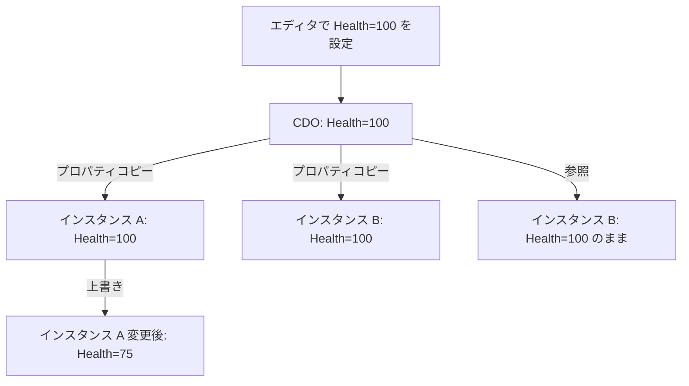

# Class Default Object（CDO）

- 上位: [[UObject/01_overview]]
- 関連: [[a_lifecycle]] | [[b_garbage_collection]]
- ソース: `CoreUObject/Public/UObject/Class.h`, `CoreUObject/Public/UObject/UObjectGlobals.h`

---

## 概要

**CDO（Class Default Object）** は、`UClass` ごとに 1 つだけ生成される「デフォルト値テンプレート」インスタンス。`NewObject<T>()` でオブジェクトが生成される際、CDO からプロパティ値がコピーされる。これにより、エディタの Details パネルで設定した「デフォルト値」がすべてのインスタンスに反映される仕組みが実現される。

---

## CDO の役割



**CDO の用途**:

1. **デフォルト値の保持** — `EditDefaultsOnly` プロパティのソース
2. **シリアライゼーションの差分圧縮** — CDO と異なる値だけを保存（同じ値は書かない）
3. **型情報のプロキシ** — `GetDefaultObject<T>()` で型の情報にアクセス
4. **Archetype チェーン** — Blueprint → 親クラス の CDO をたどってデフォルト値を解決

---

## CDO 生成タイミング

```
エンジン起動
  └─ UClass::CreateDefaultObject()
       ├─ StaticConstructObject_Internal(ClassFlags=CDO)
       │    └─ コンストラクタ呼び出し（通常のインスタンスと同じ）
       └─ PostInitProperties() 呼び出し（RF_ClassDefaultObject フラグあり）
```

各クラスの CDO は **エンジン起動時（Static Init フェーズ）** または最初にアクセスされたとき（遅延生成）に作られる。一度作られると **アプリ終了まで存在**。

---

## CDO の取得

```cpp
// UClass から CDO を取得
UMyActor* DefaultActor = GetDefault<UMyActor>();
// または
UMyActor* DefaultActor = UMyActor::StaticClass()->GetDefaultObject<UMyActor>();

// CDO かどうかを確認
bool bIsCDO = Obj->HasAnyFlags(RF_ClassDefaultObject);

// CDO の名前
// Default__ClassName の形式
FName CDOName = UMyActor::StaticClass()->GetDefaultObjectName();
// → Default__MyActor
```

---

## Archetype チェーン

Blueprint が C++ を継承する場合、デフォルト値の解決は **Archetype チェーン** をたどる:

```
Blueprint BP_MyCharacter (Health=150)
  └─ 親: C++ AMyCharacter CDO (Health=100)
       └─ 親: ACharacter CDO (Health=?)
            └─ 親: APawn CDO
                 └─ 親: AActor CDO
```

`NewObject<UMyCharacter>()` 時:
1. BP_MyCharacter の CDO を Archetype として使用
2. CDO の `Health = 150` がコピーされる（C++ CDO の 100 ではなく）

---

## コンストラクタ内での CDO 判定

```cpp
UMyActor::UMyActor()
{
    // CDO かどうか判定
    if (HasAnyFlags(RF_ClassDefaultObject))
    {
        // CDO 生成時のみ実行したい初期化
    }
    else
    {
        // 通常インスタンス生成時のみ
    }
}
```

実際には CDO とインスタンスで処理を分けることは稀。通常は `PostInitProperties()` での分岐が推奨される。

---

## プロパティコピーの仕組み（差分シリアライゼーション）

UE のシリアライゼーションは **CDO との差分のみを保存**:

```
シリアライズ時:
  foreach property in object:
    if value != CDO.property.value:
      → シリアライズ（保存）
    else:
      → スキップ（保存しない）

デシリアライズ時:
  1. CDO からすべてのプロパティをコピー
  2. 保存された差分を上書き
```

これによりファイルサイズを削減し、デフォルト値の変更がロード済みオブジェクトにも伝播する（差分に記録されていないプロパティは CDO から取得されるため）。

---

## GetDefaultObject でのリードオンリーアクセス

```cpp
// CDO は読み取り専用で使うのが原則
const UMyGameInstance* DefaultGI = GetDefault<UMyGameInstance>();
int32 MaxPlayers = DefaultGI->MaxPlayers;

// エディタ（UHT テンプレート生成等）では書き込み可能なことがある
UMyGameInstance* MutableDefault = GetMutableDefault<UMyGameInstance>();
MutableDefault->MaxPlayers = 8;  // 全インスタンスのデフォルトが変わる（危険）
```

`GetMutableDefault()` の書き込みは **全インスタンスのデフォルト値を変える** ため、通常は使わない。

---

## サブオブジェクトの CDO

`CreateDefaultSubobject<T>()` で生成したサブオブジェクトも、親 CDO が所有する CDO が存在する:

```cpp
// CDO 内で作られた MyComp も CDO
UMyCharacter::UMyCharacter()
{
    MyComp = CreateDefaultSubobject<UMyComponent>(TEXT("MyComp"));
    // → Default__MyCharacter の中に Default__MyComponent が作られる
}

// インスタンス化時:
// → MyComp の CDO からコピーしたインスタンスが作られる
```

---

## コード実行フロー

### エントリポイント（CDO 生成 〜 取得 〜 プロパティコピー）

```
(エンジン起動時 - CDO 一括生成)
ProcessNewlyLoadedUObjects()                                       [UObjectGlobals.cpp]
  ├─ UClassRegisterAllCompiledInClasses()                          ← UClass 登録
  └─ UObjectLoadAllCompiledInDefaultProperties()
       └─ for each Class: Class->GetDefaultObject(true)
            └─ UClass::CreateDefaultObject()                       [Class.cpp]
                 ├─ if (ClassDefaultObject) return ClassDefaultObject  ← 既存返却
                 ├─ FObjectInitializer Initializer(NewCDO, Archetype, ...)
                 ├─ Class->ClassConstructor(Initializer)            ← T::T() 呼出
                 └─ ClassDefaultObject = NewCDO（RF_ClassDefaultObject）

(NewObject 時 - CDO からプロパティコピー)
NewObject<T>()                                                     [UObjectGlobals.h]
  └─ StaticConstructObject_Internal()
       └─ FObjectInitializer ctor                                   [UObjectGlobals.h]
            ├─ if (CDO 未生成) Class->GetDefaultObject()
            ├─ ObjectArchetype = CDO（または Blueprint Archetype）
            └─ InitProperties()                                     [UObjectGlobals.cpp]
                 └─ for each Prop in Class:
                      └─ Prop->CopyCompleteValue(Dest, Src=Archetype) ← デフォルト値転写

(取得 API)
GetDefault<T>()                                                    [UObjectGlobals.h]
  └─ T::StaticClass()->GetDefaultObject<T>()
       └─ UClass::ClassDefaultObject (キャッシュ済み)                ← O(1) 返却

GetMutableDefault<T>()                                             [UObjectGlobals.h]
  └─ const_cast 相当（書き込み可、危険）
```

### フロー詳細

1. **起動時の一括生成** — `FEngineLoop::PreInit` が `ProcessNewlyLoadedUObjects` を呼び、`UObjectLoadAllCompiledInDefaultProperties` がすべての UClass に対して `CreateDefaultObject` を実行する（[[Reflection/Details/a_uclass]]）。
2. **CDO ctor 実行** — `Class->ClassConstructor` が `T::T(FObjectInitializer&)` を呼ぶ。CDO 生成時は `RF_ClassDefaultObject` フラグが立つ。
3. **CDO はルートセット相当** — `ClassDefaultObject` は `UClass` から強参照されるため GC で破棄されない。アプリ終了まで存在。
4. **プロパティコピー** — `NewObject` 時、`FObjectInitializer::InitProperties` が CDO の各プロパティを `FProperty::CopyCompleteValue` で新インスタンスに転写（[[Reflection/Details/b_fproperty]]）。
5. **Archetype チェーン** — Blueprint の場合、`ObjectArchetype` は BP CDO に切り替わる。BP CDO のプロパティ → C++ CDO のプロパティ → ... と継承される。
6. **シリアライゼーション差分** — `UObject::Serialize` は CDO と異なるプロパティのみ書き出す。ロード時は CDO からコピー後、差分で上書き（[[Serialization/Details/a_farchive]]）。
7. **取得 API** — `GetDefault<T>()` は `UClass::ClassDefaultObject` を返すだけで O(1)。リフレクション情報のプロキシとしてエディタや GAS でも多用される。

### 関与クラス・関数一覧

| クラス / 関数 | ファイル | 役割 |
|-------------|---------|------|
| `UClass::CreateDefaultObject` | `Class.cpp` | CDO 生成本体 |
| `UClass::GetDefaultObject` | `Class.h` | CDO 取得（キャッシュ返却） |
| `UObjectLoadAllCompiledInDefaultProperties` | `UObjectGlobals.cpp` | 起動時 CDO 一括生成 |
| `FObjectInitializer::InitProperties` | `UObjectGlobals.cpp` | CDO → Instance プロパティコピー |
| `FProperty::CopyCompleteValue` | `UnrealType.h` | プロパティ単位のコピー |
| `GetDefault<T>` / `GetMutableDefault<T>` | `UObjectGlobals.h` | CDO アクセサ |

---

## 関連ドキュメント

- [[a_lifecycle]] — `NewObject` と `PostInitProperties` でのプロパティコピー
- [[b_garbage_collection]] — CDO は GC の Root として常に存在
- [[Reference/ref_uobject_api]] — `GetDefault<T>` / `GetDefaultObject<T>` の API
