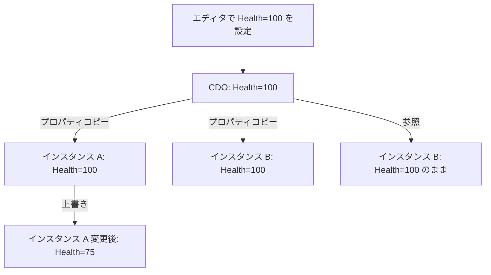

# Class Default Object（CDO）

- 上位: [[UObject/01_overview]]
- 関連: [[a_lifecycle]] | [[b_garbage_collection]]
- ソース: `CoreUObject/Public/UObject/Class.h`, `CoreUObject/Public/UObject/UObjectGlobals.h`

---

## 概要

**CDO（Class Default Object）** は、`UClass` ごとに 1 つだけ生成される「デフォルト値テンプレート」インスタンス。`NewObject<T>()` でオブジェクトが生成される際、CDO からプロパティ値がコピーされる。これにより、エディタの Details パネルで設定した「デフォルト値」がすべてのインスタンスに反映される仕組みが実現される。

---

## CDO の役割



**CDO の用途**:

1. **デフォルト値の保持** — `EditDefaultsOnly` プロパティのソース
2. **シリアライゼーションの差分圧縮** — CDO と異なる値だけを保存（同じ値は書かない）
3. **型情報のプロキシ** — `GetDefaultObject<T>()` で型の情報にアクセス
4. **Archetype チェーン** — Blueprint → 親クラス の CDO をたどってデフォルト値を解決

---

## CDO 生成タイミング

```
エンジン起動
  └─ UClass::CreateDefaultObject()
       ├─ StaticConstructObject_Internal(ClassFlags=CDO)
       │    └─ コンストラクタ呼び出し（通常のインスタンスと同じ）
       └─ PostInitProperties() 呼び出し（RF_ClassDefaultObject フラグあり）
```

各クラスの CDO は **エンジン起動時（Static Init フェーズ）** または最初にアクセスされたとき（遅延生成）に作られる。一度作られると **アプリ終了まで存在**。

---

## CDO の取得

```cpp
// UClass から CDO を取得
UMyActor* DefaultActor = GetDefault<UMyActor>();
// または
UMyActor* DefaultActor = UMyActor::StaticClass()->GetDefaultObject<UMyActor>();

// CDO かどうかを確認
bool bIsCDO = Obj->HasAnyFlags(RF_ClassDefaultObject);

// CDO の名前
// Default__ClassName の形式
FName CDOName = UMyActor::StaticClass()->GetDefaultObjectName();
// → Default__MyActor
```

---

## Archetype チェーン

Blueprint が C++ を継承する場合、デフォルト値の解決は **Archetype チェーン** をたどる:

```
Blueprint BP_MyCharacter (Health=150)
  └─ 親: C++ AMyCharacter CDO (Health=100)
       └─ 親: ACharacter CDO (Health=?)
            └─ 親: APawn CDO
                 └─ 親: AActor CDO
```

`NewObject<UMyCharacter>()` 時:
1. BP_MyCharacter の CDO を Archetype として使用
2. CDO の `Health = 150` がコピーされる（C++ CDO の 100 ではなく）

---

## コンストラクタ内での CDO 判定

```cpp
UMyActor::UMyActor()
{
    // CDO かどうか判定
    if (HasAnyFlags(RF_ClassDefaultObject))
    {
        // CDO 生成時のみ実行したい初期化
    }
    else
    {
        // 通常インスタンス生成時のみ
    }
}
```

実際には CDO とインスタンスで処理を分けることは稀。通常は `PostInitProperties()` での分岐が推奨される。

---

## プロパティコピーの仕組み（差分シリアライゼーション）

UE のシリアライゼーションは **CDO との差分のみを保存**:

```
シリアライズ時:
  foreach property in object:
    if value != CDO.property.value:
      → シリアライズ（保存）
    else:
      → スキップ（保存しない）

デシリアライズ時:
  1. CDO からすべてのプロパティをコピー
  2. 保存された差分を上書き
```

これによりファイルサイズを削減し、デフォルト値の変更がロード済みオブジェクトにも伝播する（差分に記録されていないプロパティは CDO から取得されるため）。

---

## GetDefaultObject でのリードオンリーアクセス

```cpp
// CDO は読み取り専用で使うのが原則
const UMyGameInstance* DefaultGI = GetDefault<UMyGameInstance>();
int32 MaxPlayers = DefaultGI->MaxPlayers;

// エディタ（UHT テンプレート生成等）では書き込み可能なことがある
UMyGameInstance* MutableDefault = GetMutableDefault<UMyGameInstance>();
MutableDefault->MaxPlayers = 8;  // 全インスタンスのデフォルトが変わる（危険）
```

`GetMutableDefault()` の書き込みは **全インスタンスのデフォルト値を変える** ため、通常は使わない。

---

## サブオブジェクトの CDO

`CreateDefaultSubobject<T>()` で生成したサブオブジェクトも、親 CDO が所有する CDO が存在する:

```cpp
// CDO 内で作られた MyComp も CDO
UMyCharacter::UMyCharacter()
{
    MyComp = CreateDefaultSubobject<UMyComponent>(TEXT("MyComp"));
    // → Default__MyCharacter の中に Default__MyComponent が作られる
}

// インスタンス化時:
// → MyComp の CDO からコピーしたインスタンスが作られる
```

---

## 関連ドキュメント

- [[a_lifecycle]] — `NewObject` と `PostInitProperties` でのプロパティコピー
- [[b_garbage_collection]] — CDO は GC の Root として常に存在
- [[Reference/ref_uobject_api]] — `GetDefault<T>` / `GetDefaultObject<T>` の API
