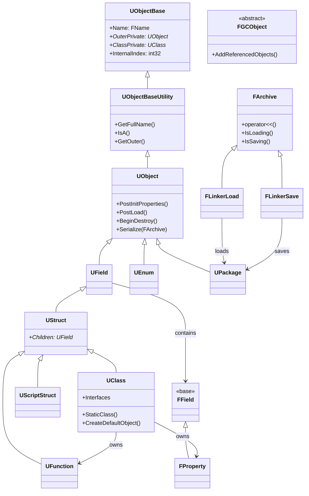

# Core ソースマップ

- 対象: `Engine/Source/Runtime/Core/` + `Engine/Source/Runtime/CoreUObject/`
- 更新日: 2026-04-24
- 上位: [[_module_index]]

---

## モジュール構成

| モジュール | パス | ファイル数（概算） | 説明 |
|-----------|------|----------|------|
| Core (Public) | `Engine/Source/Runtime/Core/Public/` | 1500+ h | プラットフォーム抽象・コンテナ・文字列・数学・非同期等 |
| Core (Private) | `Engine/Source/Runtime/Core/Private/` | 800+ cpp | Core 実装 |
| CoreUObject (Public) | `Engine/Source/Runtime/CoreUObject/Public/` | 400+ h | UObject・リフレクション・GC・シリアライゼーション |
| CoreUObject (Private) | `Engine/Source/Runtime/CoreUObject/Private/` | 200+ cpp | UObject 実装 |

### 主要サブフォルダ（今回の解析対象）

| 領域 | パス | ファイル数 | 対応サブフォルダ |
|------|------|----------|------------|
| UObject コア | `CoreUObject/Public/UObject/` | 160+ h | UObject / Reflection |
| 名前 | `Core/Public/UObject/NameTypes.h` | 1 h | Containers（FName） |
| 文字列 | `Core/Public/Containers/UnrealString.h`, `StringView.h` | — | Containers |
| 国際化 | `Core/Public/Internationalization/Text.h` | 38 h | Containers（FText） |
| コンテナ | `Core/Public/Containers/` | 81 h | Containers |
| シリアライゼーション (基盤) | `Core/Public/Serialization/` | 56 h | Serialization |
| シリアライゼーション (UObject 特化) | `CoreUObject/Public/Serialization/` | 52 h | Serialization |
| 非同期 | `Core/Public/Async/`, `Core/Public/HAL/` | 41 + HAL | AsyncTasks |
| デリゲート | `Core/Public/Delegates/` | 11 h | Delegates |
| スマートポインタ | `Core/Public/Templates/SharedPointer.h` | 3 h | Containers |
| タイマー | `Engine/Public/TimerManager.h` | 1 h | Delegates（FTimerManager）|

---

## 主要ファイル → クラス対応

### UObject — オブジェクトシステム

| ファイル | 主要クラス/構造体 | 役割 | BP公開 |
|---------|-----------------|------|--------|
| `CoreUObject/Public/UObject/Object.h` | `UObject` | 全 UObject の最上位基底（`Object.h:94`） | Yes |
| `CoreUObject/Public/UObject/UObjectBase.h` | `UObjectBase` | 低レベル基底（Name/Outer/Flags/Index 保持） | No |
| `CoreUObject/Public/UObject/UObjectBaseUtility.h` | `UObjectBaseUtility` | 基底ユーティリティ（IsA/GetFullName/GetOuter 等） | No |
| `CoreUObject/Public/UObject/UObjectGlobals.h` | `NewObject`/`StaticFindObject`/`FObjectInitializer` | オブジェクト生成・検索・CDO 初期化 | — |
| `CoreUObject/Public/UObject/UObjectArray.h` | `FUObjectArray`/`GUObjectArray` | 全 UObject の登録テーブル | No |
| `CoreUObject/Public/UObject/UObjectHash.h` | — | 名前→オブジェクトのハッシュ | No |
| `CoreUObject/Public/UObject/UObjectAllocator.h` | `FUObjectAllocator` | 低レベルアロケータ | No |
| `CoreUObject/Public/UObject/UObjectClusters.h` | `FUObjectCluster` | GC クラスタリング（高速化） | No |
| `CoreUObject/Public/UObject/UObjectThreadContext.h` | `FUObjectThreadContext` | TLS 上のスレッド状態 | No |
| `CoreUObject/Public/UObject/UObjectIterator.h` | `TObjectIterator<T>` | UObject 全走査 | No |
| `CoreUObject/Public/UObject/Package.h` | `UPackage` | アセットパッケージ（.uasset/.umap） | No |
| `CoreUObject/Public/UObject/ObjectMacros.h` | `UCLASS`/`UPROPERTY`/`UFUNCTION`/`USTRUCT` 等マクロ | リフレクションタグ | — |
| `CoreUObject/Public/UObject/ObjectPtr.h` | `TObjectPtr<T>` | UHT 生成コードが使う強参照（GC 追跡） | — |
| `Core/Public/UObject/WeakObjectPtrTemplates.h` | `TWeakObjectPtr<T>` | GC 対応の弱参照 | — |
| `Core/Public/UObject/StrongObjectPtrTemplates.h` | `TStrongObjectPtr<T>` | RAII 強参照（AddToRoot 相当） | — |
| `CoreUObject/Public/UObject/GarbageCollection.h` | `CollectGarbage`/`FGCScopeGuard` | マーク&スイープ GC | No |
| `CoreUObject/Public/UObject/GCObject.h` | `FGCObject` | 非 UObject からの UObject 参照保持 | No |
| `CoreUObject/Public/UObject/ReachabilityAnalysis.h` | — | 参照グラフ到達性解析 | No |
| `CoreUObject/Public/UObject/ReferenceChainSearch.h` | `FReferenceChainSearch` | リーク調査用参照チェーン探索 | No |
| `CoreUObject/Public/UObject/ConstructorHelpers.h` | `ConstructorHelpers::FObjectFinder` | C++ コンストラクタでのアセット参照 | — |

### Reflection — リフレクションシステム

| ファイル | 主要クラス/構造体 | 役割 | BP公開 |
|---------|-----------------|------|--------|
| `CoreUObject/Public/UObject/Class.h` | `UClass`/`UScriptStruct`/`UEnum` | 型情報（継承・プロパティ・関数メタデータ） | No |
| `CoreUObject/Public/UObject/Class.h` | `UFunction` | Blueprint/ネイティブ関数のリフレクション | No |
| `CoreUObject/Public/UObject/Field.h` | `FField` | UE5 の新プロパティ基底（旧 `UProperty` から移行） | No |
| `CoreUObject/Public/UObject/UnrealType.h` | `FProperty`/`FNumericProperty`/`FObjectProperty` 等 | 型別プロパティハンドラ | No |
| `CoreUObject/Public/UObject/EnumProperty.h` | `FEnumProperty` | Enum プロパティ | No |
| `CoreUObject/Public/UObject/FieldPath.h` | `TFieldPath<T>` | FField の永続的な参照 | — |
| `CoreUObject/Public/UObject/PropertyTag.h` | `FPropertyTag` | シリアライズ時のプロパティ識別タグ | No |
| `CoreUObject/Public/UObject/PropertyPortFlags.h` | `EPropertyPortFlags` | ExportText/ImportText のフラグ | — |
| `CoreUObject/Public/UObject/MetaData.h` | `UMetaData` | UHT が生成するメタデータ（Tooltip/EditCondition 等） | No |
| `CoreUObject/Public/UObject/Interface.h` | `UInterface`/`IInterface` | インターフェースシステム | Yes |
| `CoreUObject/Public/UObject/ReflectedTypeAccessors.h` | `StaticEnum<T>()`/`StaticStruct<T>()` | テンプレート型 → UClass 変換 | — |
| `CoreUObject/Public/UObject/PropertyAccessUtil.h` | `PropertyAccessUtil::SetPropertyValue_Object` | プロパティ値の汎用 Get/Set | — |
| `CoreUObject/Public/UObject/Script.h` | `FFrame`/`FScriptName` | Blueprint VM 実行フレーム | No |
| `CoreUObject/Public/UObject/ScriptMacros.h` | `DEFINE_FUNCTION`/`P_GET_PROPERTY` 等 | Blueprint 関数呼び出しマクロ | — |
| `CoreUObject/Public/UObject/FieldIterator.h` | `TFieldIterator<T>` | クラスの FField/UFunction 走査 | — |

### Serialization — シリアライゼーション

| ファイル | 主要クラス/構造体 | 役割 | BP公開 |
|---------|-----------------|------|--------|
| `Core/Public/Serialization/Archive.h` | `FArchive`（`Archive.h:1207`） | シリアライズ基底（`operator<<` / IsLoading / IsSaving） | No |
| `Core/Public/Serialization/ArchiveProxy.h` | `FArchiveProxy` | 別の FArchive にフォワードするプロキシ | No |
| `Core/Public/Serialization/MemoryArchive.h` | `FMemoryArchive` | メモリバッファへの読み書き基底 | No |
| `Core/Public/Serialization/MemoryReader.h` | `FMemoryReader` | メモリからロード | No |
| `Core/Public/Serialization/MemoryWriter.h` | `FMemoryWriter` | メモリへセーブ | No |
| `Core/Public/Serialization/BufferArchive.h` | `FBufferArchive` | 可変長バッファへの書き込み | No |
| `Core/Public/Serialization/BitReader.h`/`BitWriter.h` | `FBitReader`/`FBitWriter` | ビット単位 I/O（ネットワーク複製で使用） | No |
| `Core/Public/Serialization/StructuredArchive.h` | `FStructuredArchive`/`FStructuredArchiveSlot` | スロットベースの構造化シリアライズ（JSON/Bin 切替可） | No |
| `Core/Public/Serialization/CustomVersion.h` | `FCustomVersion`/`FCustomVersionContainer` | モジュール別のバージョニング | No |
| `Core/Public/Serialization/CompactBinary.h` | `FCbObject`/`FCbField`/`FCbWriter` | UE5 新シリアライズフォーマット（DDC 等） | No |
| `Core/Public/Serialization/LoadTimeTrace.h` | `TRACE_LOADTIME_*` マクロ | ロード時間計測 | — |
| `CoreUObject/Public/Serialization/BulkData.h` | `FBulkData`/`FByteBulkData` | 大きなバイナリデータ（メッシュ等）の遅延ロード | No |
| `CoreUObject/Public/Serialization/AsyncLoading2.h` | `FAsyncLoadingThread2`/`IAsyncPackageLoader` | UE5 新非同期ローダ（EDL→Zen） | No |
| `CoreUObject/Public/Serialization/AsyncPackageLoader.h` | `IAsyncPackageLoader` | 非同期パッケージローダのインターフェース | No |
| `CoreUObject/Public/Serialization/ArchiveUObject.h` | `FArchiveUObject` | UObject 対応の FArchive 基底 | No |
| `CoreUObject/Public/Serialization/ObjectWriter.h`/`ObjectReader.h` | `FObjectWriter`/`FObjectReader` | UObject のコピー用 | No |
| `CoreUObject/Public/UObject/LinkerLoad.h` | `FLinkerLoad` | パッケージロード | No |
| `CoreUObject/Public/UObject/LinkerSave.h` | `FLinkerSave` | パッケージセーブ | No |
| `CoreUObject/Public/UObject/PackageFileSummary.h` | `FPackageFileSummary` | .uasset のヘッダ構造体 | No |

### AsyncTasks — 非同期処理

| ファイル | 主要クラス/構造体 | 役割 | BP公開 |
|---------|-----------------|------|--------|
| `Core/Public/Async/Async.h` | `Async()`/`EAsyncExecution` | 汎用非同期実行のエントリポイント | No |
| `Core/Public/Async/TaskGraphInterfaces.h` | `FTaskGraphInterface`/`FBaseGraphTask`/`ENamedThreads` | タスクグラフ（UE 独自スケジューラ） | No |
| `Core/Public/Async/TaskGraphDefinitions.h` | `FGraphEventRef`/`FGraphEventArray` | タスクイベント | No |
| `Core/Public/Async/Fundamental/Scheduler.h` | `FScheduler` | UE5 新タスクスケジューラ（Task System v2） | No |
| `Core/Public/Async/Fundamental/Task.h` | `FTask`/`LaunchTask` | UE5 Task System の基本タスク | No |
| `Core/Public/Async/ParallelFor.h` | `ParallelFor()`/`EParallelForFlags` | 並列 for ループ | No |
| `Core/Public/Async/AsyncWork.h` | `FAsyncTask<T>`/`FQueuedThreadPool` | キュー方式の非同期タスク | No |
| `Core/Public/Async/Future.h` | `TFuture<T>`/`TPromise<T>` | Future/Promise パターン | No |
| `Core/Public/Async/AsyncResult.h` | `TAsyncResult<T>` | 進捗付きの非同期結果 | No |
| `Core/Public/HAL/Runnable.h` | `FRunnable` | 独立スレッドの処理実装 | No |
| `Core/Public/HAL/RunnableThread.h` | `FRunnableThread` | `FRunnable` を実行するスレッド | No |
| `Core/Public/HAL/ThreadingBase.h` | `FRunnableThread`/`GGameThreadId` 等 | スレッド管理の中核 | No |
| `Core/Public/HAL/ThreadManager.h` | `FThreadManager` | 全スレッドの管理 | No |
| `Core/Public/Async/Mutex.h` | `FMutex`/`TUniqueLock` | UE5 新ミューテックス（ParkingLot 方式） | No |
| `Core/Public/Async/SharedMutex.h` | `FSharedMutex` | 共有ミューテックス（R/W ロック） | No |
| `Core/Public/HAL/CriticalSection.h` | `FCriticalSection` | レガシー排他制御 | No |
| `Core/Public/HAL/Event.h` | `FEvent` | イベント同期 | No |

### Delegates — デリゲート・イベント

| ファイル | 主要クラス/構造体 | 役割 | BP公開 |
|---------|-----------------|------|--------|
| `Core/Public/Delegates/Delegate.h` | `TDelegate<Ret(Args)>` | 型安全デリゲート（メインテンプレート） | — |
| `Core/Public/Delegates/DelegateCombinations.h` | `DECLARE_DELEGATE*` マクロ群 | 各種デリゲート宣言マクロ | — |
| `Core/Public/Delegates/DelegateBase.h` | `TDelegateBase` | デリゲート基底（ストレージ） | — |
| `Core/Public/Delegates/MulticastDelegateBase.h` | `TMulticastDelegateBase` | マルチキャスト基底 | — |
| `Core/Public/Delegates/IDelegateInstance.h` | `IDelegateInstance` | デリゲートインスタンス基底 | — |
| `Core/Public/Delegates/DelegateInstancesImpl.h` | `TBaseStaticDelegateInstance` 等 | 各種バインド方式の実装 | — |
| `Core/Public/Delegates/DelegateSignatureImpl.inl` | — | デリゲート本体（可変引数テンプレート生成） | — |
| `Core/Public/UObject/ScriptDelegates.h` | `TScriptDelegate`/`TMulticastScriptDelegate` | Blueprint 対応 Dynamic デリゲート | Yes |
| `Core/Public/Templates/Function.h` | `TFunction<Ret(Args)>`/`TUniqueFunction` | `std::function` 相当 | — |
| `Engine/Public/TimerManager.h` | `FTimerManager`/`FTimerHandle` | タイマー管理（`SetTimer`/`ClearTimer`） | Yes |

### Containers — コンテナ・文字列・スマートポインタ

| ファイル | 主要クラス/構造体 | 役割 | BP公開 |
|---------|-----------------|------|--------|
| `Core/Public/Containers/Array.h` | `TArray<T>` | 可変長配列（最頻出コンテナ） | — |
| `Core/Public/Containers/ArrayView.h` | `TArrayView<T>` | 非所有のビュー | — |
| `Core/Public/Containers/Map.h` | `TMap<K,V>`/`TSortedMap<K,V>` | ハッシュマップ/ソート済みマップ | — |
| `Core/Public/Containers/Set.h` | `TSet<T>` | ハッシュセット | — |
| `Core/Public/Containers/SparseArray.h` | `TSparseArray<T>` | 穴あき配列（`TSet`/`TMap` の基盤） | — |
| `Core/Public/Containers/BitArray.h` | `TBitArray` | ビット配列 | — |
| `Core/Public/Containers/StaticArray.h` | `TStaticArray<T,N>` | 固定長配列 | — |
| `Core/Public/Containers/Queue.h` | `TQueue<T>` | ロックフリー単一Pキュー | — |
| `Core/Public/Containers/Deque.h` | `TDeque<T>` | 両端キュー | — |
| `Core/Public/Containers/RingBuffer.h` | `TRingBuffer<T>` | 循環バッファ | — |
| `Core/Public/Containers/MpscQueue.h` | `TMpscQueue<T>` | マルチP/シングルC ロックフリー | — |
| `Core/Public/Containers/UnrealString.h` | `FString` | 可変長文字列 | Yes |
| `Core/Public/Containers/StringView.h` | `FStringView`/`FAnsiStringView` | 非所有文字列ビュー | — |
| `Core/Public/Containers/StringConv.h` | `StringCast`/`TCHAR_TO_ANSI` 等 | 文字コード変換 | — |
| `Core/Public/Containers/AnsiString.h` | `FAnsiString` | ANSI 文字列 | — |
| `Core/Public/Containers/Utf8String.h` | `FUtf8String` | UTF-8 文字列 | — |
| `Core/Public/UObject/NameTypes.h` | `FName`/`FNameEntry` | 共有プール文字列（高速比較） | Yes |
| `Core/Public/Internationalization/Text.h` | `FText` | ローカライズ対応文字列 | Yes |
| `Core/Public/Templates/SharedPointer.h` | `TSharedPtr<T>`/`TSharedRef<T>`/`TWeakPtr<T>`/`TUniquePtr<T>` | スマートポインタ（UObject 外） | — |
| `Core/Public/Templates/RefCounting.h` | `TRefCountPtr<T>`/`FRefCountedObject` | 侵入型参照カウント | — |

---

## エントリポイント

### UObject ライフサイクル

| 関数 | ファイル | 説明 |
|------|---------|------|
| `NewObject<T>()` | `UObjectGlobals.h` | 最も一般的な UObject 生成。内部で `StaticConstructObject_Internal` → `UClass::CreateDefaultObject` |
| `StaticConstructObject_Internal()` | `UObjectGlobals.cpp` | 低レベル生成の実体。`FObjectInitializer` を生成してコンストラクタ呼び出し |
| `UObject::PostInitProperties()` | `Object.cpp` | CDO からのコピー完了後に呼ばれる初期化フック |
| `UObject::PostLoad()` | `Object.cpp` | ディスクからロード完了後に呼ばれる |
| `UObject::ConditionalBeginDestroy()` | `Object.cpp` | GC で到達不能と判定されたときに呼ばれる |
| `UObject::BeginDestroy()` | `Object.cpp` | 非同期リソース解放の開始 |
| `UObject::FinishDestroy()` | `Object.cpp` | 最終破棄（メモリ解放前の同期処理） |

### GC

| 関数 | ファイル | 説明 |
|------|---------|------|
| `CollectGarbage()` | `GarbageCollection.cpp` | GC のエントリポイント（フレーム末・`ForceGC` 呼び出し時） |
| `IsGarbageCollecting()` | `GarbageCollection.h` | GC 実行中フラグ |
| `FGCObject::AddReferencedObjects()` | `GCObject.h` | 非 UObject から UObject を GC に登録する仮想関数 |
| `UObject::AddReferencedObjects()` | `Object.h` | サブクラスで追加参照を GC に伝える（手動参照の場合） |

### リフレクション

| 関数 | ファイル | 説明 |
|------|---------|------|
| `UClass::StaticClass()` | `ObjectMacros.h`（マクロ展開） | 型ごとの UClass 取得 |
| `UObject::GetClass()` | `Object.h` | インスタンスから UClass 取得 |
| `UFunction::Invoke()`/`UObject::ProcessEvent()` | `ScriptCore.cpp` | Blueprint 関数呼び出し |
| `FProperty::CopyCompleteValue()` | `UnrealType.h` | プロパティ値の汎用コピー |
| `TFieldIterator<FProperty>` | `FieldIterator.h` | クラスのプロパティ走査 |

### シリアライゼーション

| 関数 | ファイル | 説明 |
|------|---------|------|
| `UObject::Serialize(FArchive& Ar)` | `Object.h` | オブジェクトのシリアライズフック（オーバーライド可） |
| `FLinkerLoad::Preload()` | `LinkerLoad.cpp` | パッケージロード時のプリロード |
| `SavePackage()` | `SavePackage.cpp` | パッケージ保存（エディタ） |
| `LoadPackageAsync()` | `UObjectGlobals.cpp` | 非同期パッケージロード |
| `FAsyncLoadingThread2::TickAsyncLoading()` | `AsyncLoading2.cpp` | 非同期ローダの毎フレーム更新 |

### AsyncTasks

| 関数 | ファイル | 説明 |
|------|---------|------|
| `Async()` | `Async.h` | 汎用非同期実行（`EAsyncExecution` で実行先指定） |
| `ParallelFor()` | `ParallelFor.h` | 並列 for ループ |
| `FTaskGraphInterface::Get().WaitUntilTaskCompletes()` | `TaskGraphInterfaces.h` | タスク完了待ち |
| `UE::Tasks::Launch()` | `Fundamental/Task.h` | Task System v2 のタスク起動 |
| `FRunnableThread::Create()` | `RunnableThread.h` | 独立スレッド生成 |
| `ENQUEUE_RENDER_COMMAND()` | `RenderingThread.h`（RenderCore） | GameThread → RenderThread |

### Delegates

| 関数 | ファイル | 説明 |
|------|---------|------|
| `TDelegate::BindUObject()` | `DelegateInstancesImpl.h` | UObject メンバ関数にバインド |
| `TDelegate::BindLambda()` | `DelegateInstancesImpl.h` | ラムダにバインド |
| `TMulticastDelegate::AddDynamic()` | `ScriptDelegates.h` | BP 公開デリゲートへの登録 |
| `TMulticastDelegate::Broadcast()` | `MulticastDelegateBase.h` | 全バインドを呼び出す |
| `FTimerManager::SetTimer()` | `TimerManager.h` | タイマー登録 |
| `FTimerManager::SetTimerForNextTick()` | `TimerManager.h` | 次フレーム実行 |

---

## 主要 CVar

| CVar | デフォルト | 説明 |
|------|----------|------|
| `gc.MaxObjectsInGame` | `131072` | GC 管理できる UObject 最大数 |
| `gc.TimeBetweenPurgingPendingKillObjects` | `60.0` | 強制 GC 間隔（秒） |
| `gc.AllowParallelGC` | `1` | 並列 GC の有効化 |
| `gc.IncrementalReachabilityTimeLimit` | `0.002` | インクリメンタル GC の 1 フレーム予算（秒） |
| `gc.VerifyGCAssumptions` | `0` | GC アサーション検証（開発用） |
| `TaskGraph.EnableAsyncTasks` | — | タスクグラフ非同期実行有効化 |
| `TaskGraph.TaskPriorityOverride` | — | タスク優先度上書き |
| `s.AsyncLoadingThreadEnabled` | `1` | 非同期ロードスレッド有効化 |
| `s.LevelStreamingActorsUpdateTimeLimit` | `5.0` | 非同期ロード時間制限（ms/フレーム） |
| `log.Timestamp` | — | ログへのタイムスタンプ付与 |

---

## クラス関連図（概略）

---

## 備考

- **UE5 の大きな変更**: `UProperty` は UE4 時代の UObject 派生だったが、UE5 で `FField` 派生に変更された。これにより GC 負荷が軽減。
- **Task System v2**: `Core/Public/Async/Fundamental/` に置かれる新タスクスケジューラ。`FTaskGraph` と並行稼働中。
- **シリアライズ 2 系統**: レガシーは `FArchive`、新方式は `FStructuredArchive` / `FCbObject`（Compact Binary）。DDC/Zen は後者を使う。
- **非同期ローダ 2 系統**: EDL（Event Driven Loader）→ Zen Loader（AsyncLoading2）への移行中。`s.AsyncLoadingThreadEnabled` で切替。
- **CoreUObject** 配下のヘッダは UObject / Reflection / Serialization の 3 サブフォルダに横断的に関わる。本ソースマップでは「主な用途」で分類している。
- 行番号は UE 5.6 時点。ソース変更で古くなる可能性があるため、参照時に実ファイルを確認すること。
