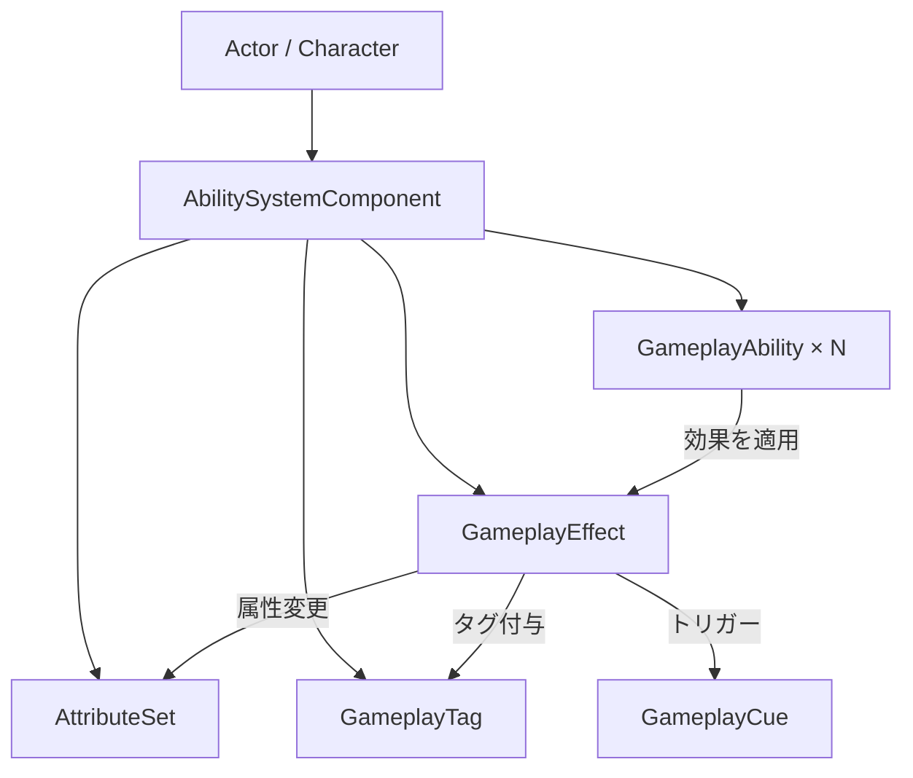

# Gameplay Ability System (GAS) 全体概要

- 取得対象: `Engine/Plugins/Runtime/GameplayAbilities/Source/`
- 上位: [[UE5 解析インデックス]]

---

## GAS とは

**多数のゲームプレイ能力・効果・属性を汎用的に管理するフレームワーク**（UE4.15〜）。  
RPG のスキル・バフ・ステータス管理から FPS のアビリティまで幅広く使われる。

| 概念 | クラス | 説明 |
|------|--------|------|
| 能力 | `UGameplayAbility` | 発動・実行・キャンセルのロジック |
| 効果 | `UGameplayEffect` | 属性変更・バフ・デバフ |
| 属性 | `UAttributeSet` | HP・MP 等の数値管理 |
| タグ | `FGameplayTag` | 状態・条件の階層的ラベル |
| キュー | `UGameplayCue` | エフェクト・サウンドのトリガー |
| コンポーネント | `UAbilitySystemComponent` (ASC) | 上記をまとめて管理 |

---

## アーキテクチャ

---

## 主要ソースファイル

| ファイル | 役割 |
|---------|------|
| `AbilitySystemComponent.h/.cpp` | GAS の中核コンポーネント |
| `GameplayAbility.h/.cpp` | アビリティ基底クラス |
| `GameplayEffect.h/.cpp` | エフェクト（バフ・デバフ）定義 |
| `AttributeSet.h/.cpp` | 属性セット基底クラス |
| `GameplayTagContainer.h` | GameplayTag のコンテナ |
| `GameplayCueManager.h/.cpp` | キュー管理・ディスパッチ |
| `AbilitySystemGlobals.h` | グローバル設定・初期化 |

---

## サブシステムドキュメント

| ドキュメント | 内容 |
|------------|------|
| `Details/a_attribute_set.md` | AttributeSet・GameplayAttribute の詳細 |
| `Details/b_gameplay_ability.md` | GameplayAbility の発動フロー |
| `Details/c_gameplay_effect.md` | GameplayEffect の適用メカニズム |
| `Details/d_ability_system_component.md` | ASC の管理・レプリケーション |
| `Details/e_gameplay_tag.md` | GameplayTag 階層と検索 |
| `Details/f_gameplay_cue.md` | GameplayCue のトリガーと管理 |
