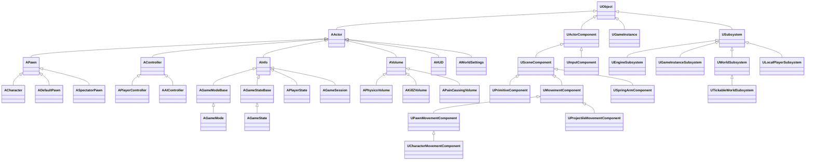
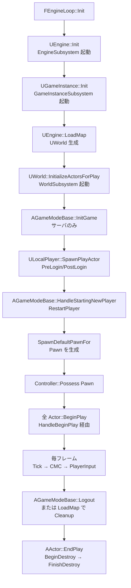

# GameFramework 全体概要

- 上位: [[UE5 解析インデックス]]
- 関連: [[ActorComponent/01_overview]] | [[GameModeState/01_overview]] | [[Controller/01_overview]] | [[CharacterMovement/01_overview]] | [[Subsystems/01_overview]]
- ソース: `Engine/Source/Runtime/Engine/Classes/GameFramework/`, `Engine/Source/Runtime/Engine/Private/`, `Engine/Source/Runtime/Engine/Public/Subsystems/`
- ソースマップ: [[_source_map]]

---

## GameFramework とは

UE5 における **「ゲームを構成するアクタ・ルール・状態の標準フレームワーク」**。
プロジェクトはこの基底クラスを派生して独自のゲームロジックを構築する。

GameFramework が提供するもの:

| 役割 | クラス | 配置 |
|------|--------|------|
| アプリ全体のシングルトン | `UGameInstance` | クライアント / サーバ各 1 |
| ワールド単位の Actor 入れ物 | `UWorld` | レベル毎 |
| ゲームルール（権限） | `AGameModeBase` / `AGameMode` | サーバのみ |
| ゲーム状態（複製） | `AGameStateBase` / `AGameState` | 全員に複製 |
| プレイヤー制御 | `APlayerController` / `APawn` / `ACharacter` | 各プレイヤー |
| プレイヤー状態（複製） | `APlayerState` | 全員に複製 |
| Pawn 移動 | `UCharacterMovementComponent` | Character に内蔵 |
| サブシステム | `UGameInstanceSubsystem` 等 | 各スコープ |
| HUD / 入力 | `AHUD` / `UPlayerInput` | プレイヤーごと |

---

## クラス階層（最重要）



---

## 全体ライフサイクル（典型的フロー）



---

## サブフォルダ構成

| サブフォルダ | 内容 | 主要クラス |
|------------|------|----------|
| `ActorComponent/` | Actor のライフサイクル・コンポーネント階層・ティック | `AActor` / `UActorComponent` / `USceneComponent` |
| `GameModeState/` | ゲームルール・状態・セッション | `AGameModeBase` / `AGameStateBase` / `AGameSession` |
| `Controller/` | コントローラ・ポゼッション・入力 | `APlayerController` / `AAIController` / `APawn` |
| `CharacterMovement/` | 歩行/落下/泳ぎ・ネット予測・ルートモーション | `ACharacter` / `UCharacterMovementComponent` |
| `Subsystems/` | サブシステムフレームワーク | `USubsystem` / `FSubsystemCollection` |

---

## サーバ / クライアント 配置

| クラス | サーバ | クライアント | 複製 |
|--------|:------:|:-----------:|:----:|
| `UGameInstance` | ◯ | ◯ | - |
| `AGameModeBase` | ◯ | ✕ | ✕（権限） |
| `AGameStateBase` | ◯ | ◯ | ◯ |
| `APlayerController` | ◯（全員分） | ◯（自分のみ） | 自身に複製 |
| `APlayerState` | ◯ | ◯ | ◯（全員に） |
| `APawn` | ◯ | ◯ | ◯（位置/向き） |
| `AHUD` | ✕ | ◯ | ✕ |
| `UPlayerInput` | - | ◯ | ✕ |

> **重要**: `AGameModeBase` はサーバ専用。クライアントから `GetGameMode()` は `nullptr` を返す。クライアントで参照したいデータは `AGameStateBase` に置く。

---

## 主要マクロと指定子

```cpp
// Replication (CharacterMovement で多用)
UFUNCTION(Server, Reliable, WithValidation)
void ServerMove(...);                            // クライアント→サーバ

UFUNCTION(Client, Reliable)
void ClientAdjustPosition(...);                  // サーバ→クライアント

UFUNCTION(NetMulticast, Reliable)
void MulticastEvent(...);                        // サーバ→全員

// Replicated Property
UPROPERTY(ReplicatedUsing=OnRep_Health)
float Health;

void OnRep_Health();                             // 受信時コールバック

// BP 公開
UPROPERTY(BlueprintReadOnly, EditAnywhere, Category="Stats")
float MaxHealth;

UFUNCTION(BlueprintCallable, BlueprintAuthorityOnly)
void ServerOnlyOperation();
```

---

## 横断的な仕組み

### Authority 判定

```cpp
if (HasAuthority())          // サーバ または StandaloneGame
{
    // 信頼できる処理（HP 減算、スポーン等）
}

if (IsLocallyControlled())   // 自分が操作している Pawn
{
    // 入力処理、UI 更新
}
```

### Net Mode

| Net Mode | 説明 |
|----------|------|
| `NM_Standalone` | シングル プレイ（Authority + Local 両方持つ） |
| `NM_DedicatedServer` | サーバ専用（描画なし） |
| `NM_ListenServer` | サーバ + クライアント両役 |
| `NM_Client` | クライアントのみ |

### Tick の所有

`AActor::PrimaryActorTick.bCanEverTick = true;` を設定し、`Tick(DeltaSeconds)` をオーバーライド。
`UActorComponent::PrimaryComponentTick` も同様。

---

## 主要 CVar

| CVar | 説明 |
|------|------|
| `t.MaxFPS` | フレームレート上限 |
| `g.TimeBetweenPurgingPendingKillObjects` | Actor 削除→GC の待ち時間 |
| `p.NetEnableMoveCombining` | CMC の ServerMove 結合 |
| `net.ReplicateOnlyToActiveConnections` | レプリケーション最適化 |

---

## 関連ドキュメント

- [[ActorComponent/01_overview]] — Actor / Component ライフサイクル
- [[GameModeState/01_overview]] — GameMode / GameState / GameSession
- [[Controller/01_overview]] — Controller / Possession / 入力
- [[CharacterMovement/01_overview]] — CharacterMovement / ネット予測
- [[Subsystems/01_overview]] — Subsystem フレームワーク
- [[../Core/UObject/01_overview]] — UObject 基底システム
- [[../Network/01_network_overview]] — レプリケーション・RPC

---

## コード実行フロー

### ゲーム起動〜プレイヤー操作開始までの全体フロー

```
[エンジン起動]
UGameInstance::Init()
  └─ SubsystemCollection.Initialize()               ← GameInstance Subsystem 起動

UWorld::InitializeActorsForPlay()
  └─ SubsystemCollection.Initialize(World)          ← World Subsystem 起動
  └─ AGameModeBase::InitGame()                      ← GameMode 初期化
  └─ AGameModeBase::InitGameState()                 ← GameState 生成

UWorld::BeginPlay()
  └─ AGameStateBase::HandleBeginPlay()              ← 全 Actor の BeginPlay 発火

[プレイヤー接続]
AGameSession::ApproveLogin() → AGameModeBase::Login()
  └─ AGameModeBase::PostLogin()
       └─ RestartPlayer() → SpawnDefaultPawnFor() → Controller::Possess(Pawn)
            └─ APlayerController::OnPossess()
                 └─ ClientRestart() → SetupPlayerInputComponent()

[毎フレーム]
UWorld::Tick()
  ├─ FTickTaskManager → 各 Actor / Component の Tick
  └─ UCharacterMovementComponent::TickComponent()
       └─ PerformMovement() or ReplicateMoveToServer()
```

### 関与クラス・関数

| クラス | 関数 | 役割 |
|--------|------|------|
| `UGameInstance` | `Init()` | ゲームセッション全体の起動 |
| `AGameModeBase` | `InitGame()` | ルールクラスの初期化 |
| `AGameStateBase` | `HandleBeginPlay()` | 全 Actor への BeginPlay 伝播 |
| `AGameModeBase` | `PostLogin()` | プレイヤー接続完了後の処理 |
| `AController` | `Possess()` | Controller と Pawn の結合 |
| `UCharacterMovementComponent` | `PerformMovement()` | キャラクター移動の実行 |
