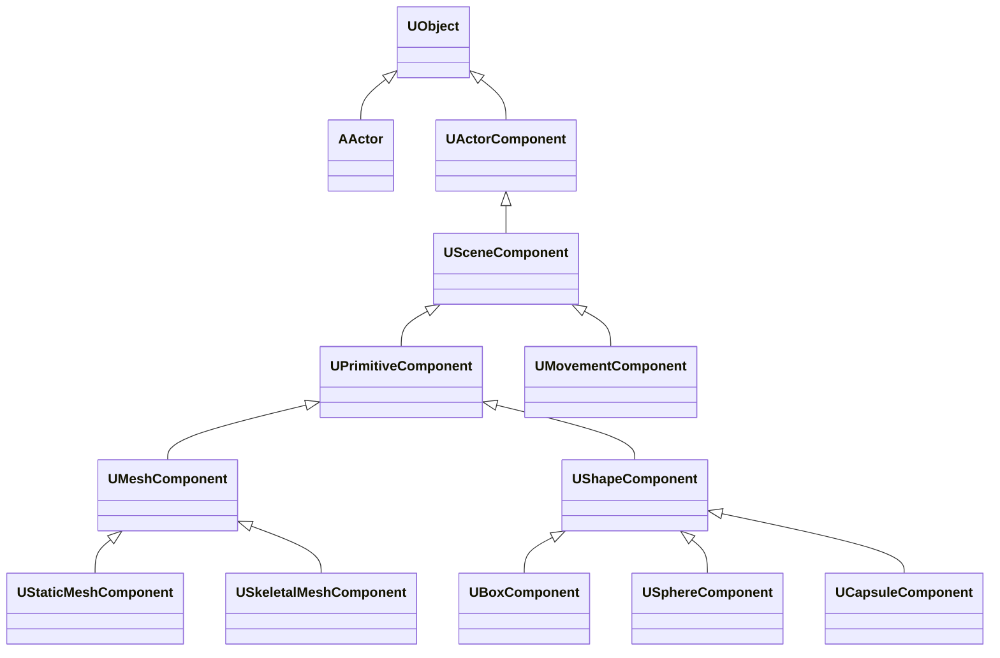
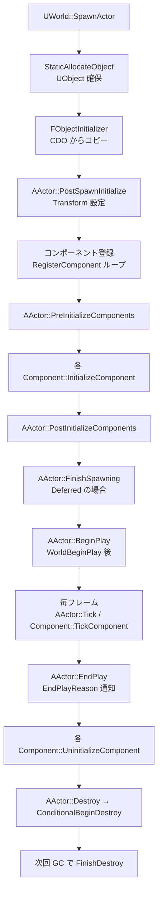

# ActorComponent 概要

- 上位: [[../01_gameframework_overview]]
- 関連: [[Details/a_actor_lifecycle]] | [[Details/b_component_model]] | [[Details/c_ticking]] | [[Details/d_actor_spawning]]
- ソース: `Engine/Source/Runtime/Engine/Classes/GameFramework/Actor.h`, `Engine/Source/Runtime/Engine/Private/Actor.cpp`, `Engine/Source/Runtime/Engine/Classes/Components/ActorComponent.h`, `Engine/Source/Runtime/Engine/Private/Components/ActorComponent.cpp`

---

## 概要

UE5 のあらゆる「ワールドに存在するもの」は `AActor`、それに装着される機能は `UActorComponent`。本サブフォルダは Actor のスポーン・初期化・ティック・破棄の **ライフサイクル** と、コンポーネントの登録・アタッチ・ティックの **コンポジション モデル** を扱う。

```
AActor                 ← 配置可能な実体（Transform は持たない、SceneComponent 経由）
 ├─ RootComponent (USceneComponent)  ← ルート Transform
 ├─ UActorComponent A                 ← ロジックのみ（Transform なし）
 └─ USceneComponent B (子)            ← Attached
      └─ USceneComponent C (孫)
```

---

## クラス階層



---

## ライフサイクル（標準フロー）



---

## 主要クラス

```cpp
class AActor : public UObject
{
    // Transform を持つルート コンポーネント（必須ではない）
    USceneComponent* RootComponent;

    // 全コンポーネント（OwnedComponents）
    TSet<UActorComponent*> OwnedComponents;

    // ライフサイクル仮想関数
    virtual void PreInitializeComponents();
    virtual void PostInitializeComponents();
    virtual void BeginPlay();
    virtual void EndPlay(const EEndPlayReason::Type EndPlayReason);
    virtual void Tick(float DeltaSeconds);

    // ティック設定
    FActorTickFunction PrimaryActorTick;
};

class UActorComponent : public UObject
{
    AActor* Owner;                           // 所有 Actor

    // ライフサイクル
    virtual void OnRegister();
    virtual void InitializeComponent();
    virtual void TickComponent(float DeltaTime, ELevelTick TickType, FActorComponentTickFunction* ThisTickFunction);
    virtual void UninitializeComponent();
    virtual void OnUnregister();

    FActorComponentTickFunction PrimaryComponentTick;
    bool bAutoActivate;
    bool bWantsInitializeComponent;
};

class USceneComponent : public UActorComponent
{
    FTransform RelativeTransform;            // 親に対する相対 Transform
    USceneComponent* AttachParent;
    TArray<USceneComponent*> AttachChildren;

    void AttachToComponent(USceneComponent* Parent, const FAttachmentTransformRules& Rules, FName SocketName);
};
```

---

## サブシステム別ドキュメント

| ドキュメント | 内容 |
|------------|------|
| [[Details/a_actor_lifecycle]] | SpawnActor → BeginPlay → EndPlay → Destroy の詳細フロー |
| [[Details/b_component_model]] | UActorComponent / USceneComponent / RegisterComponent / Attach |
| [[Details/c_ticking]] | FTickFunction / TickGroup / TickDependency |
| [[Details/d_actor_spawning]] | SpawnActorDeferred / FinishSpawning / FObjectInitializer |
| [[Reference/ref_actor_api]] | AActor API |
| [[Reference/ref_component_api]] | UActorComponent / USceneComponent API |

---

## 関連 CVar

| CVar | 説明 |
|------|------|
| `g.TimeBetweenPurgingPendingKillObjects` | Destroy → GC 待ち時間 |
| `t.MaxFPS` | フレームレート上限（Tick 影響） |
| `Engine.bAllowMultipleSimultaneousLoads` | 複数同時ロード許可 |
| `r.OneFrameThreadLag` | レンダ スレッドの 1 フレーム遅延 |

---

## 関連ドキュメント

- [[../01_gameframework_overview]] — GameFramework 全体
- [[../../Core/UObject/01_overview]] — UObject ライフサイクル基底
- [[../Controller/01_overview]] — Controller / Pawn （Actor 派生）
