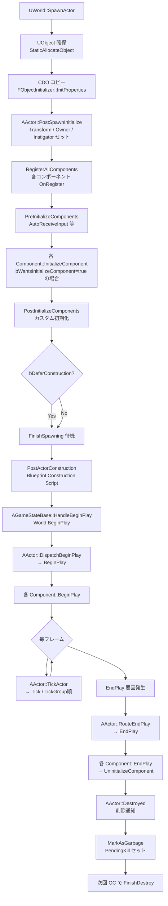

# Actor ライフサイクル

- 上位: [[ActorComponent/01_overview]]
- 関連: [[b_component_model]] | [[d_actor_spawning]]
- ソース: `Engine/Source/Runtime/Engine/Classes/GameFramework/Actor.h`, `Engine/Source/Runtime/Engine/Private/Actor.cpp`

---

## 概要

`AActor` のライフサイクルは **スポーン → 初期化 → BeginPlay → Tick → EndPlay → Destroy → GC** の 7 段階で構成される。各段階に仮想関数フックが用意されており、プロジェクトはこれをオーバーライドして処理を挿入する。

---

## ライフサイクル全体図



---

## 主要仮想関数

```cpp
class AActor : public UObject
{
public:
    // ─── スポーン直後 ───────────────────────────────
    // CDO からのコピー後、コンポーネント登録前に呼ばれる内部初期化
    // 通常はオーバーライドしない（FinishSpawning まで未完了状態）
    ENGINE_API void PostSpawnInitialize(...);

    // ─── コンポーネント初期化 ────────────────────────
    // コンポーネント登録前のフック（AutoReceiveInput 等を設定）
    ENGINE_API virtual void PreInitializeComponents();

    // 全コンポーネント InitializeComponent 完了後のフック
    // 「ゲームプレイ開始前の最後のコンストラクタ的処理」
    ENGINE_API virtual void PostInitializeComponents();

    // Deferred Spawn 時に明示的に呼ぶ必要がある（通常は自動呼出）
    ENGINE_API virtual void FinishSpawning(const FTransform& UserTransform, ...);

    // ─── プレイ開始 ─────────────────────────────────
    // World::BeginPlay → HandleBeginPlay → DispatchBeginPlay → ここ
    ENGINE_API virtual void BeginPlay();

    // ─── 毎フレーム ─────────────────────────────────
    // PrimaryActorTick.bCanEverTick = true が必要
    ENGINE_API virtual void Tick(float DeltaSeconds);

    // ─── プレイ終了 / 破棄 ──────────────────────────
    // 破棄理由（Destroyed, LevelTransition, Quit 等）を受け取る
    ENGINE_API virtual void EndPlay(const EEndPlayReason::Type EndPlayReason);

    // Destroy() 呼出時（EndPlay の後）
    ENGINE_API virtual void Destroyed();
};
```

---

## スポーン詳細（PostSpawnInitialize）

```cpp
void AActor::PostSpawnInitialize(FTransform const& UserSpawnTransform, AActor* InOwner,
                                  APawn* InInstigator, bool bRemoteOwned, bool bNoFail,
                                  bool bDeferConstruction, ...)
{
    // 1. Transform をルートコンポーネントに適用
    // 2. Owner / Instigator セット
    // 3. RegisterAllComponents → 全コンポーネントを World に登録
    // 4. PreInitializeComponents → PostInitializeComponents
    // 5. bDeferConstruction==false なら FinishSpawning を即実行
}
```

**`bDeferConstruction=true`** の場合、`SpawnActorDeferred` で呼び出し元が追加設定した後に `FinishSpawning` を手動呼出する（[[d_actor_spawning]]）。

---

## BeginPlay の起動経路

```
AGameStateBase::HandleBeginPlay()        [GameStateBase.cpp]
  └─ UWorld::BeginPlay()
       └─ for each Actor in world:
            └─ AActor::DispatchBeginPlay()
                 ├─ AActor::BeginPlay()     ← プレイヤーはここをオーバーライド
                 └─ for each Component:
                      └─ UActorComponent::BeginPlay()
```

> `BeginPlay` は必ず `Super::BeginPlay()` を呼ぶこと。呼ばないとコンポーネントの `BeginPlay` が発火しない。

---

## EndPlay の理由（EEndPlayReason）

| 値 | 発生タイミング |
|----|-------------|
| `Destroyed` | `Actor::Destroy()` が呼ばれた |
| `LevelTransition` | マップ遷移（`ServerTravel` 等） |
| `EndPlayInEditor` | PIE 終了 |
| `RemovedFromWorld` | ストリーミングでアンロード |
| `Quit` | `FGenericPlatformMisc::RequestExit()` |

---

## Destroy フロー

```cpp
Actor->Destroy()                        [Actor.cpp]
  └─ UWorld::DestroyActor(Actor)
       ├─ Actor->RouteEndPlay(Destroyed) → EndPlay 仮想関数
       ├─ Actor->UnregisterAllComponents
       ├─ Actor->Destroyed()            ← カスタム後処理
       └─ Actor->MarkAsGarbage()        ← GC 対象に
            └─ 次の IncrementalPurgeGarbage で FinishDestroy
```

`Destroy()` を呼んでも即座にメモリが解放されるわけではない。Actor ポインタへのアクセスは `IsValid(Actor)` で確認する。

---

## よくあるミス

```cpp
// NG: Super を呼ばないと Component の BeginPlay が呼ばれない
void AMyActor::BeginPlay()
{
    DoMyInit();
    // Super::BeginPlay() を忘れている！
}

// OK
void AMyActor::BeginPlay()
{
    Super::BeginPlay();    // 必ず先頭で呼ぶ
    DoMyInit();
}

// NG: PostInitializeComponents で GetWorld() を使う前に注意
// → スポーン中はまだ World に完全登録されていないケースがある
// → BeginPlay で行うのが安全

// NG: EndPlay 後に Actor ポインタを裸参照
void SomeOtherClass::OnSomething(AActor* Actor)
{
    // Actor が Destroy 済みの場合クラッシュ
    Actor->GetActorLocation();

    // OK: IsValid でガード
    if (IsValid(Actor)) { ... }
}
```

---

## 関連 CVar

| CVar | 説明 |
|------|------|
| `g.TimeBetweenPurgingPendingKillObjects` | Destroy 後の GC 待ち時間（デフォルト 60s） |
| `log.ActorLifecycle` | ライフサイクル ログ出力 |

---

## コード実行フロー

### SpawnActor → BeginPlay

```
UWorld::SpawnActor(Class, Transform, Params)         [World.cpp]
  └─ StaticConstructObject_Internal()                ← UObject 生成（CDO からコピー）
       └─ AActor::PostSpawnInitialize()              [Actor.cpp]
            ├─ RegisterAllComponents()
            │    └─ for each Component:
            │         ├─ OnRegister()
            │         └─ InitializeComponent()       (bWantsInitializeComponent のみ)
            ├─ PreInitializeComponents()
            └─ PostInitializeComponents()
  └─ FinishSpawning()
       └─ ExecuteConstruction()                      ← OnConstruction(Transform)
  └─ (World が BeginPlay 済み) → BeginPlay()        [Actor.cpp]
       ├─ RegisterAllActorTickFunctions()
       └─ for each Component: Component::BeginPlay()
```

### EndPlay → Destroy

```
UWorld::DestroyActor(Actor)                          [World.cpp]
  └─ Actor::EndPlay(EEndPlayReason::Destroyed)
       └─ for each Component: Component::EndPlay()
  └─ Actor::BeginDestroy()
  └─ GC: Actor::FinishDestroy()
```

### 関与クラス・関数

| クラス | 関数 | 役割 |
|--------|------|------|
| `UWorld` | `SpawnActor()` | Actor 生成エントリポイント |
| `AActor` | `PostSpawnInitialize()` | Component 登録・初期化の統括 |
| `AActor` | `PreInitializeComponents()` | Component 初期化前フック |
| `AActor` | `PostInitializeComponents()` | Component 初期化後フック |
| `AActor` | `BeginPlay()` | ゲーム開始通知 |
| `AActor` | `EndPlay(Reason)` | 終了通知（理由付き） |
| `AActor` | `Destroyed()` | 破棄直前の最終コールバック |

---

## 関連ドキュメント

- [[b_component_model]] — コンポーネントの RegisterComponent / Attach
- [[c_ticking]] — PrimaryActorTick / TickGroup
- [[d_actor_spawning]] — SpawnActorDeferred / FinishSpawning
- [[Reference/ref_actor_api]] — AActor API
- [[../../Core/UObject/Details/a_lifecycle]] — UObject 基底ライフサイクル
