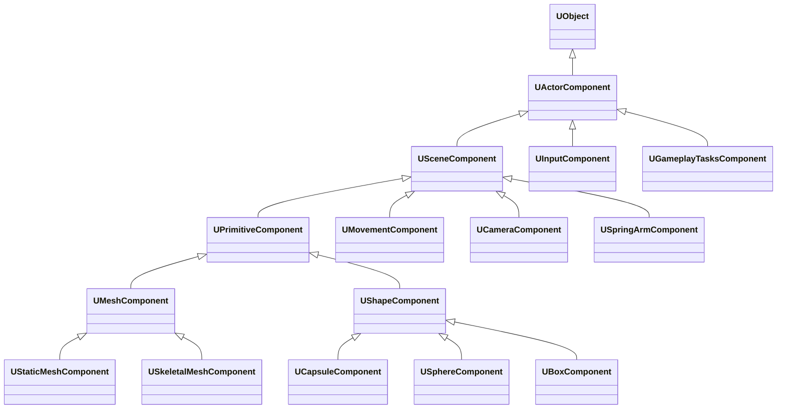

# コンポーネント モデル

- 上位: [[ActorComponent/01_overview]]
- 関連: [[a_actor_lifecycle]] | [[c_ticking]]
- ソース: `Engine/Source/Runtime/Engine/Classes/Components/ActorComponent.h`, `SceneComponent.h`, `Engine/Source/Runtime/Engine/Private/Components/ActorComponent.cpp`, `SceneComponent.cpp`

---

## 概要

UE5 の **コンポーネント モデル**は Actor の機能をモジュール化する仕組み。`UActorComponent`（Transform なし）と `USceneComponent`（Transform あり）を継承して機能を構築し、`AActor::AddComponent` または Blueprint でアタッチする。

---

## クラス階層



---

## コンポーネントの種類

| 基底クラス | Transform | Render | Collision | 用途 |
|-----------|:--------:|:------:|:---------:|------|
| `UActorComponent` | ✕ | ✕ | ✕ | 純ロジック（AI, 体力管理等） |
| `USceneComponent` | ◯ | ✕ | ✕ | 座標変換のみ（ソケット等） |
| `UPrimitiveComponent` | ◯ | ◯ | ◯ | メッシュ・形状（全描画物） |

---

## RegisterComponent フロー

```
AActor::RegisterAllComponents()                              [Actor.cpp]
  └─ for each OwnedComponent:
       └─ UActorComponent::RegisterComponentWithWorld(World) [ActorComponent.cpp]
            ├─ UActorComponent::OnRegister()                 ← 物理 / レンダリング登録
            ├─ if (bWantsInitializeComponent):
            │    └─ UActorComponent::InitializeComponent()   ← ゲームプレイ初期化
            └─ if (bAutoActivate):
                 └─ UActorComponent::Activate()
```

コンポーネントの **生成→登録** を両方しないと World に存在しない:

```cpp
// C++ でコンポーネントを動的に追加する場合
UMyComponent* Comp = NewObject<UMyComponent>(this);
Comp->RegisterComponent();           // World への登録
// または
AddComponent(Comp, false, FTransform::Identity);
```

---

## コンポーネント ライフサイクル

```
OnRegister()           ← World と物理エンジンへの登録（Render も開始）
InitializeComponent()  ← ゲームプレイ初期化（bWantsInitializeComponent=true 時）
BeginPlay()            ← Actor::BeginPlay() 後に呼ばれる
  ↓ 毎フレーム
TickComponent()        ← PrimaryComponentTick.bCanEverTick=true が必要
  ↓ プレイ終了
EndPlay()              ← Actor::EndPlay() 内で全コンポーネントに通知
UninitializeComponent()← InitializeComponent の逆
OnUnregister()         ← World / 物理エンジンから切り離し
```

---

## USceneComponent — アタッチとソケット

```cpp
class USceneComponent : public UActorComponent
{
    // 親コンポーネントへのアタッチ
    void AttachToComponent(
        USceneComponent* Parent,
        const FAttachmentTransformRules& Rules,
        FName SocketName = NAME_None
    );

    // 親から切り離し
    void DetachFromComponent(const FDetachmentTransformRules& Rules);

    // ソケット位置取得
    FVector  GetSocketLocation(FName SocketName) const;
    FRotator GetSocketRotation(FName SocketName) const;
    FTransform GetSocketTransform(FName SocketName) const;

    // ワールド Transform
    FVector  GetComponentLocation() const;
    FRotator GetComponentRotation() const;
    FTransform GetComponentTransform() const;

    // 相対 Transform (親基準)
    FVector  GetRelativeLocation() const;
    void     SetRelativeLocation(FVector NewLocation, ...);
};
```

### FAttachmentTransformRules

```cpp
// ワールド座標を保ったままアタッチ
Child->AttachToComponent(Parent, FAttachmentTransformRules::KeepWorldTransform);

// 相対座標を保ったままアタッチ
Child->AttachToComponent(Parent, FAttachmentTransformRules::KeepRelativeTransform);

// 親にスナップ（相対 Transform をリセット）
Child->AttachToComponent(Parent, FAttachmentTransformRules::SnapToTargetNotIncludingScale);
```

---

## RootComponent

`AActor` は Transform を直接持たず、`RootComponent`（`USceneComponent`）経由でワールド位置を保つ:

```cpp
// Actor の位置 = RootComponent の位置
GetActorLocation() == GetRootComponent()->GetComponentLocation()

// RootComponent を設定
RootComponent = CreateDefaultSubobject<USceneComponent>(TEXT("Root"));

// RootComponent に別コンポーネントをアタッチ
UStaticMeshComponent* Mesh = CreateDefaultSubobject<UStaticMeshComponent>(TEXT("Mesh"));
Mesh->SetupAttachment(RootComponent);
```

> `RootComponent` がない Actor は **ワールド Transform なし**。`GetActorLocation()` は Zero を返す。

---

## CreateDefaultSubobject（コンストラクタ内）

```cpp
AMyActor::AMyActor()
{
    // コンストラクタ内専用 — ゲームプレイ中は NewObject + RegisterComponent を使う
    CapsuleComp = CreateDefaultSubobject<UCapsuleComponent>(TEXT("CapsuleComp"));
    RootComponent = CapsuleComp;

    MeshComp = CreateDefaultSubobject<UStaticMeshComponent>(TEXT("MeshComp"));
    MeshComp->SetupAttachment(RootComponent);

    // ティック設定
    PrimaryActorTick.bCanEverTick = true;
}
```

`CreateDefaultSubobject` は **コンストラクタ内のみ** 有効。生成されたコンポーネントは CDO と共に登録され、`UPROPERTY` があれば BP でも編集可能。

---

## よくある設計

```cpp
// シンプルなコンポーネントの実装例
UCLASS(ClassGroup=(Custom), meta=(BlueprintSpawnableComponent))
class UHealthComponent : public UActorComponent
{
    GENERATED_BODY()

    float Health = 100.f;

public:
    UHealthComponent()
    {
        PrimaryComponentTick.bCanEverTick = false;   // Tick 不要なら false
        bWantsInitializeComponent = true;            // InitializeComponent を呼ぶ
    }

    virtual void InitializeComponent() override
    {
        Super::InitializeComponent();
        Health = 100.f;    // BeginPlay より早く呼ばれる
    }

    void TakeDamage(float Damage)
    {
        Health -= Damage;
        if (Health <= 0.f)
        {
            GetOwner()->Destroy();
        }
    }
};
```

---

## 関連ドキュメント

- [[a_actor_lifecycle]] — Actor 全体のライフサイクル
- [[c_ticking]] — PrimaryComponentTick / TickGroup
- [[Reference/ref_component_api]] — UActorComponent / USceneComponent API
