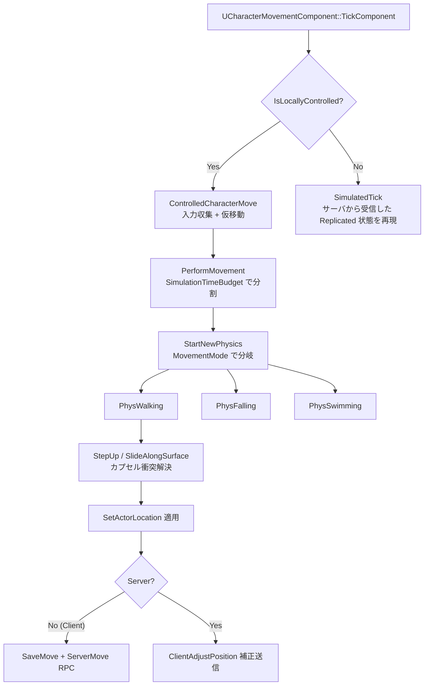

# CharacterMovement 概要

- 上位: [[../01_gameframework_overview]]
- 関連: [[Details/a_movement_modes]] | [[Details/b_cmc_networking]] | [[Details/c_root_motion]] | [[Details/d_physics_interaction]]
- ソース: `Engine/Source/Runtime/Engine/Classes/GameFramework/CharacterMovementComponent.h`, `Character.h`, `Engine/Source/Runtime/Engine/Private/Components/CharacterMovementComponent.cpp`, `Engine/Source/Runtime/Engine/Private/Character.cpp`

---

## 概要

`UCharacterMovementComponent`（以下 CMC）は **歩行・落下・泳ぎ・飛行・カスタム** を統一管理する強力な移動コンポーネント。`ACharacter` に標準装備され、**クライアント予測 + サーバ権威** のネットコード、ルートモーション、物理インタラクション（ステップアップ・斜面滑り）を全て担当する。

```
ACharacter
 ├─ UCharacterMovementComponent (CMC) ← 移動本体
 ├─ UCapsuleComponent (Root)          ← 衝突カプセル
 ├─ USkeletalMeshComponent (Mesh)     ← 描画/アニメ
 └─ APlayerController から入力受信
```

> CMC は **キャラ用に特化された MovementComponent**。他の Pawn は `UFloatingPawnMovement` などのシンプル版を使う。

---

## 移動モード（EMovementMode）

| モード | 説明 |
|--------|------|
| `MOVE_None` | 移動停止 |
| `MOVE_Walking` | 床と接触している（重力なし） |
| `MOVE_NavWalking` | NavMesh 上を移動（軽量） |
| `MOVE_Falling` | 空中（重力あり） |
| `MOVE_Swimming` | 水中（PhysicsVolume::bWaterVolume） |
| `MOVE_Flying` | 飛行（重力なし） |
| `MOVE_Custom` | プロジェクト独自（CustomMovementMode で枝分かれ） |

---

## 全体フロー（1 フレーム）



---

## ネット予測モデル

```
クライアント                              サーバ
   │                                        │
   │ PerformMovement (DeltaT=16ms)         │
   ├─ SaveMove (FSavedMove)                │
   ├─ ServerMove(...) RPC ─────────────────→ ServerMove_Implementation
   │                                       ├─ 同じ計算を実行
   │                                       └─ 結果を Replicated 状態に
   │                                       │
   │ ←─── ClientAdjustPosition (ズレ大)    │
   │                                       │
   ├─ ClientAckGoodMove (許容範囲)         │
   └─ Replay 残りの SavedMove で補正        │
```

クライアントは **送信済みだが未確認の SavedMove リスト** を保持し、サーバから補正が来たら過去状態にロールバックして全 SavedMove をリプレイする。これが「**スムーズな入力レスポンス + 権威ある最終位置**」を両立する仕組み。

---

## 主要クラス

```cpp
class UCharacterMovementComponent : public UPawnMovementComponent
{
    EMovementMode MovementMode;                    // 現在の移動モード
    uint8 CustomMovementMode;                      // MOVE_Custom 時の枝分かれ

    float MaxWalkSpeed;
    float JumpZVelocity;
    float GravityScale;
    float GroundFriction;
    float AirControl;

    // 床判定結果
    FFindFloorResult CurrentFloor;

    // RPC
    UFUNCTION(Server, Reliable, WithValidation)
    void ServerMove(float TimeStamp, FVector_NetQuantize10 InAccel, FVector_NetQuantize100 ClientLoc, ...);

    UFUNCTION(Client, Reliable)
    void ClientAdjustPosition(float TimeStamp, FVector NewLoc, FVector NewVel, UPrimitiveComponent* NewBase, ...);

    virtual void PerformMovement(float DeltaTime);
    virtual void PhysWalking(float deltaTime, int32 Iterations);
    virtual void PhysFalling(float deltaTime, int32 Iterations);
    virtual bool IsValidLandingSpot(const FVector& CapsuleLocation, const FHitResult& Hit) const;

    // RootMotion
    FRootMotionMovementParams RootMotionParams;
    void TickCharacterPose(float DeltaTime);
};

class ACharacter : public APawn
{
    UCapsuleComponent* CapsuleComponent;          // Root
    USkeletalMeshComponent* Mesh;
    UCharacterMovementComponent* CharacterMovement;

    virtual void Jump();
    virtual void StopJumping();
    virtual void Crouch(bool bClientSimulation = false);
    virtual void OnLanded(const FHitResult& Hit);

    // ジャンプ状態（複製）
    UPROPERTY(BlueprintReadOnly, Category=Character)
    bool bPressedJump;
};
```

---

## RootMotion

アニメーションのルートボーン移動を Capsule 移動に統合する仕組み。`AnimMontage` や `URootMotionSource` 経由で適用:

```cpp
// Montage によるルートモーション
ACharacter::PlayAnimMontage(Montage, PlayRate);
// → MeshComp が AnimRootMotion を抽出 → CMC が ApplyRootMotionToVelocity

// プログラム的なルートモーション ソース
auto Source = MakeShared<FRootMotionSource_ConstantForce>();
Source->Force = FVector(1000, 0, 0);
CMC->ApplyRootMotionSource(Source);
```

---

## サブシステム別ドキュメント

| ドキュメント | 内容 |
|------------|------|
| [[Details/a_movement_modes]] | Walking/Falling/Swimming/Flying/Custom |
| [[Details/b_cmc_networking]] | クライアント予測 / ServerMove / SavedMove |
| [[Details/c_root_motion]] | AnimMontage / RootMotionSource |
| [[Details/d_physics_interaction]] | StepUp / FloorCheck / SlideAlongSurface |
| [[Reference/ref_cmc_api]] | UCharacterMovementComponent API |
| [[Reference/ref_movement_flags]] | EMovementMode / CompressedFlags |

---

## 関連 CVar

| CVar | 説明 |
|------|------|
| `p.NetEnableMoveCombining` | ServerMove の結合（帯域削減） |
| `p.NetUseClientTimestampForReplicatedTransform` | クライアント時刻使用 |
| `p.MaxIterations` | 1 フレーム内の物理反復上限 |
| `p.AlwaysCheckFloor` | 毎フレーム床チェック強制 |
| `p.LedgeMovementBoostHeight` | 段差登り補正量 |

---

## コード実行フロー

### TickComponent → ネット予測

```
UCharacterMovementComponent::TickComponent(DeltaTime)
  ├─ (ローカル PC) PerformMovement()                ← ローカル物理実行
  │    └─ switch(MovementMode): PhysWalking / PhysFalling / ...
  └─ ReplicateMoveToServer()                        ← サーバーへ RPC

[Server]
ServerMove_PerformMovement() → ServerMoveHandleClientError()
  └─ (ズレ検出) ClientAdjustPosition() RPC

[Client]
ClientAdjustPosition() → ClientUpdatePositionAfterServerUpdate()
  └─ SavedMoves を Replay                          ← 位置補正後に再適用
```

### 関与クラス・関数

| クラス | 関数 | 役割 |
|--------|------|------|
| `UCharacterMovementComponent` | `PerformMovement()` | 移動物理のメインループ |
| `UCharacterMovementComponent` | `ReplicateMoveToServer()` | 入力 RPC の送信 |
| `UCharacterMovementComponent` | `ServerMoveHandleClientError()` | 位置誤差の判定 |
| `UCharacterMovementComponent` | `ClientAdjustPosition()` | クライアント補正 RPC |
| `UCharacterMovementComponent` | `ApplyRootMotionToVelocity()` | RootMotion 速度の適用 |

---

## 関連ドキュメント

- [[../01_gameframework_overview]] — GameFramework 全体
- [[../Controller/01_overview]] — 入力源の PlayerController
- [[../../Animation/01_animation_overview]] — RootMotion・AnimMontage
- [[../../Network/01_network_overview]] — RPC・レプリケーション
- [[../../Physics/01_physics_overview]] — カプセル衝突
