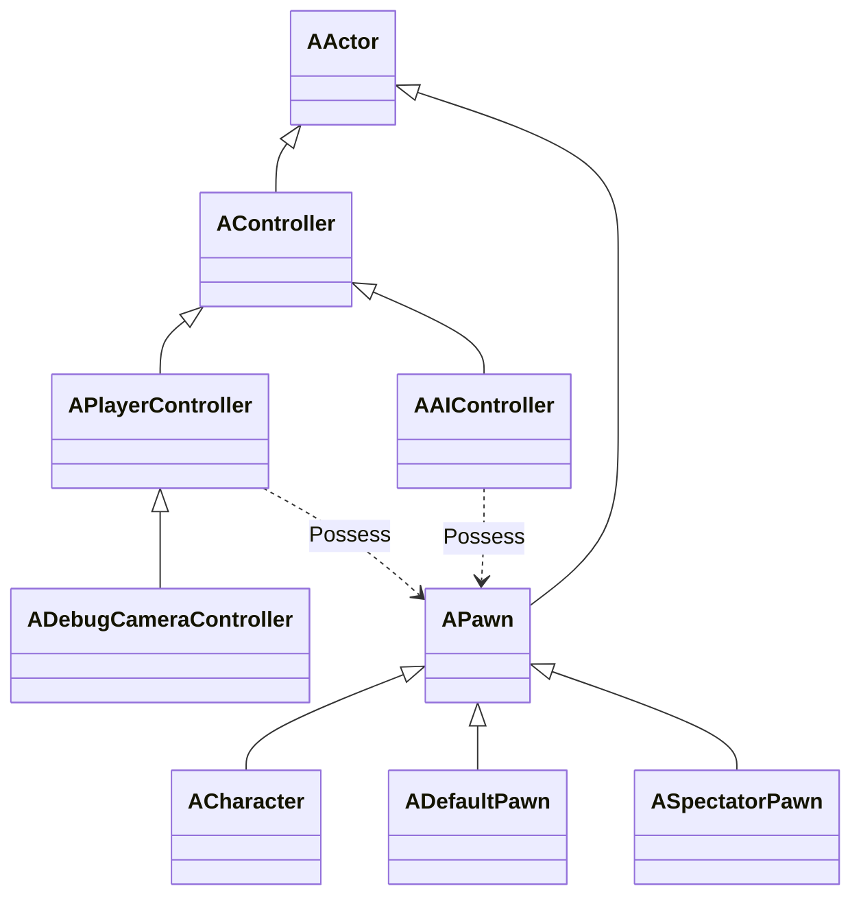
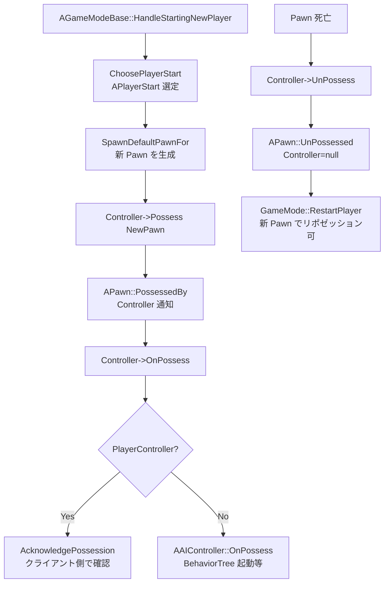

# Controller 概要

- 上位: [[../01_gameframework_overview]]
- 関連: [[Details/a_player_controller]] | [[Details/b_ai_controller]] | [[Details/c_possession]]
- ソース: `Engine/Source/Runtime/Engine/Classes/GameFramework/Controller.h`, `PlayerController.h`, `Pawn.h`, `Engine/Source/Runtime/Engine/Private/Controller.cpp`, `PlayerController.cpp`, `Pawn.cpp`

---

## 概要

`AController` は **Pawn を「憑依（Possess）」して操作する** エージェント。プレイヤーの入力や AI のロジックを Pawn に注入する分離設計:

```
AController (頭脳)  ─── Possess ──→  APawn (身体)
   │                                       │
   ├─ APlayerController (人間プレイヤー)    ├─ ACharacter
   │   ├─ UPlayerInput                    ├─ ADefaultPawn
   │   ├─ AHUD                            └─ ASpectatorPawn
   │   └─ APlayerCameraManager
   │
   └─ AAIController (AI)
       └─ BrainComponent (BehaviorTree)
```

> **重要**: `Pawn::EndPlay` で Controller は自動 UnPossess。Controller を残したまま新しい Pawn に Possess することで「死亡 → リスポーン」が表現できる。

---

## クラス階層



---

## ポゼッション フロー



---

## 主要クラス

```cpp
class AController : public AActor
{
    APawn* Pawn;                          // 憑依中の Pawn
    APlayerState* PlayerState;            // プレイヤー情報

    virtual void Possess(APawn* InPawn);
    virtual void UnPossess();
    virtual void OnPossess(APawn* InPawn);
    virtual void OnUnPossess();

    bool IsLocalController() const;       // 自端末のコントローラか
    APlayerState* GetPlayerState() const;
    APawn* GetPawn() const;
};

class APlayerController : public AController
{
    UPlayerInput* PlayerInput;            // 入力管理
    APlayerCameraManager* PlayerCameraManager;
    AHUD* MyHUD;
    UInputComponent* InputComponent;

    virtual void SetupInputComponent();   // 入力バインドのフック
    virtual void PlayerTick(float DeltaTime);
    virtual void ProcessPlayerInput(const float DeltaTime, const bool bGamePaused);

    // RPC
    UFUNCTION(Client, Reliable)
    void ClientSetHUD(TSubclassOf<AHUD> NewHUDClass);

    UFUNCTION(Server, Reliable, WithValidation)
    void ServerAcknowledgePossession(APawn* P);
};

class AAIController : public AController
{
    UBrainComponent* BrainComponent;     // BehaviorTree など
    UAIPerceptionComponent* PerceptionComponent;
    UPathFollowingComponent* PathFollowingComponent;

    virtual EPathFollowingRequestResult::Type MoveToActor(AActor* Goal, float AcceptanceRadius=5.f, ...);
    virtual bool RunBehaviorTree(UBehaviorTree* BTAsset);
};

class APawn : public AActor
{
    AController* Controller;              // 憑依中の Controller
    UInputComponent* InputComponent;

    virtual void PossessedBy(AController* NewController);
    virtual void UnPossessed();
    virtual void SetupPlayerInputComponent(UInputComponent* InInputComponent);
    virtual FVector GetMovementInputVector() const;

    bool IsLocallyControlled() const;
    bool IsPlayerControlled() const;
};
```

---

## 入力フロー（PlayerController）

```
APlayerController::PlayerTick
  └─ ProcessPlayerInput
       ├─ FInputKeyManager で生入力収集
       ├─ UPlayerInput::ProcessInputStack
       │    ├─ InputComponent[0] (Pawn)         ← Pawn::SetupPlayerInputComponent
       │    └─ InputComponent[1] (PlayerCtrl)   ← SetupInputComponent
       └─ EnhancedInput の場合は UEnhancedPlayerInput が処理
```

---

## サブシステム別ドキュメント

| ドキュメント | 内容 |
|------------|------|
| [[Details/a_player_controller]] | APlayerController / 入力 / HUD / カメラ |
| [[Details/b_ai_controller]] | AAIController / BrainComponent / RunBehaviorTree |
| [[Details/c_possession]] | Possess/UnPossess / ViewTarget / SpectatorPawn |
| [[Reference/ref_controller_api]] | APlayerController / AAIController / APawn API |

---

## 関連 CVar

| CVar | 説明 |
|------|------|
| `Input.bEnableControllerInputDebug` | 入力デバッグ |
| `g.TimeoutSeconds` | クライアント切断判定 |
| `net.PingExcludeFrameTime` | RTT 計算 |

---

## コード実行フロー

### Possess → 入力処理

```
AController::Possess(Pawn)                           [Controller.cpp]
  └─ APlayerController::OnPossess(Pawn)
       ├─ Pawn->PossessedBy(this)                   ← Owner・ネット権限設定
       ├─ ClientRestart(Pawn)                        ← クライアントへ RPC
       │    └─ Pawn->PawnClientRestart()
       │         └─ SetupPlayerInputComponent()     ← InputComponent 生成
       └─ ChangeState(NAME_Playing)

[毎フレーム – ローカル PC のみ]
APlayerController::PlayerTick()
  └─ ProcessPlayerInput()                            ← BindAxis デリゲート発火
       └─ Pawn::MoveForward(Val) → CMC::AddInputVector()
```

### 関与クラス・関数

| クラス | 関数 | 役割 |
|--------|------|------|
| `AController` | `Possess()` | Pawn との結合（サーバー権限） |
| `APlayerController` | `OnPossess()` | ClientRestart RPC 送信 |
| `APawn` | `SetupPlayerInputComponent()` | 入力バインドの設定 |
| `APlayerController` | `PlayerTick()` | 入力処理の毎フレーム更新 |
| `AAIController` | `RunBehaviorTree()` | BT の実行開始 |

---

## 関連ドキュメント

- [[../01_gameframework_overview]] — GameFramework 全体
- [[../GameModeState/01_overview]] — Controller を生成する GameMode
- [[../CharacterMovement/01_overview]] — Possess 対象の Character
- [[../../AI/01_ai_overview]] — AAIController と BehaviorTree
- [[../../Input/01_input_overview]] — EnhancedInput
