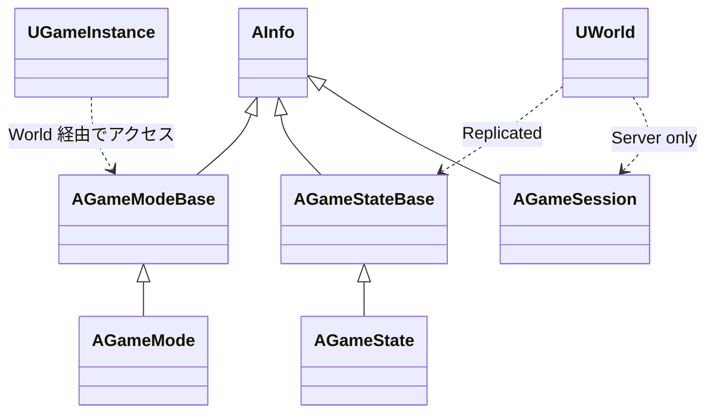
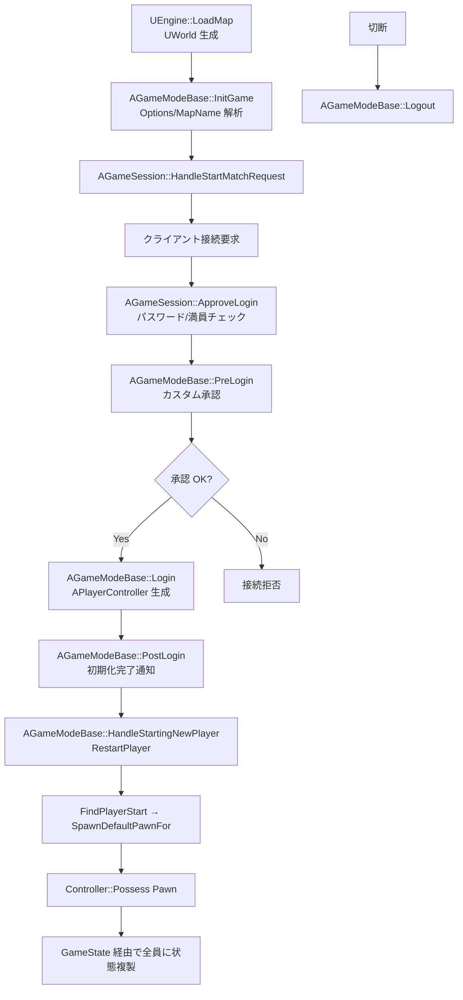

# GameModeState 概要

- 上位: [[../01_gameframework_overview]]
- 関連: [[Details/a_game_mode]] | [[Details/b_game_state]] | [[Details/c_game_session]]
- ソース: `Engine/Source/Runtime/Engine/Classes/GameFramework/GameModeBase.h`, `GameStateBase.h`, `GameSession.h`, `Engine/Source/Runtime/Engine/Private/GameModeBase.cpp`, `GameStateBase.cpp`, `GameSession.cpp`

---

## 概要

GameMode / GameState はゲームのルールと状態を分離する **権限分離パターン**:

| クラス | 配置 | 役割 |
|--------|------|------|
| `AGameModeBase` | **サーバのみ** | ルール・スポーン・ログイン承認（権限を持つ） |
| `AGameStateBase` | **全員に複製** | スコア・残り時間など共有データ |
| `AGameSession` | サーバのみ | 接続承認・OnlineSubsystem 連携 |
| `AGameMode` | サーバのみ | `AGameModeBase` + MatchState（待機/進行/終了） |
| `AGameState` | 全員に複製 | `AGameStateBase` + MatchState 複製 |

> **設計原則**: ロジックは `GameMode` に、共有データは `GameState` に。クライアントは `GameMode` を見られない（`GetGameMode()` は nullptr）。

---

## クラス階層



---

## 全体フロー（マルチプレイ ログイン）



---

## 主要クラス

```cpp
class AGameModeBase : public AInfo
{
    // Pawn / Controller / HUD のクラス指定
    TSubclassOf<APawn> DefaultPawnClass;
    TSubclassOf<APlayerController> PlayerControllerClass;
    TSubclassOf<AHUD> HUDClass;
    TSubclassOf<AGameStateBase> GameStateClass;
    TSubclassOf<APlayerState> PlayerStateClass;
    TSubclassOf<AGameSession> GameSessionClass;

    // ログインフロー
    virtual void InitGame(const FString& MapName, const FString& Options, FString& ErrorMessage);
    virtual void PreLogin(const FString& Options, const FString& Address, const FUniqueNetIdRepl& UniqueId, FString& ErrorMessage);
    virtual APlayerController* Login(UPlayer* NewPlayer, ENetRole InRemoteRole, const FString& Portal, const FString& Options, ...);
    virtual void PostLogin(APlayerController* NewPlayer);
    virtual void HandleStartingNewPlayer(APlayerController* NewPlayer);
    virtual AActor* ChoosePlayerStart(AController* Player);
    virtual APawn* SpawnDefaultPawnFor(AController* NewPlayer, AActor* StartSpot);
    virtual void Logout(AController* Exiting);
};

class AGameStateBase : public AInfo
{
    UPROPERTY(Replicated)
    TSubclassOf<AGameModeBase> GameModeClass;   // クライアント側で型を知る

    UPROPERTY(Replicated)
    TArray<APlayerState*> PlayerArray;          // 全プレイヤー一覧

    UPROPERTY(ReplicatedUsing=OnRep_ReplicatedHasBegunPlay)
    bool bReplicatedHasBegunPlay;

    virtual void HandleBeginPlay();             // 全 Actor::BeginPlay の起点
    virtual float GetServerWorldTimeSeconds() const;
};

class AGameMode : public AGameModeBase
{
    FName MatchState;                           // WaitingToStart / InProgress / WaitingPostMatch / LeavingMap
    void SetMatchState(FName NewState);
    virtual void HandleMatchHasStarted();
    virtual bool ReadyToStartMatch();
    virtual bool ReadyToEndMatch();
};
```

---

## MatchState（AGameMode 系）

```
WaitingToStart  → 全員揃うまで
   ↓ StartMatch()
InProgress      → 試合中（メイン）
   ↓ EndMatch()
WaitingPostMatch → リザルト表示
   ↓ RestartGame() / ServerTravel()
LeavingMap      → マップ切替
```

---

## サブシステム別ドキュメント

| ドキュメント | 内容 |
|------------|------|
| [[Details/a_game_mode]] | InitGame / Login / HandleStartingNewPlayer / Logout |
| [[Details/b_game_state]] | レプリケーション / MatchState / PlayerArray |
| [[Details/c_game_session]] | ApproveLogin / OnlineSubsystem 連携 |
| [[Reference/ref_gamemode_api]] | AGameModeBase / AGameStateBase API |

---

## 関連 CVar

| CVar | 説明 |
|------|------|
| `net.MaxConstructedPartialBunchSizeBytes` | レプリケーション ペイロード上限 |
| `gs.FreezeAtPosition` | サーバ移動凍結デバッグ |
| `g.TimeBetweenPurgingPendingKillObjects` | GC タイミング |

---

## 関連ドキュメント

- [[../01_gameframework_overview]] — GameFramework 全体
- [[../Controller/01_overview]] — PlayerController（Login 経由生成）
- [[../../Network/01_network_overview]] — レプリケーション基盤
