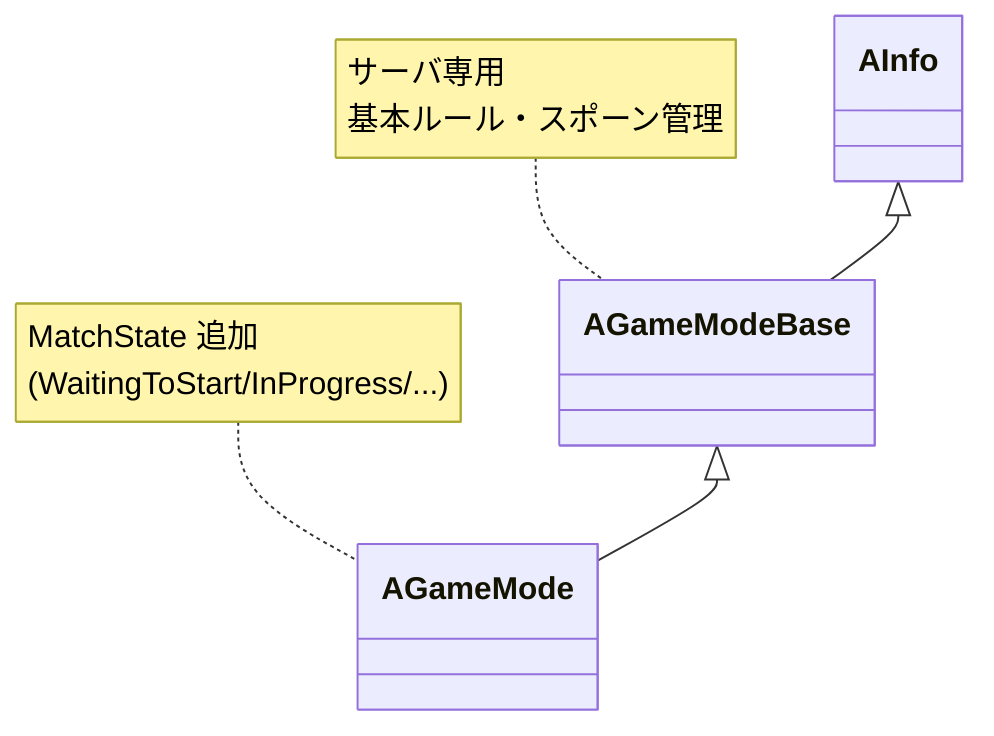

# AGameModeBase — ゲームモード

- 上位: [[GameModeState/01_overview]]
- 関連: [[b_game_state]] | [[c_game_session]]
- ソース: `Engine/Source/Runtime/Engine/Classes/GameFramework/GameModeBase.h`, `GameMode.h`, `Engine/Source/Runtime/Engine/Private/GameModeBase.cpp`, `GameMode.cpp`

---

## 概要

`AGameModeBase` は **サーバ専用** のゲームルール管理クラス。プレイヤーの接続承認・Pawn スポーン・ゲーム終了条件を担当し、クライアントには存在しない。`AGameMode` はこれを継承し、MatchState（試合フェーズ）を追加した標準形。

> クライアントから `GetWorld()->GetAuthGameMode()` は `nullptr` を返す。共有データは `AGameStateBase` に置く。

---

## クラス階層



---

## 主要クラス構造

```cpp
class AGameModeBase : public AInfo
{
    // スポーン対象クラスの設定
    UPROPERTY(EditAnywhere, BlueprintReadOnly, Category=Classes)
    TSubclassOf<APawn>              DefaultPawnClass;

    UPROPERTY(EditAnywhere, BlueprintReadOnly, Category=Classes)
    TSubclassOf<APlayerController>  PlayerControllerClass;

    UPROPERTY(EditAnywhere, BlueprintReadOnly, Category=Classes)
    TSubclassOf<AHUD>               HUDClass;

    UPROPERTY(EditAnywhere, BlueprintReadOnly, Category=Classes)
    TSubclassOf<AGameStateBase>     GameStateClass;

    UPROPERTY(EditAnywhere, BlueprintReadOnly, Category=Classes)
    TSubclassOf<APlayerState>       PlayerStateClass;

    UPROPERTY(EditAnywhere, BlueprintReadOnly, Category=Classes)
    TSubclassOf<AGameSession>       GameSessionClass;

    // ゲームオプション（URL ?key=value 形式）
    UPROPERTY(BlueprintReadOnly, Category=GameMode)
    FString OptionsString;

    // ─── ライフサイクル ──────────────────────────────────────────
    virtual void InitGame(const FString& MapName, const FString& Options, FString& ErrorMessage);
    virtual void InitGameState();       // GameState Actor を生成・初期化

    // ─── ログインフロー ─────────────────────────────────────────
    virtual void PreLogin(const FString& Options, const FString& Address,
                           const FUniqueNetIdRepl& UniqueId, FString& ErrorMessage);
    virtual APlayerController* Login(UPlayer* NewPlayer, ENetRole InRemoteRole,
                                      const FString& Portal, const FString& Options, ...);
    virtual void PostLogin(APlayerController* NewPlayer);
    virtual void HandleStartingNewPlayer(APlayerController* NewPlayer);

    // ─── スポーン ───────────────────────────────────────────────
    virtual AActor* ChoosePlayerStart(AController* Player);
    virtual APawn*  SpawnDefaultPawnFor(AController* NewPlayer, AActor* StartSpot);
    virtual void    RestartPlayer(AController* NewPlayer);

    // ─── ログアウト ─────────────────────────────────────────────
    virtual void Logout(AController* Exiting);
};
```

---

## ログインフロー（詳細）

```
クライアント接続要求
  │
  ▼
AGameSession::ApproveLogin()                  [GameSession.cpp]
  └─ パスワード・満員チェック
  │
  ▼
AGameModeBase::PreLogin()                     [GameModeBase.cpp]
  └─ ErrorMessage にセットするとログイン拒否
     （カスタム承認ロジックをここに実装）
  │
  ▼
AGameModeBase::Login()                        [GameModeBase.cpp]
  ├─ PlayerControllerClass から APlayerController 生成
  ├─ PlayerState を GameState::PlayerArray に追加
  └─ return NewPlayerController
  │
  ▼
AGameModeBase::PostLogin()                    [GameModeBase.cpp]
  ├─ HUD クラス送信（ClientSetHUD RPC）
  ├─ 既存データの同期
  └─ HandleStartingNewPlayer 呼出
  │
  ▼
AGameModeBase::HandleStartingNewPlayer()      [GameModeBase.cpp]
  └─ RestartPlayer(NewPlayer)
       ├─ ChoosePlayerStart() → APlayerStart を選択
       ├─ SpawnDefaultPawnFor() → DefaultPawnClass を生成
       └─ Controller->Possess(NewPawn)
```

---

## URL オプションの解析

ゲームに URL 引数（`?maxplayers=16?spectators=2`）を渡し、`InitGame` / `Login` で解析:

```cpp
void AMyGameMode::InitGame(const FString& MapName, const FString& Options, FString& ErrorMessage)
{
    Super::InitGame(MapName, Options, ErrorMessage);

    // "?maxplayers=16" → 16
    MaxPlayers = UGameplayStatics::GetIntOption(Options, TEXT("maxplayers"), 8);

    // "?spectators=true" → bool
    bool bAllowSpectators = UGameplayStatics::HasOption(Options, TEXT("spectators"));

    // "?gametype=deathmatch" → "deathmatch"
    FString GameType = UGameplayStatics::ParseOption(Options, TEXT("gametype"));
}
```

---

## AGameMode — MatchState

`AGameMode` は `AGameModeBase` に試合フェーズ管理を追加:

```cpp
// MatchState 定数（FName）
namespace MatchState
{
    const FName WaitingToStart  = FName("WaitingToStart");   // 開始前
    const FName InProgress      = FName("InProgress");        // 試合中
    const FName WaitingPostMatch= FName("WaitingPostMatch");  // 終了後
    const FName LeavingMap      = FName("LeavingMap");        // マップ遷移中
    const FName Aborted         = FName("Aborted");           // 中断
}

class AGameMode : public AGameModeBase
{
    FName MatchState;

    // 状態遷移（全て仮想関数）
    virtual void SetMatchState(FName NewState);   // 状態変更
    virtual void HandleMatchIsWaitingToStart();
    virtual bool ReadyToStartMatch();             // true になると WaitingToStart → InProgress
    virtual void HandleMatchHasStarted();
    virtual bool ReadyToEndMatch();               // true になると InProgress → WaitingPostMatch
    virtual void HandleMatchHasEnded();
    virtual void HandleLeavingMap();

    // 便利関数
    bool HasMatchStarted() const;
    bool IsMatchInProgress() const;
    bool HasMatchEnded() const;
    void StartMatch();   // WaitingToStart → InProgress を強制
    void EndMatch();     // InProgress → WaitingPostMatch を強制
    void RestartGame();  // マップをリロード
};
```

---

## カスタム GameMode の実装例

```cpp
// AMyGameMode.h
UCLASS()
class AMyGameMode : public AGameMode
{
    GENERATED_BODY()
    int32 MaxKills = 10;

public:
    AMyGameMode();

    virtual void PostLogin(APlayerController* NewPlayer) override;
    virtual bool ReadyToEndMatch() override;
    virtual void HandleMatchHasEnded() override;

    void OnPlayerKill(APlayerController* Killer);
};

// AMyGameMode.cpp
AMyGameMode::AMyGameMode()
{
    DefaultPawnClass = AMyCharacter::StaticClass();
    PlayerControllerClass = AMyPlayerController::StaticClass();
    PlayerStateClass = AMyPlayerState::StaticClass();
    GameStateClass = AMyGameState::StaticClass();
}

bool AMyGameMode::ReadyToEndMatch()
{
    // 誰かが MaxKills に達したら試合終了
    for (APlayerState* PS : GameState->PlayerArray)
    {
        if (Cast<AMyPlayerState>(PS)->Kills >= MaxKills)
        {
            return true;
        }
    }
    return false;
}
```

---

## 関連 CVar

| CVar | 説明 |
|------|------|
| `net.MaxPlayersOverride` | 最大プレイヤー数上書き |
| `game.MaxSpectators` | 最大観戦者数 |
| `net.AllowAsyncLoading` | 非同期ロード許可 |

---

## コード実行フロー

### プレイヤーログインフロー

```
[新規接続]
UNetDriver::NotifyAcceptingConnection()              [NetDriver.cpp]
  └─ AGameSession::ApproveLogin()                   ← 満員・パスワードチェック
       └─ AGameModeBase::PreLogin()                 [GameModeBase.cpp]
            └─ ErrorMessage.IsEmpty() → 承認

AGameModeBase::Login()                              [GameModeBase.cpp]
  ├─ PlayerControllerClass からPC 生成
  └─ return NewPlayerController

AGameModeBase::PostLogin(NewPC)
  ├─ ClientSetHUD(HUDClass) RPC
  ├─ GameState 同期
  └─ HandleStartingNewPlayer(NewPC)
       └─ RestartPlayer(NewPC)
            ├─ ChoosePlayerStart()                  ← APlayerStart を選択
            ├─ SpawnDefaultPawnFor()                ← DefaultPawnClass をスポーン
            └─ Controller->Possess(NewPawn)
```

### MatchState 遷移（AGameMode）

```
WaitingToStart
  └─ (毎フレーム) ReadyToStartMatch() == true
       └─ SetMatchState("InProgress")
            └─ HandleMatchHasStarted()

InProgress
  └─ (毎フレーム) ReadyToEndMatch() == true
       └─ SetMatchState("WaitingPostMatch")
            └─ HandleMatchHasEnded()
```

### 関与クラス・関数

| クラス | 関数 | 役割 |
|--------|------|------|
| `AGameSession` | `ApproveLogin()` | 接続の最初の承認判定 |
| `AGameModeBase` | `PreLogin()` | カスタム承認ロジック |
| `AGameModeBase` | `Login()` | PlayerController 生成 |
| `AGameModeBase` | `PostLogin()` | HUD 送信・スポーン開始 |
| `AGameModeBase` | `RestartPlayer()` | スポーン〜Possess の一連処理 |
| `AGameMode` | `ReadyToStartMatch()` | WaitingToStart → InProgress 条件 |
| `AGameMode` | `SetMatchState()` | 状態変更と Handler 呼び出し |

---

## 関連ドキュメント

- [[b_game_state]] — 全プレイヤーに複製されるゲーム状態
- [[c_game_session]] — 接続承認・OnlineSubsystem 連携
- [[../Controller/01_overview]] — PostLogin で生成される PlayerController
- [[Reference/ref_gamemode_api]] — AGameModeBase / AGameMode API
