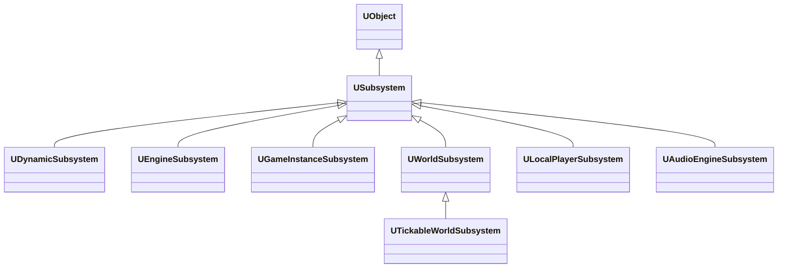
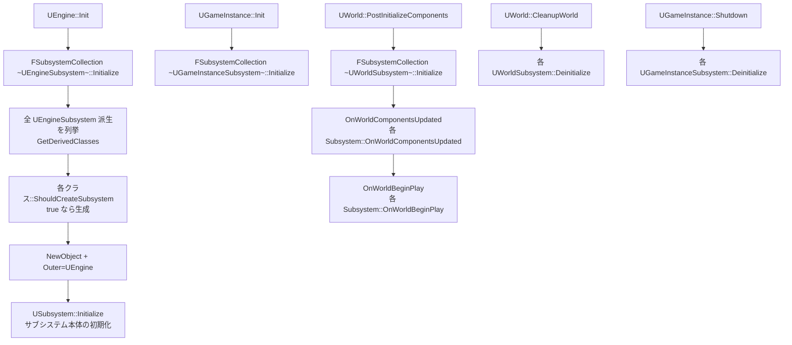

# Subsystems 概要

- 上位: [[../01_gameframework_overview]]
- 関連: [[Details/a_subsystem_types]] | [[Details/b_subsystem_lifecycle]] | [[Details/c_tickable_subsystem]]
- ソース: `Engine/Source/Runtime/Engine/Public/Subsystems/Subsystem.h`, `EngineSubsystem.h`, `GameInstanceSubsystem.h`, `WorldSubsystem.h`, `LocalPlayerSubsystem.h`, `SubsystemCollection.h`, `Engine/Source/Runtime/Engine/Private/Subsystems/`

---

## 概要

UE5 の Subsystem は **「特定スコープの寿命に紐づく自動生成シングルトン」** を提供する仕組み。`UGameInstance` / `UWorld` / `ULocalPlayer` / `UEngine` に紐づき、対応オブジェクトの生成時に自動 `Initialize`・破棄時に自動 `Deinitialize` される。

旧来の自前シングルトンや `UGameSingleton` を置き換える、UE5 推奨パターン。

```
UEngine        ─ UEngineSubsystem        (アプリ全体・1個)
UGameInstance  ─ UGameInstanceSubsystem  (ゲーム全体・1個)
UWorld         ─ UWorldSubsystem         (ワールド毎・1個)
ULocalPlayer   ─ ULocalPlayerSubsystem   (画面分割の各プレイヤー毎)
```

---

## クラス階層



---

## 4 系統サブシステム

| 種類 | スコープ | ライフサイクル | 主な用途 |
|------|---------|--------------|---------|
| `UEngineSubsystem` | `UEngine` | エンジン起動〜終了 | エディタ拡張、グローバル管理 |
| `UGameInstanceSubsystem` | `UGameInstance` | アプリ起動〜終了 | セーブデータ、オンライン、設定 |
| `UWorldSubsystem` | `UWorld` | LoadMap〜次の LoadMap | レベル状態、AI マネージャ、ストリーミング |
| `ULocalPlayerSubsystem` | `ULocalPlayer` | プレイヤー追加〜削除 | プレイヤー UI 状態、入力モード |

---

## ライフサイクル フロー



---

## 主要クラス

```cpp
class USubsystem : public UObject
{
public:
    virtual void Initialize(FSubsystemCollectionBase& Collection);
    virtual void Deinitialize();

    virtual bool ShouldCreateSubsystem(UObject* Outer) const { return true; }
};

class UGameInstanceSubsystem : public USubsystem
{
public:
    UGameInstance* GetGameInstance() const;
    UWorld* GetWorld() const override;
};

class UWorldSubsystem : public USubsystem
{
public:
    UWorld* GetWorld() const override;
    virtual void OnWorldComponentsUpdated(UWorld& World) {}
    virtual void OnWorldBeginPlay(UWorld& InWorld) {}
    virtual bool DoesSupportWorldType(EWorldType::Type WorldType) const;
};

class UTickableWorldSubsystem : public UWorldSubsystem, public FTickableGameObject
{
public:
    virtual void Tick(float DeltaTime) override;
    virtual TStatId GetStatId() const override = 0;
};
```

---

## 取得方法

```cpp
// GameInstance スコープ
UMyGISubsystem* GIS = GetGameInstance()->GetSubsystem<UMyGISubsystem>();
UMyGISubsystem* GIS2 = UGameInstance::GetSubsystem<UMyGISubsystem>(GameInstance);

// World スコープ
UMyWorldSubsystem* WS = World->GetSubsystem<UMyWorldSubsystem>();
UMyWorldSubsystem* WS2 = UWorld::GetSubsystem<UMyWorldSubsystem>(World);

// LocalPlayer スコープ
UMyLPSubsystem* LPS = LocalPlayer->GetSubsystem<UMyLPSubsystem>();

// Engine スコープ
UMyEngineSubsystem* ES = GEngine->GetEngineSubsystem<UMyEngineSubsystem>();

// Blueprint からは USubsystemBlueprintLibrary 経由
```

---

## ShouldCreateSubsystem の使い分け

```cpp
// PIE エディタでは作らない例
bool UMySubsystem::ShouldCreateSubsystem(UObject* Outer) const
{
    if (UWorld* World = Cast<UWorld>(Outer))
    {
        return World->WorldType != EWorldType::Editor;
    }
    return Super::ShouldCreateSubsystem(Outer);
}

// 同じ系統に複数派生がある場合、1つだけ生成
bool UMySpecificSubsystem::ShouldCreateSubsystem(UObject* Outer) const
{
    TArray<UClass*> ChildClasses;
    GetDerivedClasses(GetClass(), ChildClasses, false);
    if (ChildClasses.Num() > 0) return false;     // 派生クラスを優先
    return true;
}
```

---

## サブシステム別ドキュメント

| ドキュメント | 内容 |
|------------|------|
| [[Details/a_subsystem_types]] | 4 系統の Subsystem 種類と使い分け |
| [[Details/b_subsystem_lifecycle]] | Initialize/Deinitialize/ShouldCreateSubsystem |
| [[Details/c_tickable_subsystem]] | UTickableWorldSubsystem / FTickableGameObject |
| [[Reference/ref_subsystem_api]] | USubsystem / 各派生 / FSubsystemCollection API |

---

## 関連 CVar

| CVar | 説明 |
|------|------|
| `gc.MaxObjectsNotConsideredByGC` | サブシステム数に影響 |

---

## コード実行フロー

### Outer 生成 → Subsystem Initialize → Tick

```
UGameInstance::Init()
  └─ SubsystemCollection.Initialize(this)           [SubsystemCollection.cpp]
       └─ for each SubsystemClass:
            ├─ CDO->ShouldCreateSubsystem() → false なら skip
            └─ NewObject<USubsystem>()
                 └─ Subsystem->Initialize(Collection)

UWorld 生成
  └─ SubsystemCollection.Initialize(World)
       └─ WorldSubsystem->Initialize()
  └─ WorldSubsystem->PostInitialize()               ← 全 WS 初期化後

[毎フレーム]
UWorld::Tick() → FTickableGameObject::TickObjects()
  └─ UTickableWorldSubsystem::Tick(DeltaTime)       ← bInitialized == true の時
```

### 関与クラス・関数

| クラス | 関数 | 役割 |
|--------|------|------|
| `FSubsystemCollectionBase` | `Initialize()` | 全 Subsystem の生成・初期化 |
| `USubsystem` | `ShouldCreateSubsystem()` | 生成条件の判定（CDO 呼び出し） |
| `USubsystem` | `Initialize()` | ゲームロジック初期化 |
| `FSubsystemCollectionBase` | `InitializeDependency()` | 依存 Subsystem の先行初期化 |
| `UTickableWorldSubsystem` | `Tick()` | 毎フレーム更新 |

---

## 関連ドキュメント

- [[../01_gameframework_overview]] — GameFramework 全体
- [[../GameModeState/01_overview]] — UGameInstance（GameInstanceSubsystem の親）
- [[../../Core/UObject/01_overview]] — USubsystem の基底
