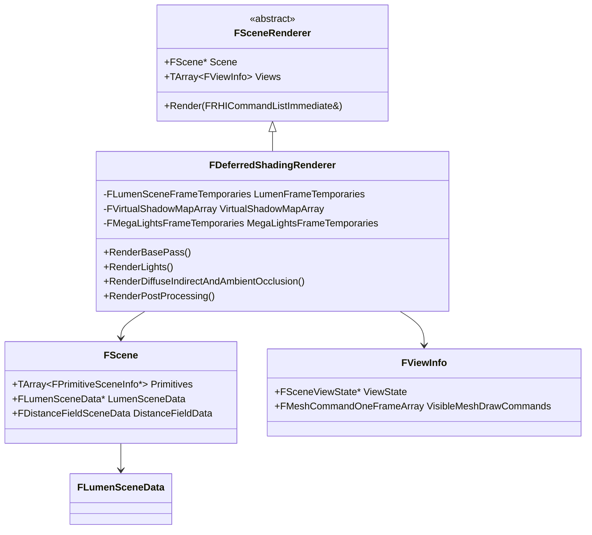

# UE5 レンダリングシステム概要

- 取得日: 2026-04-05
- 対象: `D:\UnrealEngine\Engine\Source\Runtime\Renderer\`
- 上位: [[00_engine_overview]]
- 下位: [[02_lumen_overview]] | [[03_nanite_overview]] | [[04_vsm_overview]] | [[05_postprocess_overview]] | [[06_megalights_overview]] | [[07_raytracing_overview]] | [[08_substrate_overview]] | [[09_gpuscene_overview]] | [[10_rdg_overview]] | [[11_mpp_overview]]
- Details: [[a_deferred_renderer]] | [[b_scene]] | [[c_view]] | [[d_visibility]]
- Reference: [[ref_deferred_shading_renderer]] | [[ref_scene_renderer]] | [[ref_scene]] | [[ref_view_info]]

---

## アーキテクチャ全体像

UE5 のレンダリングは **Deferred Shading（遅延シェーディング）** を基本とし、  
その上に Nanite・Lumen・Virtual Shadow Maps 等の次世代機能が積み重なっている。

```
┌─────────────────────────────────────────────────────────────┐
│                  FDeferredShadingRenderer                    │  ← メインオーケストレーター
│   (Private/DeferredShadingRenderer.h/cpp)                   │
└──────────────┬──────────────────────────────────────────────┘
               │ 各パスを呼び出す
   ┌───────────┼────────────────────────────────────────┐
   ▼           ▼           ▼           ▼           ▼    ▼
Nanite      Lumen    VirtualSMaps  PostProcess  Shadow  GBuffer
(Geometry)  (GI/Ref) (ShadowMap)  (PP)         (Ray)   (Base)
```

---

## 主要クラス / モジュール関係図（Mermaid）



---

## 1. Nanite（仮想化ジオメトリ）

### 概要
- **何をするか**: メッシュを自動的に BVH クラスタに分解し、画面上のピクセル数に応じた LOD をGPU側で自動選択してラスタライズする
- **メリット**: アーティストが手動LODを作る必要がなくなり、数十億ポリゴンをリアルタイム描画可能
- **対象外**: スケルタルメッシュ（アニメーション付き）、半透明メッシュ → 通常パスにフォールバック

### ファイル構成
| ファイル | 役割 |
|---------|------|
| `Nanite/NaniteShared.h` | 共通データ構造（`FPackedView`, `FPackedViewArray`）|
| `Nanite/NaniteCullRaster.h/cpp` | GPUカリング＋ラスタライズパイプライン |
| `Nanite/NaniteShading.h/cpp` | マテリアルシェーディング（GBuffer書き込み）|
| `Nanite/NaniteDrawList.h/cpp` | DrawCallリスト管理 |
| `Nanite/NaniteVisibility.h/cpp` | Visibility判定（HZB利用）|
| `Nanite/NaniteStreamOut.h/cpp` | ストリーミングアウト処理 |

### パイプライン（概略）
```
1. CullRaster（GPU Compute）
   ├── BVHクラスタ単位で視錐台カリング
   ├── HZB（Hierarchical Z Buffer）によるオクルージョンカリング
   └── 小三角形 → ソフトウェアラスタライザ（Compute）
       大三角形 → ハードウェアラスタライザ

2. VisBuffer 生成
   └── RWTexture2D<uint64>: 上位32bit=InstanceID, 下位32bit=TriangleID

3. MaterialResolve（NaniteShading）
   └── VisBufferから逆引きしてGBufferへシェーディング結果を書き込む
```

### 主要enum
```cpp
enum class ERasterScheduling : uint8 {
    HardwareOnly = 0,           // 全て固定機能HW
    HardwareThenSoftware = 1,   // 大→HW、小→SW(Compute)
    HardwareAndSoftwareOverlap = 2, // 両者をオーバーラップ実行
};

enum class EPipeline : uint8 {
    Primary,    // 通常描画
    Shadows,    // シャドウマップ
    Lumen,      // Lumen用ラスタライズ
    HitProxy,   // エディタ選択判定
    MaterialCache,
};
```

---

## 2. Lumen（動的グローバルイルミネーション）

### 概要
- **何をするか**: 間接照明（GI）と反射をリアルタイムで計算する
- **手法**: シーンをCard（平面パッチ）に分解 → Surface Cache に焼き付け → Screen Space + SDF / HW Ray Tracing でトレース
- **2大機能**: `DiffuseGI`（拡散間接光）と `Reflections`（反射）

### ファイル構成
| ファイル | 役割 |
|---------|------|
| `Lumen/LumenScene.cpp` | LumenSceneの更新（カード登録・削除）|
| `Lumen/LumenSceneData.h` | `FLumenSceneData`, `FLumenCardScene`（シェーダーバインド用）|
| `Lumen/LumenSurfaceCache.cpp` | Surface Cache（アルベド/法線/自発光アトラス）管理 |
| `Lumen/LumenDiffuseIndirect.cpp` | Screen Probe ベースの拡散GI |
| `Lumen/LumenReflections.cpp` | 反射トレース |
| `Lumen/LumenRadianceCache.cpp` | Radiance Cache（遠距離GI用キャッシュ）|
| `Lumen/LumenSceneDirectLighting.cpp` | Lumen Scene への直接光注入 |

### Surface Cache 構造（`FLumenCardScene`）
```cpp
// シェーダーに渡すGlobal Shader Parameterの構造体（BEGIN_GLOBAL_SHADER_PARAMETER_STRUCT マクロ）
// SHADER_PARAMETER_RDG_TEXTURE でRDGテクスチャをバインドしている
Texture2D AlbedoAtlas    // 各カードのアルベド
Texture2D NormalAtlas    // 法線
Texture2D EmissiveAtlas  // 自発光
Texture2D DepthAtlas     // 深度
```

### 定数（`Lumen.h`）
```cpp
constexpr uint32 PhysicalPageSize = 128;   // 物理ページのテクセルサイズ
constexpr uint32 VirtualPageSize  = 127;   // 0.5テクセルのボーダー込み
constexpr uint32 MinCardResolution = 8;
constexpr float  MaxTraceDistance = 0.5f * UE_OLD_WORLD_MAX;
```

### トレース方式の選択（`ETracingPermutation`）
```cpp
enum class ETracingPermutation {
    Cards,              // Surface Cache のみ（最速・近距離）
    VoxelsAfterCards,   // Cards + Voxel SDF（中距離フォールバック）
    Voxels,             // Voxel SDF のみ
};
```

### 有効化条件チェック関数
```cpp
// これらの関数がfalseを返すとLumenは無効化される
bool ShouldRenderLumenDiffuseGI(const FScene*, const FSceneView&, ...);
bool ShouldRenderLumenReflections(const FSceneView&, ...);
bool ShouldRenderLumenDirectLighting(const FScene*, const FSceneView&);
```

---

## 3. Virtual Shadow Maps（仮想シャドウマップ）

### 概要
- **何をするか**: 非常に高解像度の仮想シャドウマップ（16K×16K相当）をページング方式で管理する
- **メリット**: 必要な部分だけ実際にレンダリング → メモリ効率◎、Naniteと連携してシャドウ品質を大幅向上

### ファイル構成
| ファイル                                                   | 役割                      |
| ------------------------------------------------------ | ----------------------- |
| `VirtualShadowMaps/VirtualShadowMapArray.h/cpp`        | VMSアレイ全体の管理・描画          |
| `VirtualShadowMaps/VirtualShadowMapCacheManager.h/cpp` | フレーム間キャッシュ（静的オブジェクト再利用） |
| `VirtualShadowMaps/VirtualShadowMapClipmap.h/cpp`      | ディレクショナルライト用クリップマップ     |
| `VirtualShadowMaps/VirtualShadowMapProjection.h/cpp`   | シャドウ投影パス                |

### Naniteとの統合
```cpp
// NaniteでVSM用にラスタライズする際のデータ構造
struct FNaniteVirtualShadowMapRenderPass {
    TArray<FProjectedShadowInfo*> Shadows;
    Nanite::FPackedViewArray*     VirtualShadowMapViews;  // Naniteのビュー配列として渡す
};
```

---

## 4. その他主要サブシステム

### PostProcess（後処理）
- `Private/PostProcess/` 以下に約30ファイル
- TAA/TSR（テンポラルアンチエイリアス）、Bloom、Exposure、Depth of Field、Tonemapper 等
- `FTemporalUpscaler`（TSR: Temporal Super Resolution）が `TemporalUpscaler.h` で公開API化されている

### MegaLights
- `Private/MegaLights/` に存在
- 多数のダイナミックライトを GPU Driven に処理する機能（UE5.4〜）
- `FMegaLightsFrameTemporaries` が `DeferredShadingRenderer` に保持される

### Ray Tracing
- `Private/RayTracing/` 以下
- Lumen の HW Ray Tracing バックエンドとして使用
- `RHI_RAYTRACING` マクロで DXR/VK_RT 対応時のみコンパイル

### Substrate（マテリアルモデル）
- `Private/Substrate/` 以下
- 旧 Shading Models を置き換える新マテリアルレイヤーシステム（UE5.3〜 実験的）

### GPUScene
- `Private/GPUScene.h/cpp`
- シーン全プリミティブのインスタンスデータをGPUバッファに保持
- Nanite / Lumen / VSM が共通してこのバッファを参照する

---

## レンダリングフレームの流れ（概略）

```
FDeferredShadingRenderer::Render()
  │
  ├─ 1. PrePass（深度のみ先に描画）
  │     └─ DepthRendering.cpp
  │
  ├─ 2. Nanite CullRaster
  │     └─ VisBuffer64 生成
  │
  ├─ 3. GBuffer Pass（Base Pass）
  │     ├─ Nanite Material Shading → GBuffer
  │     └─ 非Naniteメッシュ → BasePassRendering.cpp
  │
  ├─ 4. Lumen Scene 更新
  │     └─ Surface Cache再キャプチャ（変化した部分のみ）
  │
  ├─ 5. Virtual Shadow Maps
  │     └─ Nanite / 通常メッシュのシャドウラスタライズ
  │
  ├─ 6. Lighting（Light Pass）
  │     ├─ Direct Lighting（LightRendering.cpp）
  │     ├─ MegaLights（多数ダイナミックライト）
  │     └─ Lumen GI / Reflections
  │
  ├─ 7. Translucency（半透明）
  │
  └─ 8. PostProcess
        ├─ TAA / TSR
        ├─ Bloom / Exposure / DoF
        └─ Tonemap → Final Output
```

---

## 解析優先度メモ

| 次に読むべきファイル | 目的 |
|-------------------|------|
| `Nanite/NaniteCullRaster.cpp` | GPU Driven カリングの実装詳細 |
| `Lumen/LumenDiffuseIndirect.cpp` | Screen Probe GIの実装 |
| `DeferredShadingRenderer.cpp` | Render() の全体フロー確認 |
| `GPUScene.cpp` | GPUドリブンなインスタンス管理 |
| `PostProcess/TemporalAA.cpp` | TAA/TSR の差異 |

---

## コード実行フロー

### エントリポイント

```
FSceneRenderBuilder::Execute()                         SceneRenderBuilder.cpp
  │
  └─ [レンダーコマンドキュー内]
      │
      ├─ FRDGBuilder GraphBuilder(RHICmdList, ...)       SceneRenderBuilder.cpp:872
      │
      ├─ FSceneRenderer::CreateSceneRenderer(ViewFamily) SceneRendering.cpp
      │   └─ new FDeferredShadingSceneRenderer(...)
      │       ├─ FSceneView → FViewInfo に変換して Views 配列を構築
      │       └─ FPerViewPipelineState を初期化
      │
      ├─ Renderer->Render(GraphBuilder, SceneUpdateInputs)
      │   └─ FDeferredShadingSceneRenderer::Render()    DeferredShadingRenderer.cpp:1736
      │       ├─ OnRenderBegin()                        :1790
      │       ├─ CommitFinalPipelineState()              :1820
      │       ├─ BeginUpdateLumenSceneTasks()            :1873
      │       ├─ VirtualShadowMapArray.Initialize()      :1869
      │       ├─ FSceneTextures::InitializeViewFamily()  :2046
      │       ├─ BeginInitViews()                        :2052
      │       │   └─ FrustumCull / ComputeRelevance（並列タスク）
      │       ├─ GPUScene.UploadDynamicPrimitive...()    :2172
      │       ├─ EndInitViews()                          :2316
      │       ├─ RenderPrepassAndVelocity()              :2594
      │       │   ├─ RenderPrePass()                    :2384
      │       │   └─ RenderNanite()                     :2405
      │       ├─ RenderLumenSceneLighting()              :2899
      │       ├─ RenderBasePass()                        :2905
      │       ├─ RenderDiffuseIndirectAndAmbientOcclusion() :3265
      │       ├─ RenderLights()                         :3314
      │       ├─ RenderDeferredReflectionsAndSkyLighting() :3339
      │       ├─ RenderTranslucency()                   :3654
      │       ├─ AddPostProcessingPasses()               :3943
      │       └─ OnRenderFinish()                       :4000
      │
      └─ GraphBuilder.Execute()                          SceneRenderBuilder.cpp:915
```

### フロー詳細

1. **FSceneRenderer 生成 — CreateSceneRenderer()**
   ```cpp
   // ViewFamily.Scene->GetShadingPath() に応じてレンダラーを生成
   FSceneRenderer* Renderer = FSceneRenderer::CreateSceneRenderer(ViewFamily, HitProxyConsumer);
   // PC / Console → FDeferredShadingSceneRenderer
   // Mobile       → FMobileSceneRenderer
   ```
   - コンストラクタで `FSceneView` → `FViewInfo` への変換と `FPerViewPipelineState` の確保を行う

2. **CommitFinalPipelineState() — `:1820`**
   - 各ビューの GI 方式（Lumen/SSGI）・反射方式（Lumen/SSR）・AO 方式を確定
   - `FFamilyPipelineState::bNanite` / `bHZBOcclusion` を確定
   - 以降 `ShouldRenderNanite()` / `ShouldRenderPrePass()` は確定値を返す

3. **BeginInitViews / EndInitViews — `:2052` / `:2316`**
   - 視錐台カリング → HZB オクルージョン → ComputeRelevance をタスクグラフで並列実行
   - 完了後に `FViewInfo::PrimitiveVisibilityMap` と `DynamicMeshElements` が確定

4. **主要パスの実行順序**

   | 順序 | パス | 出力先 |
   |-----|------|--------|
   | 1 | RenderPrePass | SceneDepth（深度のみ） |
   | 2 | RenderNanite | VisBuffer64（InstanceID + TriangleID） |
   | 3 | RenderLumenSceneLighting | Lumen Surface Cache |
   | 4 | RenderBasePass | GBuffer A/B/C/D（非 Nanite メッシュ） |
   | 5 | RenderDiffuseIndirect | DiffuseIndirect / AO テクスチャ |
   | 6 | RenderLights | SceneColor（Direct Lighting） |
   | 7 | RenderDeferredReflections | SceneColor（反射・スカイライト） |
   | 8 | RenderTranslucency | SceneColor（半透明） |
   | 9 | AddPostProcessingPasses | 最終 ViewFamily テクスチャ |

### 関与クラス・関数一覧

| クラス / 関数 | ファイル | 役割 |
|-------------|--------|------|
| `FSceneRenderBuilder` | `SceneRenderBuilder.cpp` | レンダーコマンドをキューに積み実行 |
| `FSceneRenderer::CreateSceneRenderer()` | `SceneRendering.cpp` | レンダラーファクトリ |
| `FDeferredShadingSceneRenderer` | `DeferredShadingRenderer.h:316` | [[ref_deferred_shading_renderer]] メインレンダラー |
| `FDeferredShadingSceneRenderer::Render()` | `DeferredShadingRenderer.cpp:1736` | レンダリングエントリ |
| `FScene` | `ScenePrivate.h` | [[ref_scene]] レンダースレッド側シーンデータ |
| `FViewInfo` | `SceneRendering.h:1131` | [[ref_view_info]] レンダースレッド拡張ビュー |
| `FRDGBuilder` | `RenderGraphBuilder.h` | [[10_rdg_overview]] RDG グラフ管理 |
