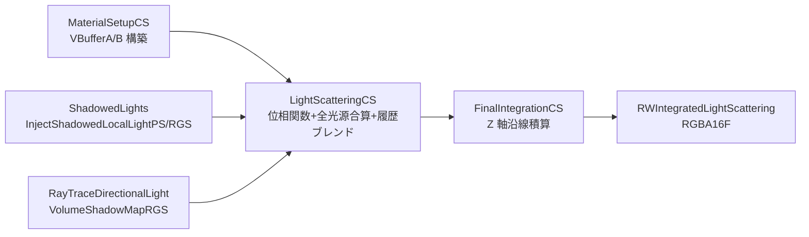

# Frostbite Volumetric Fog（参加メディア散乱）

- 出典 ID: **S62**（[[_source_index]]）
- UE 実装: `Engine/Source/Runtime/Renderer/Private/VolumetricFog.cpp`, シェーダ `Engine/Shaders/Private/VolumetricFog.usf`
- ステータス: **完了 (2026-04-26)**
- 上位: [[_algorithm_index]] / [[../01_rendering_overview]]

---

## 1. 目的

低コスト・カメラ視錐台ベースで **参加メディア（Participating Media）** の **In-Scattering** と **Transmittance** を計算し、半透明・不透明問わず一貫したシーン統合を行う。要件:

- ローカルライト（Spot/Point/Rect）の高品質シャドウ付き散乱
- ディレクショナルライト + シャドウ（Cascaded / VSM）+ Cloud Shadow
- スカイライト・Lumen GI からの間接散乱
- カメラ動作下での **時間再投影** によるノイズ抑制
- マテリアル（`ShadingModel=Volume`）でのエミッシブ／吸収係数注入

---

## 2. 理論

### 2.1 Radiative Transfer 方程式（簡略形）

ある光線方向 $\omega$ に沿った In-Scattering 寄与:

$$
L(x,\omega) = \int_0^{d} T(0,t)\,\sigma_s(t)\,\Phi(\omega,\omega_l)\,L_l(t)\,dt + T(0,d)\,L_{bg}
$$

- $T(0,t) = e^{-\int_0^t \sigma_t(s)\,ds}$ … Transmittance（Beer–Lambert）
- $\sigma_s$ … 散乱係数, $\sigma_t = \sigma_a + \sigma_s$ … 消衰係数
- $\Phi$ … **位相関数** （UE は Henyey–Greenstein を採用）
- $L_l$ … 各光源からの incoming radiance（シャドウ込み）

UE はこれを **離散化された Froxel グリッド** で1ボクセルあたり 1 サンプル（HistoryMissSupersampleCount のとき複数）として評価する。

### 2.2 Henyey–Greenstein 位相関数

$$
\Phi_{HG}(\theta; g) = \frac{1}{4\pi}\,\frac{1 - g^2}{(1 + g^2 - 2g\cos\theta)^{3/2}}
$$

`FVolumetricFogLightScatteringCS::FParameters::PhaseG` で 1 つの $g$ を渡す（マテリアル設定 `Volumetric Fog Scattering Distribution` から）。

### 2.3 Froxel グリッド と Z 分布

$$
z(k) = \mathrm{exp2}\Big( \frac{k}{N_z} \cdot S \Big) \cdot z_{near} - \text{Bias}
$$

- `r.VolumetricFog.GridPixelSize = 16` → 画面 16×16 ピクセル/Froxel
- `r.VolumetricFog.GridSizeZ = 64`（最大 128）
- `r.VolumetricFog.DepthDistributionScale = 32` … near 寄りに密、far 寄りに疎な指数分布

`GetVolumetricFogGridZParams()` が `(B, O, S)` を計算。シェーダ側は `ComputeDepthFromZSlice()` で復元。

### 2.4 Sliced Integration（沿線積算）

最終ステップでは Z スライスに沿って **prefix-product / prefix-sum** 風に積み上げる:

$$
\begin{aligned}
T_k &= \prod_{i=0}^{k-1} e^{-\sigma_t(i)\Delta z_i} \\
L_{out}(k) &= L_{out}(k-1) + T_k\,\sigma_s(k)\,\Phi\,L_l(k)\,\Delta z_k
\end{aligned}
$$

`FinalIntegrationCS` がこれを Z 軸 1 スレッドで実行（`THREADGROUP_SIZE = 8`）。

---

## 3. UE 実装

### 3.1 全体パイプライン



### 3.2 主要シェーダ

| シェーダ | エントリ | 役割 |
|---------|---------|------|
| `FVolumetricFogMaterialSetupCS` | `MaterialSetupCS` | Exponential Height Fog + マテリアル（Volume）から **VBufferA = (Albedo, Extinction)**, **VBufferB = (Emissive)** を生成 |
| `FInjectShadowedLocalLightPS` | （PS） | 1 光源 1 パス、CSM/VSM/Light Function Atlas 適用、ライトのバウンディングスフィアを Froxel に書き込み（`FWriteToBoundingSphereVS` + `FWriteToSliceGS`） |
| `FInjectShadowedLocalLightRGS` | （Ray Gen） | 上記の RT 版（`r.VolumetricFog.InjectRaytracedLights=1`）|
| `FRayTraceDirectionalLightVolumeShadowMapRGS` | （Ray Gen） | ディレクショナルライト用の **RaytracedShadowsVolume** 生成 |
| `FVolumetricFogLightScatteringCS` | `LightScatteringCS` | 位相関数を掛けて全光源を合算、SkyLight + Lumen GI、**履歴ブレンド** を実行 |
| `FVolumetricFogFinalIntegrationCS` | `FinalIntegrationCS` | Z 軸沿線積算（Beer–Lambert + 累積 In-Scattering） |

### 3.3 履歴ブレンド（時間再投影）

```hlsl
// LightScatteringCS 内で
HistoryUV = WorldToHistoryClip(FroxelWorldPos);
HistoryColor = SampleVolume(LightScatteringHistory, HistoryUV);
// 履歴がジオメトリ・ピクセルをまたぐと SuperSampleCount を上げる
SamplesThisFrame = bHistoryValid ? 1 : HistoryMissSupersampleCount;
NewColor = AverageOver(SamplesThisFrame);
Output = lerp(NewColor, HistoryColor, HistoryWeight);  // 0.9
```

`r.VolumetricFog.HistoryMissSupersampleCount = 4` … 履歴ミス時のサンプル数（最大 16）。

### 3.4 Conservative Depth 最適化

`r.VolumetricFog.ConservativeDepth = 1`（実験的）で `GenerateConservativeDepthBuffer` を生成し、シーンの最遠 depth より遠い Froxel をスキップ → ライト散乱負荷が大幅に削減される。

### 3.5 Light Function Atlas 連携

`bUseLightFunctionAtlas` が真のとき、すべてのライト関数をアトラステクスチャにベイクして 1 シェーダで全光源を処理 → ドローコール削減。`USE_LIGHT_FUNCTION_ATLAS` permutation。

### 3.6 Volumetric Cloud との接続

`CloudShadowmapTexture` を `LightScatteringCS` に渡して **雲の影が Volumetric Fog にも落ちる**（`CloudShadowmapStrength` で混合）。逆に Volumetric Fog の積算結果（`IntegratedLightScattering`）は Translucency / Volumetric Cloud / 不透明シーンの **すべて** に対して `Engine/Shaders/Private/HeightFogCommon.ush::ComputeVolumetricFog()` でサンプリングされる。

---

## 4. 近似と差分

| 項目 | 一般的な物理 | UE 実装 |
|-----|-----------|--------|
| サンプリング | 光線あたり多数のレイマーチサンプル | Froxel あたり 1 サンプル（履歴ミス時のみ 4–16）|
| 位相関数 | 多重散乱・複合 HG など | 単一 HG（`PhaseG` スカラー） |
| 多重散乱 | パストレーシング/Diffusion | Lumen Translucency Volume が Indirect として代替 |
| シャドウ | 高解像度シャドウマップ | Froxel 解像度に合わせて低解像度フィルタリング |
| Z 分布 | 線形 / 対数いずれも | 指数 (`DepthDistributionScale=32`) で near 偏重 |

物理的に正確なボリュメトリックスペクトルではなく、**「見栄え + 安定性 + 60Hz バジェット」** に最適化された参加メディア近似である。

---

## 5. CVar 一覧

| CVar | 既定 | 説明 |
|------|------|------|
| `r.VolumetricFog` | 1 | 機能の有効化 |
| `r.VolumetricFog.GridPixelSize` | 16 | Froxel の XY サイズ（ピクセル） |
| `r.VolumetricFog.GridSizeZ` | 64 | Z スライス数 |
| `r.VolumetricFog.DepthDistributionScale` | 32 | 指数分布のスケール |
| `r.VolumetricFog.TemporalReprojection` | 1 | 時間再投影の有効化 |
| `r.VolumetricFog.Jitter` | 1 | フレームごとのワールドジッタ（テンポラル超サンプル） |
| `r.VolumetricFog.HistoryWeight` | 0.9 | 履歴ブレンド係数 |
| `r.VolumetricFog.HistoryMissSupersampleCount` | 4 | 履歴ミス時のサンプル数 [1,16] |
| `r.VolumetricFog.InjectShadowedLightsSeparately` | 1 | シャドウ付きローカルライトを別パスで注入 |
| `r.VolumetricFog.ConservativeDepth` | 1 | 遠方 Froxel スキップ |
| `r.VolumetricFog.RectLightTexture` | 0 | Rect Light のソーステクスチャ参照 |
| `r.VolumetricFog.Emissive` | 1 | エミッシブ寄与 |
| `r.VolumetricFog.InjectRaytracedLights` | 0 | RT パスでローカルライトを注入 |
| `r.VolumetricFog.LightSoftFading` | 0 | Spot/Rect ライトのエッジ柔化（≥1 推奨） |
| `r.VolumetricFog.InverseSquaredLightDistanceBiasScale` | 1 | 1/d² の near アーチファクト緩和 |

---

## 6. 代替手法

| 手法 | 特徴 | UE での扱い |
|-----|------|-----------|
| Ray Marched Volumetric Lighting | 光線あたり 32–256 サンプル | `Volumetric Cloud` / RT 系で部分採用 |
| Epipolar Sampling (NVIDIA) | 太陽光線の方向に沿った 1D スイープ | 採用なし |
| Light Propagation Volume | SH 球面格子伝播 | 廃止（Lumen で代替） |
| Path-traced Participating Media | 物理正確、オフライン | Path Tracer のみ |
| Fourier Opacity Maps | 可変厚オクルージョン | 採用なし |
| Voxel Cone Tracing | スパースボクセルから sampling | 廃止（VXGI 系） |

UE5 は **Frostbite 流の Froxel 注入＋積算＋履歴ブレンド** で固定。Lumen Translucency Volume が GI を肩代わり、Volumetric Cloud は別パスで自前マーチング。

---

## 7. 参考資料

- **S62**: Hillaire, S. & Wronski, B. _Physically-based & Unified Volumetric Rendering in Frostbite_. SIGGRAPH 2015 Course "Advances in Real-Time Rendering". → [[_papers/S62_Frostbite_Volumetric.pdf]]
- Hillaire, S. _A Scalable and Production Ready Sky and Atmosphere Rendering Technique_. EGSR 2020（位相関数の HG 系で共通）→ [[atmos_hillaire]]
- Schneider, A. _Real-Time Rendering of Volumetric Clouds_（雲シャドウとの接続）→ [[atmos_clouds]]
- Bouthors et al., _Real-time realistic illumination and shading of stratiform clouds_ (Eurographics 2008)
- Wronski, B. _Volumetric fog: Unified compute shader-based solution to atmospheric scattering_, SIGGRAPH 2014（Frostbite の前段）

### UE 関連ドキュメント

- [[../Details/h_atmosphere_volumetric]] — 上位概念の Details ドキュメント
- [[../Reference/ref_VolumetricFog]] — API/構造体リファレンス
- [[../Source_Maps/Stage5_AtmosphereVolumetric_source_map]] — ソース地図

---

## 8. 相談用フック

雛形として取り上げる際の論点候補:

- **Froxel 解像度のトレードオフ**: GridPixelSize=8 にすると 4 倍の VRAM/コスト → 視覚効果はどれだけ向上？ MC（ノイズ）か空間アーチファクト（バンディング）か、ボトルネックの正体を切り分けるベンチ法。
- **位相関数の単純化**: 単一 HG ではミー散乱の前方ピーク + 後方リム を表現できない。Cornette–Shanks や 2-lobe HG（Volumetric Cloud と同じ）への拡張。
- **Lumen Translucency Volume との統合粒度**: 同じ Froxel 解像度で揃えるか、Lumen 側を半解像度にするか。SH3 ライティングをどう Beer–Lambert に乗せるか。
- **Conservative Depth の限界**: 半透明オブジェクトとの相互作用で破綻する条件。RDG パス順序が壊れる典型ケース。
- **History の品質**: HistoryWeight=0.9 はゴーストの源泉でもある。Hash-based reprojection（TSR 流）に置き換える価値はあるか。
- **マテリアル駆動の参加メディア**: `ShadingModel=Volume` 経由の Albedo/Extinction が Froxel に書き込まれる経路を、Niagara の Volume Material と統合する余地。
- **VR/分割レンダリング**: XR Multi-View で Volumetric Fog がどうハマるか（左右で履歴が共有できないので Jitter スケジュールを分ける必要あり）。

