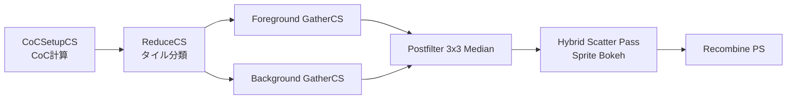

# Diaphragm DOF（Bokeh Convolution）

- 出典 ID: **S54**（[[_source_index]]）
- UE 実装: `Engine/Source/Runtime/Renderer/Private/PostProcess/DiaphragmDOF.cpp`, `PostProcessBokehDOF.cpp`, シェーダ群 `Engine/Shaders/Private/DiaphragmDOF/*.usf`
- ステータス: **完了 (2026-04-27)**
- 上位: [[_algorithm_index]] / [[../01_rendering_overview]]

---

## 1. 目的

カメラレンズの **物理ベース被写界深度** をリアルタイムで再現する。シネマティックな絞り（Aperture Diaphragm）形状の Bokeh、前景/背景の正しい合成、ピクセル単位の連続的な CoC を扱う。

採用先:
- Cinematic Camera Actor（実写ライク）
- シーケンサ撮影
- Editor のフォーカス確認用（VisualizeDOF）
- Mobile（簡略パス、Gather のみ）

---

## 2. 理論

### 2.1 Circle of Confusion（CoC）

被写界深度の根幹は **錯乱円（CoC）**。レンズ式から:

$$
\text{CoC}(z) = A\,\frac{f\,(z - z_{\text{focus}})}{z\,(z_{\text{focus}} - f)}
$$

- $A$ … 絞り径（Aperture, 単位 mm）
- $f$ … 焦点距離（Focal Length）
- $z$ … 被写体距離
- $z_\text{focus}$ … フォーカス距離

CoC 半径（ピクセル単位）が大きいほど大きくぼける。**正の CoC = 背景**、**負の CoC = 前景**として扱われる。

### 2.2 Gather vs Scatter

DOF 実装の二大手法:

| 方式 | 計算方向 | 利点 | 欠点 |
|------|---------|------|------|
| **Gather** | サンプル先 → 中央ピクセル | 帯域効率良 | 大 CoC で品質低下 |
| **Scatter** | 中央ピクセル → 周辺へ拡散 | 物理的に正確 | 性能・順序依存 |

UE は **Hybrid**: 通常領域は Gather、強い Bokeh（明るい高輝度ピクセル）のみ Scatter（Sprite として描画）。

### 2.3 Bokeh Kernel（絞り形状）

カメラレンズの Diaphragm Blade 数（5/6/7/8 枚等）で **多角形 Bokeh** を再現:

- Ring Sampling（同心円リング配置）でカーネルを構築
- Blade 数で角度を量子化、回転で形状を再現
- Aperture Mask テクスチャで詳細な形状（ハート型・星型等）

### 2.4 Foreground / Background 分離

CoC の符号で前景・背景を分離して個別に Gather → 最終 Recombine:

```
1. Setup CoC: 各ピクセルで CoC 半径計算
2. Foreground Gather: 負 CoC → Pre-Multiplied Alpha で前景畳み込み
3. Background Gather: 正 CoC → Background 専用 Gather
4. Hybrid Scatter: 高輝度 Bokeh のみ Sprite で追加描画
5. Recombine: in-focus + Foreground + Background を合成
```

---

## 3. UE 実装（パイプライン）



### 3.1 主要関数・シェーダ

| 段階 | 実装 | 役割 |
|------|------|------|
| **CoC Setup** | `DOFCocSetupCS` | 深度 → CoC 半径計算、フル → Half-Res |
| **Reduce** | `DOFReduceCS` | タイルごとの最大 CoC、Gather 必要性判定 |
| **Gather** | `DOFGatherCS` (FG/BG) | Ring Sampling で重み付き和 |
| **Postfilter** | `PostFilteringMethod=1` (3x3 Median) | Gather ノイズ抑制 |
| **Hybrid Scatter** | `DOFHybridScatterPS` + `SpriteIndexBuffer` | 高輝度ピクセルを Bokeh Sprite で描画 |
| **Recombine** | `DOFRecombinePS` | 最終合成（Foreground over In-focus over Background） |

### 3.2 Ring Count

`r.DOF.Gather.RingCount`（既定 5）で Bokeh 形状品質を制御:
- 3: 軽量（モバイル）
- 5: 標準（既定）
- 上限 5（より多くするとサンプル数が爆発）

各 Ring に固定数のサンプル（通常 8〜16）→ 合計 ~80 サンプル/ピクセル。

### 3.3 Hybrid Scatter

`DOFHybridScatterPS` は:
- CoC 半径が `r.DOF.Scatter.MinCocRadius` (既定 3.0px) 以上
- かつ高輝度（Distinction Limit を超えた）ピクセルのみ
- `r.DOF.Scatter.MaxSpriteRatio` (既定 10%) で上限

Sprite として描画することで、Gather では再現できない **明るい点光源の伸びた Bokeh** を物理ライクに再現。

---

## 4. 近似差分（理想 vs 実装）

| 項目 | 理想（実写レンズ） | UE 実装 | 補足 |
|------|------------------|---------|------|
| CoC 計算 | レンズ式厳密 | Thin Lens Approximation | 実写ライク（球面収差なし） |
| 多重散乱 | 全光経路 | Gather + Scatter Hybrid | 高輝度のみ正確 |
| 連続 Roughness | 光学厳密 | Half-Res + Postfilter 3x3 Median | バンディング/エイリアス対策 |
| Bokeh 形状 | 任意（Aperture Mask） | Ring Sampling + Blade 角量子化 | 詳細形状はテクスチャ |
| Chromatic Aberration | 各波長別 | 別パス（CA は post-tonemap） | DOF 内では未統合 |
| 半透明オブジェクト | 個別フォーカス | Translucency 用別 CoC パス | 順序問題あり |

### Distinction Limit による品質トレードオフ

`r.DOF.Gather.DistinctionLimit` で「明るすぎて Gather しきれない Bokeh を捨てる」しきい値。Scatter で別途復元しないと暗くなる。性能-品質のトレードオフ。

---

## 5. 主要 CVar

| CVar | 既定 | 効果 |
|------|------|------|
| `r.DOF.Gather.ResolutionDivisor` | 2 | 1=フル, 2=ハーフ Gather（既定） |
| `r.DOF.Gather.AccumulatorQuality` | 1 | Gather Accumulator 品質 |
| `r.DOF.Gather.RingCount` | 5 | Ring Sampling リング数 [3..5] |
| `r.DOF.Gather.PostfilterMethod` | 1 | 0=なし, 1=Median 3x3, 2=Max 3x3 |
| `r.DOF.Gather.DistinctionLimit` | 0 | Gather 上限明るさ（0=無制限） |
| `r.DOF.Gather.EnableBokehSettings` | 1 | FG/BG で Bokeh 設定有効化 |
| `r.DOF.Scatter.ForegroundCompositing` | 1 | 0=無効, 1=Additive |
| `r.DOF.Scatter.BackgroundCompositing` | 2 | 0=無効, 1=Additive, 2=Gather Occlusion |
| `r.DOF.Scatter.MinCocRadius` | 3.0 | Scatter 適用最小 CoC（px） |
| `r.DOF.Scatter.MaxSpriteRatio` | 0.1 | 最大 Sprite 比率（10%） |
| `r.DOF.Scatter.EnableBokehSettings` | 1 | Scatter で Bokeh 設定有効化 |
| `r.DOF.Recombine.EnableBokehSettings` | 1 | Recombine で Bokeh 設定有効化 |

---

## 6. 代替手法

| 手法 | 採用条件 | UE 実装 |
|------|---------|---------|
| **PostProcessDOF (Gaussian)** | 簡略・モバイル | `PostProcessDOF.cpp`（旧） |
| **PostProcessBokehDOF (Sprite)** | 旧 Sprite 方式 | `PostProcessBokehDOF.cpp`（旧） |
| **Path Tracer DOF** | リファレンス | `PathTracer.usf`（Thin Lens MC） |
| **Mobile DOF** | モバイル簡易 | `MobileDepthOfField.cpp` |
| **CircleDOF**（旧） | 5.0 前 | 廃止、Diaphragm に統合 |

UE 5.x の Cinematic 経路はすべて Diaphragm DOF。レガシーは互換目的で残存。

---

## 7. 参考資料

- **Abadie 2018** "A Life of a Bokeh" SIGGRAPH 2018 / GDC → UE 4.21 で導入された Diaphragm DOF の解説 → `_papers/S54_Abadie_DiaphragmDOF_2018.pdf`
- **McIntosh, Riecke, DiPaola 2012** "Efficiently Simulating the Bokeh of Polygonal Apertures" CGF
- **Sousa 2013** "CryEngine 3 Graphics Gems" SIGGRAPH 2013 Course → 関連 Bokeh 手法
- 出典 ID **S54** ([[_source_index]] 参照)

---

## 8. 相談用フック（不確かなポイント）

- **Hybrid Scatter のしきい値**: `MinCocRadius=3` と `MaxSpriteRatio=0.1` は経験則。Cinematic 撮影で明るい点光源（街灯・ハイライト）が多いシーンでは 0.1 上限で足りない場合あり。
- **Foreground と Background の合成順序**: PostProcessSettings の半透明設定との相互作用が複雑。Translucency が大きな CoC を持つ場合、ぼかし順序の不整合で「halo」アーティファクトが出ることがある。
- **Postfilter 3x3 Median**: Gather のノイズを除去するが、明るい Bokeh のディテール（多角形のエッジ）も削る。`r.DOF.Gather.PostfilterMethod=2` (Max) は別品質設計だが Median が既定。
- **Aperture Blade 数**: PostProcessSettings の `DiaphragmBladeCount` で 5〜16 枚指定可能。Blade 数の偶奇で Bokeh の対称性が変わる（5 枚は星型、6 枚は六角形）。
- **CoC のテクスチャ精度**: Half-Res Gather で CoC を扱うため、急峻な深度差（薄い物体）で前景/背景判定が揺れる。`r.DOF.Gather.ResolutionDivisor=1` でフル解像度にすると改善するが負荷が約 4 倍。
- **モバイル経路**: Mobile DOF は別実装で、Diaphragm の Hybrid Scatter は搭載していない。Gather + 簡易合成のみ。

---

## 関連ドキュメント

- [[aa_taa]] / [[aa_tsr]] — DOF 後の TAA/TSR でノイズ平均化
- [[post_motion_blur]] — 同じくタイルベース速度処理
- [[../01_rendering_overview]]
