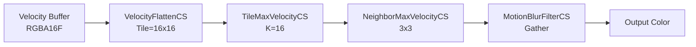

# Tile-Based Motion Blur（速度散乱）

- 出典 ID: **S55**（[[_source_index]]）
- UE 実装: `Engine/Source/Runtime/Renderer/Private/PostProcess/PostProcessMotionBlur.cpp`, シェーダ `Engine/Shaders/Private/PostProcessMotionBlur.usf`
- ステータス: **完了 (2026-04-27)**
- 上位: [[_algorithm_index]] / [[../01_rendering_overview]]

---

## 1. 目的

ピクセル毎の**速度ベクトル（VelocityBuffer）** から長時間露光（モーションブラー）を再現する。固定コストで以下を達成:

- 任意の長さの速度ベクトルに対して一定の品質
- 異なる動き方向の物体間の正しい接続
- カメラ動作 + オブジェクト動作の両方を統合
- 静止背景・動物体の境界処理

採用先:
- 全 Deferred / Forward 経路
- Cinematic 撮影（高品質設定）
- VR ではデフォルト無効（`vr.AllowMotionBlurInVR=0`）

---

## 2. 理論

### 2.1 Naive 全ピクセルブラー の問題

各ピクセルで自身の速度方向に N サンプル取ってブラー → **隣接ピクセルが異なる速度ベクトルだと境界が破綻**。
高速移動物体では N サンプルでは長さが足りず、N を増やすと負荷爆発。

### 2.2 McGuire 2012 のタイルベース手法

3 段で解決:

1. **Velocity Flatten**: 速度を K×K タイルに集約し、`Tile Max Velocity` を計算
2. **Tile Max Neighbor**: 自タイル + 周辺 8 タイルの最大速度（`NeighborMax`）
3. **Gather Pass**: ピクセルあたり N サンプルを **NeighborMax の方向** に散布
   - 各サンプル位置の速度・深度を取得
   - 中央ピクセルとの遮蔽判定（深度比較）でブレンド
   - 速度方向と一致する寄与のみ加算

これにより:
- ピクセルあたりサンプル数は固定（4〜32）
- タイルサイズ（K）= 最大ブラー長
- 異速度境界も正しく接続

### 2.3 Velocity の Half-Resolution

UE は半解像度の速度バッファ（`HalfResVelocity`）を使うことで:
- メモリ帯域削減
- 大きな動きでも一定の精度
- TSR 等の他経路と速度バッファ共有

---

## 3. UE 実装（パイプライン）



### 3.1 タイルサイズ定数

`PostProcessMotionBlur.cpp:123-126`:

```cpp
const int32 kMotionBlurFlattenTileSize = FVelocityFlattenTextures::kTileSize;  // = 16
const int32 kMotionBlurFilterTileSize = 16;
const int32 kMotionBlurComputeTileSizeX = 8;
const int32 kMotionBlurComputeTileSizeY = 8;
```

### 3.2 Velocity Flatten 共有

`r.MotionBlur.AllowExternalVelocityFlatten=1` で **TSR と Flatten パスを共有**できる。TSR が既に Flatten を生成済みなら再計算しない（最適化）。

### 3.3 Half-Res Gather

`r.MotionBlur.HalfResGather=1`（既定）:
- 動き量が大きいタイルで自動的に半解像度 Filter に切替
- Adaptive Resolution: 静止領域は full、動領域は half

`r.MotionBlur.HalfResInput=1`（既定）:
- 入力カラーを半解像度化してメモリ帯域削減
- Recombine で full に戻す

### 3.4 サンプル数（MotionBlurQuality）

`r.MotionBlurQuality` (0..4):
| 値 | サンプル数 | 用途 |
|----|----------|------|
| 0 | 無効 | OFF |
| 1 | 4 | 低品質 |
| 2 | 8 | 中（既定相当） |
| 3 | 16 | 高 |
| 4 | 32 | Cinematic |

### 3.5 ブラー方向数

`r.MotionBlur.Directions=1` （既定 1）:
- 1: 主方向のみ（NeighborMax の方向）
- 2 以上: 複数方向にサンプル → 異速度境界で品質向上、性能低下

`r.MotionBlurSeparable=1` で第二パスを追加し、ノイズを平滑化。

### 3.6 Scatter Mode

`r.MotionBlurScatter=1` で **Scatter 方式** に切替（McGuire 2014 の改良）:
- 各高速ピクセルが Sprite として速度方向に塗布
- Gather より物理的に正確だが遅い
- 既定は Gather

### 3.7 Velocity 品質補正

カメラ動作の補正は `GetPreviousWorldToClipMatrix`（94 行）で:
- `View.Family.EngineShowFlags.CameraInterpolation` が有効な場合、ViewOrigin の delta だけ世界平行移動して大規模ワールドの精度を保つ
- TWS (Tilted Wraparound Sky) と TLAS の整合性のための処理

---

## 4. 近似差分（理想 vs 実装）

| 項目 | 理想（連続露光） | UE 実装 | 補足 |
|------|----------------|---------|------|
| 露光モデル | Box Filter（連続時間積分） | 離散 N サンプル | サンプル数で近似 |
| 速度補間 | 物理連続 | タイル + NeighborMax | タイル境界で品質変化 |
| 遮蔽判定 | 正確（光線追跡） | 深度比較 + 重み | 半透明物体で誤差 |
| Anti-Aliasing | 連続 | TAA/TSR と共存 | 同フレーム ジッタ統合 |
| Camera Motion | 厳密 | View Matrix 差分 | ViewOrigin Delta 補正 |
| Roll Shutter | 厳密 | 未対応（標準 Global Shutter 仮定） | 高速回転で違和感なし |
| Object Motion | 各頂点別速度 | 頂点単位 → ピクセル補間 | スキニングメッシュで頂点速度別計算 |
| 半透明物体 | 個別 Velocity | 半透明用 Velocity 別パス（限定） | Order-Independent ではない |

---

## 5. 主要 CVar

| CVar | 既定 | 効果 |
|------|------|------|
| `r.MotionBlurQuality` | 4 (Cinematic) | 0..4、サンプル数制御 |
| `r.MotionBlur.Directions` | 1 | 1=主方向、2 以上で複数方向 |
| `r.MotionBlur.HalfResInput` | 1 | 入力カラー半解像度化 |
| `r.MotionBlur.HalfResGather` | 1 | 動領域で半解像度 Filter |
| `r.MotionBlur.AllowExternalVelocityFlatten` | 1 | TSR と Flatten 共有 |
| `r.MotionBlur.Visualize` | 0 | 0=通常, 1=HSV, 2=Plasma |
| `r.MotionBlurFiltering` | 0 | Bilinear vs Point（既定 0=Point） |
| `r.MotionBlurScatter` | 0 | 0=Gather, 1=Scatter（遅い） |
| `r.MotionBlurSeparable` | 0 | 1=第二パスでノイズ平滑化 |
| `r.MotionBlur2ndScale` | 1.0 | 第二パスのスケール（Cheat） |
| `vr.AllowMotionBlurInVR` | 0 | VR では既定で無効 |
| `r.Ortho.UsePreviousMotionVelocityFlattenPass` | 0 | Ortho カメラで前フレーム Flatten 流用 |

PostProcessSettings 側:
- `MotionBlurAmount`（0..1, ブラー強度）
- `MotionBlurMax`（最大ブラー長, 画面比率%）
- `MotionBlurPerObjectSize`（オブジェクト動作の最小サイズしきい値）

---

## 6. 代替手法

| 手法 | 採用条件 | UE 実装 |
|------|---------|---------|
| **Per-Object Motion Blur** | スキニング高品質 | Velocity Buffer（共通） |
| **Camera Only Motion Blur** | カメラだけぼかす | View Matrix 差分のみ使用 |
| **Path Tracer Motion Blur** | リファレンス | `PathTracer.usf`（時間サンプリング MC） |
| **Scatter MC**（McGuire 2014） | `r.MotionBlurScatter=1` | 同ファイル内代替経路 |
| **Frame Interpolation** | TSR/DLSS 等 | 別系統 |

---

## 7. 参考資料

- **McGuire et al. 2012** "A Reconstruction Filter for Plausible Motion Blur" I3D 2012 → `_papers/S55_McGuire_MotionBlur_2012.pdf`
- **Sousa 2013** "CryEngine 3 Graphics Gems" SIGGRAPH 2013 Course → 関連 Tile-Max
- **Jimenez 2014** "Next Generation Post Processing in Call of Duty" SIGGRAPH 2014 → 改良版 Scatter
- 出典 ID **S55** ([[_source_index]] 参照)

---

## 8. 相談用フック（不確かなポイント）

- **タイルサイズ 16 の根拠**: McGuire 元論文は 20 を推奨。UE は 16 に統一して TSR・Bloom Setup と共有。タイル境界で品質変化が起きる場合、これを 32 にすると改善するが TSR との不整合を引き起こす可能性。
- **NeighborMax の 3x3**: 自タイル + 周辺 8 タイル。McGuire 元論文と同じ。さらに広げる（5x5）変種は採用なし。
- **`r.MotionBlur.HalfResGather=1` の自動切替**: 動き量がしきい値を超えたタイルで動的に Half-Res 化。しきい値は内部固定（コード中に CVar なし）。
- **半透明物体の速度**: Translucency BasePass は Velocity Buffer に書かない既定。ParticleSystem の高速移動でブラーが効かない問題は既知（MotionBlur.HiddenPosition 等の手動補正が必要）。
- **Camera Interpolation**: `GetPreviousWorldToClipMatrix` で ViewOrigin Delta を分離する処理は LWC（Large World Coordinates）対応。FP32 精度問題を避けるが、通常は影響しない。
- **`r.MotionBlurFiltering` のチート扱い**: コメントに「expected by the shader for better quality (default 0)」とある。Point sampling が既定で、Bilinear は速度方向のサブピクセル境界を均質化してしまうため非推奨。
- **Scatter 方式は遅いのに残っている理由**: 高品質シネマ撮影や、速度の不連続境界が目立つ箇所で Gather のリングアーティファクトを避けるため。デフォルトで使う想定はない。

---

## 関連ドキュメント

- [[aa_taa]] / [[aa_tsr]] — Velocity Buffer を共有
- [[post_dof]] — 同じくポストプロセス系
- [[../01_rendering_overview]]
