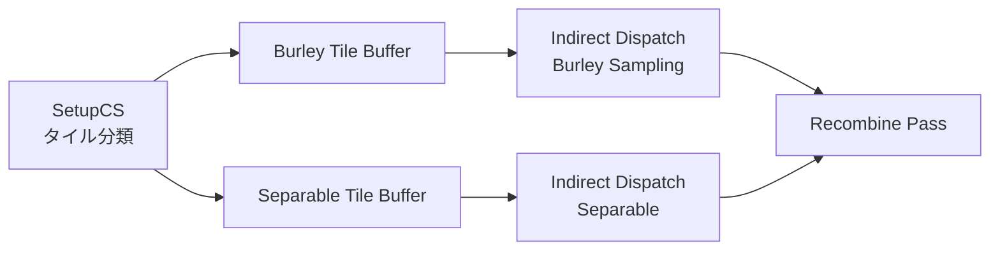

# Burley Normalized SSS（皮膚拡散散乱）

- 出典 ID: **S03**（[[_source_index]]）
- UE 実装: `Engine/Shaders/Private/BurleyNormalizedSSSCommon.ush`, `SubsurfaceBurleyNormalized.ush`, `Engine/Source/Runtime/Renderer/Private/PostProcess/PostProcessSubsurface.cpp`
- ステータス: **完了 (2026-04-26)**
- 上位: [[_algorithm_index]] / [[../01_rendering_overview]]

---

## 1. 目的

サブサーフェススキャタリングを **スクリーンスペース後処理** として近似し、SSS Profile（皮膚・蝋・葉）の Diffuse 反射を多層散乱風にぼかす。UE5 では:

- **物理ベースのパラメータ化**（Diffuse Mean Free Path / Surface Albedo）
- **サンプル数自適応**（分散ベース、6〜64 サンプル）
- **Half-Res フォールバック** で Separable に切替（高速モード）
- **Profile per-pixel** （Substrate ピクセル単位 SSS 対応）

---

## 2. 理論

### 2.1 Normalized Diffusion Profile（Burley 2015）

放射プロファイル $R(r)$ は次の二重指数で表される:

$$
R(d, r) = \frac{e^{-r/d} + e^{-r/(3d)}}{8\pi\,d\,r}
$$

- $d$ … shape parameter（散乱の幅・高さを制御、Diffuse Mean Free Path から導出）
- $r$ … 入射点から射出点までの距離

3 軸（RGB）に拡張し、各カラーチャネルで異なる $d$ を使用すると皮膚特有の赤色シフトを再現できる:

```hlsl
// BurleyNormalizedSSSCommon.ush:32
float3 GetDiffuseReflectProfileWithDiffuseMeanFreePath(float3 L, float3 S3D, float Radius)
{
    float3 D = 1 / S3D;
    float3 R = Radius / L;
    const float Inv8Pi = 1.0 / (8 * PI);
    float3 NegRbyD = -R / D;
    return max((exp(NegRbyD) + exp(NegRbyD/3.0)) / (D*L) * Inv8Pi, ...);
}
```

### 2.2 Scaling Factor（Surface Albedo → MFP 変換）

Burley 論文は MC で得た 3 つの近似式を提供している。UE は **Method 2: Diffuse Surface Scaling** を主に使う:

$$
s_{\text{diffuse}}(A) = 1.9 - A + 3.5\,(A - 0.8)^2 \quad (\text{相対誤差 3.9\%})
$$

`BurleyNormalizedSSSCommon.ush:71-75` `GetDiffuseSurfaceScalingFactor`。

代替として Method 1（Perpendicular, 5.5%）と Method 3（SearchLight Diffuse, 7.7%）も同ファイルに用意され、DMFP/MFP 変換に使われる（`Dmfp2MfpMagicNumber = 0.6f`）。

### 2.3 Disk Importance Sampling

CDF の解析逆関数を持たないため、UE は近似ルート（`ROOT_APROXIMATE = 1`）で半径方向 $r$ をサンプリングし、角度方向は **R2 シーケンス**（`SAMPLE_ROOT_ANGLE_R2SEQUENCE = 1`）を使う。

```hlsl
// SubsurfaceBurleyNormalized.ush:14-15
#define BURLEY_NUM_SAMPLES   64
#define BURLEY_INV_NUM_SAMPLES (1.0f/64)
```

サンプル数は分散推定で 8〜64 を自適応:

```hlsl
// SubsurfaceBurleyNormalized.ush:63-66
#define VARIANCE_LEVEL 0.0001
#define HIGH_LUMA_SAMPLE_COUNT 8       // 高輝度・低分散
#define LOW_LUMA_SAMPLE_COUNT 16
#define PROFILE_EDGE_SAMPLE_COUNT 32   // プロファイル境界
```

---

## 3. UE 実装（パイプライン）



実装の高レベル記述（`PostProcessSubsurface.cpp:6-10`）:

> 1. Initialize counters
> 2. Setup pass: record tiles into Burley/Separable buffers
> 3. Indirect dispatch Burley
> 4. Indirect dispatch Separable
> 5. Recombine

### 3.1 Burley Sample 重要度

`SubsurfaceBurleyNormalized.ush` の重み計算は次の方針:
- **Bilateral filtering** （Depth + Normal、`BilateralFilterKernelFunctionType=1`）でジオメトリ境界での漏れを抑制
- **MipLevel 補正**: `MIP_CONSTANT_FACTOR = 0.0625f` でサンプル数依存のミップを軽減
- **Reweight Center Sample**: 中心ピクセルの重みを再正規化（`REWEIGHT_CENTER_SAMPLE 1`）
- **Reprojection**: 前フレームの結果を時間再利用（`REPROJECTION 1`）

### 3.2 Substrate 統合（per-pixel SSS）

Substrate（5.6+）では `SSS_PROFILE_ID_PERPIXEL` で Profile ID をピクセルごとに切替可能。  
`SeparableSSS.ush:191-201` の `FillBurleyParameters` で `D3D = DiffuseMeanFreePath / S3D` を計算してピクセル単位で渡す。

---

## 4. 近似差分（理想 vs 実装）

| 項目 | 理想（Burley 2015） | UE 実装 | 補足 |
|------|--------------------|---------|------|
| 散乱媒体 | 等方無限薄膜 | スクリーンスペース 2D 畳み込み | 視線非垂直で誤差 |
| カラーシフト | RGB それぞれの $d$ で MC 解 | RGB 独立 $d$ + 一回畳み込み | 皮膚はOK |
| MFP/DMFP 変換 | 厳密拡散方程式 | `Dmfp2MfpMagicNumber = 0.6f` | コメントに「magic number」明記 |
| サンプル数 | 数百〜千 | 6〜64（分散自適応） | TAA で時間積分 |
| シャドウ感度 | 体積積分 | スクリーンスペース Bilateral | ジオメトリ境界での漏れ |
| Half-Res 切替 | なし | `r.SSS.HalfRes=1` で Separable | Burley は重い |

---

## 5. 主要 CVar

| CVar | 既定 | 効果 |
|------|------|------|
| `r.SubsurfaceScattering` | 1 | SSS 機能のグローバル ON/OFF |
| `r.SSS.Scale` | 1.0 | Scatter Radius スケール（Profile 設定の倍率） |
| `r.SSS.HalfRes` | 1 | 1=半解像度（Separable）、0=フル解像度（Burley） |
| `r.SSS.HalfRes.ForceSeparable` | 1 | HalfRes 時に強制 Separable |
| `r.SSS.Quality` | 0 | Recombine 品質（0=低速、1=高速、-1=自動） |
| `r.SSS.Filter` | 1 | 0=point、1=bilinear |
| `r.SSS.Burley.Quality` | 1 | 0=Separable フォールバック、1=自動 |
| `r.SSS.Burley.NumSamplesOverride` | 0 | 0=自適応、>0=固定サンプル数 |
| `r.SSS.Burley.EnableProfileIdCache` | 1 | プロファイル ID キャッシュで高速化（+1B/pixel） |
| `r.SSS.Burley.BilateralFilterKernelFunctionType` | 1 | 0=Depth のみ、1=Depth+Normal |
| `r.SSS.Burley.MinGenerateMipsTileCount` | 4000 | ミップ生成発火タイル数 |
| `r.SSS.Checkerboard` | 2 | 0=無効、1=Checker、2=自動 |
| `r.SSS.SubSurfaceColorAsTansmittanceAtDistance` | 0.15 | 距離正規化値（Surface Color → Transmittance 変換距離） |
| `r.SSS.Subpixel.Threshold` | 1.0 | ぼかしが 1 ピクセル以下なら SSS 省略 |

---

## 6. 代替手法

| 手法 | 採用条件 | UE 実装 |
|------|---------|---------|
| **Separable SSS（Jimenez 2015）** | Half-Res or Burley の負荷で不可 | `SeparableSSS.ush`（[[sss_separable]]） |
| **Path Tracer（リファレンス）** | オフライン参照 | `PathTracer.usf` の Volumetric Path Tracing |
| **Pre-Integrated Skin** | モバイル（簡略） | LUT ベース Forward シェーダ |
| **Diffusion Profile in Texture** | 一部レガシー | （Profile を CPU で 3 段ガウス和近似） |

---

## 7. 参考資料

- **Burley, Christensen 2015** "Approximate Reflectance Profiles for Efficient Subsurface Scattering" Disney SIGGRAPH 2015 → `_papers/S03_Burley_NormalizedSSS_2015.pdf`
- **Jimenez 2015** "Separable Subsurface Scattering" → 比較・代替手法
- 出典 ID **S03** ([[_source_index]] 参照)

---

## 8. 相談用フック（不確かなポイント）

- **`Dmfp2MfpMagicNumber = 0.6f`** はコード中に「TODO: find the source」のコメントあり。Path Tracer と Rasterizer の整合性のための実験的フィッティング値で、論文上の根拠は不明。  
  → 厳密値は `α = 1 − exp(−11.43A + 15.38A² − 13.91A³)` から導出可能（`BurleyNormalizedSSSCommon.ush:103` のコメント参照）が、Burley 近似（IOR=1）と整合しないため不採用。
- **Bilateral 重みの「12000.0f / 400000」マジック**（`SeparableSSS.ush:335`）は経験則で UE のシーンスケール（cm 系）に強く依存。
- **R2 シーケンス vs Fibonacci/Random** は経験則で R2 が最良とされているが、皮膚以外の素材で逆転する可能性あり（`SAMPLE_ROOT_ANGLE_R2SEQUENCE` を切り替えて比較する余地）。
- **Substrate の per-pixel SSS Profile** は Substrate 系限定。レガシー GBuffer では 1 ピクセル 1 ID 制約。

---

## 関連ドキュメント

- [[sss_separable]] — Separable SSS（半解像度フォールバック・薄膜透過）
- [[brdf_disney_diffuse]] — Disney Diffuse（同 Burley 系）
- [[../01_rendering_overview]]
