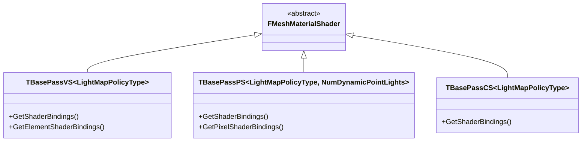

# c: BasePass マテリアル・MeshPassProcessor

- 対象ファイル: `BasePassRendering.h/.cpp` / `BasePassRendering.inl`
- 概要: [[14_basepass_overview]]

---

## 概要

BasePass のシェーダーは **マテリアル × ライトマップポリシー** の組み合わせで排列（Permutation）を生成する。  
`TBasePassMeshProcessor` が各メッシュに対して最適な排列を選択し  
`FMeshDrawCommand` を生成してコマンドリストに積む。

---

## TBasePassMeshProcessor

```cpp
// BasePassRendering.h
class FBasePassMeshProcessor : public FSceneRenderingAllocatorObject<FBasePassMeshProcessor>,
                                public FMeshPassProcessor
{
public:
    // メッシュバッチを受け取り DrawCommand を生成
    virtual void AddMeshBatch(
        const FMeshBatch& RESTRICT MeshBatch,
        uint64 BatchElementMask,
        const FPrimitiveSceneProxy* RESTRICT PrimitiveSceneProxy,
        int32 StaticMeshId = -1) override;

private:
    ETranslucencyPass::Type TranslucencyPassType; // 不透明 or 半透明
    bool bTranslucentBasePass;
    bool bEnableReceiveDecalOutput;               // DBuffer デカール受け取り
    EDepthDrawingMode EarlyZPassMode;
};
```

---

## ライトマップポリシー（FUniformLightMapPolicy）

シェーダー排列のキーとなるライトマップ処理方式。

```cpp
// UniformBuffer で渡すライトマップデータの種類を定義
enum ELightMapPolicyType : uint8
{
    LMP_NO_LIGHTMAP,                // ライトマップなし（動的 or Unlit）
    LMP_PRECOMPUTED_IRRADIANCE_VOLUME_INDIRECT_LIGHTING, // Indirect Irradiance Volume
    LMP_CACHED_VOLUME_INDIRECT_LIGHTING,   // IndirectLightingCache（ボリューム）
    LMP_CACHED_POINT_INDIRECT_LIGHTING,    // IndirectLightingCache（ポイント）
    LMP_SIMPLE_NO_LIGHTMAP,
    LMP_SIMPLE_LIGHTMAP_ONLY_LIGHTING,
    LMP_LQ_LIGHTMAP,               // 低品質ライトマップ
    LMP_HQ_LIGHTMAP,               // 高品質ライトマップ
    LMP_DISTANCE_FIELD_SHADOWS_AND_HQ_LIGHTMAP,
    LMP_DISTANCE_FIELD_SHADOWS_LIGHTMAP_AND_CSM,
    // ...
};
```

---

## シェーダークラス階層



---

## AddMeshBatch() フロー

```
TBasePassMeshProcessor::AddMeshBatch()          BasePassRendering.cpp
  │
  ├─ ShouldIncludeDomainInMeshPass() チェック
  ├─ Material.GetShadingModels() で ShadingModel 一覧取得
  ├─ LightMapPolicy を決定
  │   GetUniformLightMapPolicy(Mesh, Scene, View, ...)
  │   → LMP_HQ_LIGHTMAP / LMP_NO_LIGHTMAP 等を選択
  │
  ├─ 透明度チェック（IsTranslucent → TranslucentBasePass）
  │
  └─ Process<TBasePassVS, TBasePassPS>(...)
      ├─ シェーダー排列フラグ計算
      │   bEnableAtmosphericFog / bEnableSkyLight /
      │   bPlanarReflection / bSubstrate 等
      ├─ GetVertexShader<TBasePassVS<...>>()
      ├─ GetPixelShader<TBasePassPS<..., NumDynamicPointLights>>()
      └─ BuildMeshDrawCommands()
          → FMeshDrawCommand をバッチに追加
```

---

## 主要シェーダーパラメータ（UniformBuffer）

```cpp
// BasePassRendering.h — 不透明用 UB
BEGIN_GLOBAL_SHADER_PARAMETER_STRUCT(FOpaqueBasePassUniformParameters,)
    SHADER_PARAMETER_STRUCT(FSharedBasePassUniformParameters, Shared)
    // Shared 内部:
    //   FForwardLightUniformParameters  Forward    // Forward Shading 用ライトデータ
    //   FReflectionUniformParameters    Reflection // 反射キャプチャ
    //   FFogUniformParameters           Fog        // Height Fog
    //   LightFunctionAtlas              LFA        // Light Function Atlas
    SHADER_PARAMETER_STRUCT_INCLUDE(FDBufferParameters, DBuffer)  // DBuffer デカール
    SHADER_PARAMETER_RDG_BUFFER_SRV(..., EyeAdaptationBuffer)     // 露出
END_GLOBAL_SHADER_PARAMETER_STRUCT()
```

---

## 関連リファレンス

- [[ref_basepass_renderer]] — `TBasePassMeshProcessor` / `FBasePassVS` / `FBasePassPS` 詳細
- [[ref_basepass_common]] — `FOpaqueBasePassUniformParameters` フィールド一覧

---

## シェーダー排列生成 → AddMeshBatch() 詳細フロー

```
【排列コンパイル（ビルド時）】
  IMPLEMENT_MATERIAL_SHADER_TYPE(TBasePassPS, "BasePassPixelShader.usf", ...)
    │
    └─ ShouldCompilePermutation() 判定:
        ├─ Feature Level: SM5 以上
        ├─ LightMapPolicyType: LMP_NO_LIGHTMAP / LMP_HQ_LIGHTMAP / ...
        ├─ NumDynamicPointLights: 0, 1, 2, 3, 4
        └─ r.PSOPrecache.LightMapPolicyMode で絞り込み
           = 1（デフォルト）→ LMP_NO_LIGHTMAP のみ事前コンパイル

【ランタイム: AddMeshBatch() 呼び出し経路】
  DrawDynamicMeshPass()
    └─ FBasePassMeshProcessor::AddMeshBatch(MeshBatch, BatchElementMask, Proxy)

      [1] フィルタリング
        ShouldIncludeDomainInMeshPass(Domain, PassType)
          → Domain_Surface のみ BasePass 対象
          → Wireframe / ShaderComplexity ビューモードの例外処理

      [2] LightMapPolicy 選択
        GetUniformLightMapPolicy(Proxy, Scene, View, MeshBatch)
          → 優先度: HQ_LIGHTMAP > LQ_LIGHTMAP > IndirectIrradiance > NO_LIGHTMAP
          → Primitive の LightmapData 有無・種別で判定

      [3] ライトマップ排列 × シェーダー排列の解決
        Process<TBasePassVS<Policy>, TBasePassPS<Policy, NumDynPts>>(...)
          │
          ├─ GetVertexShader<TBasePassVS<Policy>>()
          │   → ShaderMap からキャッシュ済みシェーダーを取得
          │
          ├─ GetPixelShader<TBasePassPS<Policy, NumDynPts>>()
          │   → NumDynPts: Point Light が 0〜4 個の場合に最適化版を選択
          │
          └─ BuildMeshDrawCommands()
              ├─ Pipeline State Object（PSO）を設定
              ├─ Vertex/Index Buffer をバインド
              ├─ FMeshDrawCommand を生成
              └─ FMeshPassDrawListContext::FinalizeCommand() → キューに追加

【SubmitとDrawCall発行】
  FParallelCommandListSet or 逐次:
    FMeshDrawCommand::SubmitDraw(RHICmdList)
      → RHIDrawIndexedPrimitive() / RHIDrawIndexedPrimitiveIndirect()
```

> [!note]- PSO キャッシュ（PSOPrecache）
> `r.PSOPrecache=1`（デフォルト）の場合、マテリアルロード時に事前 PSO コンパイルが走る。
> 初回フレームでの PSO ミスによるヒッチを防ぐ。
> BasePass の PSO 数 = LightMapPolicy 種類 × ShadingModel 数 × NumDynPts(5) になるため
> `r.PSOPrecache.LightMapPolicyMode=1` で LMP_NO_LIGHTMAP に限定して数を削減できる。
