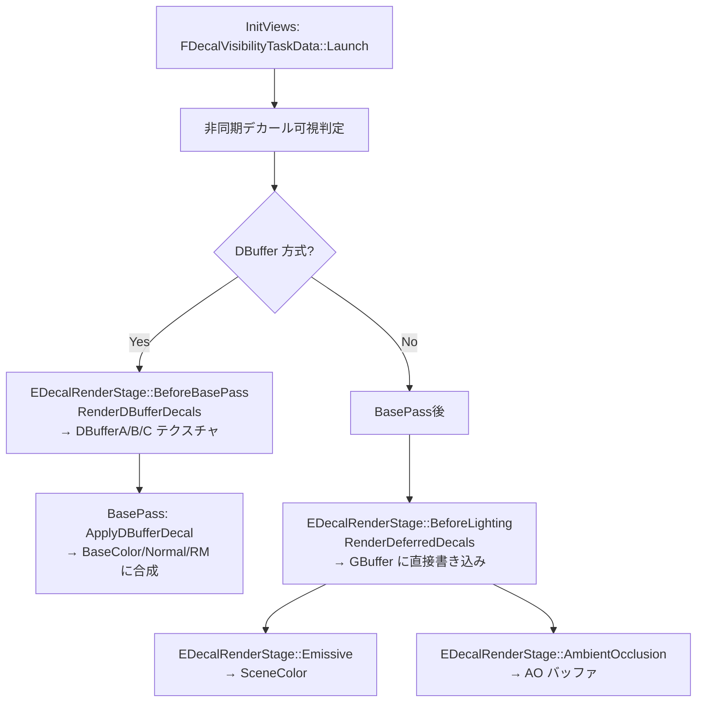

# 15: Deferred Decals 全体概要

- 対象ファイル: `DecalRenderingCommon.h` / `DecalRenderingShared.h` / `DecalRenderingShared.cpp`
- 関連: [[ref_deferred_decal]] / [[ref_dbuffer]]

---

## 概要

Deferred Decals は**投影ボックス（OBB）でジオメトリに重ねてマテリアルを塗る**機能。  
GBuffer に直接書き込む「GBuffer Decal」と、BasePass 前の DBuffer に書き込む「DBuffer Decal」の 2 方式がある。

---

## ブレンドモード対応表

| BlendMode | RenderStage | 書き込み先 | 説明 |
|-----------|------------|----------|------|
| Translucent | BeforeLighting | GBuffer（色/法線/RM）| 通常の半透明デカール |
| Stain | BeforeLighting | GBuffer（色のみ）| 色の乗算合成 |
| Normal | BeforeLighting | GBuffer（法線のみ）| 法線上書き |
| Emissive | Emissive | SceneColor | 発光デカール |
| DBuffer Translucent | BeforeBasePass | DBuffer | 事前合成（静的光源対応）|
| DBuffer Normal | BeforeBasePass | DBuffer | 法線の事前書き込み |
| DBuffer Color | BeforeBasePass | DBuffer | 色の事前書き込み |
| AmbientOcclusion | AmbientOcclusion | AO バッファ | AO デカール |

---

## アーキテクチャ（Mermaid）



---

## EDecalRenderStage（DecalRenderingCommon.h）

```cpp
enum class EDecalRenderStage : uint8
{
    None = 0,
    BeforeBasePass        = 1, // DBuffer デカール（GBuffer 前）
    BeforeLighting        = 2, // GBuffer デカール（BasePass 後・ライティング前）
    Mobile                = 3, // モバイル簡易版
    MobileBeforeLighting  = 4, // モバイル Deferred 版
    Emissive              = 5, // 発光デカール
    AmbientOcclusion      = 6, // AO デカール
    Num,
};
```

---

## フレームフロー

```
InitViews()
  └─ FDecalVisibilityTaskData::Launch()     // 非同期タスクでデカール可視判定

[DBuffer Decals]
RenderDBufferDecals()                        BeforeBasePass Stage
  → DBufferTextures（A/B/C）を生成・クリア
  → BeforeBasePass デカールをステンシルなしで投影描画
  → 結果を DBuffer テクスチャに格納

BasePass（各メッシュ）
  → ApplyDBufferDecal() で DBuffer を読み取り
  → BaseColor / Normal / RoughnessMetallic に乗算合成

[GBuffer Decals]
RenderDeferredDecals()                       BeforeLighting Stage
  → ステンシルで投影ボックス外をスキップ
  → BlendMode ごとに GBuffer チャンネルを上書き

[Emissive Decals]
RenderDeferredDecals()                       Emissive Stage
  → SceneColor に加算

[AO Decals]
RenderDeferredDecals()                       AmbientOcclusion Stage
  → AO バッファに書き込み
```

---

## 主要 CVar

| CVar | デフォルト | 説明 |
|------|----------|------|
| `r.DBuffer` | 1 | DBuffer デカール有効 |
| `r.Decal.StencilBackFaceSelection` | 1 | ステンシルによる背面除外 |
| `r.DecalFadeDuration` | 0.5 | フェードイン/アウト時間 |

---

## 関連リファレンス

- [[ref_deferred_decal]] — `FDecalBlendDesc` / `FVisibleDecal` / `FDecalVisibilityTaskData`
- [[ref_dbuffer]] — `FDBufferTextures` / `FDBufferData` / `ApplyDBufferDecal`
