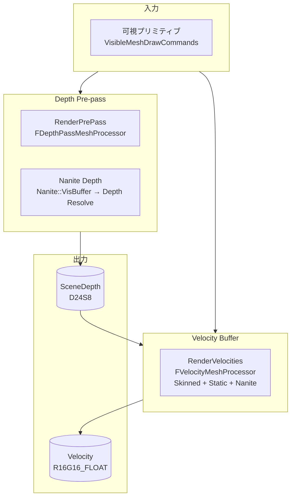

# Depth Pre-pass / Velocity Buffer 全体概要

- 取得日: 2026-04-12
- 対象: `D:\UnrealEngine\Engine\Source\Runtime\Renderer\Private\DepthRendering.h/.cpp` / `VelocityRendering.h/.cpp`
- 上位: [[01_rendering_overview]]
- Details: [[a_depth_rendering]] | [[b_velocity_rendering]]
- Reference: [[ref_depth_rendering]] | [[ref_velocity_rendering]]
- GPU 対応: [[GPU/DepthPrepass/TASK_CHECKLIST]]

---

## Depth Pre-pass とは

**BasePass より前に深度バッファを書き込む「EarlyZ」パス**。  
後続の BasePass で同じ深度を持つ可視ピクセルのみ PS を実行できるようになり  
不可視ピクセルへのシェーダー実行コストを排除する（Overdraw 削減）。

また **Velocity Buffer** はこのパスと同タイミングで描画され、  
TSR / TAA / Motion Blur が必要とする「前フレームとの差分ベクトル」を提供する。

---

## 全体アーキテクチャ



---

## EDepthDrawingMode（描画モード）

```cpp
// DepthRendering.h:22
enum EDepthDrawingMode
{
    DDM_None            = 0, // PrePass 無効
    DDM_NonMaskedOnly   = 1, // Opaque のみ（Masked はスキップ）
    DDM_AllOccluders    = 2, // Opaque + Masked（UseAsOccluder=true のみ）
    DDM_AllOpaque       = 3, // 全 Opaque（フル PrePass）
    DDM_MaskedOnly      = 4, // Masked のみ
    DDM_AllOpaqueNoVelocity = 5, // 全 Opaque（Velocity は除く → Velocity パスで後処理）
};
// r.EarlyZPass=3（デフォルト）→ DDM_AllOpaque
```

---

## フレームの流れ（概略）

```
FDeferredShadingSceneRenderer::Render()
  │
  ├─ RenderPrePass()                              DepthRendering.cpp
  │   ├─ EarlyZPassMode を決定（r.EarlyZPass）
  │   ├─ [Nanite] Nanite::VisBuffer → Depth Resolve（Nanite Depth Emit）
  │   └─ [非Nanite] FDepthPassMeshProcessor → DrawCall
  │
  └─ AddVelocityPass() / RenderVelocities()       VelocityRendering.cpp
      ├─ [Opaque] Velocity Buffer（Static / Skeletal Mesh）
      ├─ [Nanite] Nanite::RenderVelocities()
      └─ [Translucent] 別フェーズで RenderTranslucencyVelocities()
```

---

## 主要 CVar

| CVar | デフォルト | 説明 |
|------|----------|------|
| `r.EarlyZPass` | 3 | PrePass モード（0=なし/1=Opaque/2=Masked/3=All）|
| `r.EarlyZPassMovable` | 0 | 動的オブジェクトも PrePass に含める |
| `r.ParallelPrePass` | 1 | 並列 PrePass 描画 |
| `r.VelocityOutputPass` | 0 | Velocity 出力タイミング（0=PrePass後/1=BasePass中）|
| `r.BasePassOutputsVelocity` | 0 | BasePass 内で Velocity を同時出力 |

---

## 主要ソースファイル

| ファイル | 役割 |
|---------|------|
| `DepthRendering.h/.cpp` | Depth Pre-pass パス・`FDepthPassMeshProcessor`・`TDepthOnlyVS/PS` |
| `VelocityRendering.h/.cpp` | Velocity Buffer パス・`FVelocityMeshProcessor` |
| `SceneRendering.cpp` | `RenderPrePass()` の呼び出し位置 |
| `Nanite/NaniteDepth.cpp` | Nanite 深度 Resolve |

---

## RenderPrePass() → Velocity 詳細フロー

```
FDeferredShadingSceneRenderer::Render()
  │
  ├─ [1] GetDepthPassInfo(Scene) でモード確定
  │   EarlyZPassMode: DDM_AllOpaque (r.EarlyZPass=3)
  │   bEarlyZPassMovable: false（デフォルト）
  │
  ├─ [2] RenderPrePass()                          DepthRendering.cpp
  │   ├─ SceneDepth RT に D24S8 バインド
  │   ├─ [Nanite] Nanite::EmitDepth()
  │   │   → VisBuffer から深度値を Compute Shader で書き込み
  │   │
  │   ├─ [非Nanite Opaque] FDepthPassMeshProcessor
  │   │   bUsePositionOnlyStream=true → 頂点座標のみ送信（帯域節約）
  │   │   TDepthOnlyVS<true> で深度変換
  │   │   PS なし（または FDepthOnlyPS で Clip）
  │   │
  │   └─ [非Nanite Masked] FDepthPassMeshProcessor
  │       bUsePositionOnlyStream=false → テクスチャ UV も送信
  │       FDepthOnlyPS で OpacityMask < ClipValue → discard
  │
  └─ [3] AddVelocityPass() / RenderVelocities()
      ├─ FVelocityMeshProcessor で Skinned / Static メッシュの
      │   CurrentFramePos - PrevFramePos をピクセルシェーダーで計算
      ├─ [Nanite] Nanite::RenderVelocities()
      │   → NaniteVelocity CS で VisBuffer から Motion Vector を生成
      └─ Velocity テクスチャ（R16G16_FLOAT）に書き込み
```
