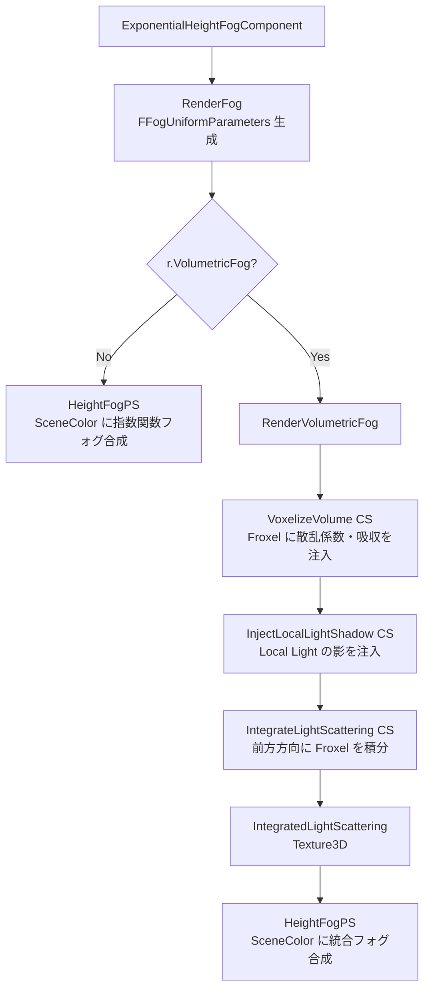

# 19: Fog 全体概要

- 対象ファイル: `FogRendering.h/.cpp` / `VolumetricFog.h/.cpp`
- 関連: [[ref_fog_rendering]] / [[ref_volumetric_fog]]

---

## 概要

UE5 の Fog は 2 種類が独立して動作する。  
Height Fog は軽量な指数関数近似、Volumetric Fog は 3D フラクセルで物理的な散乱を計算する。  
Volumetric Fog 有効時は Height Fog の結果を IntegratedLightScattering で置き換える。

---

## 2 種類の Fog

| 種別 | 計算方式 | 特徴 |
|------|---------|------|
| Exponential Height Fog | ピクセルシェーダーで指数関数近似 | 軽量・局所光源非対応 |
| Volumetric Fog | 3D フラクセルグリッドで光散乱積分 | 重いが光源・影対応 |

---

## アーキテクチャ（Mermaid）



---

## FFogUniformParameters（FogRendering.h）

```cpp
BEGIN_GLOBAL_SHADER_PARAMETER_STRUCT(FFogUniformParameters,)
    SHADER_PARAMETER(FVector4f, ExponentialFogParameters)   // FogDensity, FogHeightFalloff, etc.
    SHADER_PARAMETER(FVector4f, ExponentialFogParameters2)  // FogMaxOpacity, etc.
    SHADER_PARAMETER(FVector4f, ExponentialFogColorParameter)
    SHADER_PARAMETER(FVector4f, ExponentialFogParameters3)  // Fog Start Distance
    SHADER_PARAMETER(FVector4f, SkyAtmosphereAmbientContributionColorScale)
    SHADER_PARAMETER(FVector4f, InscatteringLightDirection)  // 散乱ライスト方向
    SHADER_PARAMETER(FVector4f, DirectionalInscatteringColor)
    SHADER_PARAMETER(float, EndDistance)                     // Fog 終端距離
    SHADER_PARAMETER(float, ApplyVolumetricFog)              // 1.0 = Volumetric Fog 使用
    SHADER_PARAMETER(float, VolumetricFogStartDistance)      // Volumetric Fog 開始距離
    SHADER_PARAMETER(float, VolumetricFogNearFadeInDistanceInv)
    SHADER_PARAMETER(FVector3f, VolumetricFogAlbedo)         // 散乱アルベド
    SHADER_PARAMETER(float, VolumetricFogPhaseG)             // Henyey-Greenstein g 値
    SHADER_PARAMETER_TEXTURE(TextureCube, FogInscatteringColorCubemap)
    SHADER_PARAMETER_RDG_TEXTURE(Texture3D, IntegratedLightScattering)
END_GLOBAL_SHADER_PARAMETER_STRUCT()
```

---

## フレームフロー

```
SetupFogUniformParameters()                 FogRendering.cpp
  → ExponentialHeightFogComponent のプロパティから UB 構築

[Height Fog のみ]
RenderFog()
  → FHeightFogVS / FHeightFogPS（全画面クワッド）
  → SceneDepth から WorldPos を再構築
  → 指数関数式 Fog: Transmittance = exp(-FogDensity × RayLength × HeightFactor)
  → InscatteringColor × (1 - Transmittance) + DirectionalInscattering

[Volumetric Fog]
RenderVolumetricFog()                       VolumetricFog.cpp
  │
  ├─ [A] Froxel グリッド確保
  │   GridSize = (Ceil(ViewSizeX/4), Ceil(ViewSizeY/4), GridSizeZ=64)
  │   VBufferA: RGBAFloat16（散乱係数・消散係数）
  │   VBufferB: RGBAFloat16（Emissive）
  │
  ├─ [B] VoxelizeVolumeFog CS
  │   → FVolumetricFogGlobalData を参照
  │   → LocalFogVolume / パーティクルシステムの密度を注入
  │   → Temporal Jitter（FrameJitterOffset）で時間的ノイズ
  │
  ├─ [C] InjectLocalLightShadow CS
  │   → Shadow Map からシャドウをサンプルして散乱係数をモジュレート
  │
  ├─ [D] IntegrateLightScattering CS
  │   → Z 方向（カメラから遠ざかる方向）に Froxel を逐次積分
  │   → 各 Froxel: ScatteringColor += σ_s × Transmittance × LightContrib
  │               Transmittance *= exp(-σ_e × Δz)
  │   → 出力: IntegratedLightScattering Texture3D
  │
  └─ [E] HeightFogPS（Height Fog と共通）
      IntegratedLightScattering.SampleLevel(FogUV, 0) でサンプル
      → ApplyVolumetricFog=1.0 のとき Volumetric Fog の結果を使用
```

---

## Froxel 座標系

```
Froxel = Frustum Voxel（フラスタム空間のボクセル）
  X, Y: ViewPort.xy / 4 のグリッドセル
  Z:    対数分布スライス（深度が遠くなるほどスライスが粗くなる）

  Z スライス計算:
  ZSlice = log2(SceneDepth × GridZParams.X + GridZParams.Y) × GridZParams.Z
  (ComputeZSliceFromDepth 関数)
```

---

## 主要 CVar

| CVar | デフォルト | 説明 |
|------|----------|------|
| `r.VolumetricFog` | 1 | Volumetric Fog 有効 |
| `r.VolumetricFog.GridPixelSize` | 8 | フラクセル 1 つのピクセルサイズ |
| `r.VolumetricFog.GridSizeZ` | 64 | Z 方向のスライス数 |
| `r.VolumetricFog.Distance` | 6000 | Volumetric Fog の最大距離 |
| `r.VolumetricFog.TemporalReprojection` | 1 | 時間的再投影有効 |

---

## 関連リファレンス

- [[ref_fog_rendering]] — `FFogUniformParameters` / `FExponentialHeightFogSceneInfo` / `FHeightFogVS`
- [[ref_volumetric_fog]] — `FVolumetricFogIntegrationParameters` / `FVolumetricFogGlobalData`
