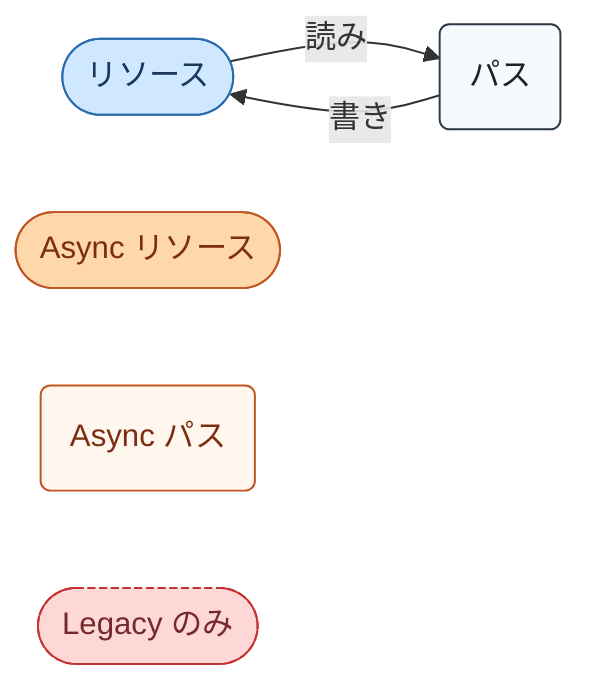
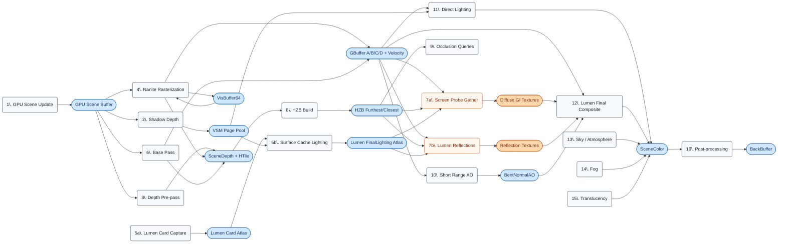
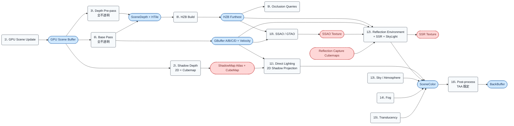

# GPU レンダーグラフ 概要

- 取得日: 2026-04-20
- 対象: `DeferredShadingRenderer.cpp` の 16 ステップを「リソース ⇔ パス」の有向グラフとして可視化
- 上位: [[01_gpu_overview]] / [[02_gpu_modern_vs_legacy]]
- 想定パイプライン: **Modern**（Nanite + Lumen + VSM 全て ON）が基準、Legacy 差分は各フェーズ末尾で補足

---

## このシリーズの目的

`01_gpu_overview.md` は 16 ステップを上から順に一覧するが、**各ステップがどのリソースを読み、何を書き出すか** が表形式では追いづらい。  
本シリーズでは Mermaid `flowchart` でパスとリソースを可視化し、**データ依存グラフとしてフレーム全体を見渡す** ことを目的とする。

1 枚で全部描くと 16 パス × 20+ リソースで読めなくなるため、5 フェーズに分割:

| フェーズ | 範囲 | ファイル |
|---------|------|---------|
| **A: Opaque Build** | [1][2][3][4][6] GPU Scene → Shadow → Depth → Nanite → Base Pass | [[04_render_graph_opaque]] |
| **B: Lumen Surface Cache** | [5a][5b] Card Capture + Surface Cache Lighting | [[05_render_graph_surface_cache]] |
| **C: Indirect + AO** | [7a][7b][8][9][10] Screen Probe + Reflections + HZB + Occlusion + AO | [[06_render_graph_indirect_ao]] |
| **D: Lighting + Composite** | [11][12][13][14] Direct Lighting + Final Composite + Sky + Fog | [[07_render_graph_lighting]] |
| **E: Translucency + Post** | [15][16] Translucency + Post-process | [[08_render_graph_final]] |

---

## Mermaid 表記ルール（全フェーズ共通）

- **リソース**（テクスチャ / バッファ）: 楕円 `R(["name"])`、水色
- **パス**（Compute / Raster Dispatch）: 角丸矩形 `P("name")`、グレー
- **AsyncCompute** 区間はオレンジ系 + `subgraph` で囲む
- **Legacy 限定**（Modern では存在しない / スキップされる）は赤破線枠
- **矢印**: リソース → パスは「読み」、パス → リソースは「書き」
- **Read-Modify-Write**: 2 本のエッジで表現（読み + 書き）。SceneColor のように多数のパスが加算書き込みする場合は太線で区別
- **Obsidian 対応の記法制約**:
    - ラベル内の `数字. ` パターンは Obsidian の Mermaid プリプロセッサが番号付きリストと誤認するため、**ピリオドを `\.` でエスケープする**（例: `P1("1\. GPU Scene Update")` / `P5a("5a\. Lumen Card Capture")`）
    - ラベルはダブルクオートで括る（` ` を含む場合は必須）

> **CPU 関数・シェーダーエントリ名** は各フェーズの入出力表に記載。図自体はリソース名のみに絞って読みやすさを優先する。

---

## 全体サマリフロー（Modern）

主要リソースのみを残し、細部を省いた俯瞰図:

**この図で省略している要素**（各フェーズで詳述）:

- Shadow Depth の中の 2D ShadowMap / CubeMap 分岐
- Nanite 内部の VisBuffer → 内部 HZB → GBuffer Export の多段構成
- Lumen Surface Cache 内の Card Atlas 4 種（Albedo / Normal / Emissive / Depth）と Radiosity の Radiance Atlas
- Lumen Screen Probe Gather 内の Radiance Cache / Probe Placement 等の中間バッファ
- Sky / Fog の LUT 群（TransmittanceLut / MultiScatteredLuminanceLut / VolumetricFog Froxel）
- Translucency の OIT / Separate Translucency バッファ
- Post-process の 10 段以上のシェーダー連鎖

---

## 全体サマリフロー（Legacy）

Nanite / Lumen / VSM を全て OFF にした場合:

Modern との主な差:

- Nanite 系ノード（VisBuffer / Nanite 内部 HZB）が消える → GBuffer は Base Pass のみが書き込む
- VSM Page Pool → 2D ShadowMap Atlas + CubeMap に置換
- Lumen Card Atlas / Diffuse GI / Reflection Textures が消え、ReflectionCapture Cubemap + SSR + SkyLight で代替
- Async レーンが消失（全て Graphics キュー）

---

## 読み方のヒント

- **各フェーズの図は単独で完結** するように入力・出力リソースを明示する（前フェーズから来たものは「入力」として左側に配置）。
- **SceneColor は全フェーズを通じて加算書き込みされる**ので、各フェーズでは「このフェーズが SceneColor に何を加算するか」に注目する。
- **AsyncCompute 区間**（Phase C）は Graphics キューと並列実行されるため、図では左右 2 レーンに分けて表示する。
- **読み順のデフォルト**: Mermaid は左→右で描画するので、資源の流れをその向きで追える。リソースが複数パスに読まれるときは分岐として表現。

---

## ue5-dive 起点

- 「RDG 全体の Pass 登録順を確認」 → `FDeferredShadingSceneRenderer::Render()` (`DeferredShadingRenderer.cpp`)
- 「RDG のリソース寿命管理」 → `FRDGBuilder::Execute()` → `FRDGPass::Execute()`
- 「パスの書き込み対象を特定」 → `FRDGBuilder::RegisterExternalTexture()` / `CreateTexture()` の呼び出し元
- 「AsyncCompute の分岐判定」 → `r.Lumen.AsyncCompute` / `r.Nanite.AsyncRasterization` / `r.RDG.AsyncCompute`
