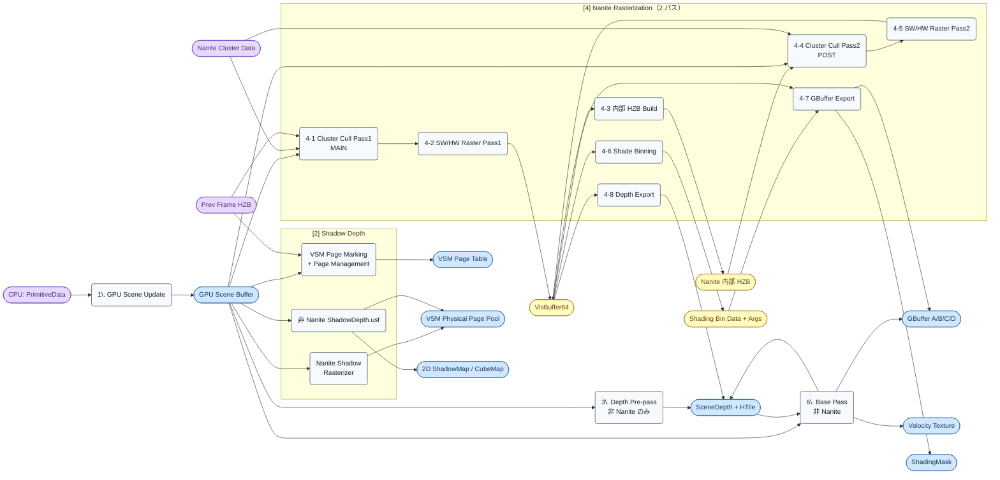
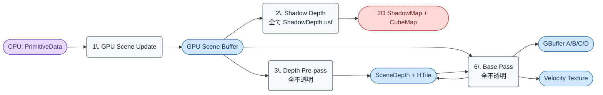

# Render Graph: Phase A — Opaque Build

- 取得日: 2026-04-20
- 対象ステップ: [1] GPU Scene / [2] Shadow Depth / [3] Depth Pre-pass / [4] Nanite / [6] Base Pass
- 上位: [[03_render_graph_overview]]
- 関連: [[01_gpu_overview]] / [[01_nanite_gpu_overview]] / [[01_vsm_gpu_overview]] / [[01_basepass_gpu_overview]] / [[01_depthprepass_gpu_overview]]

---

## このフェーズの役割

フレームの **GBuffer と SceneDepth を確定させる**。後続の全ライティング/GI/反射/ポストはこの 2 つを前提に動くため、Phase A がクリティカルパス。

主要なポイント:

1. **Nanite [4] と 非 Nanite [6] が同じ GBuffer を共有書き込み**
2. **Nanite 内部に 2 パスカリング + 内部 HZB** がある（前フレームの [8] HZB を起点に）
3. **Shadow Depth [2] は Nanite / 非 Nanite / 方向光 CSM / 点光 Cubemap で書き込み先が分岐**

---

## フェーズ図（Modern）



- **紫ノード**: フェーズ外から持ち込まれる入力（前フレーム成果物 / CPU データ / アセット）
- **水色ノード**: 本フェーズで確定する Render Target
- **黄色ノード**: 本フェーズ内でのみ使う中間バッファ（次フェーズには渡らない）

---

## リソース一覧（入出力早見表）

| リソース | 生成パス | 消費パス（本フェーズ） | 消費先（後続フェーズ） | 型 / フォーマット |
|---------|---------|----------------------|---------------------|------------------|
| GPU Scene Buffer | [1] | [2][3][4][6] | [5a][7a][7b][11][12][15] 等ほぼ全て | Structured Buffer |
| VSM Page Table | [2-V] | [2-N][2-S] | [5b][11] VSM Projection | R32_UINT Buffer |
| VSM Physical Page Pool | [2-N][2-S] | — | [5b][11] VSM Projection | Texture2DArray Depth |
| 2D ShadowMap / CubeMap | [2-S] | — | [5b][11]（VSM 非対応光源のみ）| Shadow Atlas Depth |
| SceneDepth + HTile | [3][4-8][6] | [4][6] | [7a][7b][8][9][10] 全 Indirect 系 | D24S8 / D32F |
| VisBuffer64 | [4-2][4-5] | [4-3][4-6][4-7][4-8] | — | R32G32_UINT |
| Nanite 内部 HZB | [4-3] | [4-4] | — | R32F Mip Chain |
| Shading Bin Data | [4-6] | [4-7] | — | Structured Buffer |
| GBuffer A/B/C/D | [4-7][6] | — | [7a][7b][10][11][12] | A: BaseColor+Metallic / B: Normal+Roughness / C: SSS / D: Custom |
| Velocity | [6] | — | [16] TSR/TAA | RG16F |
| ShadingMask | [4-7] | — | [11][12] Nanite ピクセル判定 | R8_UINT |

> **GBuffer は [4-7] と [6] の両方が書き込む** — RDG 上は `ERenderTargetLoadAction::ELoad` で Nanite の書き込みを引き継いで Base Pass が上書きする形。深度テストで Nanite ピクセルはスキップされる。

---

## パス別 入出力詳細

### [1] GPU Scene Update

| 項目 | 内容 |
|------|------|
| **入力** | CPU: PrimitiveData（`FScene::Primitives`）/ Light / InstanceData |
| **出力** | GPU Scene Buffer（`GPUSceneInstanceData` / `GPUScenePrimitive`） |
| **CPU 関数** | `FGPUScene::Update()` / `UploadDynamicPrimitiveShaderDataForView()` |
| **シェーダー** | `GPUSceneDataManagement.usf:GPUSceneSetInstancePrimitiveIdCS` |
| **キュー** | Graphics（または AsyncCompute） |

### [2] Shadow Depth

#### [2-V] VSM Page Marking + Management

| 項目 | 内容 |
|------|------|
| **入力** | GPU Scene, Prev Frame HZB, Light List |
| **出力** | VSM Page Table, Page Request Flags |
| **CPU 関数** | `FVirtualShadowMapArray::BeginMarkPages()` / `BuildPageAllocations()` |
| **シェーダー** | `VirtualShadowMapPageMarking.usf` / `VirtualShadowMapPhysicalPageManagement.usf` |

#### [2-N] Nanite Shadow Rasterizer

| 項目 | 内容 |
|------|------|
| **入力** | GPU Scene, Nanite Cluster Data, VSM Page Table |
| **出力** | VSM Physical Page Pool（Nanite 部分） |
| **CPU 関数** | `RenderVirtualShadowMaps()` → Nanite::RasterizePass（Shadow 用設定） |
| **シェーダー** | `NaniteRasterizer.usf`（Shadow permutation）/ `NaniteEmitShadow.usf:EmitShadowMapPS` |

#### [2-S] 非 Nanite ShadowDepth

| 項目 | 内容 |
|------|------|
| **入力** | GPU Scene（非 Nanite メッシュ）, VSM Page Table or ShadowMap Atlas |
| **出力** | VSM Physical Page Pool（非 Nanite 部分）or 2D ShadowMap / CubeMap |
| **CPU 関数** | `RenderVirtualShadowMapsNonNanite()` / `RenderShadowDepthMaps()` |
| **シェーダー** | `ShadowDepth.usf:Main / MainPS` |

### [3] Depth Pre-pass

| 項目 | 内容 |
|------|------|
| **入力** | GPU Scene（非 Nanite 不透明メッシュ）|
| **出力** | SceneDepthZ + HTile（非 Nanite 部分のみ） |
| **CPU 関数** | `RenderPrePass()` (`DepthRendering.cpp`) |
| **シェーダー** | `DepthOnlyVertexShader.usf:Main` / `DepthOnlyPixelShader.usf:Main`（Masked のみ） |

> Nanite オブジェクトは [4-8] で別途 SceneDepth に書き込むため、ここではスキップ。

### [4] Nanite Rasterization（8 サブパス）

| # | サブパス | 入力 | 出力 | シェーダー |
|---|---------|------|------|-----------|
| 4-1 | Cluster Cull Pass1（MAIN） | GPU Scene, NaniteCluster, Prev Frame HZB | 候補クラスタリスト | `NaniteClusterCulling.usf:NodeAndClusterCull`（MAIN） |
| 4-2 | SW/HW Raster Pass1 | 候補クラスタ | VisBuffer64 | `NaniteRasterizer.usf:MicropolyRasterize` / `HWRasterizeMS/PS` |
| 4-3 | 内部 HZB Build | VisBuffer64 | Nanite 内部 HZB | `HZB.usf:HZBBuildCS`（Nanite 専用設定） |
| 4-4 | Cluster Cull Pass2（POST） | GPU Scene, NaniteCluster, 内部 HZB | 追加候補クラスタリスト | `NaniteClusterCulling.usf:NodeAndClusterCull`（POST） |
| 4-5 | SW/HW Raster Pass2 | 追加候補 | VisBuffer64（追記） | 同上 |
| 4-6 | Shade Binning | VisBuffer64 | Shading Bin Data + Args | `NaniteShadeBinning.usf:ShadingBinBuildCS / ShadingBinReserveCS` |
| 4-7 | GBuffer Export | VisBuffer64, Shading Bin Data | GBuffer A/B/C/D, ShadingMask | `NaniteExportGBuffer.usf:EmitSceneDepthPS` 等 |
| 4-8 | Depth Export | VisBuffer64 | SceneDepth + HTile | `NaniteDepthExport.usf:DepthExport` |

**CPU 起点**: `RenderNanite()` → `Nanite::RasterizePass()` → `BuildShadingCommands()` → `DispatchBasePass()`

### [6] Base Pass（非 Nanite）

| 項目 | 内容 |
|------|------|
| **入力** | GPU Scene（非 Nanite 不透明メッシュ）, SceneDepth（深度テスト用） |
| **出力** | GBuffer A/B/C/D（Nanite の書き込みに追記）, Velocity, SceneDepth（Masked のみ更新） |
| **CPU 関数** | `RenderBasePass()` (`BasePassRendering.cpp`) |
| **シェーダー** | `BasePassVertexShader.usf:Main` / `BasePassPixelShader.usf:FPixelShaderInOut_MainPS`（マテリアル別生成） |
| **特記** | Substrate 有効時は MRT 構成が変わる（[[detail_substrate]] 参照） |

---

## AsyncCompute

`r.Nanite.AsyncRasterization=1` 時、**[4] 全体が AsyncCompute キューで実行** され、Graphics キューの [6] Base Pass と並列化される。

```
Graphics Queue         AsyncCompute Queue
─────────────────────  ──────────────────────────
[1] GPU Scene (一部)
[2] Shadow Depth
[3] Depth Pre-pass
[6] Base Pass          ←  [4] Nanite Rasterization
                           （VisBuffer / GBuffer Export / Depth Export 全部）

                           ※ Fence: Base Pass 完了後に GBuffer/Depth 同期
```

GBuffer への書き込みが衝突しないよう、RDG が暗黙的にフェンスを挿入する。

---

## Legacy パイプラインでの差分



変化点:

- **[4] Nanite ブロック全体が消滅** → VisBuffer / 内部 HZB / Shading Bin / Nanite GBuffer Export 全て存在しない
- **[3] と [6] が「全不透明」に拡大** → 非 Nanite のみの制限がなくなる
- **VSM 関連が消滅** → `VirtualShadowMapPageMarking.usf` 以降のパスが全て 2D `ShadowDepth.usf:Main` に集約
- GBuffer の書き込み元は [6] Base Pass のみ

---

## ue5-dive 起点

- 「Nanite が GBuffer を書くタイミング」 → `DispatchBasePass()` → `NaniteExportGBuffer.usf:EmitSceneDepthPS`
- 「VisBuffer のフォーマット定義」 → `NaniteShared.ush` / `Nanite::FPackedView`
- 「Nanite 内部 HZB の生成箇所」 → `Nanite::BuildHZB()` (`NaniteSceneRendering.cpp`)
- 「VSM ページ → Nanite ラスタライズ連携」 → `FVirtualShadowMapArray::RenderVirtualShadowMaps()` 内の Nanite::RasterizePass 呼び出し
- 「Base Pass で深度テストされる理由」 → `FBasePassMeshProcessor` の DepthStencil State 設定
- 「非 Nanite だけの Base Pass を確認」 → `RenderBasePassInternal()` + `FNaniteCommandInfo` の除外ロジック
