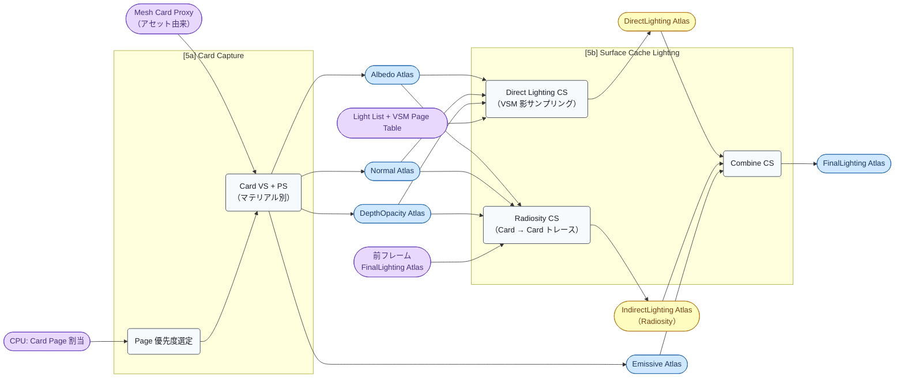
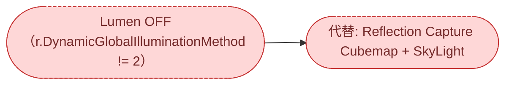

# Render Graph: Phase B — Lumen Surface Cache

- 取得日: 2026-04-20
- 対象ステップ: [5a] Lumen Card Capture / [5b] Surface Cache Lighting（Direct + Radiosity + Combine）
- 上位: [[03_render_graph_overview]]
- 関連: [[01_lumen_gpu_overview]] / [[detail_card_capture]] / [[detail_direct_lighting]] / [[detail_radiosity]]

---

## このフェーズの役割

シーンの簡略表現である **Mesh Card**（立方体6面のテクスチャ投影）に **ライティングを焼き込んで FinalLighting Atlas を生成** する。後続の Phase C（Screen Probe Gather / Reflections）がこの Atlas を GI / 反射の光源として **Ray トレースしてサンプリング** する。

ポイント:

1. **Card Capture** は毎フレーム全カードを再描画するのではなく、**Page 単位で優先度選定して部分的に更新**（キャッシュ方式）
2. **Card Atlas は 4 種類**（Albedo / Normal / Emissive / DepthOpacity）を並列出力
3. **Surface Cache Lighting = Direct + Radiosity + Combine** の 3 段パス。**VSM Page を読んで影を計算**
4. 出力 **FinalLighting Atlas** は Phase C / D / E で繰り返し読み込まれる「シーンの簡易ライティング表現」

---

## フェーズ図（Modern）



**重要な構造:**

- **Card Atlas は本フェーズで生成され、本フェーズ内で消費** される（DirectLighting / Radiosity が読む）
- **Radiosity は前フレームの FinalLighting を読む**（多バウンス GI のためのフィードバックループ）
- **Emissive は Combine 段で直接加算**（DirectLighting を経由しない）
- **FinalLighting Atlas のみ** が後続フェーズへ渡る

---

## リソース一覧（入出力早見表）

| リソース | 生成パス | 消費パス（本フェーズ） | 消費先（後続フェーズ） | 型 / フォーマット |
|---------|---------|----------------------|---------------------|------------------|
| Albedo Atlas | [5a] Card VS/PS | [5b Direct] [5b Radiosity] | — | Texture2D RGBA8 |
| Normal Atlas | [5a] Card VS/PS | [5b Direct] [5b Radiosity] | — | Texture2D RGBA8（Octa 圧縮）|
| Emissive Atlas | [5a] Card VS/PS | [5b Combine] | — | Texture2D R11G11B10F |
| DepthOpacity Atlas | [5a] Card VS/PS | [5b Direct] [5b Radiosity] | — | Texture2D R16F（Depth）/ R8（Opacity）|
| DirectLighting Atlas | [5b Direct] | [5b Combine] | — | Texture2D R11G11B10F |
| IndirectLighting Atlas | [5b Radiosity] | [5b Combine] | — | Texture2D R11G11B10F |
| **FinalLighting Atlas** | [5b Combine] | — | **[7a] Screen Probe Gather** / **[7b] Reflections** / [15] Translucency Volume Tracing | Texture2D R11G11B10F |

> **FinalLighting Atlas は Phase B の最終成果物** で、Phase C〜E の多くのパスが「シーンの簡易光源マップ」として参照する。

---

## パス別 入出力詳細

### [5a] Card Capture

Mesh Card アセット（事前生成、立方体 6 面のカードで粗く表現）のうち、**今フレームで更新が必要な Page** だけを選定して Atlas にラスタライズする。

#### [5a-1] Page 優先度選定

| 項目 | 内容 |
|------|------|
| **入力** | CPU: Card Page 割当, Camera 位置, 前フレーム可視情報 |
| **出力** | 今フレーム更新対象の CardPageId リスト |
| **CPU 関数** | `LumenScene::UpdateCardSceneBuffer()` (`LumenSceneRendering.cpp`) |
| **シェーダー** | `LumenCardComputeShader.usf:Main` 等（Page アロケーション系 CS） |

#### [5a-2] Card VS + PS

| 項目 | 内容 |
|------|------|
| **入力** | Mesh Card Proxy（アセット）, 更新対象 PageId リスト, マテリアル情報 |
| **出力** | Albedo / Normal / Emissive / DepthOpacity Atlas（MRT 同時書き込み） |
| **CPU 関数** | `LumenScene::RenderCardCaptureViews()` |
| **シェーダー** | `LumenCardVertexShader.usf:Main` + `LumenCardPixelShader.usf:Main` |
| **備考** | マテリアル別に PS が生成される（通常の GBuffer と同様のマテリアル評価） |

### [5b] Surface Cache Lighting

Card Atlas に対して **Direct → Radiosity → Combine** の 3 段で焼き込む。全て Compute。

#### [5b-1] Direct Lighting

| 項目 | 内容 |
|------|------|
| **入力** | Albedo / Normal / DepthOpacity Atlas, Light List, **VSM Page Table + PhysicalPagePool**, 2D ShadowMap（VSM 非対応光源） |
| **出力** | DirectLighting Atlas |
| **CPU 関数** | `RenderDirectLightingForLumenScene()` (`LumenSceneDirectLighting.cpp`) |
| **シェーダー** | `LumenSceneDirectLighting.usf`（複数 CS: カリング → サンプリング → 合成） |
| **特記** | 各 Card Texel ごとにライトリストを評価し、VSM からシャドウをサンプル |

#### [5b-2] Radiosity

| 項目 | 内容 |
|------|------|
| **入力** | Albedo / Normal / DepthOpacity Atlas, **前フレーム FinalLighting Atlas**（多バウンス GI のフィードバック）|
| **出力** | IndirectLighting Atlas |
| **CPU 関数** | `RenderRadiosityForLumenScene()` (`LumenRadiosity.cpp`) |
| **シェーダー** | `Radiosity/LumenRadiosity.usf`（複数 CS: Probe 配置 → トレース → Filter）|
| **特記** | Card から半球方向にレイを飛ばし、他の Card の FinalLighting を収集（Surface Cache 内で完結する簡易多バウンス） |

#### [5b-3] Combine

| 項目 | 内容 |
|------|------|
| **入力** | DirectLighting Atlas + IndirectLighting Atlas + Emissive Atlas |
| **出力** | FinalLighting Atlas |
| **CPU 関数** | `RenderLumenSceneLighting()` 末尾 (`LumenSceneLighting.cpp:217`) |
| **シェーダー** | `LumenSceneLighting.usf:CombineLumenSceneLightingCS` |
| **特記** | 単純加算（Direct + Indirect + Emissive）。次フレームの Radiosity 入力にもなる |

---

## AsyncCompute

[5b] の Direct / Radiosity / Combine は Compute Shader なので理論上 AsyncCompute 可能だが、**UE5 既定では Graphics キュー** で [5a] の直後に直列実行される（`r.Lumen.AsyncCompute` の制御範囲は主に Phase C）。

```
Graphics Queue:
  [4] Nanite Rasterization
  [5a] Card Capture（VS+PS なので Graphics 必須）
  [5b] Surface Cache Lighting（Direct → Radiosity → Combine）
  [6] Base Pass
```

---

## Legacy パイプラインでの差分

**[5a][5b] 全体がスキップ** される。Lumen Surface Cache は Lumen GI の前提であり、`r.DynamicGlobalIlluminationMethod != 2` のときは Card Atlas / FinalLighting Atlas 自体が存在しない。



Legacy での Indirect Lighting の入手元（Phase D で詳述）:

- **Reflection Capture Cubemaps**（シーンに配置する静的キューブマップ、オフライン生成）→ ReflectionEnvironment パスが参照
- **SkyLight Cubemap**（空 LUT から生成）→ ReflectionEnvironment パスが参照
- **SSGI**（`r.DynamicGlobalIlluminationMethod=1` 時のみ）→ 画面空間トレースで GBuffer から直接生成（Surface Cache なし）
- **IndirectLighting Cache**（昔ながらの Volume Sample ベース、非動的オブジェクト向け）→ GBuffer Pass で直接サンプル

つまり Legacy では **「シーンの簡易ライティング表現」に相当するデータ構造は存在せず**、静的キャプチャと画面空間情報で代替する。

---

## ue5-dive 起点

- 「Card Atlas の Page レイアウト」 → `FLumenSceneData::CardAllocator` + `LumenCardPage.ush`
- 「Card Capture の Render Target 設定」 → `LumenScene::RenderCardCaptureViews()` 内の `FRDGTextureRef` 作成箇所
- 「Direct Lighting のライトカリング」 → `LumenSceneDirectLighting.usf:BuildLightTilesCS` 系
- 「Radiosity Probe 配置」 → `LumenRadiosity.usf:LumenRadiosityBuildProbes`
- 「FinalLighting の読み出し側（Phase C）」 → `LumenScreenProbeTracing.usf` で `SurfaceCacheFinalLighting` をサンプル
- 「Card アセット生成」 → Editor 側 `MeshCardRepresentation.cpp`（本稿の範囲外）
