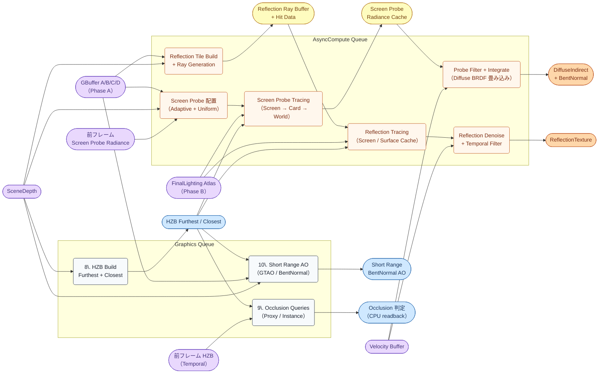
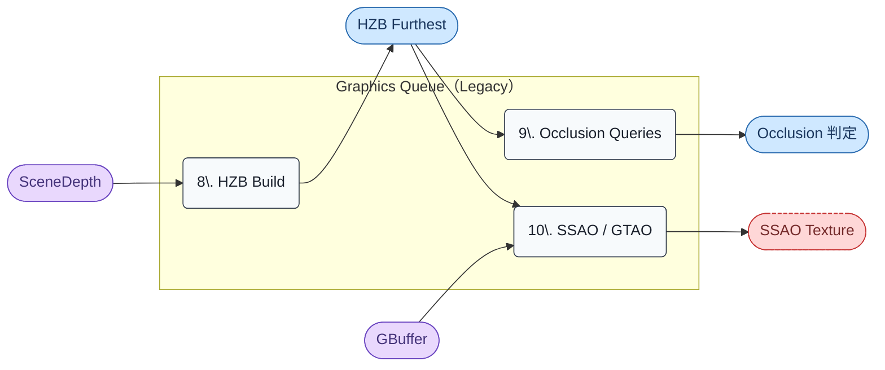

# Render Graph: Phase C — Indirect Lighting + AO

- 取得日: 2026-04-20
- 対象ステップ: [7a] Screen Probe Gather / [7b] Lumen Reflections / [8] HZB Build / [9] Occlusion Queries / [10] Short Range AO
- 上位: [[03_render_graph_overview]]
- 関連: [[05_render_graph_surface_cache]] / [[01_lumen_gpu_overview]] / [[detail_screen_probe_gather]] / [[detail_reflections]]

---

## このフェーズの役割

Phase B で生成した **FinalLighting Atlas** を「光源」として、画面空間から **Ray をトレースして Indirect Lighting（GI + Reflection）を収集** する。同時に Graphics キューで **HZB を構築**（Occlusion Culling・次フレーム Nanite 用）、**Short Range AO** を計算、**CPU 発行 Occlusion Queries** を処理する。

ポイント:

1. **[7a][7b] は AsyncCompute レーン** に乗る（`r.Lumen.AsyncCompute=1`）。Graphics キューの [8][9][10] と並列実行される
2. **HZB は Graphics で先に完成** し、AsyncCompute の [7a][7b] から read-only で参照される（Lumen Ray Tracing の加速構造として）
3. **Screen Probe Gather**: 画面空間に配置した Probe から半球レイを Card 群にトレース → Screen-space Radiance Cache に蓄積 → Full-res へ Integrate
4. **Lumen Reflections**: GBuffer Normal + Roughness から BRDF ローブでレイを生成し、**Card Atlas / Screen Trace / Surface Cache の 3 段フォールバック** で交差判定
5. HZB は **次フレームの Nanite Cluster Cull Pass1** と **Lumen Screen Trace** の両方で使われる cross-frame リソース

---

## フェーズ図（Modern、AsyncCompute 2 レーン）



**重要な構造:**

- **HZB は Graphics で先に完成** → AsyncCompute の Screen Trace / Reflection Trace が read-only 参照
- **Card Atlas / FinalLighting は [7a] と [7b] の共通光源**（Surface Cache は Indirect 全般の hit 光源）
- Filter / Denoise 段で **前フレーム結果と Velocity で Temporal Reprojection**
- AsyncCompute 区間は **Base Pass [6] 完了後に fence** が張られ、**Direct Lighting [11] 開始前に join** される

---

## リソース一覧（入出力早見表）

| リソース | 生成パス | 消費パス（本フェーズ） | 消費先（後続フェーズ） | 型 / フォーマット |
|---------|---------|----------------------|---------------------|------------------|
| HZB Furthest | [8] HZB Build | [7a Trace] [7b Trace] [9] [10] | 次フレーム [4] Nanite Cull / [7a][7b] | Texture2D R16F（Mip 連鎖） |
| HZB Closest | [8] HZB Build | [7b Trace]（reflection 早期終了） | 次フレーム [4] Nanite Cull | Texture2D R16F（Mip 連鎖） |
| Screen Probe Radiance Cache | [7a Trace] | [7a Filter] | — | Texture2DArray R11G11B10F |
| Reflection Ray Buffer | [7b Gen] | [7b Trace] | — | StructuredBuffer |
| **DiffuseIndirect + BentNormal** | [7a Filter] | — | **[12] Lumen Final Composite** | Texture2D R11G11B10F + R8G8B8A8 |
| **ReflectionTexture** | [7b Denoise] | — | **[12] Lumen Final Composite** | Texture2D R11G11B10F |
| Short Range BentNormal AO | [10] SRAO | — | [12] Final Composite（AO 乗算） | Texture2D R8G8B8A8 |
| Occlusion 判定結果 | [9] Occlusion Queries | — | CPU（次フレームの Visibility 判定） | Buffer（readback） |

> **DiffuseIndirect / ReflectionTexture** は Phase D の Final Composite で SceneColor に加算される。HZB は本フレーム後半 + 次フレーム頭 の両方で参照される cross-frame リソース。

---

## パス別 入出力詳細

### [7a] Screen Probe Gather（Lumen Diffuse GI）

GBuffer と SceneDepth から画面空間に Probe を配置し、各 Probe から半球方向にレイを飛ばす。レイは Screen → Card Atlas の順で交差判定し、hit 時に FinalLighting をサンプル。最後に Full-res へ Integrate して Diffuse GI を得る。

#### [7a-1] Probe 配置（Adaptive + Uniform）

| 項目 | 内容 |
|------|------|
| **入力** | GBuffer A/B/C/D, SceneDepth, 前フレーム Screen Probe Radiance |
| **出力** | ProbeHeader / ProbeIndirectionTexture（どこに Probe があるかの空間索引） |
| **CPU 関数** | `RenderLumenScreenProbeGather()` (`LumenScreenProbeGather.cpp`) |
| **シェーダー** | `LumenScreenProbeGather.usf:ScreenProbeDownsampleDepthUniform` / `ScreenProbeAdaptivePlacement` |
| **特記** | Adaptive Probe は高周波領域（エッジ・曲面）で密に配置される |

#### [7a-2] Screen Probe Tracing（Ray 実行）

| 項目 | 内容 |
|------|------|
| **入力** | ProbeHeader, HZB Furthest, Card Atlas, **FinalLighting Atlas**, DepthOpacity Atlas |
| **出力** | Screen Probe Radiance Cache（Octahedron 投影、Probe × 方向） |
| **CPU 関数** | `TraceScreenProbes()` |
| **シェーダー** | `LumenScreenProbeTracing.usf:ScreenProbeTraceScreenTexturesCS` / `ScreenProbeTraceMeshSDFs` / `ScreenProbeTraceVoxelsCS` |
| **特記** | **3 段フォールバック**: ① Screen Trace（HZB で画面内衝突）→ ② Mesh SDF / Global SDF → ③ ボクセル → 最終的に Card へ hit → `SurfaceCacheFinalLighting` サンプル |

#### [7a-3] Probe Filter + Integrate

| 項目 | 内容 |
|------|------|
| **入力** | Screen Probe Radiance Cache, GBuffer Normal, Velocity Buffer |
| **出力** | DiffuseIndirect Texture + BentNormal Texture（Full-res） |
| **CPU 関数** | `FilterScreenProbes()` + `ScreenProbeIntegrateGatherCS` |
| **シェーダー** | `LumenScreenProbeFiltering.usf` + `LumenScreenProbeIntegrate.usf:ScreenProbeIntegrateCS` |
| **特記** | 隣接 Probe の Radiance を Bilateral Filter で平滑化 → Pixel 単位で半球積分（Diffuse BRDF 畳み込み）→ Temporal Reprojection で前フレーム統合 |

### [7b] Lumen Reflections

GBuffer Roughness + Normal から BRDF ローブを決めて Reflection Ray を生成。**Screen Trace → Surface Cache** の順で hit を探す。

#### [7b-1] Tile Build + Ray Generation

| 項目 | 内容 |
|------|------|
| **入力** | GBuffer B（Roughness）, GBuffer A（Normal）, SceneDepth |
| **出力** | Reflection Tile Buffer（Rough/Smooth/Mirror で分類）, Reflection Ray Buffer |
| **CPU 関数** | `RenderLumenReflections()` (`LumenReflections.cpp`) |
| **シェーダー** | `LumenReflections/LumenReflectionTileClassification.usf` / `GenerateRays.usf` |
| **特記** | Roughness で Ray 本数を可変化（Mirror は 1 本、Rough は間引き後 Spatial Reuse） |

#### [7b-2] Reflection Tracing

| 項目 | 内容 |
|------|------|
| **入力** | Ray Buffer, HZB Furthest/Closest, **Card Atlas + FinalLighting Atlas**, Mesh SDF, Global SDF |
| **出力** | Hit 色 + Hit 距離（Reflection Ray Buffer へ書き戻し） |
| **CPU 関数** | `TraceReflections()` |
| **シェーダー** | `LumenReflections/ReflectionTracing.usf` + `ReflectionHardwareRayTracing.usf`（HWRT 時） |
| **特記** | **Screen Trace**（HZB, 低ラフ Mirror 向け）→ 失敗時 **Surface Cache Trace**（Card Atlas サンプル）にフォールバック。HWRT 有効時は Mesh BVH も併用 |

#### [7b-3] Denoise + Temporal Filter

| 項目 | 内容 |
|------|------|
| **入力** | Ray Buffer（Hit 情報）, Velocity Buffer, SceneDepth, 前フレーム Reflection |
| **出力** | ReflectionTexture（Full-res） |
| **CPU 関数** | `DenoiseReflections()` |
| **シェーダー** | `LumenReflections/ReflectionSpatialResolve.usf` + `ReflectionTemporalFilter.usf` |
| **特記** | Spatial Resolve（近傍タイルから Hit 色 Reuse）→ Temporal（Velocity で前フレームと統合）。Rough ほど強く blur |

### [8] HZB Build（パイプライン全体 HZB）

SceneDepth から Mip 連鎖の **Hierarchical Z-Buffer** を生成。本フェーズと次フレームの両方で使われる。

| 項目 | 内容 |
|------|------|
| **入力** | SceneDepth（Phase A で生成済み、Nanite による GBuffer Export も含む）|
| **出力** | HZB Furthest（Mip0〜N、保守的に遠い深度）+ HZB Closest（Reflection 用、近い深度）|
| **CPU 関数** | `BuildHZB()` (`HZB.cpp`) |
| **シェーダー** | `HZB.usf:HZBBuildCS` |
| **特記** | **Nanite 内部 HZB とは別物**（Phase A 内で ephemeral に使われる内部 HZB は本 HZB とは独立）。本 HZB は **次フレームの Nanite Cluster Cull Pass1** と **本フレーム [7a][7b][9]** の両方で参照 |

### [9] Occlusion Queries（Proxy / Instance）

Nanite 非対応メッシュや CPU Primitive の可視判定を HZB でまとめて実行。

| 項目 | 内容 |
|------|------|
| **入力** | HZB Furthest, Primitive Bounds（前フレーム判定済みの候補） |
| **出力** | Visibility 判定結果（CPU へ readback、次フレームの Draw Call 発行に利用） |
| **CPU 関数** | `RenderOcclusion()` (`SceneOcclusion.cpp`) |
| **シェーダー** | `HZBOcclusion.usf:HZBTestCS` |
| **特記** | 結果は CPU 側で **数フレーム遅延して** 反映される（Latent Occlusion）|

### [10] Short Range AO（GTAO / Screen Space Bent Normal）

Lumen の Indirect に含まれない高周波な接触影（Contact Shadow）を GBuffer + SceneDepth から画面空間で計算。

| 項目 | 内容 |
|------|------|
| **入力** | GBuffer A（Normal）, SceneDepth, HZB |
| **出力** | BentNormal AO（Full-res、AO 係数 + BentNormal 方向） |
| **CPU 関数** | `AddPostProcessingAmbientOcclusion()` + `AddGTAOPass()` (`PostProcessAmbientOcclusion.cpp`) |
| **シェーダー** | `PostProcessAmbientOcclusion.usf` + `GTAO.usf:GTAOHorizonSearchCS` |
| **特記** | `r.AmbientOcclusion.Method`（0=SSAO, 1=GTAO）で切替。GTAO は Lumen と併用される前提で短距離のみ評価 |

---

## AsyncCompute 詳細

```
Graphics Queue:                          AsyncCompute Queue:
  [6] Base Pass 終了                       （待機）
  ─── fence signal ───────────────────→  [7a] Screen Probe Gather 開始
  [8] HZB Build                            [7a-1] Probe 配置
  [9] Occlusion Queries ←─ HZB 待ち        [7a-2] Tracing ←─ HZB 待ち（read-only）
  [10] Short Range AO ←─ HZB 待ち          [7a-3] Filter + Integrate
                                           [7b] Lumen Reflections
                                           [7b-1] Tile Build
                                           [7b-2] Tracing ←─ HZB 待ち
                                           [7b-3] Denoise
  ─── fence wait ←─────────────────────── join
  [11] Direct Lighting（DiffuseIndirect / ReflectionTexture が揃って開始）
```

**制御 CVar:**

- `r.Lumen.DiffuseIndirect.AsyncCompute`（[7a] を AsyncCompute へ、既定 1）
- `r.Lumen.Reflections.AsyncCompute`（[7b] を AsyncCompute へ、既定 1）
- `r.RDG.AsyncCompute`（RDG の AsyncCompute 全体マスタースイッチ）

**HZB への依存**: AsyncCompute 側の Tracing は HZB 完成を待つため、Graphics の [8] HZB Build が AsyncCompute 開始より先に signal する必要がある。HZB が間に合わない場合、AsyncCompute は前フレームの HZB で代用する実装もある（`r.Lumen.ScreenProbeGather.HierarchicalScreenTraces.HZBTraversal`）。

---

## Legacy パイプラインでの差分

**[7a][7b] 全体がスキップ** される。代わりに:

- `r.DynamicGlobalIlluminationMethod=1` → **SSGI**（Screen Space GI、`ScreenSpaceDiffuseIndirect.usf`）を Phase D の [12] 代替パスで実行
- `r.DynamicGlobalIlluminationMethod=0` → GI なし（ReflectionCapture + SkyLight のみで代用）
- `r.ReflectionMethod=1` → **SSR**（Screen Space Reflection）を Phase D の Reflection Environment 内で実行
- `r.ReflectionMethod=0` → **ReflectionCapture Cubemap** のみ

つまり Legacy では Phase C で走るのは **[8] HZB / [9] Occlusion / [10] SRAO のみ**、そして AsyncCompute は実質使われない。



Legacy では **Diffuse GI / Reflection Texture という概念がフェーズ C に存在しない** ため、Phase D の [12] が大きく変わる（Reflection Environment パスで Cubemap + SSR + SkyLight を合成）。

---

## ue5-dive 起点

- 「Screen Probe 配置の Adaptive ロジック」 → `LumenScreenProbeGather.usf:ScreenProbeAdaptivePlacementCS`
- 「Screen Trace のフォールバック順」 → `LumenScreenProbeTracing.usf` 内の `TRACE_SCREEN` / `TRACE_MESH_SDF` / `TRACE_VOXELS` マクロ分岐
- 「Reflection の 3 段フォールバック実装」 → `LumenReflections/ReflectionTracing.usf:ReflectionClearTileCS` + `ReflectionTraceMeshSDFsCS`
- 「HZB Furthest vs Closest の使い分け」 → `HZB.cpp:BuildHZBFurthest()` / `BuildHZBClosest()`
- 「AsyncCompute の fence 張り方」 → `FRDGBuilder::Execute()` 内の `ERDGPassFlags::AsyncCompute` 判定
- 「次フレームに HZB が渡る経路」 → `FSceneViewState::PrevFrameViewInfo.HZB`
