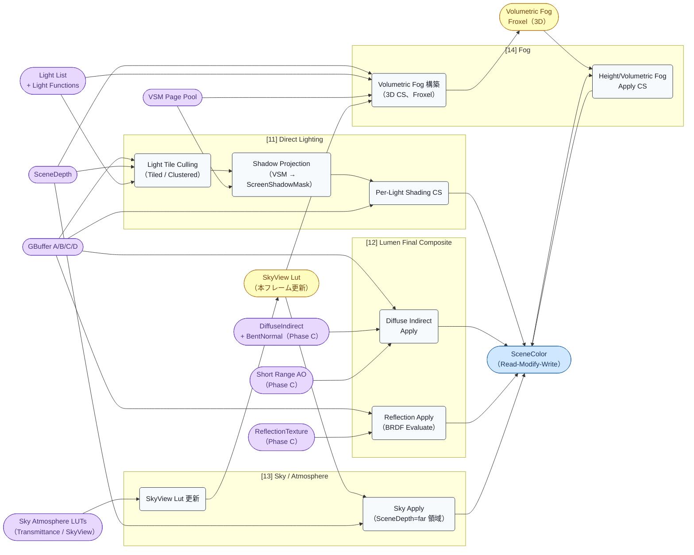
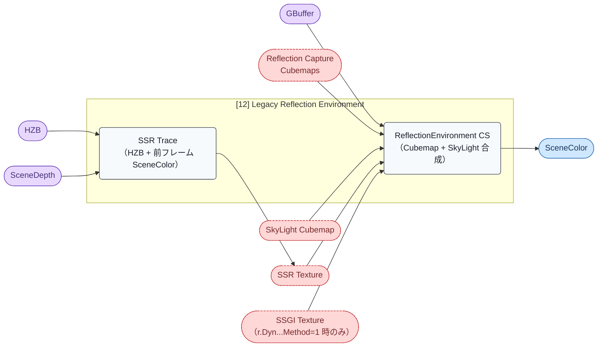

# Render Graph: Phase D — Lighting + Composite

- 取得日: 2026-04-20
- 対象ステップ: [11] Direct Lighting / [12] Lumen Final Composite / [13] Sky / Atmosphere / [14] Fog
- 上位: [[03_render_graph_overview]]
- 関連: [[06_render_graph_indirect_ao]] / [[04_render_graph_opaque]] / [[detail_direct_lighting]] / [[detail_sky_atmosphere]]

---

## このフェーズの役割

GBuffer（Phase A）と Indirect Lighting（Phase C）を材料に **SceneColor を構築する中核フェーズ**。順序は:

1. **[11] Direct Lighting**: VSM からシャドウをサンプリングして光源毎に SceneColor へ加算
2. **[12] Lumen Final Composite**: DiffuseIndirect + Reflection + BentNormal AO + Emissive を SceneColor へ加算
3. **[13] Sky / Atmosphere**: 空の色を SceneDepth=far の領域に描画、大気散乱を適用
4. **[14] Fog**: Exponential / Volumetric Fog を SceneColor に適用

ポイント:

1. **SceneColor はこのフェーズ全体を通して read-modify-write** される（各パスが加算・乗算）
2. **VSM Page Table → PhysicalPagePool** のサンプリングが Direct Lighting の核
3. **Volumetric Fog は Froxel（3D テクスチャ）** を先に構築し、後段で Ray March しながら SceneColor へ適用
4. Legacy では [12] が **Reflection Environment + SSR + SkyLight Cubemap 合成** に置換される

---

## フェーズ図（Modern）

**重要な構造:**

- **SceneColor は 4 つのサブフェーズ全てが書き込む** 共有リソース（ADD 合成）
- **VSM は [11] Direct Lighting と [14] Volumetric Fog の両方で参照**（Fog もボリューム内で影を計算する）
- **SkyView Lut は [13] で更新後、[14] Fog が参照**（Fog に空の色を溶かす）
- Volumetric Fog Froxel は [14] 内で構築 → 同じ [14] 内で消費される中間

---

## リソース一覧（入出力早見表）

| リソース | 生成/更新パス | 消費パス | 型 / フォーマット |
|---------|-------------|---------|------------------|
| **SceneColor** | [11][12][13][14] 全て書き込み | 次フェーズ [15] Translucency / [16] PostProcess | Texture2D R11G11B10F |
| ScreenShadowMask | [11 Shadow] | [11 Shade] | Texture2D R8 |
| SkyView Lut | [13 Lut] | [13 Apply] + [14 Vol] | Texture2D R11G11B10F（Mip 付） |
| Volumetric Fog Froxel | [14 Vol] | [14 Apply] | Texture3D RGBA16F |
| DistanceToFarShadowMap | [11 Shadow]（VSM 非対応光源用） | [11 Shade] | Texture2D R16F |

> Phase D の **唯一の外部出力は SceneColor**。他はフェーズ内で完結する中間。

---

## パス別 入出力詳細

### [11] Direct Lighting

各ライト毎に「GBuffer サンプル → シャドウ評価 → BRDF 評価 → SceneColor へ加算」を行う。実体は光源数 × タイル数の CS ディスパッチ。

#### [11-1] Light Tile Culling

| 項目 | 内容 |
|------|------|
| **入力** | Light List, SceneDepth, GBuffer |
| **出力** | TiledLightGrid（Tile × LightIndex 配列）|
| **CPU 関数** | `CullLightsToTiles()` (`ClusteredLighting.cpp` 等) |
| **シェーダー** | `LightCulling.usf:LightGridInjectionCS` |
| **特記** | Forward / Clustered Lighting で利用。Deferred では影響度の高いライトのみタイル化 |

#### [11-2] Shadow Projection（VSM サンプリング）

| 項目 | 内容 |
|------|------|
| **入力** | **VSM Page Table + PhysicalPagePool**, SceneDepth, Light Transform |
| **出力** | ScreenShadowMask（ライト毎、Full-res の R8 シャドウ係数）|
| **CPU 関数** | `RenderShadowProjections()` (`ShadowRendering.cpp`) |
| **シェーダー** | `VirtualShadowMapProjection.usf:VirtualShadowMapProjectionCS` + `ShadowProjectionPixelShader.usf`（2D 非仮想用） |
| **特記** | Page Table を辿って PhysicalPage を引き、PCF / Contact Hardening Shadow を適用。VSM 非対応光源（Spot 遠距離等）は 2D Shadow Projection にフォールバック |

#### [11-3] Per-Light Shading

| 項目 | 内容 |
|------|------|
| **入力** | GBuffer A/B/C/D, ScreenShadowMask, SceneDepth, Light Parameters |
| **出力** | SceneColor（加算） |
| **CPU 関数** | `RenderLights()` → `RenderLight()` 光源毎ループ |
| **シェーダー** | `DeferredLightPixelShaders.usf:DeferredLightPixelMain` / `DeferredLightTiledCS` |
| **特記** | BRDF 評価（Diffuse Lambert + Specular GGX）。Light Function（プロジェクター）は専用 RT に描いてから参照 |

### [12] Lumen Final Composite

Phase C で生成した Diffuse GI / Reflection を BRDF Evaluate して SceneColor に加算。

#### [12-1] Diffuse Indirect Apply

| 項目 | 内容 |
|------|------|
| **入力** | GBuffer A（Normal）/ B（BaseColor, Metallic）/ C（Specular, Roughness）, DiffuseIndirect, BentNormal, Short Range AO |
| **出力** | SceneColor（加算） |
| **CPU 関数** | `RenderLumenFinalGather()` (`LumenFinalGather.cpp`) |
| **シェーダー** | `LumenFinalGather.usf:LumenDiffuseIndirectCS` |
| **特記** | Diffuse BRDF 畳み込み済みの値を BaseColor × (1-Metallic) で変調。BentNormal で方向性 AO を適用 |

#### [12-2] Reflection Apply

| 項目 | 内容 |
|------|------|
| **入力** | GBuffer A（Normal）/ C（Specular, Roughness）, ReflectionTexture |
| **出力** | SceneColor（加算） |
| **CPU 関数** | `RenderLumenReflectionApply()` |
| **シェーダー** | `LumenReflections/ReflectionApply.usf:ReflectionApplyCS` |
| **特記** | Specular BRDF（GGX）で ReflectionTexture をウェイト付けて加算。Fresnel / Metallic を考慮 |

### [13] Sky / Atmosphere

Sky Atmosphere Component がある場合に SkyView Lut を本フレーム用に更新し、SceneDepth=far の領域に空の色を描画。

#### [13-1] SkyView Lut 更新

| 項目 | 内容 |
|------|------|
| **入力** | Transmittance Lut, MultiScatteredLuminance Lut（静的 LUT）|
| **出力** | SkyView Lut（本フレーム用、カメラ向き依存の天球 Radiance）|
| **CPU 関数** | `RenderSkyAtmosphereLookUpTables()` (`SkyAtmosphereRendering.cpp`) |
| **シェーダー** | `SkyAtmosphere.usf:RenderSkyViewLutCS` |
| **特記** | 既存の Transmittance / MultiScattered Lut はエンジン起動時に 1 回だけ生成される静的 LUT。SkyView Lut のみ毎フレーム更新 |

#### [13-2] Sky Apply

| 項目 | 内容 |
|------|------|
| **入力** | SkyView Lut, SceneDepth（=far 判定に使う）|
| **出力** | SceneColor（空ピクセルに書き込み + 大気散乱適用） |
| **CPU 関数** | `RenderSkyAtmosphereInternal()` |
| **シェーダー** | `SkyAtmosphere.usf:RenderSkyAtmosphereRayMarchingPS` |
| **特記** | SceneDepth=1（far）のピクセルは空、それ以外は大気散乱（Aerial Perspective）のみ適用 |

### [14] Fog

Exponential Height Fog と Volumetric Fog を SceneColor に適用。Volumetric Fog は 3D テクスチャ（Froxel）を先に構築する。

#### [14-1] Volumetric Fog 構築

| 項目 | 内容 |
|------|------|
| **入力** | SceneDepth, Light List, **VSM**, SkyView Lut, 前フレーム Volumetric Fog（Temporal）|
| **出力** | Volumetric Fog Froxel（Texture3D RGBA16F、RGB=散乱光 A=透過率）|
| **CPU 関数** | `ComputeVolumetricFog()` (`VolumetricFog.cpp`) |
| **シェーダー** | `VolumetricFogLightScattering.usf:VolumetricFogLightScatteringCS` + `VolumetricFogAccumulation.usf:VolumetricFogFinalIntegrationCS` |
| **特記** | 各 Froxel で VSM からシャドウサンプル → Inscattering 計算 → Ray March 前段の Accumulation。Temporal Reprojection で前フレーム統合 |

#### [14-2] Fog Apply

| 項目 | 内容 |
|------|------|
| **入力** | SceneColor, SceneDepth, Volumetric Fog Froxel, Exponential Fog parameters |
| **出力** | SceneColor（乗算 + 加算） |
| **CPU 関数** | `RenderFog()` (`FogRendering.cpp`) |
| **シェーダー** | `HeightFogCombine.usf:ExponentialHeightFogPS`（Volumetric Fog 併用時は 3D テクスチャからサンプル） |
| **特記** | Fog Color = Extinction × SceneColor + InScattering。Volumetric Fog は Froxel を SceneDepth 対応位置でサンプル |

---

## AsyncCompute

Phase D は原則 **Graphics キュー で直列実行**。SceneColor の RMW が多数発生するため AsyncCompute のメリットが薄い。例外:

- **Volumetric Fog の一部** が AsyncCompute に乗るビルドもある（`r.VolumetricFog.AsyncCompute`）が、既定は OFF
- SkyView Lut 更新は短時間で完了するため Graphics のまま

Phase C と Phase D の境界で AsyncCompute の fence join が発生し、DiffuseIndirect / ReflectionTexture が揃ってから [11] が開始する。

---

## Legacy パイプラインでの差分

Lumen OFF (`r.DynamicGlobalIlluminationMethod != 2`) かつ ReflectionMethod=ReflectionCapture の場合、[12] は大きく置き換わる。

### Legacy [12] = Reflection Environment + SSR + SkyLight

| パス | 入力 | 出力 | シェーダー |
|------|------|------|-----------|
| Legacy SSR Trace | HZB, 前フレーム SceneColor, GBuffer Roughness | SSR Texture | `SSRT/SSRTRayMarching.usf` |
| ReflectionEnvironment | Reflection Capture Cubemaps, SkyLight Cubemap, SSR Texture, SSGI Texture | SceneColor（加算） | `ReflectionEnvironmentShaders.usf:ReflectionEnvironmentSkyLightingCS` |

**Legacy [11] Direct Lighting** も VSM 非対応になり、2D ShadowMap Atlas + CubeMap Atlas からの Projection に変わる:

- `VirtualShadowMapProjection.usf` → `ShadowProjectionPixelShader.usf`（通常の 2D Shadow Projection）
- Point Light は Cubemap Shadow からのサンプル

**Legacy [14] Fog**: VSM が無いため Volumetric Fog の影計算は Cascade ShadowMap からサンプルする。

### 代替データ構造のまとめ

| Modern | Legacy |
|--------|--------|
| DiffuseIndirect + BentNormal（[7a]） | SSGI Texture or ReflectionCapture Diffuse |
| ReflectionTexture（[7b]） | SSR Texture + Reflection Capture Cubemaps |
| VSM Page Pool → PhysicalPage | 2D ShadowMap Atlas + CubeMap Atlas |
| Lumen Final Composite | Reflection Environment CS |

---

## ue5-dive 起点

- 「ライト毎の RenderLights ループ実体」 → `DeferredShadingRenderer.cpp:RenderLights()` → `RenderLight()`
- 「VSM Projection の Page Table Walk」 → `VirtualShadowMapProjection.usf:SampleVirtualShadowMapPageTableCS`
- 「Lumen Final Composite の BRDF 変調」 → `LumenFinalGather.usf` 内の `DiffuseColor * DiffuseIndirect` 箇所
- 「Volumetric Fog Froxel の座標系」 → `VolumetricFog.cpp:GetVolumetricFogResourceGridSize()` + `VolumetricFogLightScattering.usf`
- 「Sky Atmosphere の Lut 連鎖」 → `SkyAtmosphereRendering.cpp:InitSkyAtmosphereForScene()` + `SkyAtmosphere.usf` 内の 4 種類 Lut
- 「Legacy Reflection Environment のコード」 → `ReflectionEnvironment.cpp:RenderDeferredReflectionsAndSkyLighting()`
- 「SSGI パス実体」 → `ScreenSpaceDiffuseIndirect.cpp:AddScreenSpaceDiffuseIndirectPass()`
