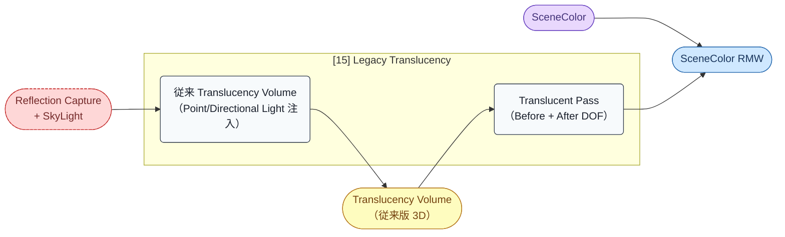

# Render Graph: Phase E — Translucency + Post-process

- 取得日: 2026-04-20
- 対象ステップ: [15] Translucency / [16] Post-processing
- 上位: [[03_render_graph_overview]]
- 関連: [[07_render_graph_lighting]] / [[detail_translucency]] / [[detail_post_process]]

---

## このフェーズの役割

不透明系が全て揃った SceneColor の上に **半透明オブジェクトを描画** し、最後に **Post-process の長い連鎖で色調整・AA・アップスケール** を行い、**BackBuffer へ書き出す** 最終フェーズ。

ポイント:

1. **[15] Translucency は Lumen Translucency Volume** を経由して GI を取得（Lumen 連携の最後のパス）
2. **Separate Translucency** は DOF との合成順序を変えるための独立レイヤー
3. **[16] Post-process は 10+ 段のシェーダー連鎖**、各段 RDG の中間 Texture を生成
4. **TAA / TSR / DLSS / FSR** は [16] 内の Upscale 段で選択される
5. 最終的に **BackBuffer に書き込まれた時点でフレーム完了**

---

## フェーズ図（Modern）

```mermaid
flowchart LR
    %% 入力
    SceneColorIn(["SceneColor<br/>（Phase D 最終）"]):::external
    SceneDepthIn(["SceneDepth"]):::external
    VelocityIn(["Velocity Buffer"]):::external
    GBufferIn(["GBuffer"]):::external
    FinalLightingIn(["FinalLighting Atlas<br/>（Phase B）"]):::external
    PrevSceneColorIn(["前フレーム<br/>SceneColor History"]):::external

    %% Translucency
    subgraph TRANSLUCENCY["[15] Translucency"]
        P15TVol("Translucency Volume<br/>Lighting（3D）"):::pass
        P15Before("Before DOF<br/>Translucency Pass"):::pass
        P15After("After DOF<br/>Translucency Pass"):::pass
        P15Combine("Separate Translucency<br/>Composite"):::pass
    end

    %% 中間
    TransVolume(["Translucency<br/>Lighting Volume（3D）"]):::intermediate
    SepTranslucency(["Separate<br/>Translucency RT"]):::intermediate

    %% Post-process
    subgraph POST["[16] Post-processing"]
        P16MB("Motion Blur"):::pass
        P16DOF("Depth of Field<br/>（Gather/Scatter）"):::pass
        P16TAA("TSR / TAA<br/>（Upscale + AA）"):::pass
        P16Bloom("Bloom + Lens Flare"):::pass
        P16Expo("Eye Adaptation<br/>（Auto Exposure）"):::pass
        P16Tone("Tone Mapping<br/>+ Color Grading LUT"):::pass
        P16Sharpen("Sharpen / FXAA"):::pass
        P16UI("UI Composite"):::pass
    end

    %% 中間
    BloomTex(["Bloom Texture<br/>（Mip 連鎖）"]):::intermediate
    ExposureTex(["Exposure Value<br/>（1×1）"]):::intermediate
    ColorLut(["ColorGrading LUT<br/>（32³）"]):::intermediate

    %% 最終出力
    BackBuffer(["BackBuffer"]):::resource

    %% SceneColor RMW
    SceneColorRMW(["SceneColor<br/>（RMW）"]):::resource

    %% Translucency 依存
    SceneColorIn --> SceneColorRMW
    FinalLightingIn --> P15TVol
    P15TVol --> TransVolume
    TransVolume --> P15Before
    TransVolume --> P15After
    SceneDepthIn --> P15Before
    SceneDepthIn --> P15After
    GBufferIn --> P15Before
    P15Before --> SceneColorRMW
    P15After --> SepTranslucency
    SepTranslucency --> P15Combine

    %% Post-process 依存
    SceneColorRMW --> P16MB
    VelocityIn --> P16MB
    P16MB --> P16DOF
    SepTranslucency --> P15Combine
    P15Combine --> P16DOF
    P16DOF --> P16TAA
    VelocityIn --> P16TAA
    PrevSceneColorIn --> P16TAA
    P16TAA --> P16Bloom
    P16Bloom --> BloomTex
    P16TAA --> P16Expo
    P16Expo --> ExposureTex
    BloomTex --> P16Tone
    ExposureTex --> P16Tone
    ColorLut --> P16Tone
    P16Tone --> P16Sharpen
    P16Sharpen --> P16UI
    P16UI --> BackBuffer

    classDef external fill:#e9d8fd,stroke:#6b46c1,color:#44337a
    classDef resource fill:#cfe8ff,stroke:#2b6cb0,color:#1a365d
    classDef intermediate fill:#fefcbf,stroke:#b7791f,color:#744210
    classDef pass fill:#f7fafc,stroke:#2d3748,color:#1a202c
```

**重要な構造:**

- **Translucency Lighting Volume（3D テクスチャ）** が Translucency GI の要。FinalLighting Atlas を 3D ボクセルへ事前注入
- **Before DOF は SceneColor に直接合成**、**After DOF は Separate RT に描画**（DOF との順序制御のため）
- **Post-process は原則単方向チェーン**（SceneColor → MB → DOF → TAA → Bloom → Tone → UI → BackBuffer）だが、Exposure と Bloom は分岐して Tone Map で合流
- **TSR / TAA が Upscale を兼ねる**ため、DOF 後・Bloom 前に配置される

---

## リソース一覧（入出力早見表）

| リソース | 生成/更新パス | 消費パス | 型 / フォーマット |
|---------|-------------|---------|------------------|
| Translucency Lighting Volume | [15 TVol] | [15 Before] [15 After] | Texture3D RGBA16F（Inner/Outer 2 段）|
| Separate Translucency RT | [15 After] | [15 Combine] | Texture2D R11G11B10F |
| Bloom Texture | [16 Bloom] | [16 Tone] | Texture2D R11G11B10F（Mip 連鎖）|
| Exposure Value | [16 Expo] | [16 Tone] + 次フレーム全体 | Texture2D R32F（1×1）|
| ColorGrading LUT | 別途生成（CPU/GPU）| [16 Tone] | Texture3D R10G10B10A2（32³）|
| **BackBuffer** | [16 UI] | Swap Chain（Present） | RGBA8 / RGBA10_A2 |

> **BackBuffer はフレーム最終成果物**。ここに書き込まれた時点で GPU 側の仕事は終了、Present 待ちとなる。

---

## パス別 入出力詳細

### [15] Translucency

#### [15-1] Translucency Lighting Volume

| 項目 | 内容 |
|------|------|
| **入力** | **FinalLighting Atlas（Lumen Surface Cache）**, SceneDepth, Light List |
| **出力** | Translucency Lighting Volume（Inner: カメラ近傍、Outer: 遠方の 2 段 3D テクスチャ）|
| **CPU 関数** | `InjectTranslucencyLightingVolumeFromLumen()` (`TranslucentLighting.cpp`) |
| **シェーダー** | `TranslucencyLightingVolume.usf:InjectLumenTranslucencyVolumeCS` |
| **特記** | 3D ボクセル各セルで Lumen Surface Cache へレイキャストし、Inscattered Lighting を Inject。半透明オブジェクトは **頂点単位でこのボリュームをサンプル**（Full GI はコスト的に不可）|

#### [15-2] Before DOF Translucency

| 項目 | 内容 |
|------|------|
| **入力** | Translucency Lighting Volume, SceneDepth, GBuffer |
| **出力** | SceneColor（ブレンド加算） |
| **CPU 関数** | `RenderTranslucency()` (`TranslucentRendering.cpp`) |
| **シェーダー** | 各半透明マテリアルの PS（`BasePassPixelShader.usf` Translucent モード）|
| **特記** | Material 側で `TranslucencyLightingMode=SurfacePerPixelLighting` 等の設定によりボリュームサンプル / スクリーンスペース等を選択 |

#### [15-3] After DOF Translucency

| 項目 | 内容 |
|------|------|
| **入力** | Translucency Lighting Volume, SceneDepth |
| **出力** | Separate Translucency RT |
| **CPU 関数** | 同上（`DrawRenderState` が `ETranslucencyPass::AfterDOF` |
| **シェーダー** | 同上 |
| **特記** | Particle FX など Depth of Field の後で合成したい半透明。Separate RT にフル解像度で描画 |

#### [15-4] Separate Translucency Composite

| 項目 | 内容 |
|------|------|
| **入力** | Separate Translucency RT |
| **出力** | SceneColor（合成 / アルファブレンド） |
| **CPU 関数** | `ComposeSeparateTranslucency()` |
| **シェーダー** | `ComposeSeparateTranslucency.usf` |
| **特記** | DOF 処理後の SceneColor に上から載せる形で合成 |

### [16] Post-processing

#### 連鎖の代表順序（UE5 Modern Deferred）

| # | パス | 入力 | 出力 | 主なシェーダー |
|---|------|------|------|---------------|
| 1 | Motion Blur | SceneColor, Velocity, SceneDepth | SceneColor | `MotionBlur.usf:MotionBlurCS` |
| 2 | Depth of Field | SceneColor, SceneDepth, CoC Mask | SceneColor | `DiaphragmDOF/*.usf`（Gather / Scatter / Recombine）|
| 3 | **TSR / TAA** | SceneColor, Velocity, 前フレーム History | **Upscaled SceneColor** | `TemporalSuperResolution/*.usf` または `TemporalAA.usf` |
| 4 | Bloom | SceneColor | Bloom Texture（Mip 連鎖）| `PostProcessBloomSetup.usf` + `PostProcessDownsample.usf` + `PostProcessUpsample.usf` |
| 5 | Eye Adaptation | SceneColor（過去 histogram）| Exposure Value | `PostProcessEyeAdaptation.usf:EyeAdaptationCS` |
| 6 | **Tone Mapping + Color Grading** | SceneColor, Bloom, Exposure, ColorLut | Tone Mapped SceneColor | `PostProcessTonemap.usf:MainPS` |
| 7 | Sharpen / FXAA（任意）| Tone Mapped SceneColor | Sharpened SceneColor | `PostProcessSharpen.usf` / `FXAA` |
| 8 | UI / HUD Composite | Sharpened SceneColor, UI Texture | BackBuffer | Slate RHI 直書き |

**CVar による切替:**

- `r.AntiAliasingMethod`: 0=None / 1=FXAA / 2=TAA / 3=MSAA（Forward のみ）/ 4=**TSR**
- `r.TSR.Enabled=1` のとき [3] が TSR に置換され、DLSS/FSR もここに差し込まれる
- `r.BloomQuality`: 0=OFF ～ 5=最高（Mip 段数が変わる）
- `r.Tonemapper.Quality`: Tone Mapper の品質と Color Grading Lut 適用可否

---

## AsyncCompute

Phase E では基本 **Graphics キュー で直列実行**。理由:

- Translucency はラスタライズ依存（Graphics 必須）
- Post-process は各段が直前段の出力を読むため直列依存が強い
- 例外的に **TSR の一部 CS** や **Bloom の Downsample** が AsyncCompute に乗るケースもあるが、既定では全て Graphics

Phase C の AsyncCompute は Phase D 開始前に join されているため、Phase E 時点で AsyncCompute レーンは使用されていない。

---

## Legacy パイプラインでの差分

### [15] Translucency の差分

Lumen OFF のとき `InjectTranslucencyLightingVolumeFromLumen()` は呼ばれず、代わりに **従来の Translucency Lighting Volume**（`InjectTranslucentVolumeLighting()`）が動作する。

- **従来版の入力**: Light List（Directional / Point）+ ReflectionCapture + SkyLight Cubemap
- **従来版の実装**: 各ライト毎に 3D ボリュームへ InScattering を注入
- シェーダー: `TranslucentLightingShaders.usf:TInjectPointLightPS` 等

つまり Legacy では半透明 GI も **ReflectionCapture / SkyLight 由来** になる。

### [16] Post-process の差分

- **TSR は Modern 既定**、Legacy では TAA が既定（`r.AntiAliasingMethod=2`）
- DLSS / FSR プラグインは両パイプラインで使える
- その他 Motion Blur / DOF / Bloom / Tone Mapping は共通（シェーダー差分はほぼなし）

---

## フレーム完了と次フレームへの橋渡し

Phase E 終了時点で **次フレームに持ち越されるリソース** は以下:

| リソース | 用途 |
|---------|------|
| **HZB Furthest / Closest** | 次フレーム [4] Nanite Cull Pass1 + [7] Lumen Trace |
| **FinalLighting Atlas** | 次フレーム [5b] Radiosity のフィードバック入力 |
| **Card Atlas（Persist 部分）** | 次フレーム [5a] で更新されなかった Page はそのまま流用 |
| **VSM PhysicalPagePool（Cache 部分）** | 次フレーム [2] で invalidation されなかった Page はそのまま流用 |
| **Screen Probe Radiance History** | 次フレーム [7a] の Temporal 入力 |
| **Reflection History** | 次フレーム [7b Denoise] の Temporal 入力 |
| **SceneColor History** | 次フレーム [16 TSR] の Temporal 入力 |
| **Exposure Value** | 次フレーム全体の露出値（Eye Adaptation の慣性）|
| **Occlusion Query 結果** | 次フレームの Primitive Visibility 判定 |

UE5 の多くのモダン機能は **Temporal（時間的）な積分** に依存しているため、これらの History バッファが壊れるとフリッカー・Ghosting が発生する。`FSceneViewState::PrevFrameViewInfo` にまとめて保持される。

---

## ue5-dive 起点

- 「Translucency Lighting Volume の 3D 座標系」 → `TranslucencyLightingVolume.cpp:GetTranslucencyLightingVolumeParameters()`
- 「Before/After DOF の切替」 → `FTranslucencyDrawingPolicy` の `ETranslucencyPass` 判定
- 「Post-process のパス登録順」 → `PostProcessing.cpp:AddPostProcessingPasses()` の長い if 連鎖
- 「TSR の本体」 → `TemporalSuperResolution.cpp:AddTemporalSuperResolutionPasses()`
- 「Bloom の Mip 連鎖実装」 → `PostProcessBloom.cpp:AddBloomPass()`
- 「ToneMap の Color Grading Lut 読み込み」 → `PostProcessCombineLUTs.cpp`（毎フレーム再構築）
- 「History バッファの保持」 → `SceneRendering.cpp:FSceneViewState::PrevFrameViewInfo`
- 「BackBuffer の最終 Present」 → `RHI::RHIEndDrawingViewport()` + Swap Chain
