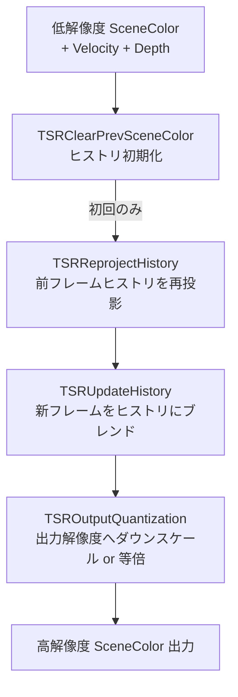

# TSR（Temporal Super Resolution）GPU シェーダー詳細

- グループ: a - TSR
- 上位: [[01_postprocess_gpu_overview]]
- 関連: [[detail_taa]]
- ソース: `Engine/Source/Runtime/Renderer/Private/PostProcess/TemporalSuperResolution.cpp`
- シェーダー: `Engine/Shaders/Private/TSR/`

## 概要

UE5 のデフォルトアップスケーラー。低解像度シーンカラーを高解像度にアップスケールしながら  
テンポラルアンチエイリアシングを行う。**NyQuist-Shannon サンプリング定理**に基づき  
ヒストリ解像度を出力解像度の最大 200% に設定できる（`r.TSR.History.ScreenPercentage`）。

---

## 処理フロー

---

## 主要パス

### TSRReprojectHistory（再投影）

- 前フレームのヒストリテクスチャを現フレームのベロシティで再投影
- ゴースト抑制のためにサンプルカウントを追跡（`TSRHistory.Metadata`）
- `r.TSR.History.R11G11B10=1` でヒストリを R11G11B10 形式に圧縮（帯域削減）

### TSRUpdateHistory（ヒストリ更新）

- 再投影ヒストリと新フレームをブレンド
- `r.TSR.History.SampleCount`（デフォルト 16）でピクセルあたりの最大蓄積サンプル数を制御
- `r.TSR.History.UpdateQuality`（0〜3）で品質シェーダーパーミュテーションを選択
- WaveOps サポート時は `r.TSR.WaveOps=1` で並列処理を最適化

### 出力段（ダウンスケール or 等倍）

- `r.TSR.History.ScreenPercentage=200` のとき: ヒストリ→出力解像度にダウンサンプル（NyQuist 条件）
- `r.TSR.History.ScreenPercentage=100` のとき: ヒストリ解像度 == 出力解像度

---

## 主要 CVar

| CVar | デフォルト | 説明 |
|------|----------|------|
| `r.TSR.History.ScreenPercentage` | 100 (Scalability) | ヒストリ解像度倍率（100〜200%）。Epic/Cinematic は 200 |
| `r.TSR.History.SampleCount` | 16.0 | ピクセルあたりの最大蓄積サンプル数（最小 8、最大 32） |
| `r.TSR.History.R11G11B10` | 1 | ヒストリを R11G11B10 で保存（メモリ帯域削減） |
| `r.TSR.History.UpdateQuality` | 3 | UpdateHistory の品質（Scalability により制御） |
| `r.TSR.WaveOps` | 1 | Wave 命令による並列最適化 |
| `r.TSR.AlphaChannel` | -1 | -1=PropagateAlpha に依存, 0=無効, 1=有効 |
| `r.TSR.Support.LensDistortion` | 1 | レンズ歪みサポート（1=デスクトップのみ） |
| `r.TSR.Visualize` | — | ヒストリ蓄積サンプル数の可視化（0=サンプル数） |

---

## エントリポイント関数

| 関数 | ソース | 説明 |
|------|--------|------|
| `AddTemporalSuperResolutionPasses()` | `TemporalSuperResolution.cpp` | TSR 全パスの RDG 構築 |
| `IsTemporalSuperResolutionEnabled()` | `TemporalSuperResolution.cpp` | TSR 有効判定 |

---

## CPU との接続

`EMainTAAPassConfig::TSR` が選択されたとき（`TemporalAA.h`）に TSR が実行される。  
`AddPostProcessingPasses()` 内で `AddTemporalSuperResolutionPasses()` が呼ばれる。

---

## 関連リファレンス

| リファレンス | 対象ソース |
|------------|----------|
| [[ref_tsr]] | `TemporalSuperResolution.cpp` エントリポイント一覧 |
