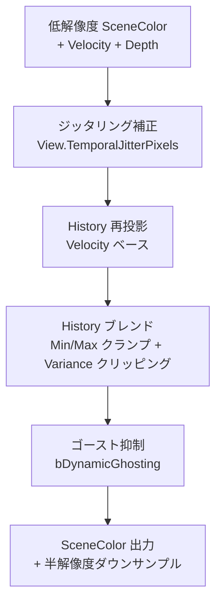

# TAA（Temporal Anti-Aliasing）GPU シェーダー詳細

- グループ: b - TAA
- 上位: [[01_postprocess_gpu_overview]]
- 関連: [[detail_tsr]]
- ソース: `Engine/Source/Runtime/Renderer/Private/PostProcess/TemporalAA.h/.cpp`

## 概要

UE5 で TSR が選択されていない場合に使用される**テンポラルアンチエイリアシング**実装。  
Gen4 コンソール向けの旧来 TAA と、複数の `ETAAPassConfig` パーミュテーションで構成される。

| モード | 説明 |
|--------|------|
| `Main` | 通常 TAA（シーンカラーのアンチエイリアシング） |
| `MainUpsampling` | TAA + アップサンプリング（動的解像度と組み合わせ） |
| `MainSuperSampling` | 高品質スーパーサンプリング |
| `DiaphragmDOF` | DOF CoC を含むテンポラルスムージング |
| `ScreenSpaceReflections` | SSR ノイズの蓄積 |
| `LightShaft` | Light Shaft ノイズの蓄積 |
| `Hair` | ヘアシミュレーション用 |

---

## 処理フロー



---

## 主要クラス・構造体

### `FTAAPassParameters`

```cpp
struct FTAAPassParameters
{
    ETAAPassConfig Pass = ETAAPassConfig::Main; // パス種別
    ETAAQuality Quality = ETAAQuality::High;    // 品質（Low/Medium/High/MediumHigh）

    bool bOutputRenderTargetable = false;       // RT として出力可能か
    bool bDownsample = false;                   // 半解像度ダウンサンプルを出力するか

    FIntRect InputViewRect;                     // 入力ビューポート
    FIntRect OutputViewRect;                    // 出力ビューポート（アップサンプリング時は拡大）
    int32 ResolutionDivisor = 1;                // 解像度除数

    FRDGTexture* SceneDepthTexture = nullptr;
    FRDGTexture* SceneVelocityTexture = nullptr;
    FRDGTexture* SceneColorInput = nullptr;
    FRDGTexture* SceneMetadataInput = nullptr;  // DOF CoC 等のメタデータ

    float CoCBilateralFilterStrength = 1.0;    // DOF TAA 用バイラテラルフィルタ強度
};
```

### `FTAAOutputs`

```cpp
struct FTAAOutputs
{
    FRDGTexture* SceneColor = nullptr;          // アンチエイリアシング済みシーンカラー
    FRDGTexture* SceneMetadata = nullptr;       // オプション：DOF CoC 等
    FRDGTexture* DownsampledSceneColor = nullptr; // 半解像度ダウンサンプル出力
};
```

---

## 主要関数

### `AddTemporalAAPass`

```cpp
FTAAOutputs AddTemporalAAPass(
    FRDGBuilder& GraphBuilder,
    const FSceneTextureParameters& Inputs,
    const FViewInfo& View,
    const FTAAPassParameters& Params,
    const FTemporalAAHistory& InputHistory,
    FTemporalAAHistory* OutputHistory);
```

TAA の RDG パスを構築して `FTAAOutputs` を返す。  
`InputHistory` / `OutputHistory` でフレーム間の履歴テクスチャを受け渡す。

---

## 主要 CVar

| CVar | デフォルト | 説明 |
|------|----------|------|
| `r.TemporalAA.Algorithm` | 0 | 0=TAA, 1=TSR |
| `r.TemporalAA.Quality` | 3 | 0=Low, 1=Medium, 2=High, 3=MediumHigh |
| `r.TemporalAA.Upsampling` | 0 | TAA アップサンプリング有効化 |
| `r.TemporalAA.FilterSize` | 1.0 | フィルタサイズ |
| `r.TemporalAA.CatmullRom` | 1 | Catmull-Rom ヒストリサンプリング |
| `r.TemporalAA.Responsive` | 1 | TAA レスポンシブ（マテリアルフラグ対応） |

---

## ユーティリティ関数

| 関数 | 説明 |
|------|------|
| `IsTAAUpsamplingConfig(Pass)` | アップサンプリング系の Pass かどうか |
| `IsMainTAAConfig(Pass)` | メインシーンカラー用の Pass かどうか |
| `IsDOFTAAConfig(Pass)` | DOF 用の Pass かどうか |

---

## CPU との接続

`EMainTAAPassConfig::TAA` が選択されたとき（TSR が無効、サードパーティなし）に使用。  
`AddPostProcessingPasses()` 内で `AddTemporalAAPass()` が呼ばれる。

---

## 関連リファレンス

| リファレンス | 対象ソース |
|------------|----------|
| [[ref_taa]] | `TemporalAA.h/.cpp` エントリポイント一覧 |
