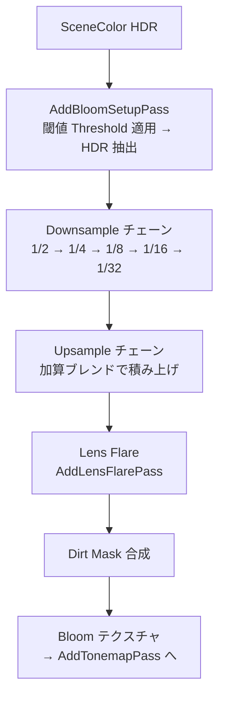

# Bloom GPU シェーダー詳細

- グループ: c - Bloom
- 上位: [[01_postprocess_gpu_overview]]
- 関連: [[detail_tonemap]]
- ソース: `Engine/Source/Runtime/Renderer/Private/PostProcess/PostProcessBloomSetup.h/.cpp`, `PostProcessLensFlares.h/.cpp`, `PostProcessFFTBloom.h/.cpp`

## 概要

HDR シーンカラーの高輝度部分を抽出して **Downsample → Upsample** チェーンで拡散させ、  
Lens Flare や Dirt Mask と合成してトーンマップパスに渡す輝き表現システム。

| 品質 | 処理 |
|------|------|
| `r.Bloom.Quality` 0 | Bloom 無効 |
| `r.Bloom.Quality` 1〜5 | 段階的な Downsample/Upsample チェーン |
| FFT Bloom | `r.BloomFFT=1` で高品質 FFT ベース（重い） |

---

## 処理フロー



---

## AddBloomSetupPass

```cpp
FScreenPassTexture AddBloomSetupPass(
    FRDGBuilder& GraphBuilder,
    const FViewInfo& View,
    const FBloomSetupInputs& Inputs);
```

### `FBloomSetupInputs` メンバ

| 変数名 | 型 | 説明 |
|--------|-----|------|
| `SceneColor` | `FScreenPassTextureSlice` | HDR シーンカラー（必須） |
| `EyeAdaptationBuffer` | `FRDGBufferRef` | 露出値バッファ（必須） |
| `Threshold` | `float` | 輝度閾値（> 0 必須） |
| `EyeAdaptationParameters` | `const FEyeAdaptationParameters*` | 露出パラメータ |
| `LocalExposureParameters` | `const FLocalExposureParameters*` | ローカル露出パラメータ |
| `LocalExposureTexture` | `FRDGTextureRef` | ローカル露出テクスチャ |
| `BlurredLogLuminanceTexture` | `FRDGTextureRef` | ぼかし済み輝度テクスチャ |

露出補正済みの HDR から `Threshold` 以上の輝度ピクセルを抽出し Bloom 入力を生成する。

---

## Downsample / Upsample チェーン

```cpp
// PostProcessBloomSetup.cpp
FScreenPassTexture AddGaussianBloomPasses(
    FRDGBuilder& GraphBuilder,
    const FViewInfo& View,
    const FTextureDownsampleChain* SceneDownsampleChain);
```

`r.Bloom.Quality` の値に応じてダウンサンプルの段数が変化:

| Quality | ダウンサンプル段数 | 備考 |
|---------|----------------|------|
| 1 | 2段（1/4まで） | 最低品質 |
| 3 | 4段（1/16まで） | デフォルト |
| 5 | 6段（1/64まで） | 最高品質 |

---

## FFT Bloom

```cpp
// PostProcessFFTBloom.h
// r.BloomFFT=1 で有効
// 光学的に正確な PSF（Point Spread Function）ベースのブルーム
```

通常の Gaussian Bloom より品質が高いが GPU コストが高い。  
大きなカーネルや複雑な PSF 形状に対応。

---

## Lens Flare / Dirt Mask

```cpp
// PostProcessLensFlares.h
FScreenPassTexture AddLensFlarePass(
    FRDGBuilder& GraphBuilder,
    const FViewInfo& View,
    FScreenPassTexture Bloom);
```

- Lens Flare: Bloom テクスチャを基に光学フレアを生成
- Dirt Mask: `r.BloomDirtMask` テクスチャをレンズ汚れとして乗算合成

---

## 主要 CVar

| CVar | デフォルト | 説明 |
|------|----------|------|
| `r.Bloom.Quality` | 5 | 0=無効, 1〜5=品質レベル |
| `r.BloomFFT` | 0 | FFT Bloom 有効化 |
| `r.BloomThreshold` | -1 | -1=PostProcess ボリューム依存 |
| `r.BloomDirtMask` | 1 | Dirt Mask 有効化 |
| `r.LensFlare` | 1 | Lens Flare 有効化 |

---

## 関連リファレンス

| リファレンス | 対象ソース |
|------------|----------|
| [[ref_bloom]] | `PostProcessBloomSetup.h/.cpp` エントリポイント |
