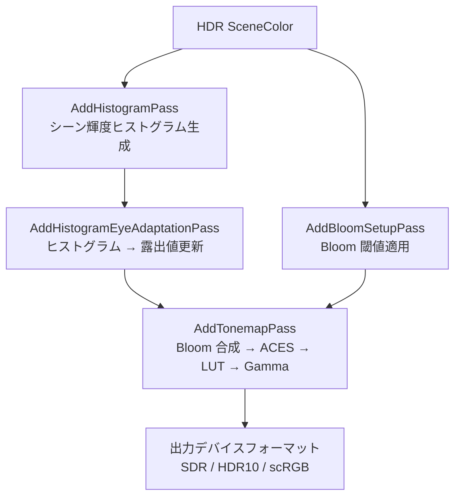

# Tonemap GPU シェーダー詳細

- グループ: d - Tonemap
- 上位: [[01_postprocess_gpu_overview]]
- 関連: [[detail_bloom]]
- ソース: `Engine/Source/Runtime/Renderer/Private/PostProcess/PostProcessTonemap.h/.cpp`, `PostProcessEyeAdaptation.h/.cpp`, `PostProcessHistogram.h/.cpp`, `ACESUtils.h/.cpp`

## 概要

HDR シーンカラーを表示デバイスの輝度範囲に変換する最終パス群。  
**Histogram → EyeAdaptation → Tonemap（ACES）→ Gamma 補正 → LUT 適用** の順で処理される。

---

## 処理フロー



---

## ヒストグラム / Eye Adaptation

### `AddHistogramPass`

```cpp
FRDGTextureRef AddHistogramPass(
    FRDGBuilder& GraphBuilder,
    const FViewInfo& View,
    const FEyeAdaptationParameters& EyeAdaptationParameters,
    FScreenPassTextureSlice SceneColor,
    const FSceneTextureParameters& SceneTextures,
    FRDGBufferRef EyeAdaptationBuffer);
```

シーンカラーの対数輝度ヒストグラムを生成。256 バケットの 1D テクスチャを返す。

### `AddHistogramEyeAdaptationPass`

```cpp
FRDGBufferRef AddHistogramEyeAdaptationPass(
    FRDGBuilder& GraphBuilder,
    const FViewInfo& View,
    const FEyeAdaptationParameters& EyeAdaptationParameters,
    const FLocalExposureParameters& LocalExposureParameters,
    FRDGTextureRef HistogramTexture,
    bool bComputeAverageLocalExposure);
```

ヒストグラムから目標露出値を算出し `EyeAdaptationBuffer`（1要素バッファ）に書き込む。  
前フレームとの差分を `ExposureSpeedUp` / `ExposureSpeedDown` でスムーズに遷移させる。

### `FEyeAdaptationParameters`（主要メンバ）

| パラメータ | 説明 |
|-----------|------|
| `ExposureLowPercent` | ヒストグラムの低輝度カットオフ（%） |
| `ExposureHighPercent` | ヒストグラムの高輝度カットオフ（%） |
| `MinAverageLuminance` / `MaxAverageLuminance` | 平均輝度のクランプ範囲 |
| `ExposureCompensationSettings` | 露出補正（EV） |
| `ExposureSpeedUp` / `ExposureSpeedDown` | 露出変化速度（明暗それぞれ） |
| `HistogramScale` / `HistogramBias` | ヒストグラム座標変換 |
| `LuminanceMax` | センサー飽和輝度（cd/m²） |

---

## AddTonemapPass

```cpp
FScreenPassTexture AddTonemapPass(
    FRDGBuilder& GraphBuilder,
    const FViewInfo& View,
    const FTonemapInputs& Inputs);
```

### `FTonemapInputs` 主要メンバ

| 変数名 | 必須 | 説明 |
|--------|------|------|
| `SceneColor` | ✅ | HDR シーンカラー |
| `Bloom` | ✅ | Bloom テクスチャ（透明黒なら Bloom なし） |
| `ColorGradingTexture` | ✅ | Color Grading LUT |
| `EyeAdaptationParameters` | ✅ | 露出パラメータ |
| `EyeAdaptationBuffer` | ✅ | 現在の露出値バッファ |
| `LocalExposureBilateralGridTexture` | ― | Local Exposure グリッド |
| `BlurredLogLuminanceTexture` | ― | ぼかし済み輝度（Local Exposure 用） |
| `bGammaOnly` | ― | ACES をスキップして Gamma のみ適用 |
| `bOutputInHDR` | ― | HDR 出力（HDR10 / scRGB） |
| `bWriteAlphaChannel` | ― | アルファチャンネルを出力に書き込む |

---

## ACES トーンマップ

```cpp
// ACESUtils.h
// ACES（Academy Color Encoding System）カーブの実装
// ACES Filmic Tone Mapping Curve を GPU シェーダーで評価
```

`FTonemapperOutputDeviceParameters` で出力デバイスを設定:

```cpp
BEGIN_SHADER_PARAMETER_STRUCT(FTonemapperOutputDeviceParameters, )
    SHADER_PARAMETER(FVector3f, InverseGamma)   // 出力ガンマの逆数
    SHADER_PARAMETER(uint32, OutputDevice)       // SDR / HDR10 / scRGB 等
    SHADER_PARAMETER(uint32, OutputGamut)        // Rec.709 / P3 / Rec.2020 等
    SHADER_PARAMETER(float, OutputMaxLuminance)  // HDR 最大輝度（nit）
END_SHADER_PARAMETER_STRUCT()
```

---

## Local Exposure

```cpp
// PostProcessLocalExposure.h
FRDGTextureRef AddLocalExposurePass(
    FRDGBuilder& GraphBuilder,
    const FViewInfo& View,
    const FEyeAdaptationParameters& EyeAdaptationParameters,
    FScreenPassTextureSlice SceneColor);
```

局所的な露出補正（明暗コントラスト強化）。Bilateral Grid を生成して Tonemap パスに渡す。

---

## 主要 CVar

| CVar | デフォルト | 説明 |
|------|----------|------|
| `r.EyeAdaptationQuality` | 2 | 0=無効, 1=Basic, 2=Histogram |
| `r.EyeAdaptation.IgnoreMaterials` | 0 | マテリアル輝度を露出計算から除外 |
| `r.Tonemapper.Quality` | 5 | トーンマップ品質（シェーダーパーミュテーション） |
| `r.Tonemapper.GrainQuantization` | 1 | Grain による量子化ノイズ |
| `r.HDR.EnableHDROutput` | 0 | HDR 出力（HDR10/scRGB） |
| `r.LocalExposure.HighlightContrastScale` | 0.8 | ハイライトのコントラスト強度 |

---

## 関連リファレンス

| リファレンス | 対象ソース |
|------------|----------|
| [[ref_tonemap]] | `PostProcessTonemap.h/.cpp`, `PostProcessEyeAdaptation.h`, `PostProcessHistogram.h` |
