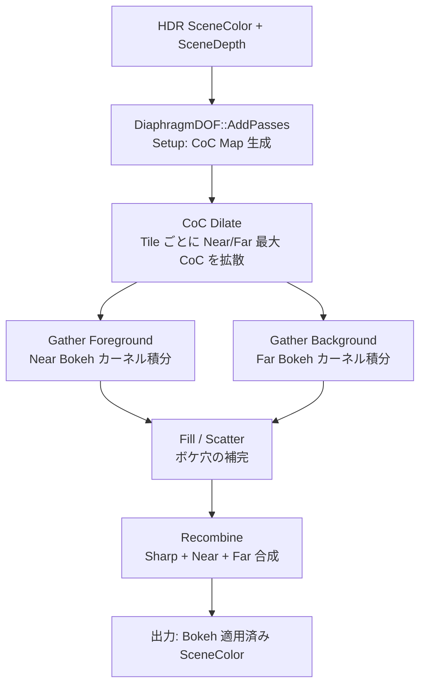

# DOF（被写界深度）GPU シェーダー詳細

- グループ: e - DOF
- 上位: [[01_postprocess_gpu_overview]]
- 関連: [[detail_taa]]
- ソース: `Engine/Source/Runtime/Renderer/Private/PostProcess/DiaphragmDOF.h/.cpp`

## 概要

**Cinematic Diaphragm DOF**：物理ベースの絞り（Diaphragm）モデルを使った被写界深度。  
Near/Far Bokeh を分離して **Scatter-as-Gather** 方式でボケを表現する。

| フェーズ | 処理 |
|----------|------|
| Setup | CoC（Circle of Confusion）半径計算、SceneColor + CoC マップ生成 |
| Dilate | Near/Far CoC を Tile ごとに拡張（最大 CoC 把握） |
| Gather | Foreground / Background ボケをカーネル積分 |
| Fill | Gather 結果の穴埋め（near 領域の背景補完） |
| Recombine | Sharp + Near ボケ + Far ボケを合成して最終出力 |

---

## 処理フロー



---

## `FPhysicalCocModel`（物理 CoC モデル）

```cpp
struct FPhysicalCocModel
{
    // レンズパラメータ
    float SensorWidth;           // センサー幅（mm）
    float FStops;                // F 値（絞り）
    float FocusDistance;         // フォーカス距離（cm）
    float MaxForegroundCocRadius;// 手前ボケ最大 CoC 半径（ピクセル）
    float MaxBackgroundCocRadius;// 奥ボケ最大 CoC 半径（ピクセル）

    // Petzval レンズ収差パラメータ（Swirl Bokeh）
    float PetzvalFocusDistance;
    float PetzvalAngle;
    float PetzvalRadialStrength;

    // CoC 計算
    float ComputeCircleDofHalfCoc(float Depth) const;
    float MinForegroundCocRadius() const;  // ≤ 0
};
```

| パラメータ | 説明 |
|-----------|------|
| `SensorWidth` | 物理センサー幅（mm）→ FoV と CoC スケールに影響 |
| `FStops` | F 値。小さいほどボケが強い |
| `FocusDistance` | ピント位置（cm）。この距離のオブジェクトが Sharp |
| `MaxForegroundCocRadius` | 手前ボケの最大ピクセル半径（正の値で格納） |
| `MaxBackgroundCocRadius` | 奥ボケの最大ピクセル半径（正の値で格納） |
| Petzval params | 旋回ボケ（Swirl Bokeh）の光学収差シミュレーション |

---

## DiaphragmDOF 名前空間

### `IsEnabled(View)`

```cpp
bool DiaphragmDOF::IsEnabled(const FViewInfo& View);
```

- `r.DepthOfField.Method == 1`（DiaphragmDOF）かつ DOF パラメータが有効か判定
- `bOverride_DepthOfFieldFstop` 等のポストプロセスボリューム設定を考慮

### `AddPasses(...)`

```cpp
FRDGTextureRef DiaphragmDOF::AddPasses(
    FRDGBuilder& GraphBuilder,
    const FSceneTextureParameters& SceneTextures,
    const FViewInfo& View,
    FRDGTextureRef InputSceneColor,
    FRDGBufferRef EyeAdaptationBuffer);
```

全フェーズ（Setup → Dilate → Gather → Fill → Recombine）をまとめて追加し  
ボケ適用済み SceneColor テクスチャを返す。

### `CircleDofHalfCoc(View)`

```cpp
float DiaphragmDOF::CircleDofHalfCoc(const FViewInfo& View);
```

View から最大 CoC 半径を取得。TAA/TSR パスに渡す解像度スケールの算出に使用される。

---

## Gather カーネル

| カーネル種別 | 説明 |
|------------|------|
| Gaussian | 低コスト、ソフトボケ |
| Bokeh Kernel | アーティスト定義テクスチャ形状（`r.DepthOfField.BokehShape`） |
| Ring Accumulate | リング状サンプリングで物理的な絞り形状を近似 |

Near / Far は別々にギャザーされ、後の Recombine パスで Alpha ブレンドされる。

---

## Scatter-as-Gather 方式

従来の Scatter（1ピクセルを近傍に拡散）を **Gather（中心から周囲をサンプリング）** に逆転。

- GPU フレンドリーなキャッシュアクセスパターン
- ボケ半径に応じた可変サンプル数（Dilate した Tile サイズを利用）
- Near ボケ：半透明として Foreground Gather → Recombine で合成

---

## 主要 CVar

| CVar | デフォルト | 説明 |
|------|----------|------|
| `r.DepthOfField.Method` | 1 | 0=BokehDOF(非推奨), 1=DiaphragmDOF |
| `r.DepthOfField.TemporalAA` | 1 | TAA と連携してジッター除去 |
| `r.DepthOfField.KernelSize` | -1 | -1=自動, 正値=最大カーネル半径 |
| `r.DepthOfField.ScatterOcclusion` | 1 | Scatter 遮蔽計算 |
| `r.DOF.Gather.AccumulatorQuality` | 1 | Gather 精度（0=低, 1=高） |
| `r.DOF.Gather.PostfilterMethod` | 1 | Gather 後フィルタ |
| `r.DOF.Recombine.Quality` | 2 | Recombine 品質 |

---

## 関連リファレンス

| リファレンス | 対象ソース |
|------------|----------|
| [[ref_dof]] | `DiaphragmDOF.h/.cpp` エントリポイント全関数 |
